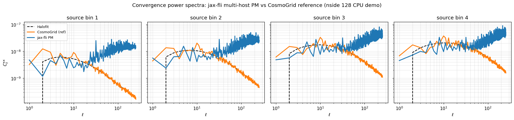

# 10 · Multi-host PM and validation against CosmoGrid

The single-GPU notebooks scale to **multiple nodes** with no change to the physics code — only
the device mesh grows. This page shows how to launch the distributed pipeline on a SLURM cluster
and how to validate the resulting convergence maps against a CosmoGrid reference.

The runnable script is [`10-multi-host-pm.py`](10-multi-host-pm.py).

---

## How multi-host works

JAX runs **one process per device**. Across nodes, the processes are tied together by a
coordinator: each calls `jax.distributed.initialize()` **before touching the JAX backend** (this
is why the script imports `jax`, calls `initialize()`, and only *then* imports `jax_fli`). After
that, a `NamedSharding` over a 2-D device mesh partitions the first two spatial axes of every
field, and `jax_fli` / `jaxpm` handle the halo exchange and distributed FFTs automatically.

```python
import jax
jax.distributed.initialize()          # multi-host: must come first
import jax_fli as jfli
from jax.sharding import AxisType, NamedSharding, PartitionSpec as P

mesh = jax.make_mesh((jax.device_count(), 1), ("x", "y"),
                     axis_types=(AxisType.Auto, AxisType.Auto))
sharding = NamedSharding(mesh, P("x", "y"))
# ... gaussian_initial_conditions(..., field_sharding=sharding) -> lpt -> nbody -> born
```

The lead process (`jax.process_index() == 0`) gathers the result and writes the Parquet catalog.

## Launching on SLURM

One task per GPU; `srun` sets the environment that `jax.distributed.initialize()` reads:

```bash
#!/bin/bash
#SBATCH --nodes=4
#SBATCH --gpus-per-node=4
#SBATCH --tasks-per-node=4
#SBATCH --gpu-bind=none

srun python 10-multi-host-pm.py --multihost \
     --mesh 1024 --box 3000 --nside 1024 --nb-shells 16 \
     --out kappa_sim.parquet
```

The repository also ships a SLURM dispatcher — `fli-launcher` (see
[Scripts & utilities](../4-scripts-and-utilities/fli-launcher.md)) — which submits grids of these
jobs over cosmologies and seeds.

### Test it on a laptop first

The same script runs on a single host with **fake CPU devices**, which is exactly how the figure
below was produced:

```bash
XLA_FLAGS="--xla_force_host_platform_device_count=4" JAX_PLATFORMS=cpu \
    python 10-multi-host-pm.py --mesh 128 --nside 128 --nb-shells 8 --out kappa_sim.parquet
```

## Validating against CosmoGrid

`10-multi-host-pm.py` writes a `SphericalKappaField` catalog. We load it back, load a CosmoGrid
Stage-3 convergence reference (see [notebook 9](09-External-Catalog.ipynb)), and compare angular
power spectra at matched cosmology:

```python
import jax_fli as jfli, jax_cosmo as jc, numpy as np
from pathlib import Path

SIM = Path("/path/to/Simulations")

# Reference + its cosmology
cg = jfli.io.load_cosmogrid_kappa(SIM / "CosmoGrid/stage3_forecast/cosmo_000002/perm_0000")
kappa_cg, cosmo = cg.field[0], cg.cosmology[0]

# Our run (produced by 10-multi-host-pm.py, here at the same cosmology)
kappa_sim = jfli.io.Catalog.from_parquet("kappa_sim.parquet").field[0]

lmax = 2 * kappa_sim.nside
cl_sim = kappa_sim.angular_cl(method="healpy", lmax=lmax - 1)
cl_cg = kappa_cg.angular_cl(method="healpy", lmax=lmax - 1)
theory = jfli.compute_theory_cl(cosmo, ell=np.arange(lmax),
                                z_source=jfli.io.get_stage3_nz_shear(),
                                probe_type="weak_lensing", nonlinear_fn=jc.power.halofit)
# ... overplot cl_sim, cl_cg, theory per source bin ...
```



On the scales the CPU demo can resolve (ℓ ≲ 30–50) the simulated convergence, the CosmoGrid
reference, and the Halofit prediction **agree across all four source bins**. They diverge at high
ℓ for the expected, opposite reasons: this `nside = 128`, `mesh = 128³` run is shot-noise dominated
on small scales (the blue curves rise), while at production resolution
(`mesh = 1024³`, `nside = 1024`, launched with `srun` as above) the agreement extends to much
higher ℓ.
