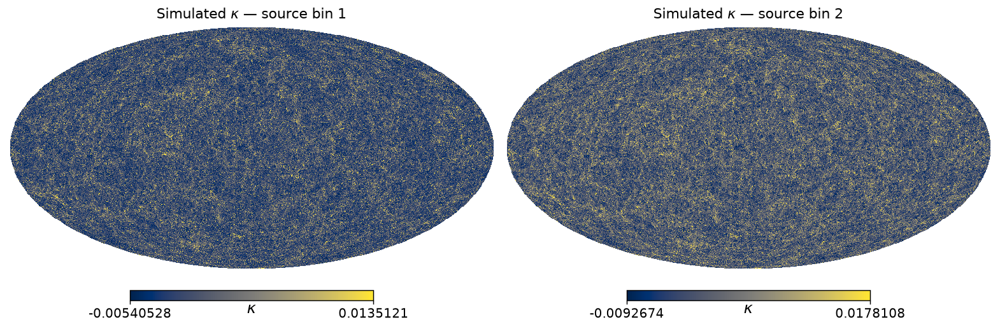
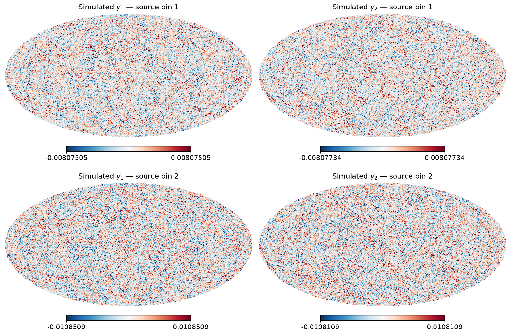

# Multi-host PM and validation against theory

The single-GPU notebooks scale to **multiple nodes** with no change to the physics code — only the device mesh grows. This page shows how to launch the distributed pipeline on a SLURM cluster and how to validate the resulting convergence against its Halofit theory prediction.

A runnable script backs this page: [`11-multi-host-pm.py`](11-multi-host-pm.py) runs the distributed simulation.

---

## How multi-host works

JAX runs **one process per device**. Across nodes, the processes are tied together by a coordinator: each calls `jax.distributed.initialize()` **before touching the JAX backend** (this is why the script imports `jax`, calls `initialize()`, and only *then* imports `jax_fli`). After that, a `NamedSharding` over a 2-D device mesh partitions the first two spatial axes of every field, and `jax_fli` / `jaxpm` handle the halo exchange and distributed FFTs automatically.

```python
import jax
jax.distributed.initialize()          # multi-host: must come first
import jax_fli as jfli
from jax.experimental.mesh_utils import create_hybrid_device_mesh
from jax.sharding import AxisType, Mesh, NamedSharding, PartitionSpec as P

nbins = 2                             # source bins
gpus_per_node = 4                     # GPUs per node (one process per GPU)
n_dev = jax.device_count()
P_X, P_Y = n_dev // nbins, nbins      # split the x-axis over devices, y over source bins

if not hasattr(jax.devices()[0], "slice_index"):
    # Single node — every device talks to every other at the same (NVLink) bandwidth.
    mesh = jax.make_mesh((P_X, P_Y), ("x", "y"), axis_types=(AxisType.Auto, AxisType.Auto))
else:
    # Several nodes — bandwidth is *non-uniform*: fast NVLink inside a node, slower
    # InfiniBand between nodes. Tile the mesh so each node's GPUs stay contiguous on the
    # x-axis (over NVLink) and only the slab boundaries between nodes cross the network.
    intra = (gpus_per_node, 1)                    # GPUs within one node (NVLink)
    inter = (P_X // gpus_per_node, P_Y)           # across nodes (InfiniBand)
    mesh = Mesh(create_hybrid_device_mesh(intra, inter), axis_names=("x", "y"))

sharding = NamedSharding(mesh, P("x", "y"))
# gaussian_initial_conditions(..., field_sharding=sharding) -> lpt -> nbody -> born -> get_shear
```

On a single node a plain `jax.make_mesh` is enough — all GPUs share one fast NVLink fabric. Across nodes the links are *not* equal: GPUs inside a node are joined by NVLink, while nodes talk over the much slower InfiniBand network. `create_hybrid_device_mesh` lays the devices out so the PM's halo exchange — the heaviest communication — runs over NVLink wherever it can, and only the slab boundaries between nodes cross InfiniBand. See the JAX guide on [meshes with non-uniform communication bandwidth](https://docs.jax.dev/en/latest/multi_process.html#meshes-can-have-non-uniform-communication-bandwidth).

The lead process (`jax.process_index() == 0`) gathers the result and writes the Parquet catalogs.

## Launching on SLURM

One task per GPU; `srun` sets the environment that `jax.distributed.initialize()` reads:

```bash
#!/bin/bash
#SBATCH --nodes=4
#SBATCH --gpus-per-node=4
#SBATCH --tasks-per-node=4
#SBATCH --gpu-bind=none

srun python 11-multi-host-pm.py \
     --mesh 1200 --nbins 2 --nside 1024 --nb-shells 16 \
     --gpus-per-node 4 --out sim.parquet   # writes sim_kappa.parquet + sim_shear.parquet
```

The repository also ships a SLURM dispatcher — `fli-launcher` (see [Scripts & utilities](../4-scripts-and-utilities/fli-launcher.md)) — which submits grids of these jobs over cosmologies and seeds.

### Test it on a laptop first

The same script runs on a single host with **fake CPU devices** — a quick smoke test of the whole multi-host code path before you queue a real job:

```bash
XLA_FLAGS="--xla_force_host_platform_device_count=4" JAX_PLATFORMS=cpu \
    python 11-multi-host-pm.py --mesh 64 --nbins 2 --nside 64 --nb-shells 8 --out sim.parquet
```

## Validating against theory

`11-multi-host-pm.py` writes **two** catalogs: a `SphericalKappaField` (the Born convergence) and a `SphericalShearField` (the two shear components, from `kappa.get_shear()`), one map per source bin. The figures below are from a `mesh = 1200³`, `nside = 1024` run over the **two** lowest Stage-3 source bins.

### Maps



The convergence κ is the Born line-of-sight projection of the lightcone density onto each source plane. Bin 2 reaches a higher effective source redshift than bin 1, so it integrates through more structure and carries a visibly larger amplitude.



The shear (γ1, γ2) is the spin-2 field obtained from κ with `kappa.get_shear()` — the forward Kaiser–Squires transform on the sphere (κ → E-mode → shear). It is what a galaxy survey actually measures; the two components carry the same lensing signal rotated by 45° relative to each other.

### Power spectra

We validate the convergence against its Halofit weak-lensing prediction at the simulation cosmology (Planck18). The spectrum was already computed by the run and saved alongside the maps, so the check just loads it back and overlays the theory for the two source bins:

```python
import jax_fli as jfli, jax_cosmo as jc, numpy as np

# Our run: the convergence spectrum we already computed, plus its (Planck18) cosmology.
sim = jfli.io.Catalog.from_parquet("spectra_sim_kappa.parquet")
cl_sim, cosmo = sim.field[0], sim.cosmology[0]          # PowerSpectrum (2 bins), Planck18

# Halofit theory for the two simulated Stage-3 source bins, at the same cosmology.
nz = jfli.io.get_stage3_nz_shear()[:2]
theory = jfli.compute_theory_cl(cosmo, np.asarray(cl_sim.wavenumber)[2:], z_source=nz,
                                probe_type="weak_lensing", nonlinear_fn=jc.power.halofit)
# ... C_ℓ (top) and C_ℓ / theory (bottom) per bin -> 11-multi-host-validate.py
```


The simulated spectrum (blue) tracks the Halofit prediction (red dashed) across the whole resolved range for both source bins. The bottom panels show the ratio to theory: it sits near unity over the signal-dominated band, then climbs at high ℓ. That excess is **shot noise from the finite particle sampling**. This run evolves `1200³` particles in a `(4595 Mpc/h)³` box — only ≈ 0.018 particles per `(Mpc/h)³`, i.e. **one particle per `(3.8 Mpc/h)³`**. Below that mean inter-particle spacing the discrete particles merely Poisson-sample the density field, adding a near-white noise floor that lifts `C_ℓ` above the smooth theory; a denser sampling (a larger mesh at fixed box size) pushes the departure to higher ℓ.
