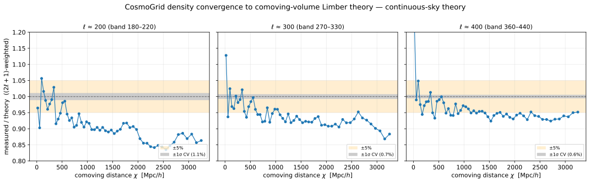
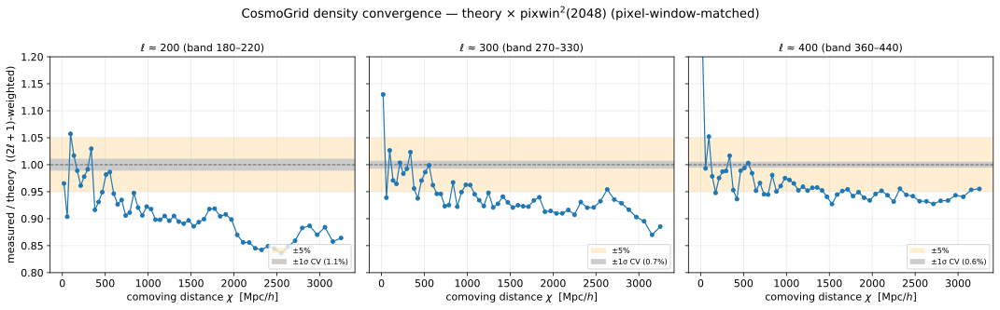

# Experiment 00 — CosmoGrid reference

**Goal.** Provide the full-resolution ground truth that the accuracy experiments (01–07) validate
against: the native CosmoGrid density lightcone, CosmoGrid's **own** Stage-3 forecast κ, and **Born**
convergence (κ) references computed from the density for two source distributions (DES Y3 and Stage-3)
— plus a dorian **ray-traced** κ script (post-Born exact) — published to the HuggingFace dataset
`ASKabalan/jax-fli-experiments`.

## Data

Built from `cosmo_000001` (density from `raw/cosmo_000001/run_0`; the forecast κ from the matching
`stage3_forecast/cosmo_000001/perm_0000`, so it shares the same cosmology). HuggingFace dataset configs:

| config | field | nside | dtype | contents |
|--------|-------|------:|-------|----------|
| `00-cosmogrid-density`        | `SphericalDensity`    | 2048 | float32 | particle **counts**, ~56 shells out to **z ≤ 1.6** (DES Y3 depth) — **one config, one row per shell** (load by streaming) |
| `00-cosmogrid-kappa`          | `SphericalKappaField` |  512 | float32 | 4 bins, CosmoGrid's own **Stage-3 forecast** κ (the simulation's published convergence maps) |
| `00-cosmogrid-born-des`       | `SphericalKappaField` | 2048 | float32 | 4 bins, **Born** approximation from the density, **DES Y3** source n(z) |
| `00-cosmogrid-born-s3`        | `SphericalKappaField` | 2048 | float32 | 4 bins, **Born** approximation from the density, **Stage-3** source n(z) |
| `00-cosmogrid-kappa-raytrace` | `SphericalKappaField` | 2048 | float32 | 4 bins, **ray-traced** (dorian, full distortion matrix); computed by `run.sh` (step 3), *not yet published* |

The density is loaded with `jfli.io.load_cosmogrid_lc(max_redshift=1.6)` and kept out to **z ≤ 1.6**:
that is the **DES Y3** source depth (its deepest bin ends z≈1.45, see [experiment 06](../06-cosmogrid-shells/)),
and the small Stage-3 tail beyond 1.6 is negligible for the lensing kernel, so the one reference serves
both the DES and Stage-3 κ paths. It is saved in the loader's native **COUNTS** unit (float32) — what
every `load_cosmogrid_lc` consumer gets; `jfli.born`/`jfli.raytrace` convert to overdensity internally.
The 2048 lightcone is too large to be one parquet — stacking it to write OOMs and `load_dataset`
combining ~56·npix elements overflows arrow's INT32 list offset — so `load_cosmogrid_lc(output=folder)`
writes **one `(1, npix)` parquet per shell** and they are published as **one config `00-cosmogrid-density`**.
Reassemble by **streaming** the config (a non-streaming load would combine the rows and overflow) and
concatenating along the shell axis. The computed κ (ray-traced + Born)
use the Stage-3 source n(z) by default (DES Y3 is a one-line `--nz-shear des_y3` switch); `00-cosmogrid-kappa`
keeps CosmoGrid's own forecast κ at its native nside 512.

```python
from datasets import load_dataset
from huggingface_hub import snapshot_download
from jax_fli import SphericalDensity
from jax_fli.io import Catalog

REPO = "ASKabalan/jax-fli-experiments"
GLOB = "00-cosmogrid/density/cosmogrid_density_nside2048_shell*.parquet"
# one config, one (npix,) row per shell. Snapshot the files once (idempotent; offline-capable), then
# STREAM from the LOCAL dir (a non-streaming load overflows arrow's int32 list-offset; and offline,
# load_dataset(REPO, ...) cannot resolve the config — point it at the snapshot dir instead).
local = snapshot_download(REPO, repo_type="dataset", allow_patterns=[GLOB, "README.md"])
ds = load_dataset(local, "00-cosmogrid-density", split="train", streaming=True)
density = SphericalDensity.stack([Catalog.from_dataset(row).field[0] for row in ds])   # (~56, npix) float32, nside 2048
```

## Results — density convergence across the lightcone

`density_convergence.py` measures the overdensity angular Cℓ of every one of the 56 density shells
(healpy anafast, ℓ_max = 2000) and compares it to the analytic **comoving-volume** Limber number-counts
theory — the density-shell model shown correct in [experiment 01](../01-resolution-convergence/) (the
legacy `tophat_z` weighting is biased and is not used here). Each panel is the per-shell, (2ℓ+1)-weighted
measured/theory ratio in a narrow band around a target multipole (ℓ ≈ 200, 300, 400), versus the shell's
comoving distance χ (≈ 19 → 3300 Mpc/h, z ≈ 0.006 → 1.6). Grey is the ±1σ full-sky cosmic-variance band
(~0.6–1.1 % over these bands), orange is ±5 %.



The reference density tracks the analytic theory to within **~±5 %** for the near and intermediate shells
(χ ≲ 1000 Mpc/h, z ≲ 0.35). Toward the far, high-redshift shells the measured Cℓ falls progressively
below the prediction — a smooth, **redshift-growing deficit** reaching ≈ 10–15 % at ℓ ≈ 200 (milder at
ℓ ≈ 400). It is systematic, not cosmic variance (the CV band is ~1 %), so it marks the regime where this
painted-shell-vs-Limber reference is least tight. The thinnest, nearest shell (χ ≈ 19 Mpc/h, z ≈ 0.006)
overshoots and runs off-scale at ℓ ≳ 300 — the expected Limber breakdown for an ultra-near thin shell.



Repeating the comparison against the pixel-window-matched theory (× pixwin²(2048)) gives an essentially
identical picture: at ℓ ≤ 400 the nside-2048 pixel window is pixwin² ≳ 0.996 (a < 0.4 % correction). So the
HEALPix pixel window is **negligible** at these scales. Nor is it a cosmology-input mismatch — the theory
uses the maps' own stamped cosmology (the native CosmoGrid run000: σ₈ = 0.9, w₀ = −1.1665, Ων ≈ 0.0012),
and a σ₈/amplitude error would be redshift-flat rather than growing. The deficit is therefore in the
simulation-vs-(halofit-Limber) comparison itself at high redshift, the regime where this reference is
least tight.

## How to run

The density and forecast-κ publishers rebuild from the local CosmoGrid files and publish directly; the
computed κ run on the cluster via `run.sh` (the `fli-born-rt` / `fli-dorian-rt` CLIs) and **only save
parquet**, which `publish_local.py` uploads afterwards (so `HF_TOKEN` is only needed where you publish);
`density_convergence.py` is a local, CPU figure-making study. `download.py` pre-caches the HuggingFace
data. Each publisher also takes `--check`, which loads its **published** config from HuggingFace and
prints the stored field attributes (no rebuild) — i.e. it inspects what is actually live on the Hub.

**0 · Pre-cache — `download.py`** (online, one time). Snapshots the per-shell density parquets and
caches the forecast-κ config into `HF_HOME`. Run it once on a node with internet (a login node); the
`run.sh` lensing jobs then stream from that warm cache and run offline (set
`HF_HUB_OFFLINE=1 HF_DATASETS_OFFLINE=1` on compute nodes — see below):

```bash
python download.py                  # snapshot density shells + cache the kappa config into HF_HOME
```

**1 · Density — `publish_density_2048.py`** (CPU). Loads the 2048 lightcone with
`jfli.io.load_cosmogrid_lc(max_redshift=--max-z)` (default **z ≤ 1.6**, DES Y3 depth), converts
COUNTS→**density** (ρ = N/V, float32), and writes **one parquet per shell** (each a `(1, npix)` row),
publishing them all under **one config `00-cosmogrid-density`** (one parquet for all shells would OOM on
write and overflow arrow's INT32 offset on load). The per-shell write keeps peak RAM low; load the config
by **streaming**:

```bash
python publish_density_2048.py --self-test                 # validate the serializer round-trip (fast)
python publish_density_2048.py --out /scratch/d.parquet     # write the per-shell parquets locally (no upload)
python publish_density_2048.py --check                      # STREAM + inspect the published 00-cosmogrid-density config
python publish_density_2048.py --publish                    # write shells + upload as one config 00-cosmogrid-density
```

**2 · CosmoGrid forecast κ — `publish_kappa_512.py`** (CPU). Loads CosmoGrid's own Stage-3 forecast κ
(nside 512, float32, 4 bins) from `stage3_forecast/cosmo_000001/perm_0000` via `load_cosmogrid_kappa`,
asserts it shares the density's cosmology, and overwrites `00-cosmogrid-kappa`:

```bash
python publish_kappa_512.py --self-test      # validate the κ parquet round-trip (fast)
python publish_kappa_512.py --check          # inspect the published 00-cosmogrid-kappa config on HF
python publish_kappa_512.py --publish        # build + overwrite the HuggingFace config
```

**3 · Computed κ (Born + ray-traced) — `run.sh`.** Both reference κ are computed on the cluster by the
lensing CLIs, driven through `fli-launcher` and **streaming** the published density shells
(`--repo ASKabalan/jax-fli-experiments --data-files "00-cosmogrid/density/…shell*.parquet"`):

- **`fli-born-rt`** — fully-JAX Born approximation, density **sharded** across the device mesh (one
  process per GPU; `jax.distributed` coordinates them), for the Stage-3 (`--nz-shear s3`) and DES Y3
  (`--nz-shear des_y3`) source n(z).
- **`fli-dorian-rt`** — dorian ray-tracing (exact distortion matrix). Run **single-process** here (numpy;
  the MPI path is deferred), so it holds the full nside-2048 lightcone in host RAM (~14 GB) — use a
  fat-RAM node, or `--nside` to downsample. `--with-born` also emits the Born byproduct as a cross-check.

Each writes one κ parquet into its `--output` directory (`BORN_<base>.parquet` / `RAYTRACE_<base>.parquet`).

```bash
MODE=dryrun bash run.sh   # print the resolved fli-launcher commands (born ×2, dorian ×2), submit nothing
MODE=sbatch bash run.sh   # submit to SLURM
```

**4 · Publish computed κ — `publish_local.py`** (local, `HF_TOKEN`). Resolves each κ parquet from the
`run.sh` output directories (`$RESULTS/exp0/<kind>`) and registers its config in the dataset card
(ray-traced → `00-cosmogrid-kappa-raytrace`; Born → `00-cosmogrid-born-des` / `00-cosmogrid-born-s3` for
the DES Y3 / Stage-3 source n(z)), leaving CosmoGrid's forecast κ at `00-cosmogrid-kappa` untouched:

```bash
python publish_local.py          # dry run: print exactly what would be uploaded
python publish_local.py --yes    # upload + update the card
```

**5 · Density convergence figures — `density_convergence.py`** (local, CPU). Streams the 56 density
shells, measures the overdensity Cℓ (ℓ_max = 2000) and compares it to the `comoving_volume` Limber
theory, writing the two convergence SVGs in the Results section above (cached `.npz`, ~6–8 min first run):

```bash
JAX_PLATFORMS=cpu python density_convergence.py
```

**Offline cluster (Jean Zay — no internet on compute nodes).** Pre-cache the density on a login node,
then run offline (the same applies to any experiment that compares against CosmoGrid, e.g. 06, 07):

```bash
# Snapshot the per-shell parquets + the dataset README (the streaming loader resolves the config's
# data_files glob from it). A non-streaming load_dataset cannot be used to pre-cache — it overflows
# arrow's int32 list-offset across the 56 shells. download.py does exactly this snapshot.
HF_HOME=$WORK/hf_cache python download.py
# then on compute nodes (streaming reads the local cache):
export HF_HOME=$WORK/hf_cache HF_HUB_OFFLINE=1 HF_DATASETS_OFFLINE=1
```

`fli-born-rt` / `fli-dorian-rt` stream the shells with `load_dataset(..., streaming=True)`; once the
cache is warm (`download.py`) and `HF_HUB_OFFLINE=1` is set they read it without touching the network.
