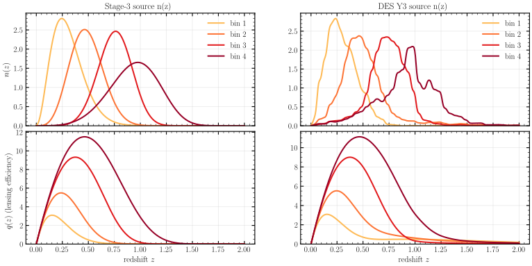
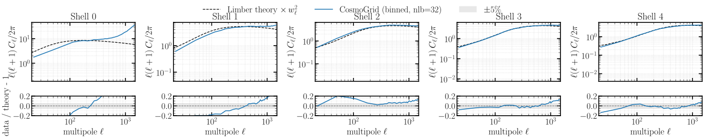
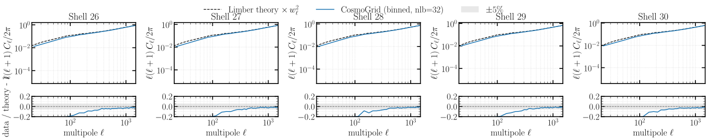
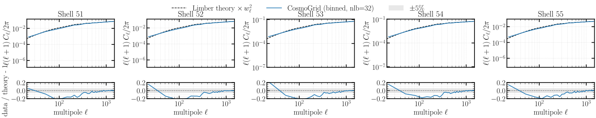
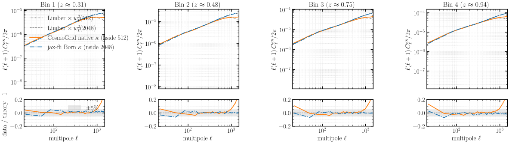
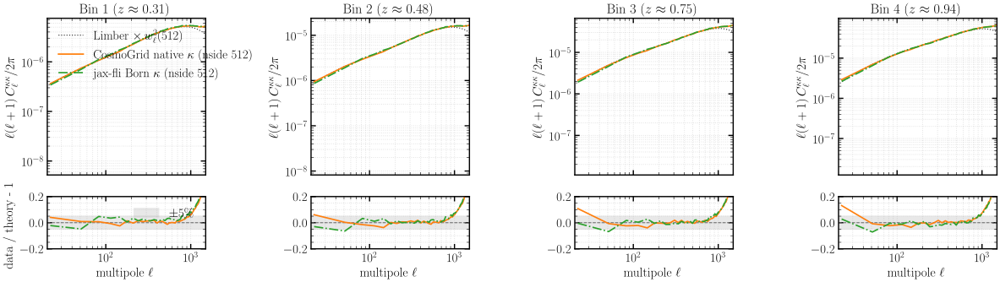
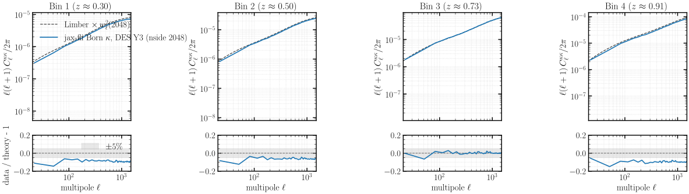
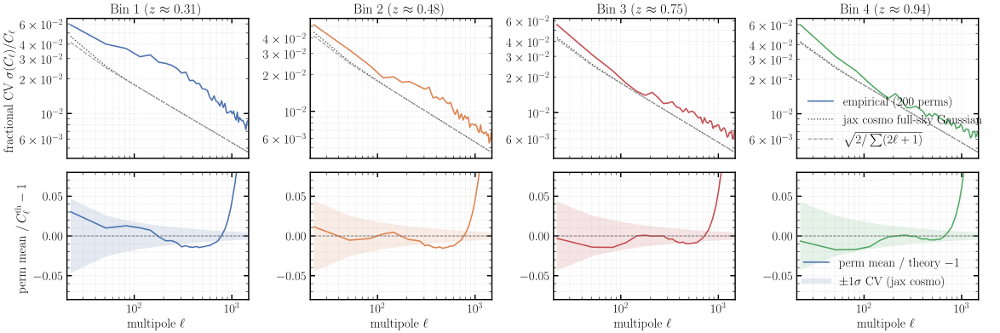

# Experiment 00 — CosmoGrid reference

## Goal

CosmoGrid is the external N-body suite this work validates against. This experiment pins down **what CosmoGrid can be trusted to reference**, in two roles:

1. **A density reference for checking the analytic theory.** CosmoGrid's published nside-2048 density lightcone (56 shells, `z ≤ 1.6`) is compared, shell by shell, to the Limber **number-counts** `C_ℓ`. Where they agree, the analytic theory is the right yardstick; where they part it is the theory (thin-shell Limber / halofit) or the resolution, not the simulation. The headline: **CosmoGrid tracks the theory to high ℓ — out to `ℓ ≈ 700` across the shells and approaching `ℓ ≈ 1000` for the far shells** — so it is a sound reference for validating a per-shell theory `C_ℓ`.
2. **A lensing reference for validating jax-fli's Born approximation.** We Born-integrate CosmoGrid's *own* published density into convergence (κ) for the **Stage-3** and **DES Y3** sources and compare to CosmoGrid's native κ and to Limber weak-lensing theory. At full **nside 2048** our Born κ resolves more small-scale power than CosmoGrid's native nside-512 κ; **down-sampled to 512 the two agree**, so the difference is purely resolution — the Born integral itself is validated.

The κ products this experiment computes (the density is CosmoGrid's, streamed from HuggingFace, not a run of ours):

| product | source `n(z)` | entry point | resolution | devices |
|---------|---------------|-------------|------------|---------|
| **Born κ** (figures) | Stage-3, DES Y3 | `fli-born-rt` | nside 2048, float64, global norm | **32 GPU** (8 nodes × 4, npix-sharded `--pdim 32 1`) |
| ray-traced κ (cross-check) | Stage-3, DES Y3 | `fli-dorian-rt` | nside 2048, bilinear interp | 1 CPU process (full lightcone in host RAM) |

The Born run is the fast, many-GPU path the lensing science uses; the dorian ray-trace is a single-process numpy cross-check (MPI parallelism deferred).

### Data

Everything is on the `ASKabalan/jax-fli-experiments` HuggingFace dataset (built from CosmoGrid `cosmo_000001`, run000 cosmology — σ₈ 0.9, w₀ −1.1665, Ω_ν ≈ 0.0012):

| config | field | nside | contents |
|--------|-------|------:|----------|
| `00-cosmogrid-000001-density` | `SphericalDensity` | 2048 | particle counts, 56 shells to **z ≤ 1.6** (DES Y3 depth) — **one row per shell**, load by **streaming** |
| `00-cosmogrid-000001-kappa` | `SphericalKappaField` | 512 | CosmoGrid's own **Stage-3 forecast** κ (4 bins) |
| `00-cosmogrid-000001-born-{s3,des}` | `SphericalKappaField` | 2048 | **Born** κ from the density, Stage-3 / DES Y3 source `n(z)` (4 bins) |

The 2048 lightcone is too large to be one parquet (stacking it OOMs; a non-streaming `load_dataset` overflows arrow's INT32 list-offset across the 56 shells), so the density is stored **one `(1, npix)` parquet per shell** under a single config and **reassembled by streaming**.

## Method

**Density side.** Each of the 56 CosmoGrid shells is reduced to overdensity `δ = ρ/⟨ρ⟩_shell − 1` and its full-sky `C_ℓ` bandpower-binned (`nlb = 16`). The reference is the analytic **comoving-volume Limber number-counts** `C_ℓ` on the measured pixel-window footing — the full-resolution theory × `pixwin(2048)²` *before* binning (the legacy `tophat_z` shell weighting is biased and not used). The convergence figure forms, per target multipole, the `(2ℓ+1)`-weighted measured/theory ratio in a narrow band and plots it against each shell's comoving distance, with the full-sky `±1σ` cosmic-variance band and a `±5 %` envelope.

**Lensing side.** `fli-born-rt` streams the 56 density shells and Born-integrates them once into a tomographic κ for the **Stage-3** and **DES Y3** source `n(z)` (`jax_fli.data.get_stage3_nz_shear` / `get_des_y3_nz_shear`). κ is dimensionless (no unit conversion). Each measured κ `C_ℓ` is compared to Limber **weak-lensing** theory (`compute_theory_cl`, *not* the density `_for_density`), pixel-window-matched to that series' nside; since CosmoGrid's native κ is nside 512 and ours native nside 2048, we also down-sample ours to 512 for the matched comparison.

## Results

### The source redshift bins

The two source distributions that drive the lensing comparisons — Stage-3 (the forecast CosmoGrid itself used) and DES Y3 — with their lensing-efficiency kernels:



Per source set: the per-bin `n(z)` (top) and the weak-lensing efficiency `q(z)` (bottom) — the kernel that turns the density shells into convergence. CosmoGrid's native lensing used the **Stage-3** forecast, which is why the strict end-to-end κ check below is Stage-3, and DES Y3 is taken against theory.

### Density: CosmoGrid vs Limber theory

Per-shell density `C_ℓ`, CosmoGrid (binned) against the pixel-window-matched Limber number-counts theory — first, middle and last five of the 56 shells:





The innermost shells (0–1) are the noisiest — thin, low-occupancy, discreteness-limited — and their ratio wanders. From a few shells out CosmoGrid tracks the theory across a broad `ℓ` range; the residual high-`ℓ` behaviour is the shells' own resolution/painting, not a theory failure.

The convergence figure makes the trust region quantitative — the `(2ℓ+1)`-weighted measured/theory ratio vs comoving distance, at six target multipoles:


Across `ℓ = 200 … 700` the ratio sits inside the `±5 %` envelope and the cosmic-variance band for the **far** (large-χ) shells, degrading only at small χ where the near shells are discreteness-limited. That is the basis for the headline: **CosmoGrid is an accurate density reference out to `ℓ ≈ 700`, and toward `ℓ ≈ 1000` for the far shells** — tight enough to validate a per-shell analytic `C_ℓ` against.

### Lensing: validating the Born convergence

Stage-3 convergence `C_ℓ`, per tomographic bin — CosmoGrid's native κ, our jax-fli Born κ (native 2048), and Limber theory:



Our Born κ at **nside 2048** tracks the theory further into high `ℓ` than CosmoGrid's native **nside-512** κ, which rolls off earlier — the resolution + pixel-window difference between 2048 and 512. To show that is *all* it is, we repeat with **our** κ down-sampled to nside 512:



At the matched resolution the two **agree** — confirming the apparent advantage in fig05 is resolution, and that the Born integral reproduces CosmoGrid's lensing like-for-like. Finally DES Y3, for which there is no native CosmoGrid κ (CosmoGrid used the Stage-3 forecast), so the Born κ is shown against Limber theory alone:



The DES Y3 Born κ tracks the weak-lensing theory over the same intermediate band, validating the pipeline for the second source distribution.

### The cosmic-variance band of the reference

Every ratio figure of this work (05b/05c, and the thesis `lensing_vs_cosmogrid`) divides our spectra by a CosmoGrid κ reference, so the plotted residual carries the cosmic variance of that reference. The band is measured from the fiducial CosmoGrid permutations themselves: all 200 `perm_XXXX` of `stage3_forecast/fiducial/cosmo_fiducial`, four Stage-3 κ bins each, full-sky `C_ℓ` to ℓ = 1500 (healpy anafast — the same estimator and the same banding, linear bins of 32 multipoles with `(2ℓ+1)` weights, as every figure). The product is published in the dataset under `00-cosmogrid/fiducial_kappa_spectra/` as five parquets: one per 50 permutations (`cosmo_fiducial_part{0..3}.parquet`, one row per perm, array `(4, 1501)`) and `cosmo_fiducial_stats.parquet`, the ensemble summary as a two-row spectra file (row 0 = per-multipole mean across the perms, row 1 = std). The band itself is derived from the parts, not the stats rows: the empirical CV is the std across perms of the bandpowers, which the pointwise std row overestimates in the first band (bin(std row)/bin(mean row) is biased high by ≈ 0.2 where the in-band `C_ℓ` variation is large). The fiducial cosmology (H₀ 67.36, Ω_m 0.26, σ₈ 0.84) is resolved in `2-build.py` from the metainfo's `parameters/fiducial` group — the library's `load_cosmogrid_kappa` only knows the numbered grid cosmologies, so the script patches the resolution locally (no `src/` change). The band is a fractional, cosmology-independent quantity, so the fiducial cosmology differing from the `cosmo_172798` / `cosmo_000001` references does not matter.

Three estimates of the fractional band come out side by side, per bin and bandpower:



- **Empirical** — the std/mean of the bandpowers across the 200 permutations. The perms are semi-independent (reshuffles and rotations of only 7 independent fiducial simulations, Kacprzak et al. 2023) — this is the sims-based error bar the ratio panels should draw.
- **jax_cosmo Gaussian** — `gaussian_cl_covariance` (noise-free, `f_sky=1`), propagated exactly to the same bandpowers. Its floor is the closed form `sqrt(2/Σ(2ℓ+1))`, which it reproduces to ≤ 0.7 % for ℓ ≥ 100; below that the C_ℓ variation inside a band inflates the propagated variance, as it must.
- The empirical scatter sits **above** the Gaussian band everywhere — 1.2–2.6× at ℓ ≲ 1000, converging toward it at high ℓ — the direction expected from the non-Gaussian (trispectrum) contribution that the Gaussian formula ignores; it is stable between perm halves. The Gaussian number is the idealized floor, the empirical one the conservative band.

The bottom row checks the ensemble itself: the perm-mean against the Limber theory at the fiducial cosmology, pixel-window matched. It sits inside the band for ℓ ≲ 1200 (worst ≈ 1.9× the band at ℓ ~ 500) and only leaves it from above near the nside-512 Nyquist, where the maps' aliasing power — not cosmic variance — takes over; the same reason the ratio figures stop at ℓ ≈ 1300.

## How to run

The density and forecast-κ are published from the local CosmoGrid files; the Born/ray-traced κ run on the cluster and save parquet, which `publish_local.py` uploads afterwards. The figure scripts are local, CPU.

```bash
# 1. Publish the reference density + CosmoGrid's forecast κ (CPU; needs HF_TOKEN to upload).
python publish_density_2048.py --publish     # 00-cosmogrid-000001-density (one parquet per shell, streamed)
python publish_kappa_512.py    --publish     # 00-cosmogrid-000001-kappa   (CosmoGrid's own Stage-3 forecast κ)

# 2. Compute the Born + ray-traced κ on the cluster, then publish (SLURM via fli-launcher).
MODE=dryrun bash run.sh        # resolve the born ×2 / dorian ×2 commands without submitting
bash run.sh                    # submit; then: python publish_local.py --yes

# 3. Figures from the published spectra (CPU; float64) — no GPU, no re-simulation.
JAX_PLATFORMS=cpu uv run --no-sync python 0-build.py    # fig01–fig04  (density convergence)
JAX_PLATFORMS=cpu uv run --no-sync python 1-build.py    # fig05–fig07 + fig08-nz-bins  (lensing)

# 4. Fiducial cosmic-variance band (CPU; reads the local CosmoGrid files, ~10 min).
#    Writes cosmo_fiducial_part{0..3}.parquet + cosmo_fiducial_stats.parquet into
#    ../jax-fli-experiments/00-cosmogrid/fiducial_kappa_spectra/; skips if they exist.
JAX_PLATFORM_NAME=cpu uv run --no-sync python 2-build.py   # fig09-cosmic-variance  (FORCE_REGEN=1 to recompute)

# 5. Publish the product (run from ../jax-fli-experiments):
#    hf upload ASKabalan/jax-fli-experiments 00-cosmogrid/fiducial_kappa_spectra 00-cosmogrid/fiducial_kappa_spectra --repo-type dataset
```

> **Offline cluster (Jean Zay — no internet on compute nodes).** Pre-cache on a login node (`HF_HOME=$WORK/hf_cache python download.py`), then on compute nodes set `HF_HOME=$WORK/hf_cache HF_HUB_OFFLINE=1 HF_DATASETS_OFFLINE=1`; `fli-born-rt` / `fli-dorian-rt` then stream the warm cache without touching the network.
