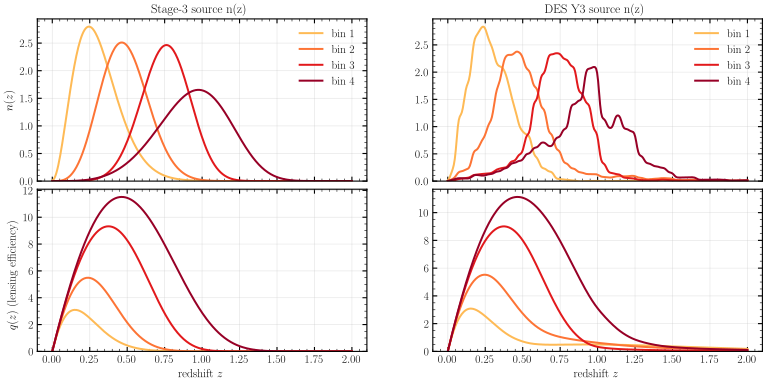
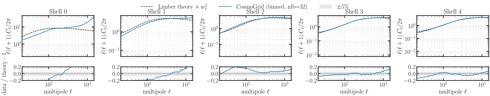
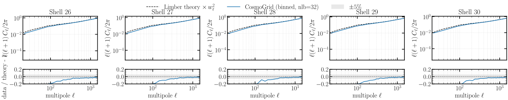
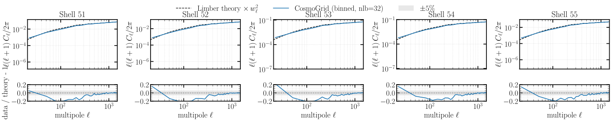
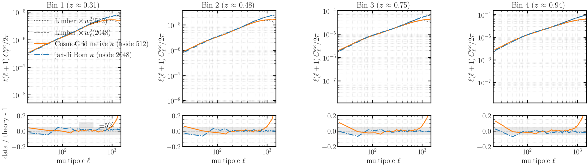
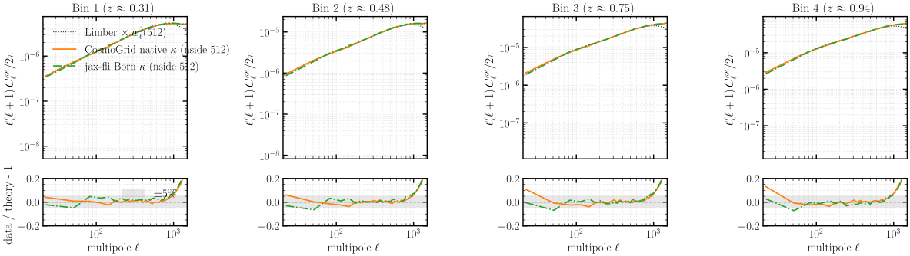
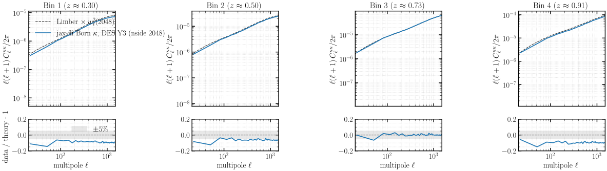
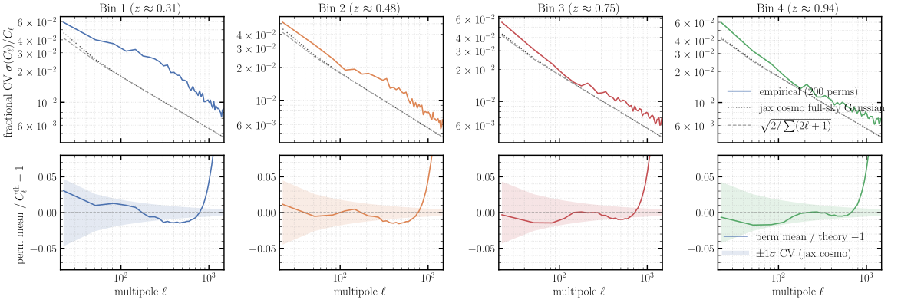

# Experiment 00 — CosmoGrid reference

**Goal.** CosmoGrid is the external N-body suite this work validates against, and this experiment fixes what it can be trusted to reference, in two roles. As a **density reference**, its published nside-2048 lightcone (56 shells, `z ≤ 1.6`) is compared shell by shell with the Limber **number-count** `C_ℓ`: CosmoGrid tracks the theory **out to `ℓ ≈ 700` across the shells, and toward `ℓ ≈ 1000` for the far shells**, so it can validate a per-shell theory `C_ℓ`. As a **lensing reference**, we Born-integrate the CosmoGrid density into convergence κ for the **Stage-3** and **DES Y3** sources and compare it with the native CosmoGrid κ and with Limber weak-lensing theory. At nside 2048 our Born κ resolves more small-scale power than the native nside-512 κ, and **down-sampled to 512 the two agree**, which validates the Born integral. The density is CosmoGrid's own, streamed from HuggingFace.

| product | source `n(z)` | entry point | resolution | devices |
|---------|---------------|-------------|------------|---------|
| **Born κ** (figures) | Stage-3, DES Y3 | `fli-born-rt` | nside 2048, float64, global norm | **32 GPU** (8 nodes × 4, npix-sharded `--pdim 32 1`) |
| ray-traced κ (cross-check) | Stage-3, DES Y3 | `fli-dorian-rt` | nside 2048, bilinear interp | 1 CPU process (full lightcone in host RAM) |

The Born run is the fast, many-GPU path of the lensing science, and the dorian ray-trace is a single-process numpy cross-check, with MPI parallelism deferred. The data are on the `ASKabalan/jax-fli-experiments` dataset, built from CosmoGrid `cosmo_000001` (run000 cosmology: σ₈ 0.9, w₀ −1.1665, Ω_ν ≈ 0.0012):

| config | field | nside | contents |
|--------|-------|------:|----------|
| `00-cosmogrid-000001-density` | `SphericalDensity` | 2048 | particle counts, 56 shells to **z ≤ 1.6** (DES Y3 depth), **one row per shell**, load by **streaming** |
| `00-cosmogrid-000001-kappa` | `SphericalKappaField` | 512 | the CosmoGrid **Stage-3 forecast** κ (4 bins) |
| `00-cosmogrid-000001-born-{s3,des}` | `SphericalKappaField` | 2048 | **Born** κ from the density, Stage-3 / DES Y3 source `n(z)` (4 bins) |

Stacking the nside-2048 lightcone into one parquet runs out of memory, and a non-streaming `load_dataset` overflows the INT32 list offset of Arrow across the 56 shells. The density is therefore stored as one `(1, npix)` parquet per shell under a single config and reassembled by streaming.

## Method

**Density.** We reduce each of the 56 shells to the overdensity `δ = ρ/⟨ρ⟩_shell − 1` and bin its full-sky `C_ℓ` in bandpowers (`nlb = 16`). The reference is the comoving-volume Limber number-count `C_ℓ`, multiplied by `pixwin(2048)²` before binning; the legacy `tophat_z` shell weighting is biased and unused. The convergence figure plots, per target multipole, the `(2ℓ+1)`-weighted measured/theory ratio in a narrow band against the comoving distance of each shell, with the full-sky `±1σ` cosmic-variance band and a `±5%` envelope.

**Lensing.** `fli-born-rt` streams the 56 density shells and Born-integrates them once into a tomographic κ for the Stage-3 and DES Y3 source `n(z)` (`jax_fli.data.get_stage3_nz_shear` / `get_des_y3_nz_shear`). We compare each κ `C_ℓ` with Limber weak-lensing theory (`compute_theory_cl`), matched to the pixel window of the nside of each series. The native CosmoGrid κ is at nside 512 and ours at nside 2048, so we also down-sample ours to 512 for a matched comparison.

## Results

### The source redshift bins



**Source redshift bins.** For Stage-3, the forecast CosmoGrid itself used, and for DES Y3: the `n(z)` of each bin (top) and the weak-lensing efficiency `q(z)` (bottom), the kernel that turns the density shells into convergence. The native CosmoGrid lensing used the Stage-3 forecast, so the end-to-end κ check is Stage-3, and DES Y3 is compared with theory.

### Density: CosmoGrid against Limber theory





**Per-shell density `C_ℓ` against theory.** The binned CosmoGrid spectra of the first, middle and last five of the 56 shells against the pixel-window-matched Limber number-count theory. The innermost shells (0–1) are thin, sparsely occupied and limited by discreteness, and their ratio wanders. From a few shells out CosmoGrid tracks the theory across a broad `ℓ` range, and the residual behaviour at high `ℓ` comes from the resolution and painting of the shells.


**Measured/theory against comoving distance, `ℓ = 200 … 700`.** The `(2ℓ+1)`-weighted ratio at six target multipoles. For the far shells it sits inside the `±5%` envelope and the cosmic-variance band at every multipole, and it degrades only at small `χ`, where the near shells are limited by discreteness. CosmoGrid is an accurate density reference out to `ℓ ≈ 700`, and toward `ℓ ≈ 1000` for the far shells.

### Lensing: validating the Born convergence



**Stage-3 κ: native CosmoGrid, jax-fli Born at nside 2048, and theory.** Per tomographic bin, our Born κ tracks the theory further into high `ℓ` than the native nside-512 κ, which rolls off earlier from its resolution and pixel window.



**Stage-3 κ matched at nside 512.** With our κ down-sampled to nside 512 the two agree: the gap of fig05 is resolution, and the Born integral reproduces the CosmoGrid lensing like for like.



**DES Y3 κ against theory.** CosmoGrid has no native κ for DES Y3, so the Born κ is compared with Limber theory alone. It tracks the theory over the same intermediate band, which validates the pipeline for the second source distribution.

### The cosmic-variance band of the reference

Every ratio figure of this work (05b, 05c and the thesis `lensing_vs_cosmogrid`) divides our spectra by a CosmoGrid κ reference, so the residual carries the cosmic variance of that reference. We measure it from all 200 fiducial permutations `perm_XXXX` of `stage3_forecast/fiducial/cosmo_fiducial`, four Stage-3 κ bins each, with full-sky `C_ℓ` to ℓ = 1500 from healpy anafast in the banding of every figure (linear bins of 32 multipoles with `(2ℓ+1)` weights). The spectra are published under `00-cosmogrid/fiducial_kappa_spectra/`: `cosmo_fiducial_part{0..3}.parquet` hold 50 permutations each (one row per permutation, array `(4, 1501)`), and `cosmo_fiducial_stats.parquet` holds the per-multipole mean (row 0) and std (row 1). We derive the band from the parts, as the std across permutations of the bandpowers, because the pointwise std row overestimates it in the first band (bin(std row)/bin(mean row) is biased high by ≈ 0.2 where `C_ℓ` varies strongly within the band). `2-build.py` resolves the fiducial cosmology (H₀ 67.36, Ω_m 0.26, σ₈ 0.84) from the `parameters/fiducial` group of the metainfo, since `load_cosmogrid_kappa` knows only the numbered grid cosmologies, and patches this locally without a `src/` change. The band is fractional and independent of cosmology, so it applies to the `cosmo_172798` and `cosmo_000001` references.



**Fractional cosmic variance of the reference, three estimates per bin and bandpower.** The **empirical** band is the std/mean of the bandpowers across the 200 permutations, which are reshuffles and rotations of only 7 independent fiducial simulations (Kacprzak et al. 2023); it is the sims-based error bar for the ratio panels. The **jax_cosmo Gaussian** band propagates `gaussian_cl_covariance` (noise-free, `f_sky=1`) exactly to the same bandpowers and reproduces the closed form `sqrt(2/Σ(2ℓ+1))` to ≤ 0.7% for ℓ ≥ 100, while below ℓ = 100 the variation of `C_ℓ` inside a band inflates it. The empirical scatter sits above the Gaussian band everywhere, by 1.2–2.6× at ℓ ≲ 1000, and converges toward it at high ℓ, as expected from the trispectrum contribution that the Gaussian formula omits; it is stable between halves of the permutations. The Gaussian band is the idealised floor and the empirical one the conservative band. The bottom row compares the mean of the permutations with Limber theory at the fiducial cosmology, pixel-window matched: it sits inside the band for ℓ ≲ 1200 (worst ≈ 1.9× the band at ℓ ~ 500) and leaves it from above near the nside-512 Nyquist, where aliasing power takes over, which is also why the ratio figures stop at ℓ ≈ 1300.

## How to run

The density and the forecast κ are published from the local CosmoGrid files, and the Born and ray-traced κ run on the cluster and save parquet. The figure scripts run locally on CPU.

```bash
python publish_density_2048.py --publish     # 00-cosmogrid-000001-density (one parquet per shell, streamed)
python publish_density_512.py                # the same lightcone down-graded to nside 512, one stacked parquet
python publish_kappa_512.py    --publish     # 00-cosmogrid-000001-kappa (the CosmoGrid Stage-3 forecast κ)

MODE=dryrun bash run.sh        # resolve the born ×2 / dorian ×2 commands without submitting
bash run.sh                    # submit; then: python publish_local.py --yes

JAX_PLATFORMS=cpu uv run --no-sync python 0-build.py    # fig01–fig04 (density convergence)
JAX_PLATFORMS=cpu uv run --no-sync python 1-build.py    # fig05–fig07 + fig08-nz-bins (lensing)
JAX_PLATFORM_NAME=cpu uv run --no-sync python 2-build.py   # fig09-cosmic-variance (~10 min; FORCE_REGEN=1 to recompute)
```

`2-build.py` reads the local CosmoGrid files and writes `cosmo_fiducial_part{0..3}.parquet` and `cosmo_fiducial_stats.parquet` into `../jax-fli-experiments/00-cosmogrid/fiducial_kappa_spectra/`, skipping files that exist; publish them from `../jax-fli-experiments` with `hf upload ASKabalan/jax-fli-experiments 00-cosmogrid/fiducial_kappa_spectra 00-cosmogrid/fiducial_kappa_spectra --repo-type dataset`. The compute nodes of Jean Zay have no internet: pre-cache on a login node (`HF_HOME=$WORK/hf_cache python download.py`), then set `HF_HOME=$WORK/hf_cache HF_HUB_OFFLINE=1 HF_DATASETS_OFFLINE=1` on the compute nodes, and `fli-born-rt` / `fli-dorian-rt` stream the warm cache.
