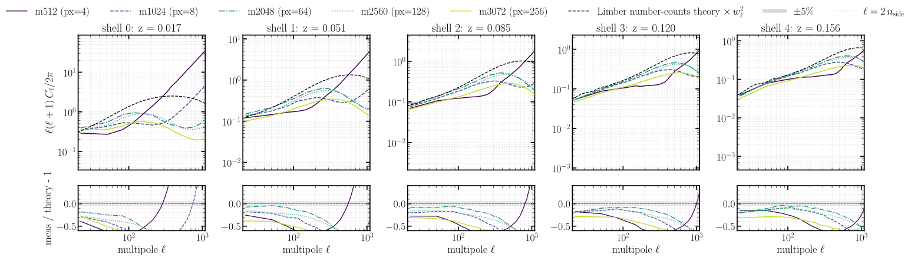
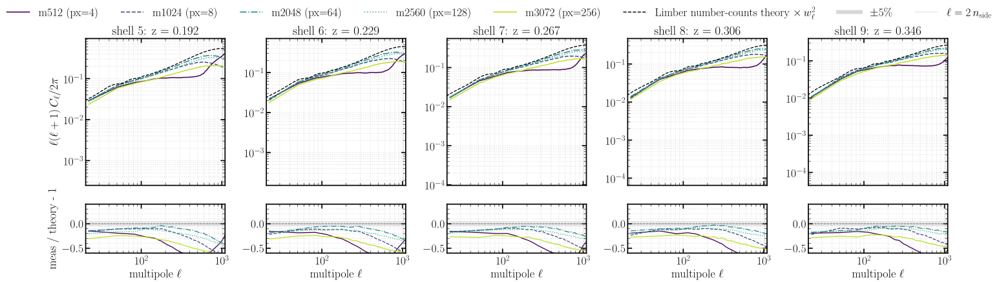
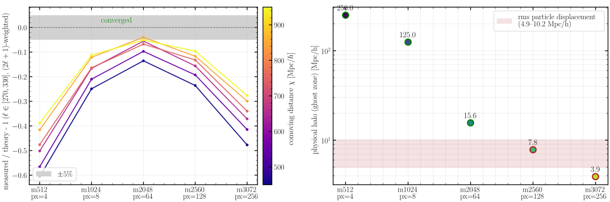
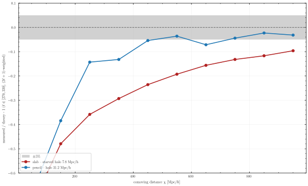
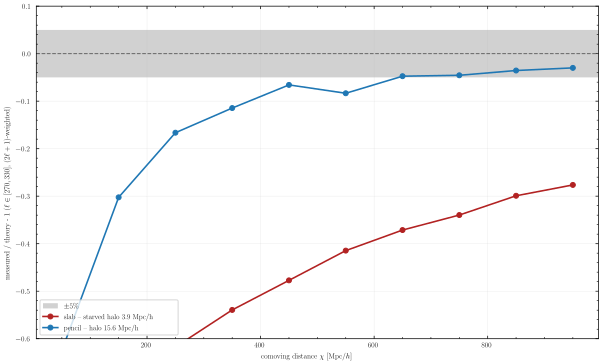
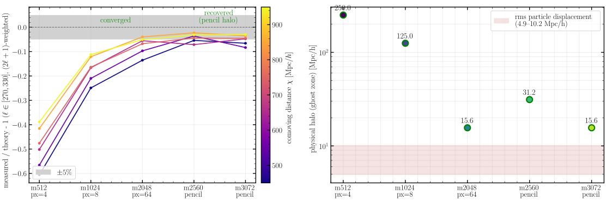

# Experiment 01 — Resolution convergence

**Goal.** Push the particle-mesh (PM) resolution up at fixed box, step count and cosmology, and ask
how the per-shell spherical-map angular power spectrum `C_ℓ` converges — to fix the mesh a
sub-percent lightcone needs. The answer turned out to be more interesting than a monotonic
convergence: the spectra converge up to **2048³**, then the **over-fine runs lose power** — and the
cause is not physics but a **starved distributed-PM ghost zone**. This experiment establishes the
usable resolution *and* surfaces (with a quantitative diagnosis and a fix) that artifact.

The five resolution rungs — one PM sim each, identical but for the mesh (and the GPU count `pₓ` and
ghost-zone halo the mesh forces):

| mesh | GPUs (`pₓ`) | nodes | physical halo `box/2pₓ` |
|-------|----:|----:|----------:|
| 512³  | 4   | 1  | 250 Mpc/h |
| 1024³ | 8   | 2  | 125 Mpc/h |
| 2048³ | 64  | 16 | 15.6 Mpc/h |
| 2560³ | 128 | 32 | 7.8 Mpc/h |
| 3072³ | 256 | 64 | 3.9 Mpc/h |

Fixed across all five: BullFrog (`bf`), `--nb-steps 50` (`a = 0.001 → 1`), `--paint-order cic`,
`--scheme ngp`, `--nside 512`, `--nb-shells 10`, `--shell-spacing comoving`, box `2000³` Mpc/h, CosmoGrid
fiducial cosmology, `--seed 0`, **float64**, `--halo-multiplier 0.5`. Two **pencil** re-runs (2560³ and
3072³ at `--pdim 32 4`) test the fix — see [§ The runs](#the-runs) for the per-rung sizing and the
measured intermediate-ℓ ratios.

## Method

Each rung is one PM simulation (BullFrog, 50 steps, `a = 0.001 → 1`) painting a lightcone of
**10 comoving HEALPix shells** (`nside = 512`, centres 50–950 Mpc/h, width 100, `z ≈ 0.017–0.35`)
from a centred observer in a `2000³` Mpc/h box. The rungs share everything but the mesh — and,
because the IC white noise is drawn **per mesh cell**, each rung is an **independent realisation**
(their maps cross-correlate at `r_ℓ ≈ 0`, even at the largest scales). So the rungs are different
universes at the same cosmology, not a phase-matched ladder.

For each shell we form the **per-plane overdensity** `δ = ρ/⟨ρ⟩_shell − 1` (each shell normalised by
its own mean — the choice consistent with a per-shell number-counts prediction; `≈` global to ~2% on
the well-sampled outer shells) and its **full-sky** angular `C_ℓ` with healpy `anafast`
(`fli-summary-stats --method healpy --normalization per_plane --mask none`). The reference is the
analytic **Limber number-counts** `C_ℓ` (`jax_fli.compute_theory_cl_for_density`, bias 1, halofit),
computed with the correct **comoving-volume** shell selection: a painted shell is a comoving-volume
projection of `δ` (radial weight `q(χ) ∝ χ²`), and the theory is the edge-exact per-shell Limber
integral of that, **not** a redshift top-hat (the deprecated path, which under-sampled the narrow
inner shells and added spurious per-shell scatter). It is put on the same footing as the measurement
by multiplying by the HEALPix pixel window `pixwin(nside)²` (the painted map carries `W_ℓ²`).

The clean comparison band is a narrow window at **intermediate ℓ** (`ℓ ∈ [270, 330]`, around
`ℓ ≈ 300`), where the full-sky cosmic variance over the band is **sub-percent** — small enough that a
real resolution effect cannot hide behind it — and which sits below where the coarse-mesh and
pixel-window roll-offs and the **CosmoGrid** cross-check break down (exp 06: the same per-shell pipeline
tracks a different N-body code to ~2–3 % out to `ℓ ≈ 300`). The broader `ℓ ∈ [30, 300]` band is
cosmic-variance-dominated by its few large-scale modes, so it is *not* used for the convergence ratio.

## Results

### The per-shell spectra

Every shell × resolution measured `C_ℓ` (**`(2ℓ+1)`-weighted bandpowers**, coloured by mesh) against the
pixel-window-matched Limber theory (black), each panel pairing the `C_ℓ` (top) with its binned
measured/theory ratio (bottom, 3:1) over a grey **±1σ cosmic-variance band** — the first then the last
five of the 10 shells (`z ≈ 0.017 → 0.35`):




The **nearest shells sit systematically below theory** — there the `χ²` weighting probes higher `k`, where
PM force resolution and non-linearity bite, and the thin low-`z` shells are discreteness-limited (shell 0
reaches only `≈ 0.6` of theory). The mid and far shells track theory well. The resolution ordering is not
the naive one — `512³` is coarse-mesh / shot-noise limited, and the *over-fine* `2560³`/`3072³` lose
large-scale power — which the next figure quantifies.

### Convergence — and the anti-convergence of the over-fine runs



**Left** — the measured/theory ratio, **`(2ℓ+1)`-weighted** over the CV-clean band `ℓ ∈ [270, 330]`,
one line per shell (outer, well-sampled shells bold). It is **non-monotonic**: the outer shells rise
to a resolution-independent plateau at **1024³ and 2048³** (`≈ 0.88` and `≈ 0.92` of theory — they
agree with *each other* to ~3 %, i.e. converged), then **fall back**. The plateau sits a consistent
**~8–12 % below** the halofit-Limber theory, flat in ℓ — and **that offset is the theory, not the
simulation.** Exp 06 (the CosmoGrid comparison) settles it: there the same per-shell pipeline
reproduces the independent **CosmoGrid** TreePM N-body to **~2–3 % out to `ℓ ≈ 300`**, and CosmoGrid
*itself* sits ~15–25 % below the *same* halofit-Limber theory at low/mid ℓ. An independent N-body
undershooting the analytic curve by the same amount means the offset is the **Limber approximation
for thin shells (plus a few-percent halofit), not a missing normalisation factor** — indeed the
per-plane `δ = ρ/⟨ρ⟩_shell − 1` provably divides the shell-volume and `4π/npix` factors straight out
(`per_plane ≈ global`). This offset is **not** what this experiment is about. The robust,
theory-independent statement is the **relative** one: **2560³ and 3072³ carry ~8 % and ~29 % less
power than the converged 2048³** at scales all three resolve identically — a deficit that is the
**same sign in all 10 shells** and **grows with the decomposition `pₓ`**, far beyond the ~0.5 % cosmic
variance of the band (so it is not a statistical fluke). A *finer* mesh delivering *less* power, at
scales it resolves easily, is not convergence. It is also not particle shot noise (which is
*additive* — subtracting it makes the coarse meshes *more* deficient, and it is < 0.5 % of signal on
the outer high-mesh shells).

**Right** — the cause. The distributed PM keeps particles in fixed Lagrangian slabs and paints into a
padded slab whose **ghost zone (halo) has physical width `halo_multiplier · box / pₓ = box/(2 pₓ)`**,
so it **shrinks with the x-decomposition `pₓ` (GPU count)**: 15.6 / 7.8 / 3.9 Mpc/h for
2048³ / 2560³ / 3072³ (`pₓ = 64 / 128 / 256`). The rms particle displacement here is
`σ₁D ≈ 4.9–5.9` Mpc/h (3D rms ≈ 8.5–10.2, red band). The 2048³ halo clears it; **2560³ and 3072³
fall into and below it**, so boundary particles that drift more than the ghost-zone width lose their
CIC deposit / force contribution → broadband power loss, worse for the smaller halo — exactly where,
and by how much, the deficit appears. `halo_multiplier = 0.5` was sized for memory and the even-halo
constraint, and at `pₓ ≥ 128` it inadvertently dropped the ghost zone below the displacement scale.

This is the leading, quantitatively-matched explanation — and the next figures **demonstrate the fix**:
a device layout (or `--halo-multiplier`) that restores the ghost zone restores the power.

### Switching slab → pencil restores convergence

The halo scales as `box/2pₓ` along the **sharded** axis, so re-running 2560³ and 3072³ as a **2-D pencil**
(`--pdim 32 4`) instead of a **1-D slab** (`--pdim 128 1` / `256 1`) splits each axis fewer ways and
**enlarges the ghost zone** — 7.8 → 31.2 Mpc/h (2560³) and 3.9 → 15.6 Mpc/h (3072³) — at the *same* mesh
and GPU count. The recovered power, per shell vs comoving distance:




For both meshes the **pencil (large halo) sits well above the starved slab** and climbs into the ±5 % band
on the outer shells — recovering the power the slab lost, most strongly where the deficit was worst (and
the small scales improve too, from a cleaner force on the boundary particles). Repeating the convergence
diagnostic with 2560³/3072³ as pencils:



the anti-convergence is **gone** — every resolution now reaches the converged plateau (left), because the
pencil halos clear the displacement band (right). So the pencil decomposition is the **demonstrated fix**:
at fixed mesh and GPU count, a layout with a larger ghost zone removes the starvation. (Equivalently, raise
`--halo-multiplier`; the sizing rule below sets the target.)

### The maps

Shell 9 `δ` for all five **slab** resolutions on a shared `log₁₀(1+δ)` scale — flat gnomonic patch,
orthographic globe, full-sky mollview:


By eye the loss is **diffuse**, not a localised defect — 512³ is visibly smoother (coarse force mesh) and
the higher meshes show no boundary stripes, holes, or grid pattern (the `pₓ = 256` domain boundaries
project ~0.5° apart, too dense to see). Putting the starved slabs next to their pencils makes the
broadband loss visible on close inspection:


slab and pencil share the same cosmic-web texture, but the starved slabs are subtly **less contrasted at
small scales** — the missing power, made visible — while the pencil maps are sharper and the more
converged. There is still no gross artifact: the starvation is a broadband amplitude loss, consistent with
the spectra.

## The runs

Fixed: `--sim-mode pm`, BullFrog (`bf`), `--nb-steps 50`, `--paint-order cic`, `--scheme ngp`,
`--nside 512`, `--nb-shells 10`, `--shell-spacing comoving`, box `2000³` Mpc/h, fiducial cosmology
(Ω_c 0.2589, Ω_b 0.0486, h 0.6774, σ₈ 0.8159, n_s 0.9667), `--seed 0`, **float64**
(`--enable-x64`), `--halo-multiplier 0.5`.

| mesh | GPUs (`pₓ`) | nodes | physical halo `box/2pₓ` | measured/theory, `ℓ∈[270,330]` |
|------|--:|--:|--:|--:|
| 512³  | 4   | 1  | 250 Mpc/h | ~0.71 (coarse-mesh limited) |
| 1024³ | 8   | 2  | 125 Mpc/h | **≈ 0.88 (converged)** |
| 2048³ | 64  | 16 | 15.6 Mpc/h | **≈ 0.92 (converged)** |
| 2560³ | 128 | 32 | 7.8 Mpc/h | ~0.87 (halo-starved) |
| 3072³ | 256 | 64 | 3.9 Mpc/h | ~0.71 (halo-starved) |

> The GPU count per rung is the smallest `pₓ` (with `pₓ | mesh` and `mesh/pₓ` a multiple of 4) that
> keeps the local mesh ≤ 512³ on a float64 H100. That choice ties the halo to `pₓ`, which is the knob
> the result above turns on — a larger `--halo-multiplier` (or fewer, fatter slabs) is the fix.

**Sizing the halo (the rule this experiment establishes).** The ghost zone along the sharded axis
has physical width `halo = halo_multiplier · box / pₓ` (`= box/2pₓ` at the default `hm = 0.5`). To
avoid the starvation above, it must exceed the **rms particle displacement** — the Zel'dovich
displacement from the linear power spectrum at `z = 0` (its largest, end-of-run value):

> `σ_disp = √( (1 / 2π²) ∫ P_lin(k, z=0) dk )`  — 3D rms ≈ 10 Mpc/h here; per-axis `σ₁D = σ_disp/√3 ≈ 6`.

so the requirement, and the knob to turn, is

> `halo_multiplier · box / pₓ  ≳  σ_disp`   ⟺   `halo_multiplier ≳ σ_disp · pₓ / box`.

Calibration from the rungs: 2048³ (halo 15.6 ≈ 1.5 σ_disp) converged; 2560³/3072³ (7.8/3.9, at or
below σ_disp) lost ~8 %/~29 %. Target **`halo ≳ 1.5 σ_disp`** for margin — by raising
`--halo-multiplier` or using fewer, fatter slabs (smaller `pₓ`); the halo padding costs memory, so
trade it against the per-GPU float64 ceiling.

## How to run

```bash
# 1. Simulations -> results/exp1/m<mesh>.parquet (cluster; SLURM via fli-launcher)
MODE=dryrun bash run.sh     # print the resolved commands
bash run.sh                 # submit

# 2. Two spectra sets per map (raw + pixel-window-deconvolved)
fli-summary-stats results/exp1 --method healpy --normalization per_plane --mask none --enable-x64
fli-summary-stats results/exp1 --method healpy --normalization per_plane --mask none --enable-x64 \
                  --pixel-window-deconvolution
#   -> spectra_m<mesh>.parquet  and  spectra_deconv_m<mesh>.parquet

# 3. Figures (CPU is fine; loads the maps for fig04)
uv run --no-sync python 01-resolution-convergence.py   # -> assets/fig01..fig04.svg
```

Density maps, both spectra sets, and the perf CSV/reports + launch logs are published to the
`ASKabalan/jax-fli-experiments` HuggingFace dataset as four configs — `01-resolution-density`,
`01-resolution-spectra`, `01-resolution-deconvolved-spectra`, and `01-resolution-perf` — each
bundling all five resolutions as rows (index by `field.mesh_size`). The figure script loads them
straight from there.
