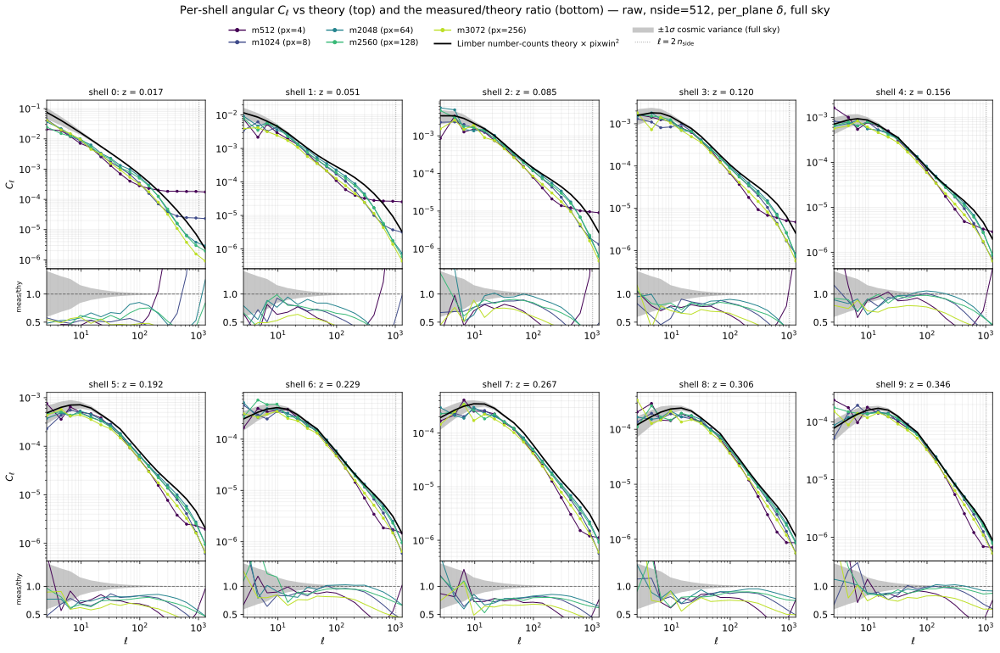
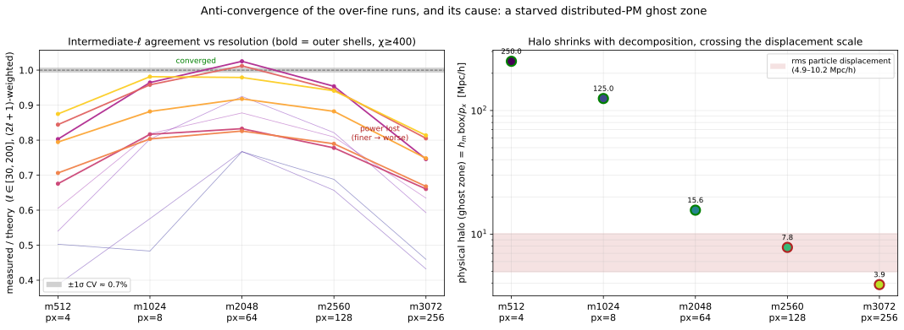
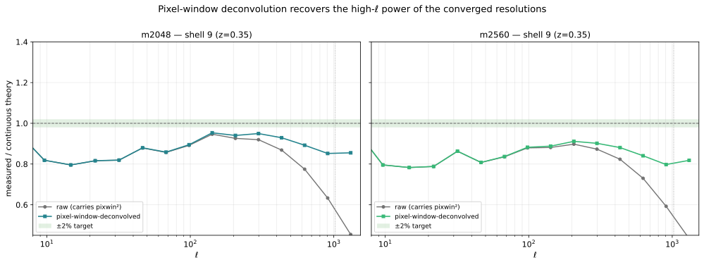

# Experiment 01 — Resolution convergence

**Goal.** Push the particle-mesh (PM) resolution up at fixed box, step count and cosmology, and ask
how the per-shell spherical-map angular power spectrum `C_ℓ` converges — to fix the mesh a
sub-percent lightcone needs. The answer turned out to be more interesting than a monotonic
convergence: the spectra converge up to **2048³**, then the **over-fine runs lose power** — and the
cause is not physics but a **starved distributed-PM ghost zone**. This experiment establishes the
usable resolution *and* surfaces (with a quantitative diagnosis and a fix) that artifact.

## Method

Each rung is one PM simulation (BullFrog, 50 steps, `a = 0.001 → 1`) painting a lightcone of
**10 comoving HEALPix shells** (`nside = 512`, centres 50–950 Mpc/h, width 100, `z ≈ 0.017–0.35`)
from a centred observer in a `2000³` Mpc/h box. The rungs share everything but the mesh — and,
because the IC white noise is drawn **per mesh cell**, each rung is an **independent realisation**
(their maps cross-correlate at `r_ℓ ≈ 0`, even at the largest scales). So the rungs are different
universes at the same cosmology, not a phase-matched ladder.

For each shell we form the **per-plane overdensity** `δ = ρ/⟨ρ⟩_shell − 1` (each shell normalised by
its own mean — the choice consistent with a per-shell number-counts prediction; `≈` global to ~2% on
the well-sampled outer shells) and its **full-sky** angular `C_ℓ` with healpy `anafast`
(`fli-summary-stats --method healpy --normalization per_plane --mask none`). The reference is the
analytic **Limber number-counts** `C_ℓ` (`jax_fli.compute_theory_cl_for_density`, bias 1, halofit),
put on the same footing as the measurement by multiplying it by the HEALPix pixel window
`pixwin(nside)²` (the painted map carries `W_ℓ²`). A second spectra set is produced with
`--pixel-window-deconvolution`, which divides that window back out.

The clean comparison band is **intermediate ℓ** (`ℓ ∈ [30, 200]`), where the full-sky cosmic
variance is only **≈ 0.7 %** — small enough that a real resolution effect cannot hide behind it,
and large enough that the coarse-mesh and pixel-window roll-offs have not yet kicked in.

## Results

### The per-shell spectra



Every shell × resolution measured `C_ℓ` (log-binned, coloured by mesh) against the pixel-window-matched
theory (black) with its ±1σ full-sky cosmic-variance band (grey); each panel pairs the `C_ℓ` (top)
with its **measured/theory ratio** (bottom, 3:1) for every resolution. The shells span `z ≈ 0.017`
(shell 0) to `0.35` (shell 9). At large scales all resolutions scatter around theory at roughly the
realisation level; the resolution story lives at higher ℓ, quantified next.

### Convergence — and the anti-convergence of the over-fine runs



**Left** — the `(2ℓ+1)`-weighted measured/theory ratio over the CV-clean band `ℓ ∈ [30, 200]`, one
line per shell (outer, well-sampled shells bold). It is **non-monotonic**: it rises to ≈ 1 at
**1024³ and 2048³** (these match theory to a few percent), then **falls back**. The robust,
theory-independent statement is the **relative** one: **2560³ and 3072³ carry ~4 % and ~17 % less
power than the converged 2048³** at scales all three resolve identically — a deficit that is the
**same sign in all 10 shells** and **grows with the decomposition `pₓ`**, far beyond the ~0.7 %
cosmic variance of the band (so it is not a statistical fluke). A *finer* mesh delivering *less*
power, at scales it resolves easily, is not convergence. It is also not particle shot noise (which
is *additive* — subtracting it makes the coarse meshes *more* deficient, and it is < 0.5 % of signal
on the outer high-mesh shells), and not the overdensity normalisation (raw `DENSITY` equals
`n̄ = mesh³/box³`, which `δ` divides straight out; `per_plane ≈ global`).

**Right** — the cause. The distributed PM keeps particles in fixed Lagrangian slabs and paints into a
padded slab whose **ghost zone (halo) has physical width `halo_multiplier · box / pₓ = box/(2 pₓ)`**,
so it **shrinks with the x-decomposition `pₓ` (GPU count)**: 15.6 / 7.8 / 3.9 Mpc/h for
2048³ / 2560³ / 3072³ (`pₓ = 64 / 128 / 256`). The rms particle displacement here is
`σ₁D ≈ 4.9–5.9` Mpc/h (3D rms ≈ 8.5–10.2, red band). The 2048³ halo clears it; **2560³ and 3072³
fall into and below it**, so boundary particles that drift more than the ghost-zone width lose their
CIC deposit / force contribution → broadband power loss, worse for the smaller halo — exactly where,
and by how much, the deficit appears. `halo_multiplier = 0.5` was sized for memory and the even-halo
constraint, and at `pₓ ≥ 128` it inadvertently dropped the ghost zone below the displacement scale.

This is the leading, quantitatively-matched explanation; the **decisive test** (future work) is to
re-run 3072³ with `--halo-multiplier ≈ 1.5` (halo ≈ 10 Mpc/h) — the power should climb back to
theory / 2048³.

### Pixel-window deconvolution recovers the converged resolutions



A separate, orthogonal correction. The painted-map `anafast` carries the HEALPix pixel window, so the
**raw** ratio (grey) rolls off toward ~0.5 by `ℓ = 2 nside` — power that no mesh refinement recovers.
`--pixel-window-deconvolution` divides out `pixwin(nside)²` and **restores it**: the deconvolved
2048³ (the converged resolution) tracks theory to ≈ 0.9–1.0 across the band, approaching the green
`±2 %` target near `ℓ ~ 100–300`. This is the right footing for using these maps as a sub-percent
reference, independent of the halo issue above.

### The maps show no localised artifact


Shell 9 `δ` for all five resolutions on a shared `log₁₀(1+δ)` scale, in two views — top row a flat
gnomonic patch (~26°), bottom row the full-sky orthographic globe (one hemisphere). 512³ is
visibly smoother (coarse force mesh); the higher meshes show no boundary stripes, holes, or grid
pattern. The halo-starvation loss is **diffuse**, not a localised defect — consistent with the
`pₓ = 256` domain boundaries projecting ~0.5° apart on this shell (too dense to see), and with the
broadband nature of the deficit.

## The runs

Fixed: `--sim-mode pm`, BullFrog (`bf`), `--nb-steps 50`, `--paint-order cic`, `--scheme ngp`,
`--nside 512`, `--nb-shells 10`, `--shell-spacing comoving`, box `2000³` Mpc/h, fiducial cosmology
(Ω_c 0.2589, Ω_b 0.0486, h 0.6774, σ₈ 0.8159, n_s 0.9667), `--seed 0`, **float64**
(`--enable-x64`), `--halo-multiplier 0.5`.

| mesh | GPUs (`pₓ`) | nodes | physical halo `box/2pₓ` | intermediate-ℓ measured/theory |
|------|--:|--:|--:|--:|
| 512³  | 4   | 1  | 250 Mpc/h | ~0.85 (coarse-mesh limited) |
| 1024³ | 8   | 2  | 125 Mpc/h | **≈ 0.97 (converged)** |
| 2048³ | 64  | 16 | 15.6 Mpc/h | **≈ 0.98 (converged)** |
| 2560³ | 128 | 32 | 7.8 Mpc/h | ~0.94 (halo-starved) |
| 3072³ | 256 | 64 | 3.9 Mpc/h | ~0.81 (halo-starved) |

> The GPU count per rung is the smallest `pₓ` (with `pₓ | mesh` and `mesh/pₓ` a multiple of 4) that
> keeps the local mesh ≤ 512³ on a float64 H100. That choice ties the halo to `pₓ`, which is the knob
> the result above turns on — a larger `--halo-multiplier` (or fewer, fatter slabs) is the fix.

**Sizing the halo (the rule this experiment establishes).** The ghost zone along the sharded axis
has physical width `halo = halo_multiplier · box / pₓ` (`= box/2pₓ` at the default `hm = 0.5`). To
avoid the starvation above, it must exceed the **rms particle displacement** — the Zel'dovich
displacement from the linear power spectrum at `z = 0` (its largest, end-of-run value):

> `σ_disp = √( (1 / 2π²) ∫ P_lin(k, z=0) dk )`  — 3D rms ≈ 10 Mpc/h here; per-axis `σ₁D = σ_disp/√3 ≈ 6`.

so the requirement, and the knob to turn, is

> `halo_multiplier · box / pₓ  ≳  σ_disp`   ⟺   `halo_multiplier ≳ σ_disp · pₓ / box`.

Calibration from the rungs: 2048³ (halo 15.6 ≈ 1.5 σ_disp) converged; 2560³/3072³ (7.8/3.9, at or
below σ_disp) lost ~6 %/~20 %. Target **`halo ≳ 1.5 σ_disp`** for margin — by raising
`--halo-multiplier` or using fewer, fatter slabs (smaller `pₓ`); the halo padding costs memory, so
trade it against the per-GPU float64 ceiling.

## How to run

```bash
# 1. Simulations -> results/exp1/m<mesh>.parquet (cluster; SLURM via fli-launcher)
MODE=dryrun bash run.sh     # print the resolved commands
bash run.sh                 # submit

# 2. Two spectra sets per map (raw + pixel-window-deconvolved)
fli-summary-stats results/exp1 --method healpy --normalization per_plane --mask none --enable-x64
fli-summary-stats results/exp1 --method healpy --normalization per_plane --mask none --enable-x64 \
                  --pixel-window-deconvolution
#   -> spectra_m<mesh>.parquet  and  spectra_deconv_m<mesh>.parquet

# 3. Figures (CPU is fine; loads the maps for fig04)
uv run --no-sync python 01-resolution-convergence.py   # -> assets/fig01..fig04.svg
```

Parquet maps, both spectra sets, the perf CSV/report and the launch logs are published to the
`ASKabalan/jax-fli-experiments` HuggingFace dataset (subset `01-resolution-convergence`); the figure
script can load them from there instead of a local `results/exp1`.
