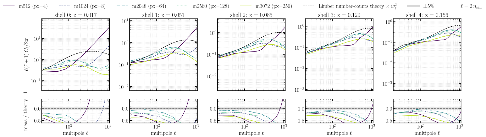
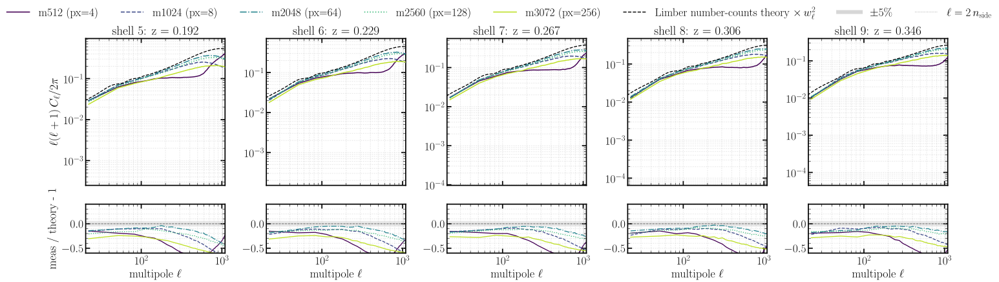
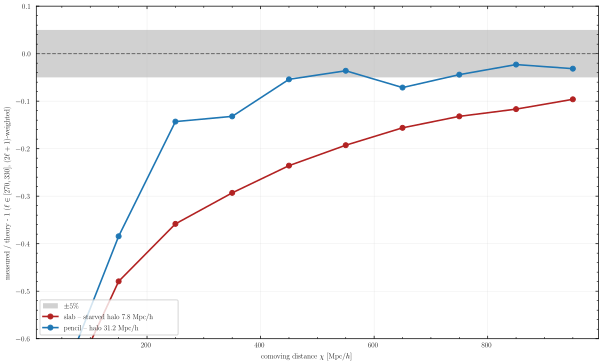
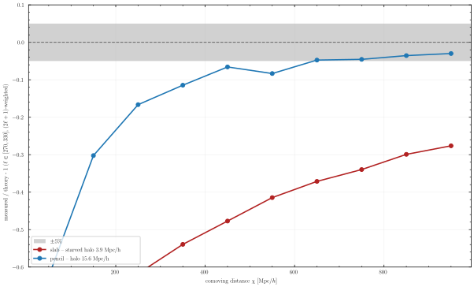
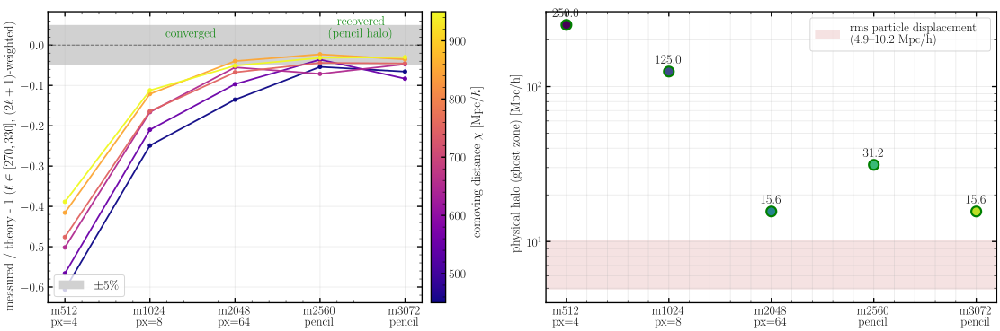

# Experiment 01 — Resolution convergence

**Goal.** We raise the particle-mesh (PM) resolution at fixed box, step count and cosmology, and measure how the per-shell angular power spectrum `C_ℓ` of the spherical maps converges, to fix the mesh a sub-percent lightcone needs. The spectra converge up to **2048³**, and the finer runs then **lose power**. The cause is a **starved ghost zone of the distributed PM**, and the experiment gives the usable resolution together with a quantitative diagnosis of the artefact and its fix. Five slab runs differ only in the mesh, and in the GPU count `pₓ` and ghost-zone halo that the mesh forces; two **pencil** re-runs, 2560³ at `--pdim 32 4` and 3072³ at `--pdim 64 4`, test the fix.

| mesh | GPUs (`pₓ`) | nodes | physical halo `box/2pₓ` | measured/theory, `ℓ∈[270,330]` |
|------|--:|--:|--:|--:|
| 512³  | 4   | 1  | 250 Mpc/h | ~0.71 (coarse-mesh limited) |
| 1024³ | 8   | 2  | 125 Mpc/h | **≈ 0.88 (converged)** |
| 2048³ | 64  | 16 | 15.6 Mpc/h | **≈ 0.92 (converged)** |
| 2560³ | 128 | 32 | 7.8 Mpc/h | ~0.87 (halo-starved) |
| 3072³ | 256 | 64 | 3.9 Mpc/h | ~0.71 (halo-starved) |

*Fixed:* `--sim-mode pm`, BullFrog (`bf`), `--nb-steps 50` (`a = 0.001 → 1`), `--paint-order cic`, `--scheme ngp`, `--nside 512`, `--nb-shells 10`, `--shell-spacing comoving`, box `2000³` Mpc/h, CosmoGrid fiducial cosmology (Ω_c 0.2589, Ω_b 0.0486, h 0.6774, σ₈ 0.8159, n_s 0.9667), `--seed 0`, **float64** (`--enable-x64`), `--halo-multiplier 0.5`. Each run uses the smallest `pₓ` (with `pₓ | mesh` and `mesh/pₓ` a multiple of 4) that keeps the local mesh ≤ 512³ on a float64 H100, and this choice ties the halo to `pₓ`.

## Method

Each run paints a lightcone of **10 comoving HEALPix shells** (`nside = 512`, centres 50–950 Mpc/h, width 100, `z ≈ 0.017–0.35`) from a centred observer. The IC white noise is drawn per mesh cell, so every run is an **independent realisation** at the same cosmology: their maps cross-correlate at `r_ℓ ≈ 0`, even at the largest scales. For each shell we form the per-plane overdensity `δ = ρ/⟨ρ⟩_shell − 1`, consistent with a per-shell number-count prediction and equal to the global normalisation to ~2% on the well-sampled outer shells, and its full-sky `C_ℓ` with healpy `anafast` (`fli-summary-stats --method healpy --normalization per_plane --mask none`). The reference is the Limber number-count `C_ℓ` (`jax_fli.compute_theory_cl_for_density`, bias 1, halofit), integrated exactly over the comoving-volume selection of each shell (radial weight `q(χ) ∝ χ²`), which replaces the deprecated redshift top-hat that under-sampled the narrow inner shells. We multiply it by the pixel window `pixwin(nside)²`, which the painted map carries.

We compare the resolutions in the band `ℓ ∈ [270, 330]`, where the full-sky cosmic variance is **sub-percent** and a real resolution effect cannot hide behind it. The band sits below the roll-offs of the coarse mesh and of the pixel window, and below the scale where the same pipeline stops tracking CosmoGrid (~2–3% out to `ℓ ≈ 300`, [Experiment 06](../06-cosmogrid-shells/README.md)). The broader `ℓ ∈ [30, 300]` is dominated by the cosmic variance of its few large-scale modes, so we leave it out of the convergence ratio.

## Results

### The per-shell spectra




**Per-shell spectra against pixel-window theory, all five resolutions.** Each panel pairs the `(2ℓ+1)`-weighted bandpowers, coloured by mesh, against the Limber theory (black) with the binned ratio below (3:1) over a grey ±1σ cosmic-variance band, for shells 0–4 and 5–9 (`z ≈ 0.017 → 0.35`). The nearest shells sit below theory: the `χ²` weighting probes higher `k`, where the PM force resolution and non-linearity act, and the thin low-`z` shells are limited by discreteness (shell 0 reaches `≈ 0.6` of theory). The mid and far shells track theory. The ordering of the meshes departs from the naive one, with `512³` limited by the coarse mesh and shot noise and the finer `2560³`/`3072³` losing large-scale power.

### Convergence and the anti-convergence of the finer runs


**Convergence, and the anti-convergence of the finer runs.** Left: the `(2ℓ+1)`-weighted measured/theory ratio over `ℓ ∈ [270, 330]`, one line per shell, outer shells bold. The outer shells rise to a plateau at **1024³ and 2048³** (`≈ 0.88` and `≈ 0.92`, within ~3% of each other) and then fall back. **2560³ and 3072³ carry ~8% and ~29% less power than 2048³** at scales all three resolve, with the same sign in all 10 shells, growing with `pₓ`, and far beyond the ~0.5% cosmic variance of the band. Particle shot noise is additive and < 0.5% of the signal on the outer shells, so subtracting it would deepen the deficit of the coarse meshes and leaves this loss unexplained. Right: the physical halo `halo_multiplier · box / pₓ = box/(2 pₓ)` shrinks with `pₓ`, to 15.6 / 7.8 / 3.9 Mpc/h at 2048³ / 2560³ / 3072³, against the rms displacement `σ₁D ≈ 4.9–5.9` Mpc/h (3D rms ≈ 8.5–10.2, red band). The 2048³ halo clears it, and 2560³ and 3072³ fall into and below it.

The plateau sits ~8–12% below the halofit-Limber prediction, flat in `ℓ`, and the offset belongs to the theory. In Experiment 06 the same pipeline reproduces the CosmoGrid TreePM run to ~2–3% out to `ℓ ≈ 300`, while CosmoGrid itself sits ~15–25% below the same theory at low and intermediate `ℓ`. The offset therefore comes from the Limber approximation for thin shells plus a few percent of halofit, and the per-plane `δ` divides the shell-volume and `4π/npix` factors out exactly (`per_plane ≈ global`). The relative deficit of the finer runs is the result of this experiment. The distributed PM keeps the particles in fixed Lagrangian slabs and paints into a slab padded by the ghost zone. Boundary particles that drift further than the ghost-zone width lose their CIC deposit and force contribution, which removes power across all scales, more for a smaller halo. `halo_multiplier = 0.5` was sized for memory and for the even-halo constraint, and at `pₓ ≥ 128` it dropped the ghost zone below the displacement scale.

### Switching slab → pencil restores convergence




**Pencil against slab, per shell.** The halo scales as `box/2pₓ` along the sharded axis, so a 2-D pencil (`--pdim 32 4` / `64 4`) in place of the 1-D slab (`--pdim 128 1` / `256 1`) enlarges it at the same mesh and GPU count: 7.8 → 31.2 Mpc/h at 2560³ and 3.9 → 15.6 Mpc/h at 3072³. For both meshes the pencil sits well above the starved slab and climbs into the ±5% band on the outer shells, with the largest gain where the deficit was worst. The small scales improve too, from a cleaner force on the boundary particles.



**Convergence restored under the pencil decomposition.** With 2560³ and 3072³ run as pencils, every resolution reaches the converged plateau (left), because the pencil halos clear the displacement band (right). A larger `--halo-multiplier` has the same effect, and the sizing rule below sets its target.

### The maps


**Shell-9 δ maps, all five slab resolutions.** A gnomonic patch, an orthographic globe and a full-sky Mollweide view on a shared `log₁₀(1+δ)` scale. 512³ is visibly smoother from its coarse force mesh, and the higher meshes show no boundary stripes, holes or grid pattern; the `pₓ = 256` domain boundaries project ~0.5° apart, too dense to see. The loss is diffuse.


**Starved slab against pencil δ maps.** Slab and pencil share the same cosmic-web texture, and on close inspection the starved slabs are less contrasted at small scales while the pencil maps are sharper. The starvation is a broadband loss of amplitude with no gross artefact, consistent with the spectra.

## Sizing the halo

The ghost zone along the sharded axis has a physical width `halo = halo_multiplier · box / pₓ` (`= box/2pₓ` at the default `hm = 0.5`), and it must exceed the rms particle displacement, the Zel'dovich displacement of the linear power spectrum at `z = 0`:

> `σ_disp = √( (1 / 2π²) ∫ P_lin(k, z=0) dk )`  — 3D rms ≈ 10 Mpc/h here; per-axis `σ₁D = σ_disp/√3 ≈ 6`.

The requirement is therefore

> `halo_multiplier · box / pₓ  ≳  σ_disp`   ⟺   `halo_multiplier ≳ σ_disp · pₓ / box`.

2048³ (halo 15.6 ≈ 1.5 σ_disp) converged, and 2560³/3072³ (7.8/3.9, at or below σ_disp) lost ~8%/~29%. We target **`halo ≳ 1.5 σ_disp`**, by raising `--halo-multiplier` or by using fewer, fatter slabs (smaller `pₓ`); the halo padding costs memory, to be traded against the per-GPU float64 ceiling.

## How to run

```bash
MODE=dryrun bash run.sh     # print the resolved commands
bash run.sh                 # submit; writes results/exp1/m<mesh>.parquet
fli-summary-stats results/exp1 --method healpy --normalization per_plane --mask none --enable-x64   # spectra_m<mesh>.parquet
JAX_PLATFORMS=cpu uv run --no-sync python build.py   # fig01–fig08 on CPU
```

The density maps, the spectra and the perf CSV, reports and launch logs are published to `ASKabalan/jax-fli-experiments` as the configs `01-resolution-density`, `01-resolution-spectra` and `01-resolution-perf`, with the two pencil re-runs next to the five slab runs. `build.py` loads them from there.
