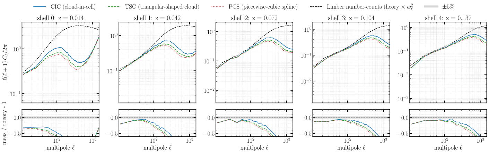
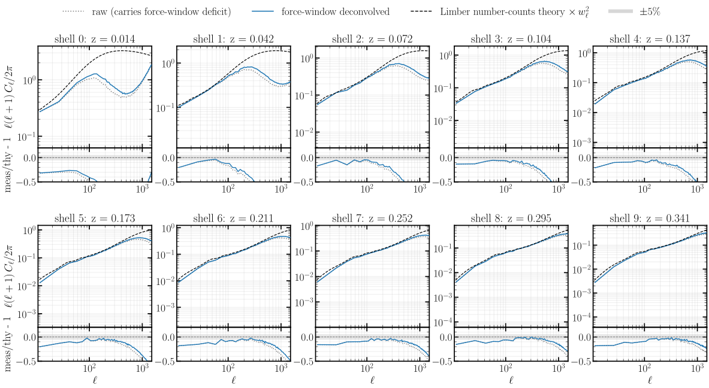
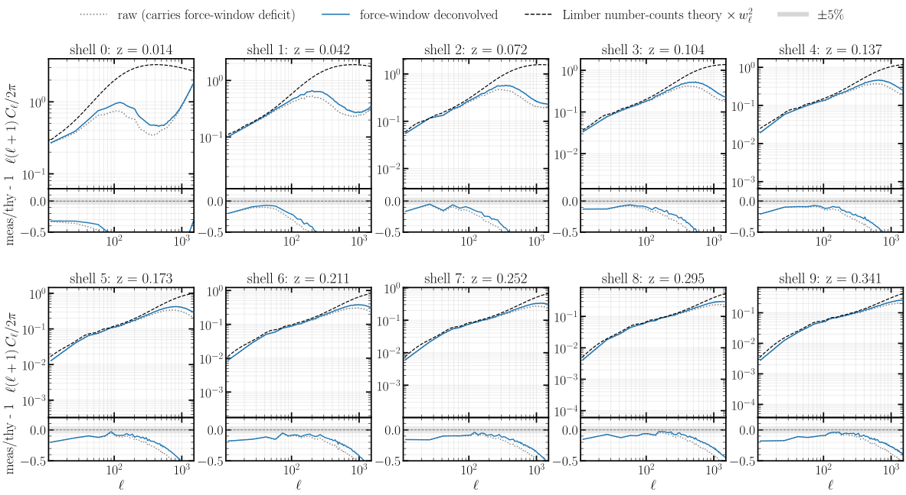
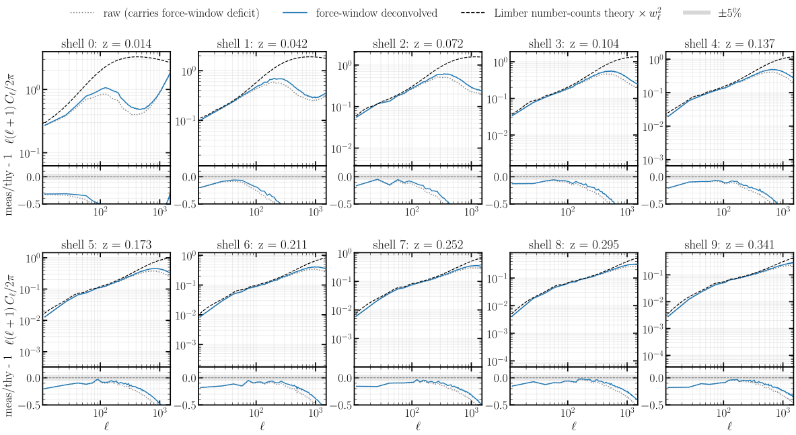
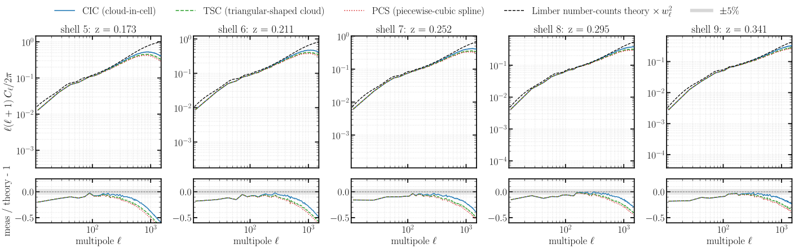

# Experiment 02 — 3D force mass assignment + window deconvolution

## Goal

The particle-mesh force is computed by **depositing the particles onto the 3D density mesh** with a mass-assignment kernel, solving for the potential in Fourier space, and reading the force back at the particle positions. The deposit order sets a Fourier-space window `W(k)` that suppresses small-scale power, and the order can be raised — **CIC** (cloud-in-cell), **TSC** (triangular-shaped cloud), **PCS** (piecewise-cubic spline) — or the window can be divided back out with a **force-window deconvolution**. This experiment measures how that 3D-force choice propagates all the way into the per-shell spherical-map angular power spectrum `C_ℓ`, and fixes the assignment used by Experiments 03–07.

The result motivates a deliberately **simple** default. By the time the field is evolved and painted onto the nside-2048 shell, the **three assignment orders give nearly the same** spherical `C_ℓ` — the force-window differences are small at that stage — and a `--deconvolution` that divides the window back out recovers only a little of the high-ℓ deficit while, with **no interlacing**, lifting the aliased near-grid noise along with it. With little to gain and a known un-interlaced-deconvolution hazard, we adopt the **simplest** option — **CIC, no deconvolution, no interlacing** — as the reference for Experiments 03–07. In principle a higher order smooths the force more and deconvolution matters more (and would need interlacing to stay clean); quantifying that cleanly is future work.

The six runs (only the 3D force deposit changes):

| run | 3D force `--paint-order` | `--deconvolution` |
|----:|--------------------------|-------------------|
| 1 | CIC | off |
| 2 | CIC | on |
| 3 | TSC | off |
| 4 | TSC | on |
| 5 | PCS | off |
| 6 | PCS | on |

Fixed across all six: `--sim-mode pm`, **2048³** mesh, **2000³ Mpc/h** box, BullFrog (`bf`), `--nb-steps 50`, growth-factor time stepping (`--time-stepping D`), a **nside 2048** spherical lightcone of **10 shells** (`--shell-spacing a`) painted with **NGP** (`--scheme ngp`), `--halo-multiplier 0.5`, CosmoGrid fiducial cosmology (Ω_c 0.2589, Ω_b 0.0486, h 0.6774, σ₈ 0.8159, n_s 0.9667), `--seed 0`, **float64**. Each run is **64 GPU** (16 nodes × 4, slab `pdim 64×1`). Crucially the spherical lightcone painting stays **NGP throughout** — only the 3D force deposit varies — so any `C_ℓ` difference is the force-assignment window, not the map painting (that is [Experiment 03](../03-spherical-painting/)).

## Method

Each run is one PM simulation that paints 10 comoving-volume HEALPix shells; for every shell we form the per-plane overdensity `δ = ρ/⟨ρ⟩_shell − 1` and its full-sky `C_ℓ` (healpy `anafast`), bandpower-binned (`nlb = 16`). The reference is the analytic **Limber number-counts** `C_ℓ` (`jax_fli.compute_theory_cl_for_density`, halofit), put on the measured pixel-window footing by multiplying the full-resolution theory by `pixwin(2048)²` **before** binning. The ratio panels are the binned measured/theory per scheme.

The physics under test is the **3D mass-assignment window**. An order-`p` deposit convolves the density with a kernel whose transform rolls off as `W(k) = ∏ sinc^p(k_i Δ/2)`: CIC is `p = 2`, TSC `p = 3`, PCS `p = 4`, so a higher order suppresses more force power toward the grid Nyquist `k_Ny = π/Δ`. The optional `--deconvolution` divides the force by `W(k)` to undo that roll-off. The catch is **aliasing**: on a grid, power above `k_Ny` folds back below it, and dividing by the small `W` near the Nyquist inflates that aliased contribution. **Interlacing** (averaging two half-cell-shifted deposits) is the standard cure that cancels the leading alias so the deconvolution is clean — it is **not** implemented here, by design, so these runs show deconvolution *without* its usual safeguard.

## Results

### Raw assignment: the order barely changes the painted spectrum




The three raw schemes **track each other closely** across the whole band — they overlap at low and intermediate ℓ and roll off below theory **together** at high ℓ, separating by at most a few percent at the very highest ℓ. So although a higher-order kernel does smooth the 3D force more in principle, by the time the field has been evolved and painted onto the nside-2048 shell that imprint is small: the high-ℓ deficit the ratio panels show is dominated by the HEALPix pixel window and the shell projection, which are common to all three. The practical message is that the force-assignment **order is not a lever** on the per-shell `C_ℓ` at this resolution.

### Deconvolution recovers little, and not cleanly





Per scheme, the **deconvolved** spectrum (blue) sits **slightly above** the **raw** one (grey) — the force-window deconvolution does lift a little power back — but **both stay below theory** at high ℓ: the force window is not what dominates the roll-off there, so dividing it out cannot close the deficit. What deconvolution *does* add is noise: with no interlacing it lifts the aliased near-grid power along with the signal, so the blue curve is the rougher of the two near the grid scale. The gain is small and the recovery is not clean — exactly the un-interlaced-deconvolution behaviour this experiment is set up to see.

### All three schemes deconvolved



Deconvolved and placed side by side on the outer shells, the three schemes **still nearly overlap** and still fall short of theory at the highest ℓ. No deconvolved variant is cleanly better than raw CIC across the band — which is the point.

**Conclusion.** The force-assignment order makes little difference to the spherical `C_ℓ`, and deconvolution buys back only a little power while adding aliasing noise (no interlacing). The simplest option is therefore as good as any: **raw CIC** is the reference 3D force assignment for Experiments 03–07. Recovering the residual small-scale power *cleanly* — with a higher order *and* deconvolution made safe by interlacing — is left to future work.

## How to run

```bash
# 1. Simulations -> results/exp2/exp2_<scheme>[_deconv].parquet (cluster; SLURM via fli-launcher)
MODE=dryrun bash run.sh     # print the resolved commands
bash run.sh                 # submit

# 2. Figures (CPU is fine; loads the precomputed per-shell spectra from HuggingFace)
JAX_PLATFORMS=cpu uv run --no-sync python build.py     # -> assets/fig01..fig06.svg
```

The density maps and their precomputed per-shell spectra are published to the `ASKabalan/jax-fli-experiments` HuggingFace dataset (`02-mass-assignement/…`); the figure script loads them straight from there.
