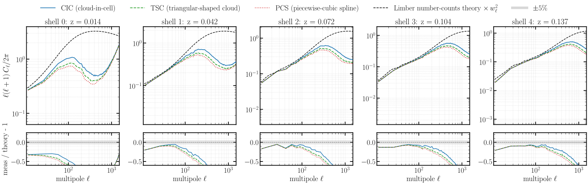
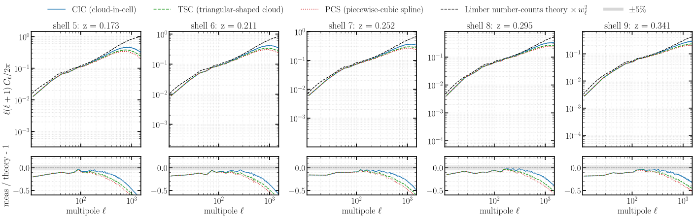
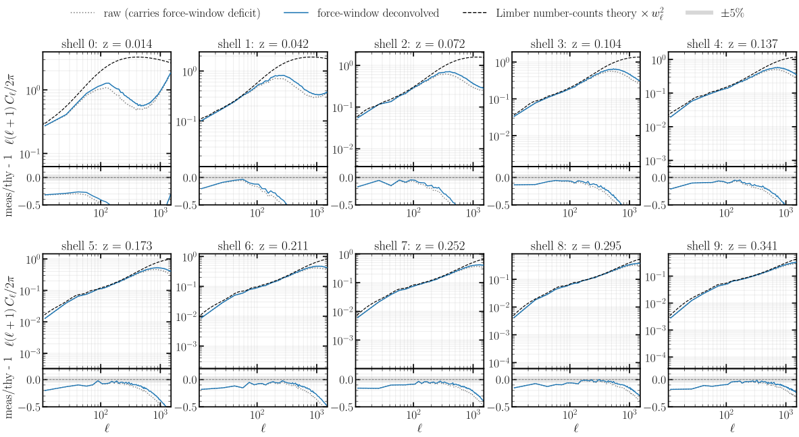
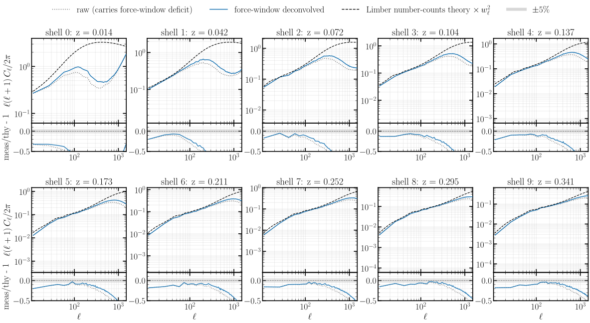
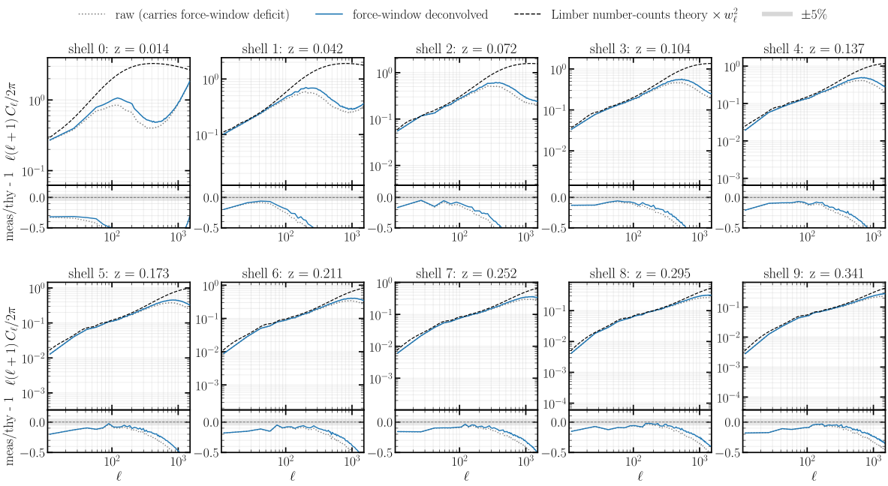

# Experiment 02 — 3D force mass assignment + window deconvolution

**Goal.** The particle-mesh force **deposits the particles onto the 3D density mesh** with a mass-assignment kernel, solves for the potential in Fourier space and reads the force back at the particle positions. The order of the deposit sets a Fourier-space window `W(k)` that suppresses small-scale power: it can be raised from **CIC** (cloud-in-cell) to **TSC** (triangular-shaped cloud) and **PCS** (piecewise-cubic spline), or divided back out with a **force-window deconvolution**. We measure how this choice propagates into the per-shell angular power spectrum `C_ℓ` of the spherical maps, and fix the assignment of Experiments 03–07. By the time the field is evolved and painted onto the nside-2048 shell, the **three orders give nearly the same** `C_ℓ`, and the deconvolution recovers little of the high-`ℓ` deficit while, **without interlacing**, lifting the aliased near-grid noise with it. We therefore adopt the simplest option, **CIC without deconvolution or interlacing**, as the reference for Experiments 03–07.

| run | 3D force `--paint-order` | `--deconvolution` |
|----:|--------------------------|-------------------|
| 1 | CIC | off |
| 2 | CIC | on |
| 3 | TSC | off |
| 4 | TSC | on |
| 5 | PCS | off |
| 6 | PCS | on |

*Fixed:* `--sim-mode pm`, **2048³** mesh, **2000³ Mpc/h** box, BullFrog (`bf`), `--nb-steps 50`, growth-factor stepping (`--time-stepping D`), a **nside 2048** spherical lightcone of **10 shells** (`--shell-spacing a`) painted with **NGP** (`--scheme ngp`), `--halo-multiplier 0.5`, CosmoGrid fiducial cosmology (Ω_c 0.2589, Ω_b 0.0486, h 0.6774, σ₈ 0.8159, n_s 0.9667), `--seed 0`, **float64**, **64 GPUs** (16 nodes × 4, slab `pdim 64×1`). The spherical painting stays NGP throughout and only the 3D force deposit varies, so every `C_ℓ` difference comes from the force-assignment window; the map painting is the subject of [Experiment 03](../03-spherical-painting/README.md).

## Method

For every shell we form the per-plane overdensity `δ = ρ/⟨ρ⟩_shell − 1` and its full-sky `C_ℓ` (healpy `anafast`), binned in bandpowers (`nlb = 16`). The reference is the Limber number-count `C_ℓ` (`jax_fli.compute_theory_cl_for_density`, halofit), multiplied by `pixwin(2048)²` **before** binning, and the ratio panels show the binned measured/theory per scheme. An order-`p` deposit convolves the density with a kernel whose transform rolls off as `W(k) = ∏ sinc^p(k_i Δ/2)`, with `p = 2` for CIC, 3 for TSC and 4 for PCS, so a higher order suppresses more force power toward the grid Nyquist `k_Ny = π/Δ`. `--deconvolution` divides the force by `W(k)` to undo this roll-off. On a grid, power above `k_Ny` folds back below it, and dividing by the small `W` near the Nyquist inflates that aliased contribution. **Interlacing**, the average of two deposits shifted by half a cell, cancels the leading alias; these runs leave it out by design and show the deconvolution without it.

## Results




**Raw CIC, TSC and PCS spectra, shells 0–4 and 5–9.** The three schemes overlap at low and intermediate `ℓ` and roll off below theory together at high `ℓ`, separating by at most a few percent at the highest `ℓ`. The high-`ℓ` deficit comes from the HEALPix pixel window and the shell projection, common to all three, so at this resolution the order of the force assignment has little effect on the per-shell `C_ℓ`.





**Force-window deconvolution against raw, per scheme.** The deconvolved spectrum (blue) sits slightly above the raw one (grey), and both stay below theory at high `ℓ`, where the force window is a minor part of the roll-off. Without interlacing the deconvolution lifts the aliased near-grid power along with the signal, so the blue curve is the rougher of the two near the grid scale.


**All three schemes deconvolved, outer shells.** Side by side, the deconvolved schemes still nearly overlap and fall short of theory at the highest `ℓ`, and none is cleanly better than raw CIC across the band.

## Conclusion

The order of the force assignment changes the spherical `C_ℓ` little, and the deconvolution recovers only a little power while adding aliasing noise. Raw CIC is therefore the reference 3D force assignment for Experiments 03–07. A higher order smooths the force more, so deconvolution would matter more there and would need interlacing to stay clean; recovering the residual small-scale power that way is future work.

## How to run

```bash
MODE=dryrun bash run.sh     # print the resolved commands
bash run.sh                 # submit; writes results/exp2/exp2_<scheme>[_deconv].parquet
JAX_PLATFORMS=cpu uv run --no-sync python build.py     # assets/fig01..fig06.svg from the spectra on HuggingFace
```

The density maps and their per-shell spectra are published to `ASKabalan/jax-fli-experiments` under `02-mass-assignement/`, and `build.py` loads them from there.
