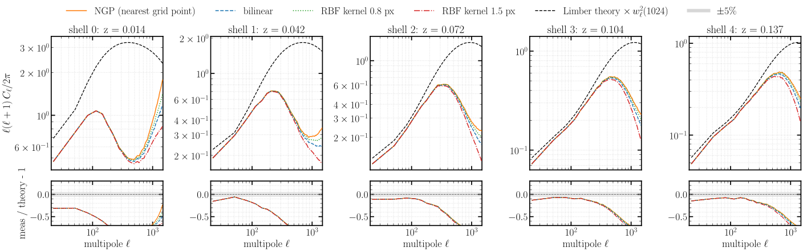
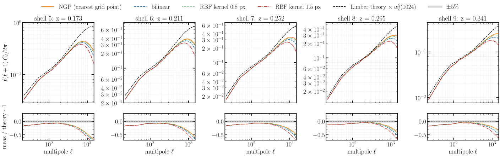
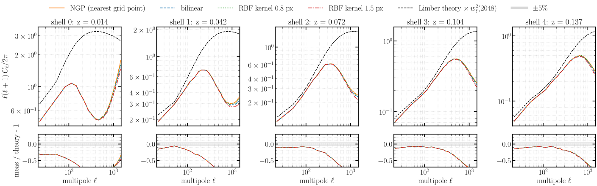
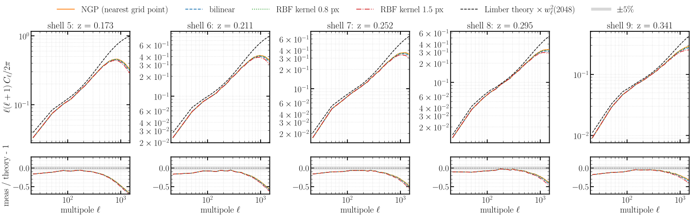
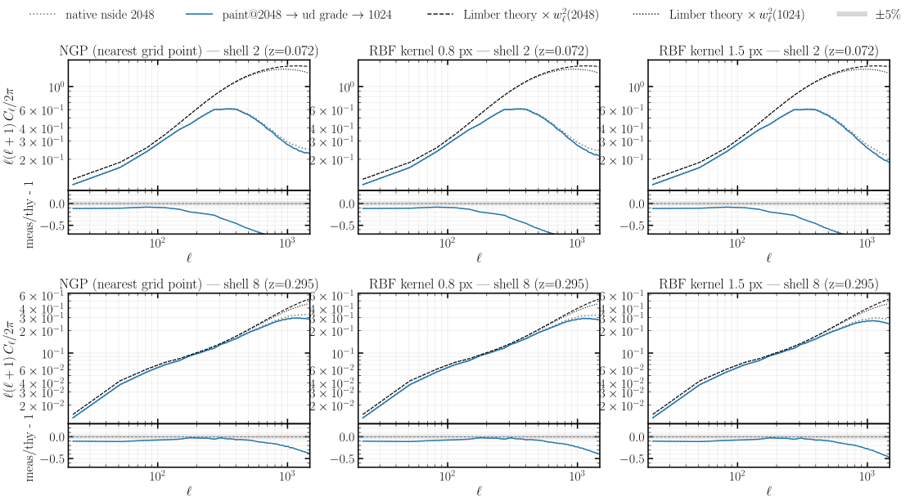
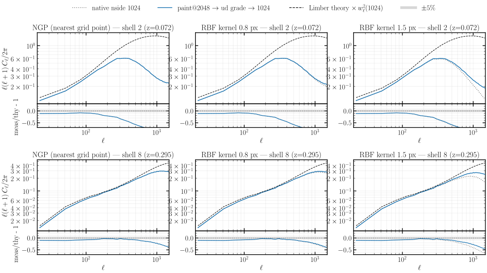

# Experiment 03 — Spherical painting scheme + pixel window

## Goal

How a particle is deposited onto the **HEALPix sphere** — the lightcone painting `--scheme` — sets the small-scale `C_ℓ` and, critically for field-level inference, whether the map is **differentiable** with respect to the particle positions. This experiment compares four schemes and settles which one the production lightcone uses.

The tension is sharpness vs differentiability:

- **NGP** (nearest grid point) is the **sharpest** — each particle drops whole into one pixel, the closest thing to direct binning, so it retains the most small-scale power. But it is a hard assignment: **not differentiable** in the particle position (no gradient for inference).
- **Bilinear** (jax-healpy `get_interp_weights`) spreads each particle over its 4 surrounding pixels and **is differentiable** — but it **smooths** (loses high-`ℓ` power), has **no closed-form deconvolution kernel** to undo that smoothing, and its effective kernel is **position-dependent** (the bilinear weights vary with where on the sphere the particle lands).
- **RBF-neighbour** (a Gaussian-RBF deposit on a fixed neighbour stencil — `paint_particles_spherical_rbf_neighbor` in JaxPM's `spherical.py`, on jax-healpy's `get_all_neighbours`) is differentiable **and** has a **controllable width**. Choosing a **sub-pixel** width at a **high nside** gives a `C_ℓ` essentially identical to NGP's — sharp, retaining the small-scale power — while staying smooth and differentiable, with a gentle, *controlled* smoothing NGP cannot offer.

So the production choice is **RBF-neighbour at sub-pixel width**: NGP's spectrum, with NGP's only flaw (non-differentiability) removed. As in [Experiment 02](../02-mass-assignment/), undoing the **pixel** window by *deconvolution* would re-inflate small-scale noise; here we instead show that painting at a **higher nside and down-grading** recovers the window without that hazard.

The eight runs — four schemes, each painted natively at two resolutions:

| `--scheme` | `--kernel-width-pixels` | native nside |
|------------|-------------------------|--------------|
| `ngp` | — | 1024, 2048 |
| `bilinear` | — | 1024, 2048 |
| `rbf_neighbor` | 0.8 | 1024, 2048 |
| `rbf_neighbor` | 1.5 | 1024, 2048 |

*Fixed across all eight:* `--sim-mode pm`, **2048³** mesh, box `2000³` Mpc/h, BullFrog (`bf`), `--nb-steps 50`, growth-factor stepping, **`--paint-order cic`** (the Exp 02 reference — CIC, no force `--deconvolution`), `--nb-shells 10`, `--shell-spacing a`, CosmoGrid fiducial cosmology, `--seed 0`, **float64**; **64 GPU** (16 nodes × 4, slab `--pdim 64 1`). The **paint@2048 → down-grade → 1024** variant (figs 5–6) is computed *locally* from the native-2048 maps, not a separate run.

## Method

Each run paints 10 comoving-volume shells; per shell we form the per-plane overdensity and its full-sky `C_ℓ` (bandpower-binned, `nlb = 16`) against the comoving-volume Limber number-counts theory put on the **matching** pixel-window footing (× `pixwin(nside)²` of *that* map).

**The RBF-neighbour kernel.** For a particle pointing in direction `(θ, φ)`:

1. **Stencil.** jax-healpy `get_all_neighbours(nside, θ, φ, get_center=True)` returns a fixed **9-pixel** stencil — the central pixel plus its 8 HEALPix neighbours — so the cost per particle is constant (predictable on a GPU), unlike an unbounded radius search.
2. **Gaussian weights.** Each stencil pixel `i` (centre direction `n̂_i`) gets a weight from the angular distance to the particle, `w_i ∝ exp(−Δθ_i² / 2σ²)`, with `Δθ_i = arccos(p̂·n̂_i)`. The width `σ` is set by `--kernel-width-pixels` in units of the HEALPix pixel scale (`nside2resol`); the nine weights are **normalised to sum to 1**, so particle mass is conserved, then deposited.

Because the weights are a **smooth** function of the particle direction, the whole map is differentiable in the particle positions — the property NGP lacks. A **sub-pixel** `σ` (e.g. 0.8 px) concentrates almost all the weight in the central pixel, recovering NGP's sharpness; a wider `σ` (1.5 px) spreads it and smooths more. The fixed 9-stencil means the kernel is *near* position-independent, unlike bilinear.

## Results

### The four schemes vs theory

Per-shell `C_ℓ` for the four painting schemes against the pixel-window-matched theory — painted natively at **nside 1024** then **nside 2048**:






**Four painting schemes vs theory, both native nsides.** The schemes separate exactly by sharpness. **NGP and RBF-0.8px overlie** and hold the most small-scale power, tracking theory furthest into high `ℓ`; **bilinear and RBF-1.5px smooth more**, peeling below theory earlier. The key reading is the NGP / RBF-0.8px coincidence: the **sub-pixel RBF reproduces NGP's spectrum** — and it does so *differentiably*. The effect is the same at both native resolutions, sharper at nside 2048 where the pixel scale is finer.

### Pixel window: paint fine, then down-grade

Undoing the HEALPix pixel window by *deconvolution* would amplify near-pixel noise (the spherical analogue of Experiment 02). Painting at a **higher nside and down-grading** is the cleaner route — these panels compare a native map to one **painted at 2048 then `ud_grade`-d to 1024**, against theory, at the near and far shells:




**Paint-fine-then-downgrade vs native, near and far shells.** Painting fine and down-grading retains the small-scale power that native-1024 painting loses to its coarser pixel window — recovering it through resolution rather than a noise-amplifying deconvolution. (The crude 4-pixel `ud_grade` average is not an `alm` resample, so it slightly *over*-shoots at the highest `ℓ` — retained-plus-aliased power — which is the expected diagnostic framing.)

### NGP vs sub-pixel RBF, both resolutions

The headline coincidence, isolated — NGP vs RBF-0.8px at native nside 1024 and 2048:


**NGP vs sub-pixel RBF at both nsides.** The NGP and RBF-0.8px spectra **track each other at both nsides**, across the whole band. That is the result: at sub-pixel width and high nside the differentiable RBF kernel is, for the spectrum, indistinguishable from NGP — so the production lightcone can be painted **differentiably with no loss of small-scale power**, with a controlled smoothing that direct NGP binning cannot provide.

## How to run

```bash
# 1. Simulations -> results/exp3/exp3_<scheme>_native{1024,2048}.parquet (cluster; SLURM via fli-launcher)
MODE=dryrun bash run.sh     # print the resolved commands
bash run.sh                 # submit

# 2. Figures (CPU; loads the near/far nside-2048 density maps for the ud_grade comparison)
JAX_PLATFORMS=cpu uv run --no-sync python build.py     # -> assets/fig01..fig07.svg
```

The per-scheme spectra and the near/far density maps are published to the `ASKabalan/jax-fli-experiments` dataset (`03-spherical-painting/…`); the figure script loads them straight from there.
