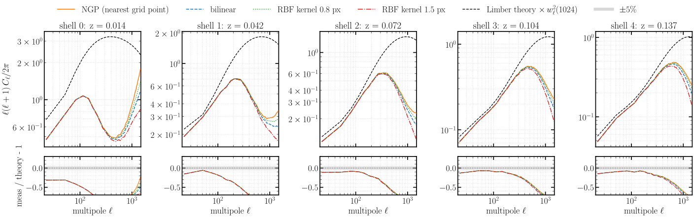
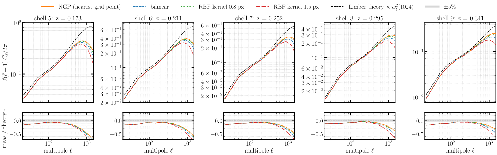
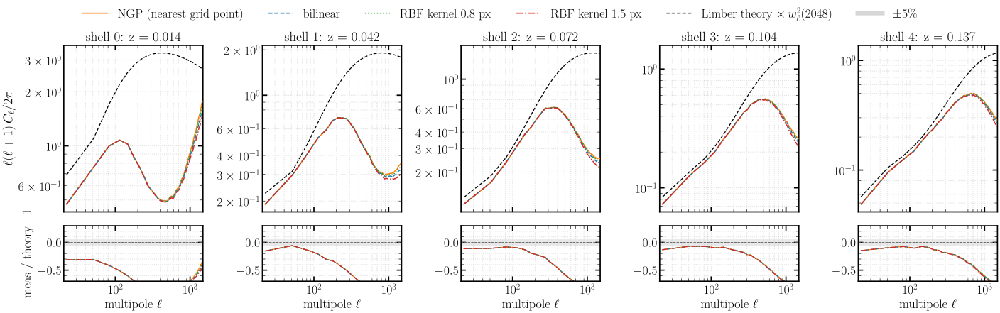
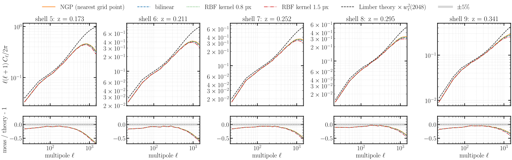
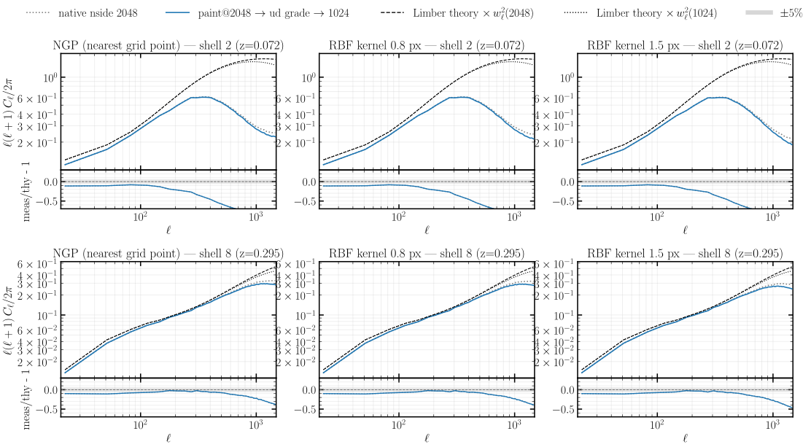
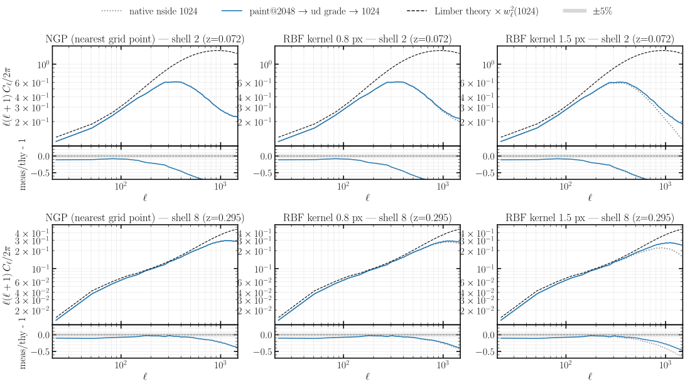

# Experiment 03 — Spherical painting scheme + pixel window

**Goal.** The lightcone painting `--scheme` deposits each particle onto the **HEALPix sphere**. It sets the small-scale `C_ℓ` and decides whether the map is **differentiable** in the particle positions, which field-level inference needs. We compare four schemes and choose the one of the production lightcone.

- **NGP** (nearest grid point) drops each particle whole into one pixel. It is the sharpest scheme and keeps the most small-scale power, and as a hard assignment it has **no gradient** in the particle position.
- **Bilinear** (jax-healpy `get_interp_weights`) spreads each particle over its 4 surrounding pixels and **is differentiable**. It smooths away high-`ℓ` power, has no closed-form deconvolution kernel, and its effective kernel depends on where the particle lands on the sphere.
- **RBF-neighbour** (a Gaussian-RBF deposit on a fixed neighbour stencil, `paint_particles_spherical_rbf_neighbor` in `spherical.py` of JaxPM, on the `get_all_neighbours` of jax-healpy) is differentiable and has a **controllable width**. At a **sub-pixel** width and a **high nside** its `C_ℓ` matches that of NGP, with a gentle, controlled smoothing.

The production choice is **RBF-neighbour at sub-pixel width**: the spectrum of NGP, made differentiable. As in [Experiment 02](../02-mass-assignment/README.md), a deconvolution of the **pixel** window would re-inflate small-scale noise, so we paint at a **higher nside and down-grade** instead.

| `--scheme` | `--kernel-width-pixels` | native nside |
|------------|-------------------------|--------------|
| `ngp` | — | 1024, 2048 |
| `bilinear` | — | 1024, 2048 |
| `rbf_neighbor` | 0.8 | 1024, 2048 |
| `rbf_neighbor` | 1.5 | 1024, 2048 |

*Fixed:* `--sim-mode pm`, **2048³** mesh, box `2000³` Mpc/h, BullFrog (`bf`), `--nb-steps 50`, growth-factor stepping, **`--paint-order cic`** without force `--deconvolution` (the Exp 02 reference), `--nb-shells 10`, `--shell-spacing a`, CosmoGrid fiducial cosmology, `--seed 0`, **float64**, **64 GPUs** (16 nodes × 4, slab `--pdim 64 1`). The variant painted at 2048 and down-graded to 1024 (figs 5–6) is computed locally from the native-2048 maps.

## Method

For every shell we form the per-plane overdensity and its full-sky `C_ℓ` (binned in bandpowers, `nlb = 16`), against the comoving-volume Limber number-count theory times the `pixwin(nside)²` of that map. The RBF-neighbour kernel works on a fixed stencil. For a particle in direction `(θ, φ)`, `get_all_neighbours(nside, θ, φ, get_center=True)` returns **9 pixels**, the central pixel and its 8 HEALPix neighbours, so the cost per particle is constant on a GPU. Each stencil pixel `i`, of centre direction `n̂_i`, gets the weight `w_i ∝ exp(−Δθ_i² / 2σ²)` with `Δθ_i = arccos(p̂·n̂_i)`, where `σ` is `--kernel-width-pixels` times the pixel scale (`nside2resol`). The nine weights are **normalised to sum to 1**, which conserves the particle mass. The weights vary smoothly with the particle direction, so the map is differentiable in the particle positions. A sub-pixel `σ` (0.8 px) puts almost all the weight in the central pixel and recovers the sharpness of NGP, while a wider `σ` (1.5 px) smooths more, and the fixed stencil makes the kernel nearly independent of position.

## Results






**Four painting schemes against theory, native nside 1024 and 2048.** The schemes separate by sharpness. **NGP and RBF-0.8px overlie** and keep the most small-scale power, tracking theory furthest into high `ℓ`, while **bilinear and RBF-1.5px** smooth more and fall below theory earlier. The sub-pixel RBF reproduces the spectrum of NGP, differentiably, at both resolutions, and more sharply at nside 2048, where the pixels are finer.




**Painting fine then down-grading, against native painting, near and far shells.** A map painted at 2048 and `ud_grade`-d to 1024 keeps the small-scale power that native 1024 painting loses to its coarser pixel window, recovered through resolution instead of a deconvolution that amplifies noise. The 4-pixel `ud_grade` average is cruder than an `alm` resample and slightly overshoots at the highest `ℓ`, where it retains power plus aliasing.


**NGP against the sub-pixel RBF, both nsides.** The two spectra track each other across the whole band at nside 1024 and 2048. At a sub-pixel width and a high nside the differentiable RBF kernel matches NGP for the spectrum, so the production lightcone is painted **differentiably with no loss of small-scale power**, with a controlled smoothing.

## How to run

```bash
MODE=dryrun bash run.sh     # print the resolved commands
bash run.sh                 # submit; writes results/exp3/exp3_<scheme>_native{1024,2048}.parquet
JAX_PLATFORMS=cpu uv run --no-sync python build.py     # assets/fig01..fig07.svg; loads the near/far nside-2048 maps for the ud_grade comparison
```

The spectra of each scheme and the near and far density maps are published to `ASKabalan/jax-fli-experiments` under `03-spherical-painting/`, and `build.py` loads them from there.
