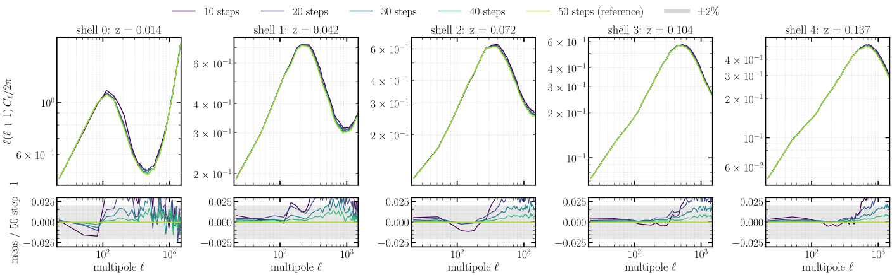
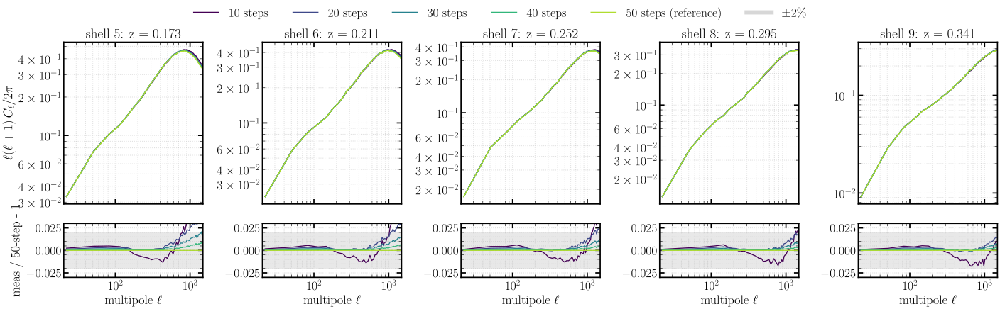
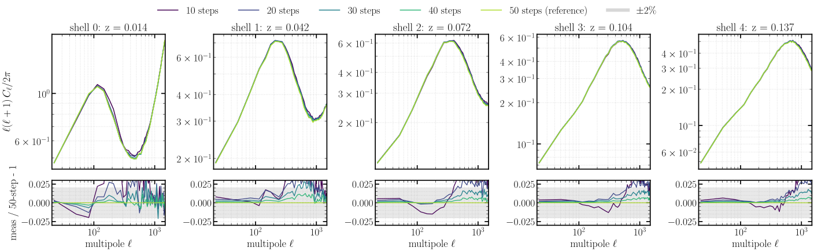
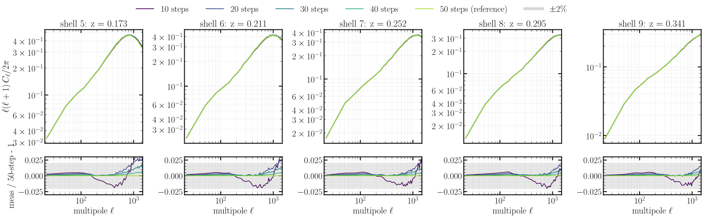
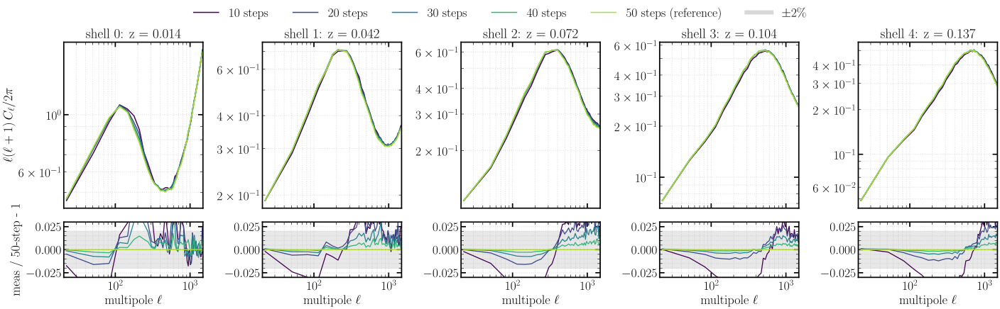
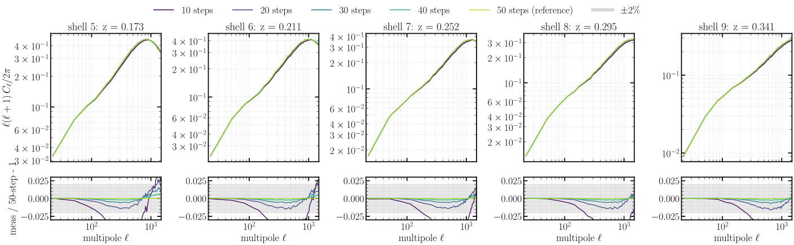
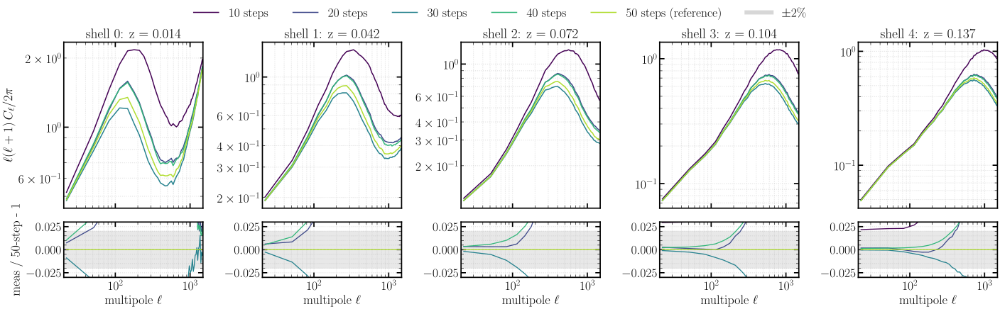
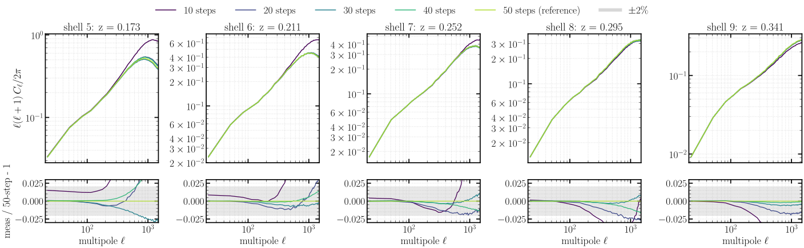
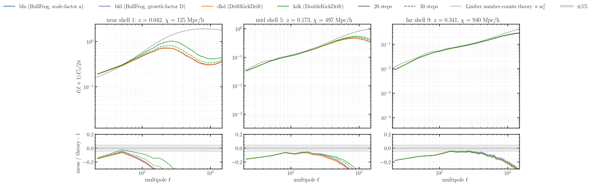

# Experiment 04 — Step convergence (solver × step count)

**Goal.** Two questions in one sweep. (1) **Step budget** — how few PM integration steps give a
converged per-shell spherical `C_ℓ`, for each variant: the smallest `--nb-steps` at which the
lightcone maps stop changing, which fixes the cheapest accurate production run. (2) **Solver
comparison** — how the four solver/stepping variants converge relative to one another: BullFrog run two
ways (`bfa`, scale-factor `a`; `bfd`, growth-factor `D`), `dkd` (DriftKickDrift)
and `kdk` (DoubleKickDrift) — including whether BullFrog's stepping choice matters. (This experiment merges the former
`04-solver-comparison` and `04b-step-convergence`, which were the same solver × step-count sweep; the
**speed** half — wall-time per step — lives in [Experiment 11](../11-scaling/README.md).)

The runs — four solver/stepping variants × five step counts (20 sims):

| run | integrator (`--solver`) | `--time-stepping` | `--nb-steps` |
|-----|-------------------------|-------------------|--------------|
| `bfa` | BullFrog (`bf`) | `a` (scale factor) | 10, 20, 30, 40, 50 |
| `bfd` | BullFrog (`bf`) | `D` (growth factor) | 10, 20, 30, 40, 50 |
| `dkd` | DriftKickDrift | `a` | 10, 20, 30, 40, 50 |
| `kdk` | DoubleKickDrift | `a` | 10, 20, 30, 40, 50 |

*Fixed across all 20:* `--sim-mode pm`, **2048³** (Exp 01: resolution-converged, halo-safe for float64),
box `2000³` Mpc/h, `--paint-order cic` with **no** force-window `--deconvolution` (Exp 02), `--scheme ngp`
(Exp 03), `--nside 2048`, `--shells-per-file 1`, `--nb-shells 10`, `--shell-spacing a`, CosmoGrid fiducial
cosmology (Ω_c 0.2589, Ω_b 0.0486, h 0.6774, σ₈ 0.8159, n_s 0.9667), `--seed 0`, **float64**; **64 GPU**
(16 nodes × 4, slab `--pdim 64 1`). BullFrog is run **two** ways — `bfa` in the scale factor `a` and `bfd`
in the growth factor `D` — while `dkd`/`kdk` step in `a`.

> **Halo (Exp 01 rule).** 2048³ on 64 GPUs gives local mesh `32³ ≤ 512³` (fits a float64 H100) and an
> **even** halo `int(32·0.5) = 16` (an odd halo crashes jaxpm `slice_unpad`). The physical ghost zone
> `0.5·2000/64 = 15.6 Mpc/h` clears the end-of-run 3D rms displacement `σ₃D(z=0) = 10.2 Mpc/h` with a
> `1.53×` margin — the resolution-converged rung of [Exp 01](../01-resolution-convergence/README.md).

**Method.** Hold everything fixed (resolution, box, painting, shells, seed, float64) and sweep
`--nb-steps ∈ {10, 20, 30, 40, 50}` for all four variants. For each (variant, steps) we paint the
spherical lightcone and measure the per-shell `C_ℓ`; convergence is the `C_ℓ` ratio against the **same
variant's** 50-step run. (The originally-planned 5 and 6-step runs are dropped — with 10 lightcone shells
the step count must exceed the shell count, so they fail to integrate; convergence is already clear from
10 steps up.)

## Results

**Per-variant step budget.** For each variant, the per-shell `C_ℓ` and its ratio to that variant's
50-step run — shells 0–4 (near) then 5–9 (far). The curves collapse onto the 50-step reference well
before 50 steps: the ratios sit inside a couple of percent across the trusted `ℓ` range, with the
largest residual at the lowest step count and the smallest scales, confirming a modest step budget
suffices at this resolution.

**BullFrog — scale-factor `a` stepping (`bfa`)**




**BullFrog — growth-factor `D` stepping (`bfd`)**




**DriftKickDrift (`dkd`)**




**DoubleKickDrift (`kdk`)**




The two BullFrog panels are nearly indistinguishable — at this resolution the **stepping variable does not
change the step convergence**: `bfa` and `bfd` reach the 50-step reference at the same rate, the 10-step
run deviating by the same ~10 % at high `ℓ` on the near shells.

**Variant comparison vs theory.** At the budget the step sweep points to (20–30 steps), the four variants
are compared head-to-head at the near / mid / far shell against the analytic Limber number-counts theory
(on the HEALPix pixel-window footing, `× pixwin²(2048)`). All four agree with one another and track the
theory to within a few percent over the mid and far shells; the near shell is the hardest (low signal,
Limber breakdown), where the residuals are largest. **BullFrog's stepping choice does not matter here:**
`bfa` (scale-factor `a`) and `bfd` (growth-factor `D`) **overlie** — so for this per-shell `C_ℓ` the time
variable is not a lever, and the modest 20–30-step budget holds for every variant.



## How to run

The cluster runs (`run.sh`) write one directory of per-shell parquet (`shell_NNNN.parquet`) per
(solver, steps) to `results/exp4/<solver>_s<steps>/`, plus a `perf_pm.csv` timing row per run; their
precomputed spectra live under `04-step-size/density_spectra/` on the
[`ASKabalan/jax-fli-experiments`](https://huggingface.co/datasets/ASKabalan/jax-fli-experiments) dataset.

```bash
MODE=dryrun bash run.sh   # print the resolved fli-launcher commands (submit nothing)
bash run.sh               # submit to SLURM

# render the figures locally from the published spectra (CPU is fine):
JAX_PLATFORMS=cpu uv run --no-sync python build.py
```
