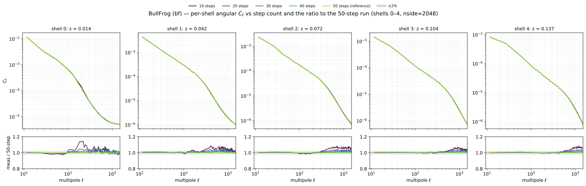
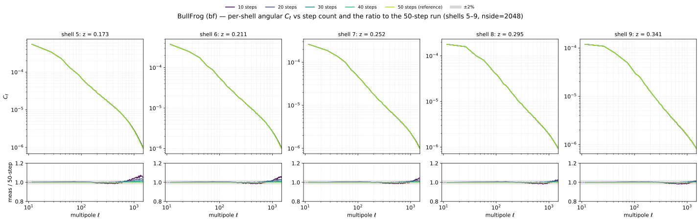
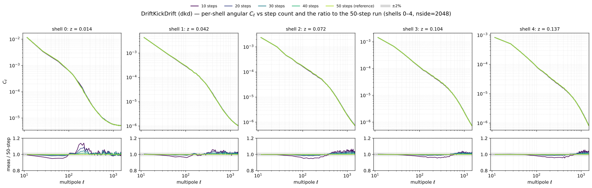
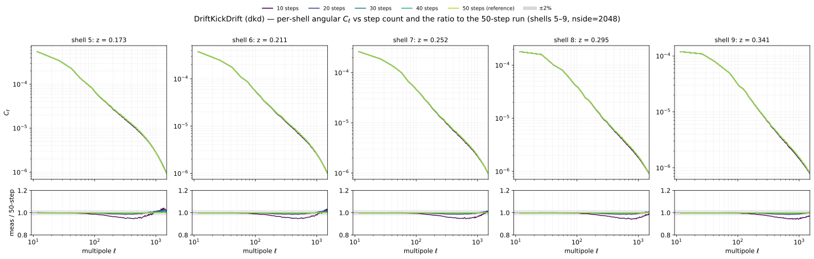
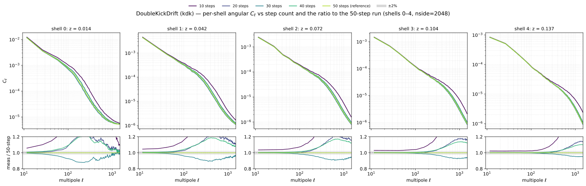
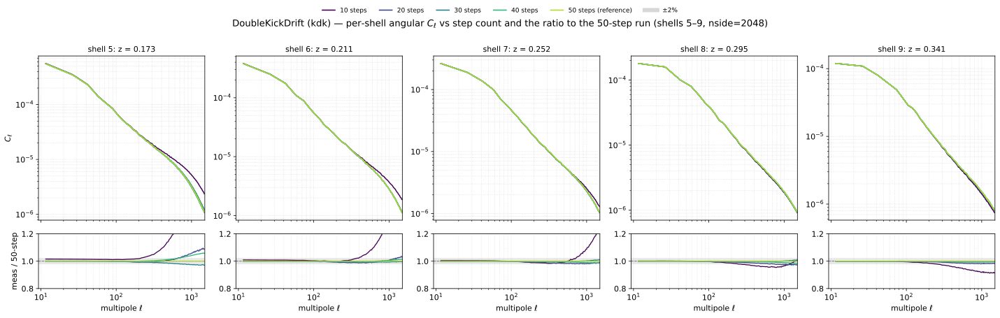
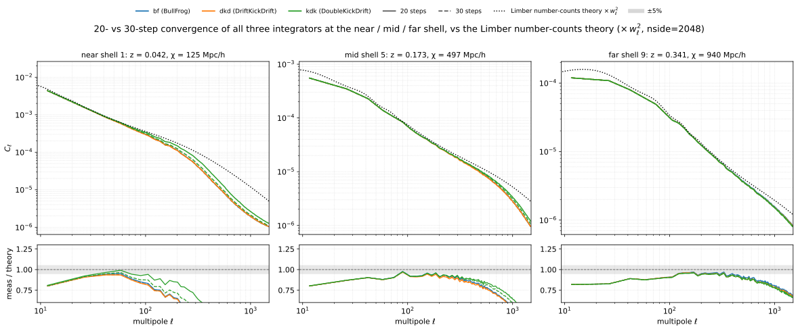

# Experiment 04 — Step convergence (solver × step count)

**Goal.** Two questions in one sweep. (1) **Step budget** — how few PM integration steps give a
converged per-shell spherical `C_ℓ`, for each integrator: the smallest `--nb-steps` at which the
lightcone maps stop changing, which fixes the cheapest accurate production run. (2) **Solver
comparison** — how the three N-body integrators `kdk` (DoubleKickDrift), `dkd` (DriftKickDrift) and
`bf` (BullFrog) converge relative to one another. (This experiment merges the former
`04-solver-comparison` and `04b-step-convergence`, which were the same solver × step-count sweep; the
**speed** half — wall-time per step — lives in [Experiment 11](../11-scaling/README.md).)

**Method.** Hold everything fixed (resolution, box, painting, shells, seed, float64) and sweep
`--nb-steps ∈ {10, 20, 30, 40, 50}` for all three integrators. For each (solver, steps) we paint the
spherical lightcone and measure the per-shell `C_ℓ`; convergence is the `C_ℓ` ratio against the **same
solver's** 50-step run. (The originally-planned 5 and 6-step runs are dropped — with 10 lightcone shells
the step count must exceed the shell count, so they fail to integrate; convergence is already clear from
10 steps up.)

## Grid

*Fixed:* `--sim-mode pm`, **2048³** (Exp 01: resolution-converged, halo-safe for float64),
`--paint-order cic` with **no** force-window `--deconvolution` (Exp 02), `--scheme ngp` (Exp 03),
`--nside 2048` (production CosmoGrid projection), `--shells-per-file 1`, `--nb-shells 10`,
`--shell-spacing comoving`, box `2000³` Mpc/h, `--seed 0`, **float64**. **64 GPU** (16 nodes × 4,
`--pdim 64 1`).

| `--solver` | `--nb-steps` |
|------|------|
| kdk (DoubleKickDrift) | 10, 20, 30, 40, 50 |
| dkd (DriftKickDrift)  | 10, 20, 30, 40, 50 |
| bf (BullFrog)         | 10, 20, 30, 40, 50 |

> **GPU count & halo (Exp 01 rule).** 2048³ on 64 GPUs (`--pdim 64 1`) gives local mesh `32³ ≤ 512³`
> (fits a float64 H100) and an **even** halo `int(32·0.5) = 16` (an odd halo crashes jaxpm
> `slice_unpad`). The physical ghost zone `0.5·2000/64 = 15.6 Mpc/h` clears the end-of-run 3D rms
> particle displacement `σ₃D(z=0) = 10.2 Mpc/h` with a `1.53×` margin — the resolution-converged rung of
> [Exp 01](../01-resolution-convergence/README.md). Box and cosmology fix the displacement, so this one
> check holds for every (solver, steps) here.

## Results

**Per-solver step budget.** For each integrator, the per-shell `C_ℓ` and its ratio to that solver's
50-step run — shells 0–4 (near) then 5–9 (far). The curves collapse onto the 50-step reference well
before 50 steps: the ratios sit inside a couple of percent across the trusted `ℓ` range, with the
largest residual at the lowest step count and the smallest scales, confirming a modest step budget
suffices at this resolution.

**BullFrog**




**DriftKickDrift**




**DoubleKickDrift**




**Solver comparison vs theory.** At the budget the step sweep points to (20–30 steps), the three solvers
are compared head-to-head at the near / mid / far shell against the analytic Limber number-counts theory
(on the HEALPix pixel-window footing, `× pixwin²(2048)`). The integrators agree with one another and
track the theory to within a few percent over the mid and far shells; the near shell is the hardest
(low signal, Limber breakdown), where the residuals are largest.



## How to run

The cluster runs (`run.sh`) write one directory of per-shell parquet (`shell_NNNN.parquet`) per
(solver, steps) to `results/exp4/<solver>_s<steps>/`, plus a `perf_pm.csv` timing row per run; their
precomputed spectra live under `04-step-size/density_spectra/` on the
[`ASKabalan/jax-fli-experiments`](https://huggingface.co/datasets/ASKabalan/jax-fli-experiments) dataset.

```bash
MODE=dryrun bash run.sh   # print the resolved fli-launcher commands (submit nothing)
bash run.sh               # submit to SLURM

# render the figures locally from the published spectra (CPU is fine):
JAX_PLATFORMS=cpu uv run --no-sync python build.py
```
