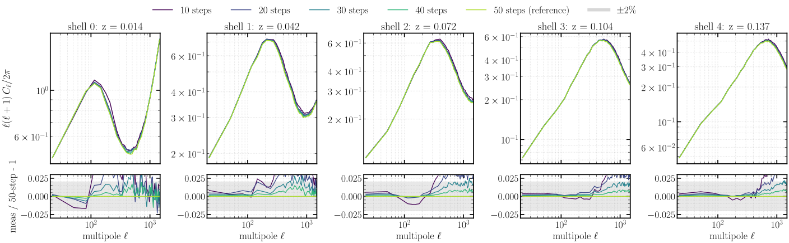
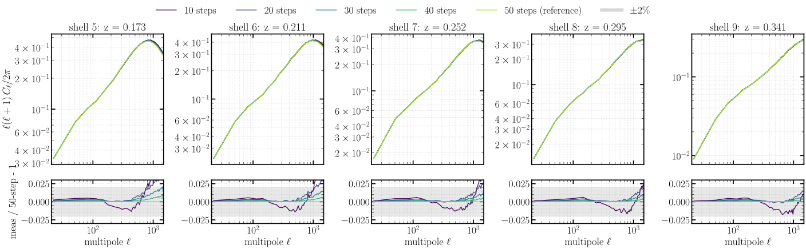
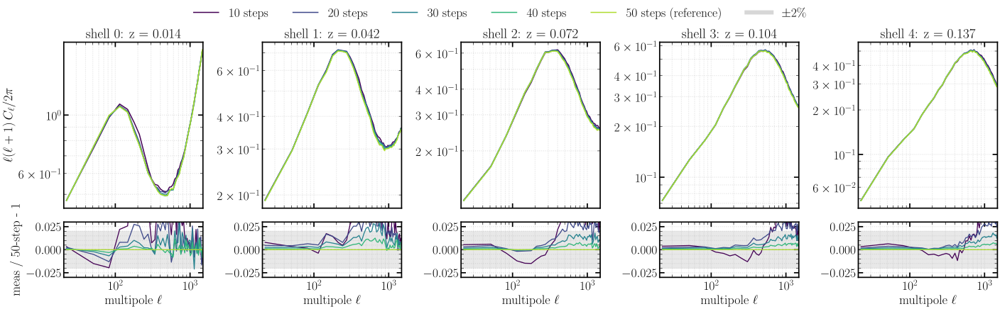
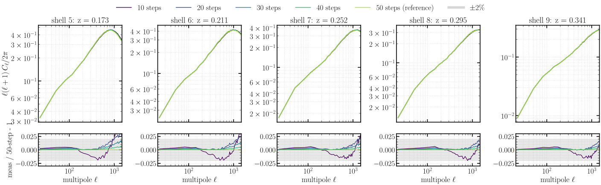
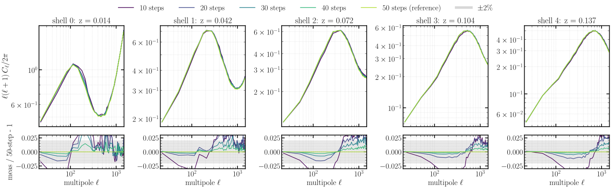
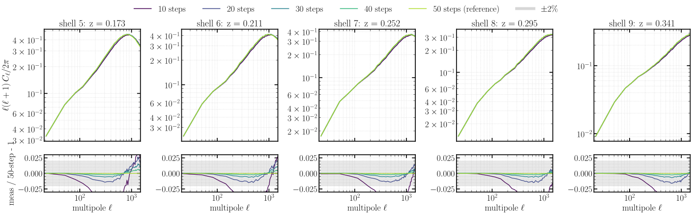
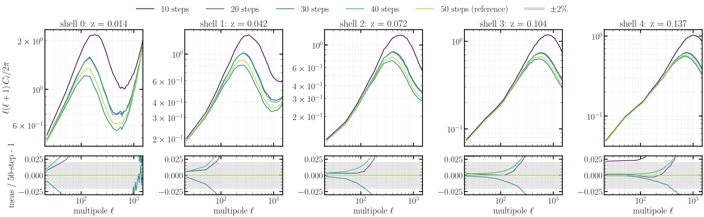
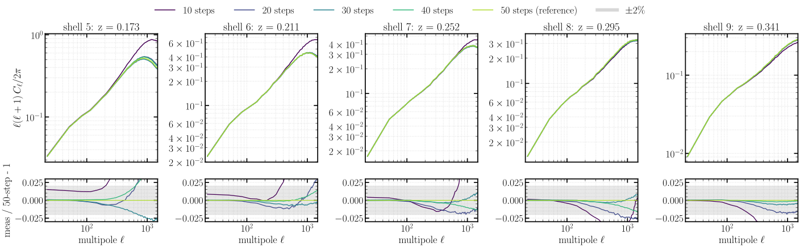

# Experiment 04 — Step convergence (solver × step count)

**Goal.** One sweep answers two questions. The **step budget** is the smallest `--nb-steps` at which the per-shell spherical `C_ℓ` stops changing, which fixes the cheapest accurate production run. The **solver comparison** measures how four solver and stepping variants converge relative to one another: BullFrog in the scale factor (`bfa`) and in the growth factor (`bfd`), `dkd` (DriftKickDrift) and `kdk` (DoubleKickDrift), including whether the stepping of BullFrog matters. The experiment merges the former `04-solver-comparison` and `04b-step-convergence`, and the wall-time per step lives in [Experiment 11](../11-scaling/README.md).

| run | integrator (`--solver`) | `--time-stepping` | `--nb-steps` |
|-----|-------------------------|-------------------|--------------|
| `bfa` | BullFrog (`bf`) | `a` (scale factor) | 10, 20, 30, 40, 50 |
| `bfd` | BullFrog (`bf`) | `D` (growth factor) | 10, 20, 30, 40, 50 |
| `dkd` | DriftKickDrift | `a` | 10, 20, 30, 40, 50 |
| `kdk` | DoubleKickDrift | `a` | 10, 20, 30, 40, 50 |

*Fixed:* `--sim-mode pm`, **2048³** (converged in resolution and safe in halo for float64, Exp 01), box `2000³` Mpc/h, `--paint-order cic` **without** force-window `--deconvolution` (Exp 02), `--scheme ngp` (Exp 03), `--nside 2048`, `--shells-per-file 1`, `--nb-shells 10`, `--shell-spacing a`, CosmoGrid fiducial cosmology (Ω_c 0.2589, Ω_b 0.0486, h 0.6774, σ₈ 0.8159, n_s 0.9667), `--seed 0`, **float64**, **64 GPUs** (16 nodes × 4, slab `--pdim 64 1`). The slab gives a local mesh of `32³ ≤ 512³`, which fits a float64 H100, and an **even** halo of `int(32·0.5) = 16` cells (an odd halo crashes the `slice_unpad` of jaxpm). The ghost zone of `0.5·2000/64 = 15.6 Mpc/h` clears the end-of-run 3D rms displacement `σ₃D(z=0) = 10.2 Mpc/h` with a `1.53×` margin, as in the converged run of [Exp 01](../01-resolution-convergence/README.md).

## Method

We hold the resolution, box, painting, shells, seed and precision fixed and sweep `--nb-steps ∈ {10, 20, 30, 40, 50}` for all four variants. For each variant and step count we paint the spherical lightcone and measure the per-shell `C_ℓ`, and the convergence is the ratio of `C_ℓ` to the 50-step run of the **same variant**. The step count must exceed the 10 lightcone shells, so the planned 5 and 6-step runs fail to integrate and were dropped; the convergence is already clear from 10 steps.

## Results




**BullFrog, scale-factor stepping (`bfa`), shells 0–4 and 5–9.**




**BullFrog, growth-factor stepping (`bfd`), shells 0–4 and 5–9.**




**DriftKickDrift (`dkd`), shells 0–4 and 5–9.**




**DoubleKickDrift (`kdk`), shells 0–4 and 5–9.** For each variant, the per-shell `C_ℓ` and its ratio to the 50-step run of that variant. The curves collapse onto the 50-step reference well before 50 steps: the ratios lie within a couple of percent across the trusted `ℓ` range, with the largest residual at the lowest step count and the smallest scales, so a modest step budget suffices at this resolution. The two BullFrog variants are nearly indistinguishable: `bfa` and `bfd` reach the 50-step reference at the same rate, and their 10-step runs deviate by the same ~10% at high `ℓ` on the near shells.


**The four variants against theory at 20 and 30 steps, near, mid and far shells.** The Limber number-count theory is multiplied by `pixwin²(2048)`. The four variants agree with one another and track the theory within a few percent over the mid and far shells, and the near shell, with its low signal and the breakdown of Limber, carries the largest residuals. `bfa` and `bfd` overlie, so the time variable of BullFrog leaves this per-shell `C_ℓ` unchanged, and a budget of 20–30 steps holds for every variant.

## How to run

```bash
MODE=dryrun bash run.sh   # print the resolved fli-launcher commands (submit nothing)
bash run.sh               # submit to SLURM
JAX_PLATFORMS=cpu uv run --no-sync python build.py   # the figures from the published spectra, on CPU
```

The cluster runs write one directory of `shell_NNNN.parquet` per solver and step count to `results/exp4/<solver>_s<steps>/`, plus one `perf_pm.csv` timing row per run. Their spectra are published under `04-step-size/density_spectra/` on the [`ASKabalan/jax-fli-experiments`](https://huggingface.co/datasets/ASKabalan/jax-fli-experiments) dataset.
