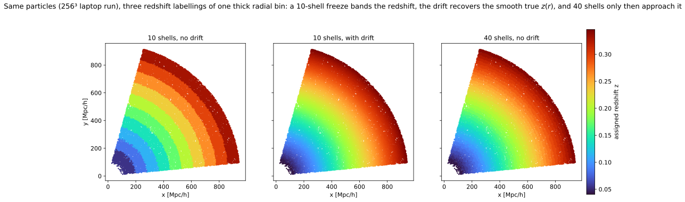
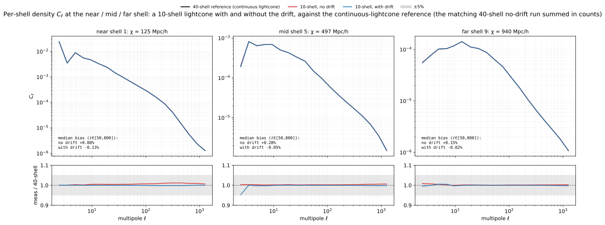
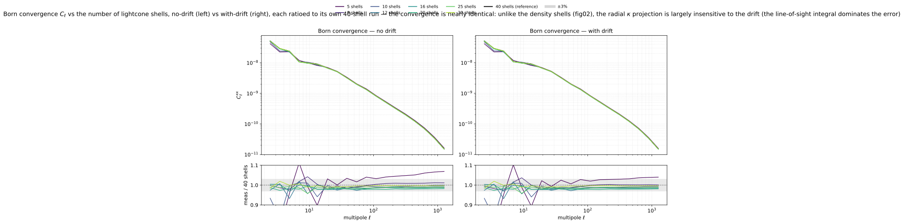

# Experiment 05 — Drift on the lightcone

**Goal.** Show that drifting particles to their lightcone-crossing epoch (`--drift-on-lightcone`)
sharpens the per-shell density `C_ℓ` of a **thick** lightcone — a *drifted* coarse shell stack matches a
*much finer* undrifted one — while the **Born convergence is essentially unaffected**, because the radial
line-of-sight projection, not the per-shell redshift assignment, dominates the lensing error.

**Method.** The simplest lightcone painting freezes every particle in a shell at the shell-centre scale
factor `a_c`; across a *thick* shell the near edge is over-evolved and the far edge under-evolved. The
drift instead moves each particle to the scale factor at which it actually crosses the lightcone,
`a(χ = ‖x − x_obs‖)` — a small (sub-Mpc) symplectic move. We run one fixed set of initial conditions (so
every comparison is cosmic-variance-free), sweeping `--nb-shells ∈ {5, 8, 10, 12, 16, 20, 25, 30, 40}`
with and without the drift, and Born-integrate each into a single source-bin convergence map. The
continuous-lightcone **reference** for a thick shell is the *same* radial slab covered by many thin
(≈25 Mpc/h) sub-shells, each frozen at its own centre and summed in **counts** (the per-pixel volume then
cancels on the overdensity conversion) — i.e. the 40-shell run.

## Results

**What the drift does to redshift assignment.** A small local (256³, laptop) run makes the mechanism
visible: the *same* particles in one thick radial bin, coloured by the redshift each is assigned. A
10-shell freeze paints discrete redshift **bands**; the drift recovers the smooth true `z(r)`; 40 shells
only then approach that same smooth gradient. The drift buys with 10 shells what would otherwise take far
more.



**Density `C_ℓ`: the drift removes the frozen-epoch bias.** At the near / mid / far shell, the 10-shell
runs are compared to the 40-shell continuous-lightcone reference. Without the drift the thick shell
carries a small positive frozen-epoch bias (largest at the near shell, where the shell spans the most
redshift evolution — `+0.9%`); the drift removes it to the `≈0.1%` level. The effect is modest at 10
shells (`~100 Mpc/h` thick) and grows with shell thickness — which is exactly why it lets you halve the
shell count at fixed accuracy.



**Born convergence is largely insensitive to the drift.** Ratioing each shell-count run to its own
40-shell run, the drifted and undrifted lensing spectra converge to the few-percent level at much the same
rate — the radial `κ` projection averages over the per-shell redshift assignment, so the density-shell
improvement barely carries into the convergence. The drift helps only at the coarsest counts (at 5 shells
the bias improves from `+5.4%` to `+3.3%`) and is gone once converged (the drifted and undrifted `κ` agree
to `0.01%` at 40 shells). The drift is a density-field tool, not a lensing one.



A deeper, three-source-bin tomographic counterpart on a 5 Gpc/h box lives in
[Experiment 05b](../05b-drift-on-lightcone-3bin/README.md).

## Grid

*Fixed:* `--sim-mode pm`, **2048³** (Exp 01), BullFrog (`bf`), `--nb-steps 50`, `--paint-order cic` with
**no** force-window `--deconvolution` (Exp 02), `--scheme ngp` (Exp 03), `--nside 2048`,
`--shells-per-file 1`, `--shell-spacing comoving`, box `2000³` Mpc/h, `--seed 0`, **float64**.
**64 GPU** (16 nodes × 4, `--pdim 64 1`). Source for Born lensing: a single bin at `z = 0.35`.

| sweep | values |
|------|------|
| `--nb-shells` | 5, 8, 10, 12, 16, 20, 25, 30, 40 |
| drift | (none), `--drift-on-lightcone` |

> **Halo (Exp 01 rule).** 2048³ on 64 GPUs gives local `32³ ≤ 512³` and an even halo `int(32·0.5) = 16`;
> the physical ghost zone `0.5·2000/64 = 15.6 Mpc/h` clears the 3D rms displacement
> `σ₃D(z=0) = 10.2 Mpc/h`. The drift only repaints existing particles, so the displacement scale (and this
> check) is unchanged.

## How to run

The cluster runs (`run.sh`) write per-shell parquet to `results/exp5/` and a `fli-born-rt` lensing map per
run; their precomputed density and `κ` spectra live under `05-drift-n-shells/` on the
[`ASKabalan/jax-fli-experiments`](https://huggingface.co/datasets/ASKabalan/jax-fli-experiments) dataset.

```bash
MODE=dryrun bash run.sh   # print the resolved commands (submit nothing)
bash run.sh               # submit to SLURM

# render the figures locally (CPU; fig01 runs a small 256³ sim, fig02 loads a few nside-2048 maps):
JAX_PLATFORMS=cpu uv run --no-sync python build.py
```
