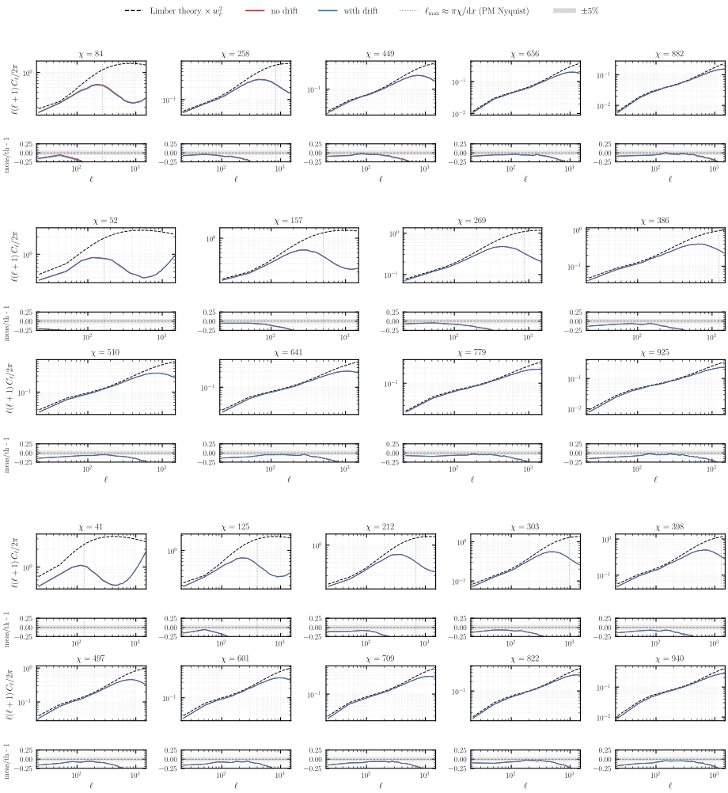
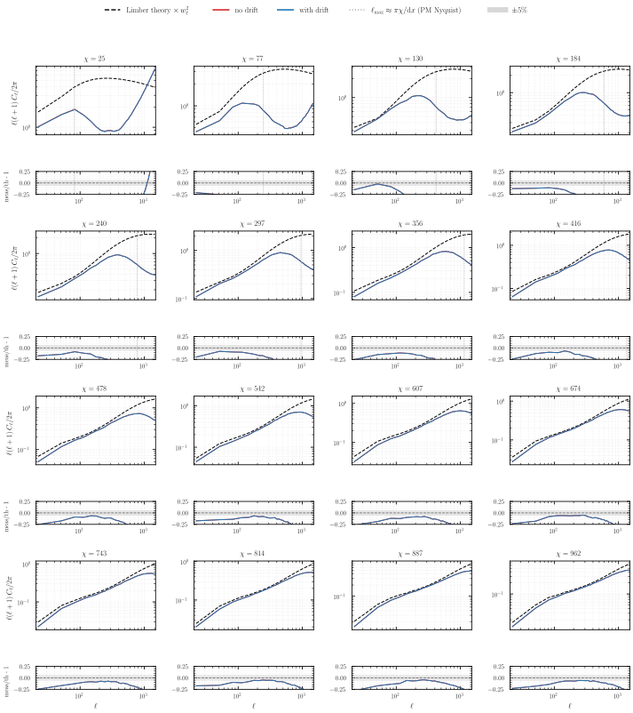
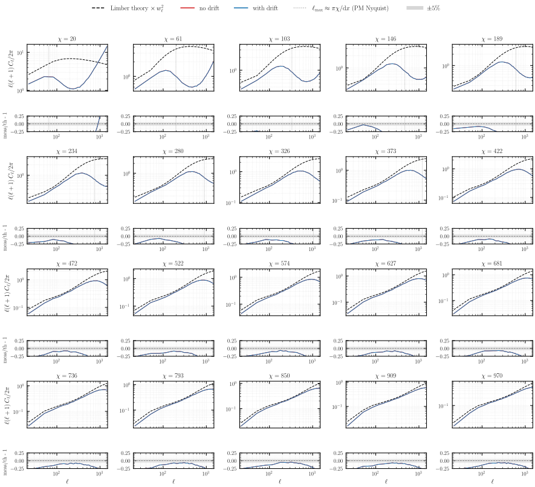
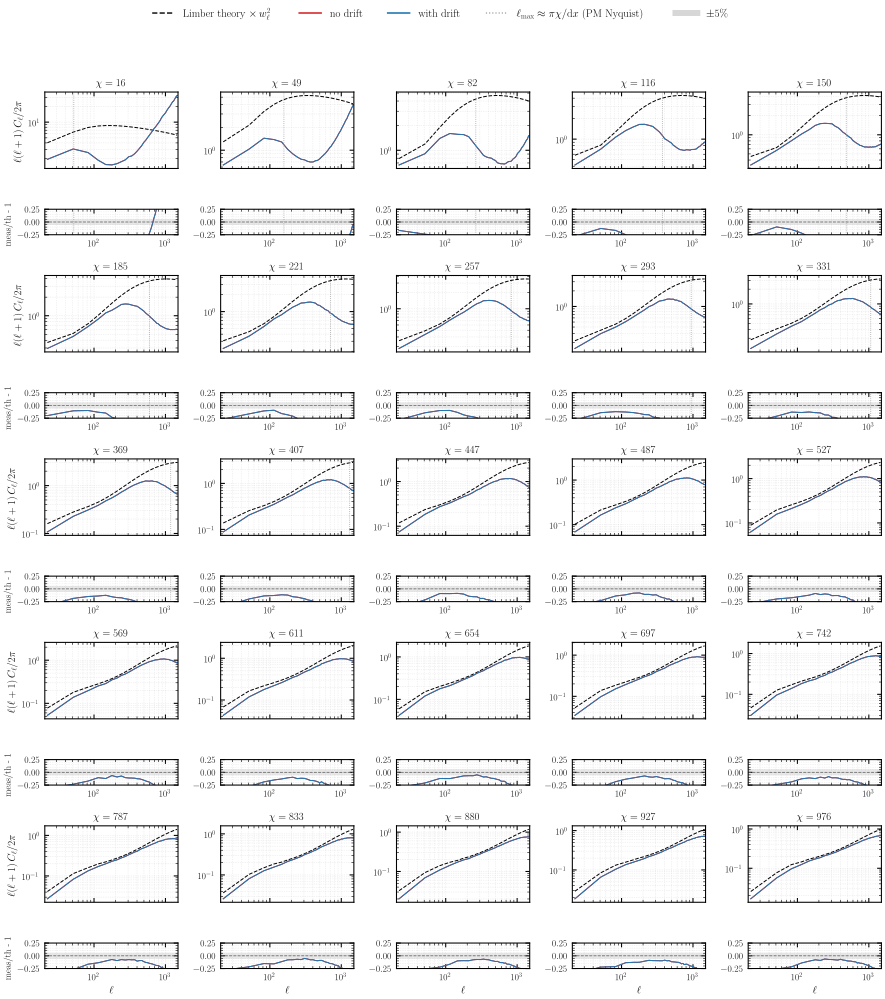
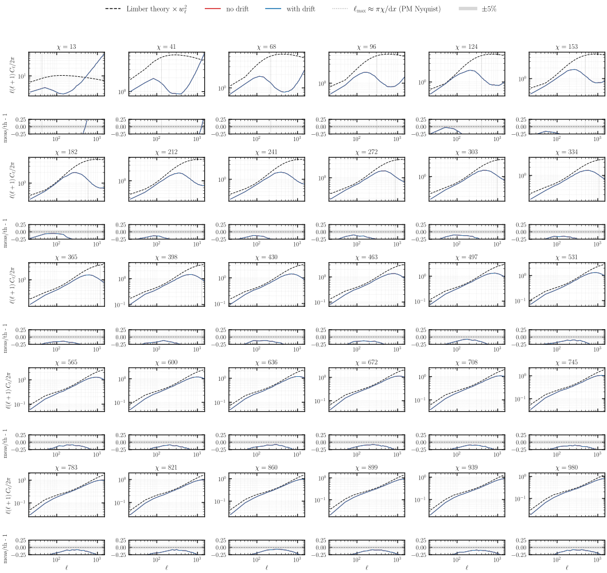
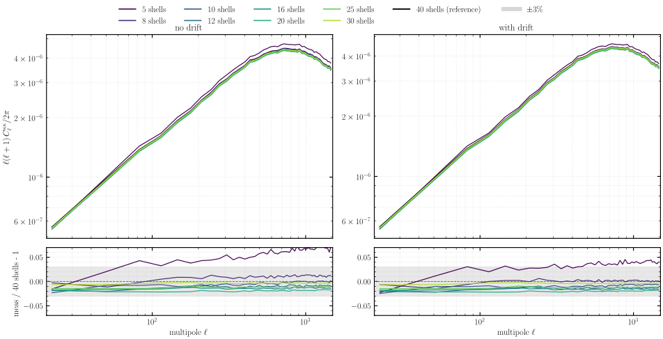
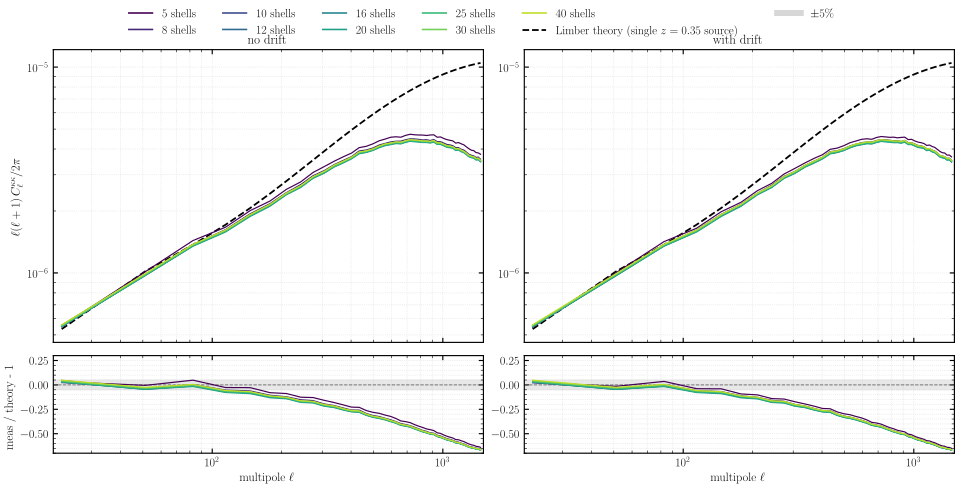

# Experiment 05a — Drift on the lightcone

**Goal.** We show that drifting particles to their lightcone-crossing epoch (`--drift-on-lightcone`) sharpens the per-shell density `C_ℓ` of a **thick** lightcone, so that a coarse drifted shell stack matches a much finer undrifted one, while the **Born convergence is essentially unaffected**, because the radial line-of-sight projection dominates the lensing error over the redshift assigned to each shell. Nine shell counts, with and without the drift, give 18 PM runs, each Born-integrated into a single-bin convergence map.

| sweep | values |
|-------|--------|
| `--nb-shells` | 5, 8, 10, 12, 16, 20, 25, 30, 40 |
| drift | (none), `--drift-on-lightcone` |

*Fixed:* `--sim-mode pm`, **2048³** (Exp 01), box `2000³` Mpc/h, BullFrog (`bf`), `--nb-steps 50`, growth-factor stepping (`--time-stepping D`), `--paint-order cic` **without** `--deconvolution` (Exp 02), `--scheme ngp` (Exp 03), `--nside 2048`, `--shells-per-file 1`, **`--shell-spacing a`**, **`--min-width 5.0`** (deliberately *thick* shells), CosmoGrid fiducial cosmology, `--seed 0`, **float64**, **64 GPUs** (16 nodes × 4, slab `--pdim 64 1`). The Born lensing uses a single source bin at `z = 0.35`. The slab gives a local mesh of `32³ ≤ 512³` and an even halo of `int(32·0.5) = 16` cells, and the 15.6 Mpc/h ghost zone (`0.5·2000/64`) clears the 3D rms displacement `σ₃D(z=0) = 10.2 Mpc/h`, which the drift leaves unchanged.

## Method

The simplest lightcone painting freezes every particle of a shell at the scale factor `a_c` of the shell centre, so across a thick shell the near edge is over-evolved and the far edge under-evolved. The drift moves each particle to the scale factor at which it crosses the lightcone, `a(χ = ‖x − x_obs‖)`, a small (sub-Mpc) symplectic move. All runs share one set of initial conditions, so every comparison is free of cosmic variance. The continuous-lightcone reference for a thick shell is the same radial slab covered by many thin (≈25 Mpc/h) sub-shells of the 40-shell run, each frozen at its own centre and summed in counts, so that the per-pixel volume cancels in the conversion to overdensity.

## Results


**Redshift assignment.** A small 256³ run shows the same particles in one thick radial bin, coloured by the redshift assigned to each. A 10-shell freeze paints discrete redshift bands, the drift recovers the continuous `z(r)`, and 40 shells only approach that gradient. The drift reaches with 10 shells what otherwise takes far more.


**Density `C_ℓ` of the near, mid and far shells.** The 10-shell runs against the 40-shell reference. Without the drift the thick shell carries a small positive frozen-epoch bias, largest at the near shell, which spans the most redshift evolution (`+0.9%`), and the drift reduces it to `≈0.1%`. The effect is modest at 10 shells (`~100 Mpc/h` thick) and grows with the shell thickness, which lets the drift halve the shell count at fixed accuracy.

Each panel of the census compares one shell with the Limber number-count prediction (`compute_theory_cl_for_density`, comoving-volume weighted, times the pixel window `w_ℓ²`): `C_ℓ` without (red) and with (blue) the drift and the theory (dashed), over the ratio to theory. The two runs share the seed and the particles, so their shot noise cancels and the red–blue gap isolates the drift. The shared rise above theory at high `ℓ` is shot noise, meaningful only below the marked PM-Nyquist `ℓ_max ≈ πχ/dx`. With scale-factor spacing the shells stay thin, so the frozen-epoch bias is sub-percent everywhere: the two runs lie on top of each other on every shell and track theory down to the resolution cutoff. The census of the equal-volume variant [05c](../05c-spacing-n-stepping-equal-vol/README.md), which fattens the inner shell, opens a large red–blue gap.



**Per-shell density census — 5 / 8 / 10 shells.**



**Per-shell density census — 16 shells.**



**Per-shell density census — 20 shells.**



**Per-shell density census — 25 shells.**



**Per-shell density census — 30 shells.**


**Per-shell density census — 40 shells.**



**Born convergence against the 40-shell run.** Each shell count divided by its own 40-shell run. The drifted and undrifted spectra converge to the few-percent level at about the same rate, because the radial projection of `κ` averages over the redshift assigned to each shell. The drift helps only at the coarsest counts, where at 5 shells the bias falls from `+5.4%` to `+3.3%`, and the two agree to `0.01%` at 40 shells. The drift improves the density field and leaves the lensing essentially unchanged.



**Born convergence against Limber theory.** The same spectra divided by the Limber weak-lensing prediction for the `z = 0.35` source plane, times `w_ℓ²`. Every shell count, 40 included, tracks the theory within a few percent from `ℓ ≈ 10` to `≈ 100`, then falls below it toward `ℓ ≈ 10³` as the finite PM resolution and the Born projection suppress the small-scale power. The spread between shell counts in fig09 sits on top of this common resolution deficit, which is what the convergence converges to.

The deeper, three-source-bin counterpart in a 5 Gpc/h box is [Experiment 05b](../05b-spacing-n-stepping-3bin/README.md), and the equal-volume variant is [05c](../05c-spacing-n-stepping-equal-vol/README.md).

## How to run

```bash
MODE=dryrun bash run.sh   # print the resolved commands (submit nothing)
bash run.sh               # submit to SLURM
JAX_PLATFORMS=cpu uv run --no-sync python build.py   # fig01 runs a small 256³ sim, fig02 loads a few nside-2048 maps
```

The cluster runs write per-shell parquet to `results/exp5/` and one `fli-born-rt` lensing map per run. Their density and `κ` spectra are published under `05-spacing-n-stepping/` on the [`ASKabalan/jax-fli-experiments`](https://huggingface.co/datasets/ASKabalan/jax-fli-experiments) dataset.
