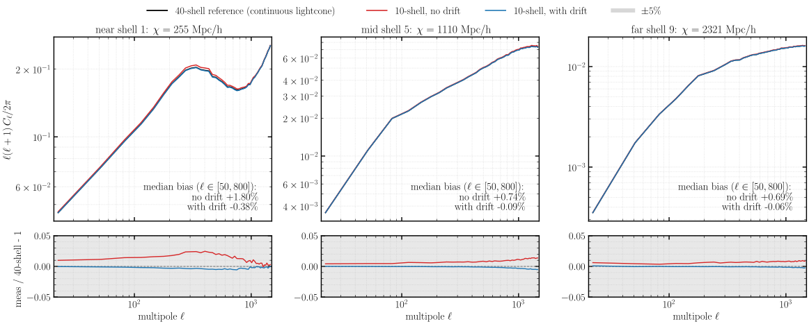
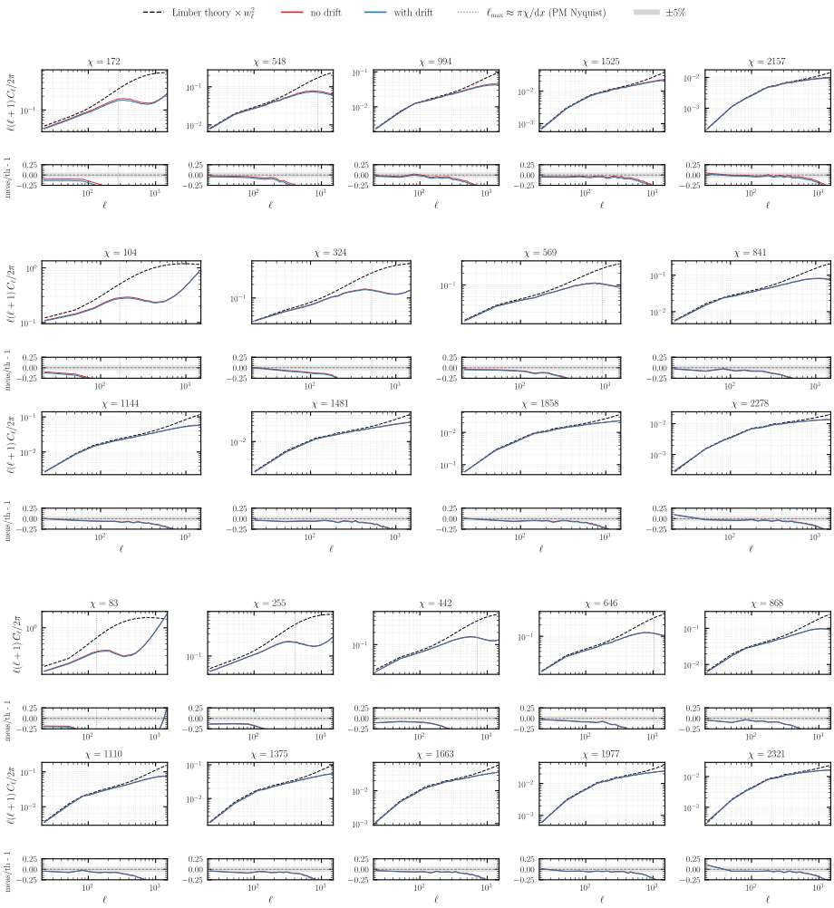
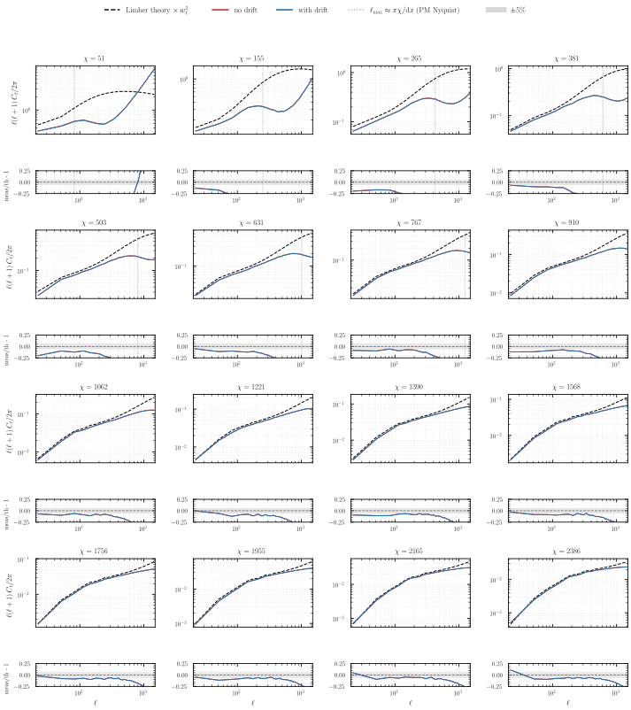
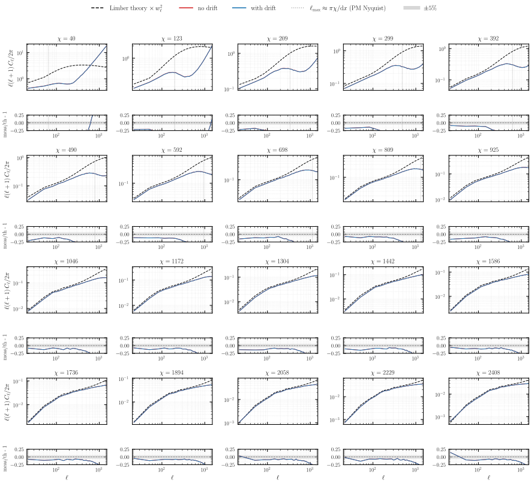
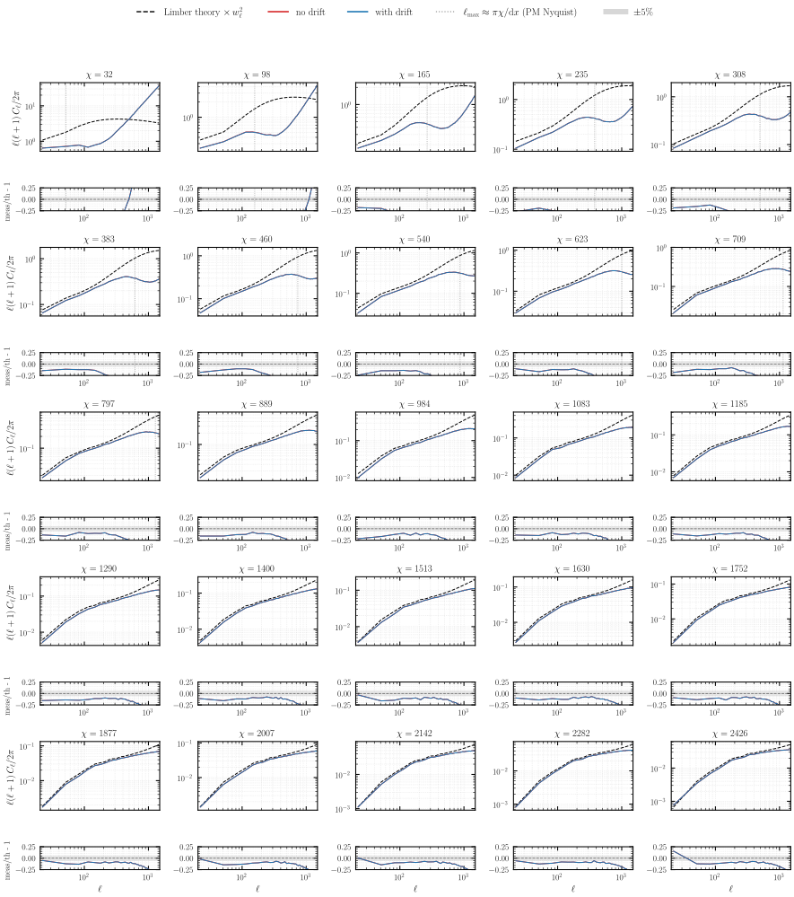
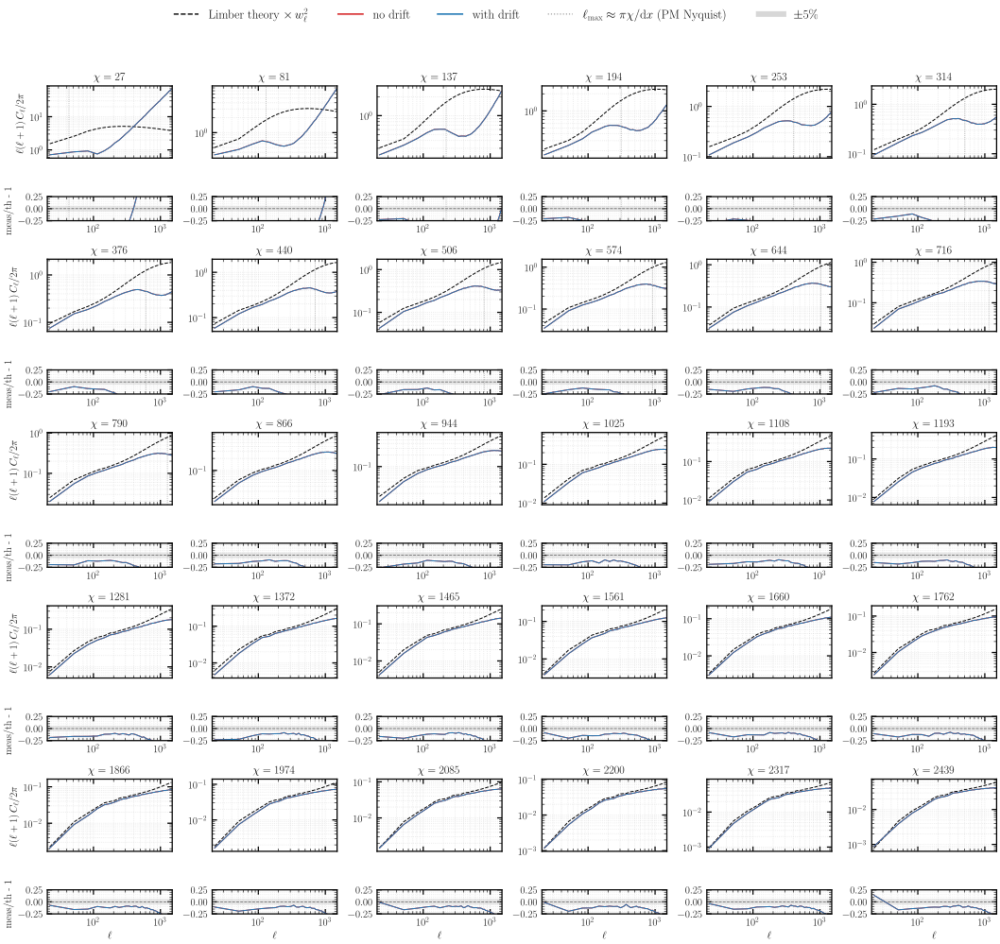
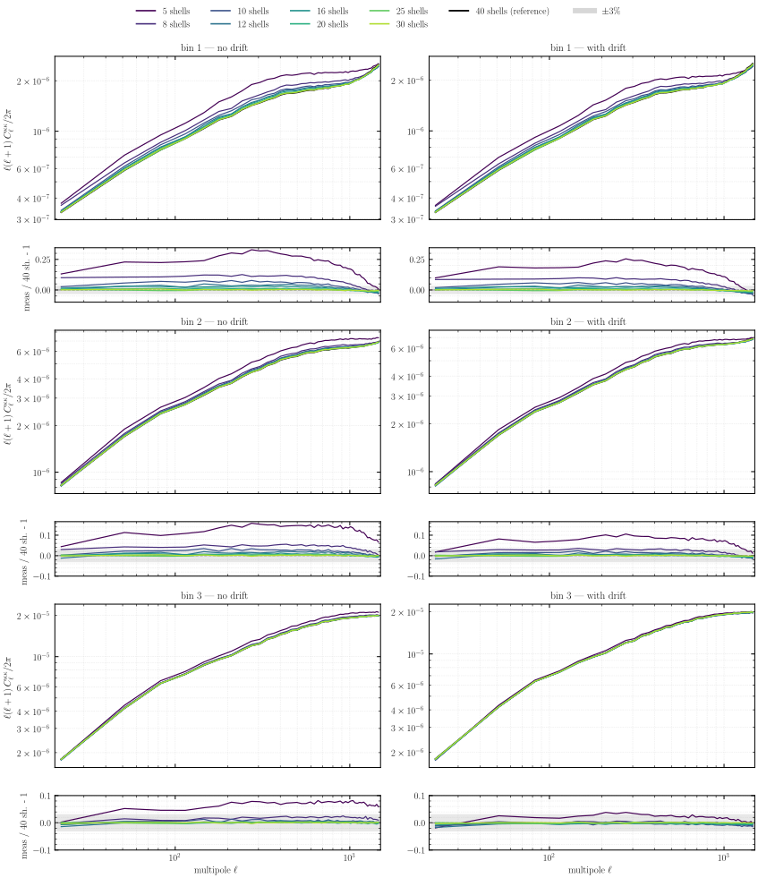
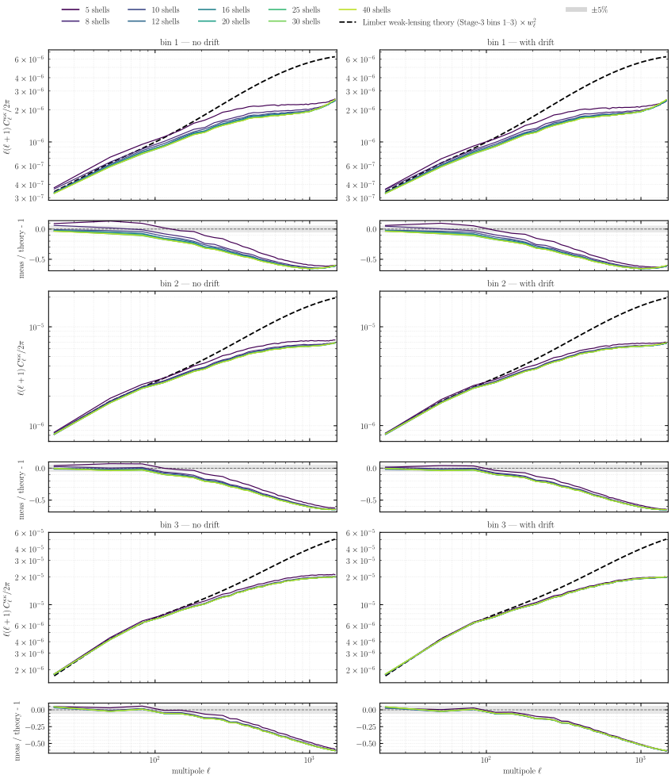
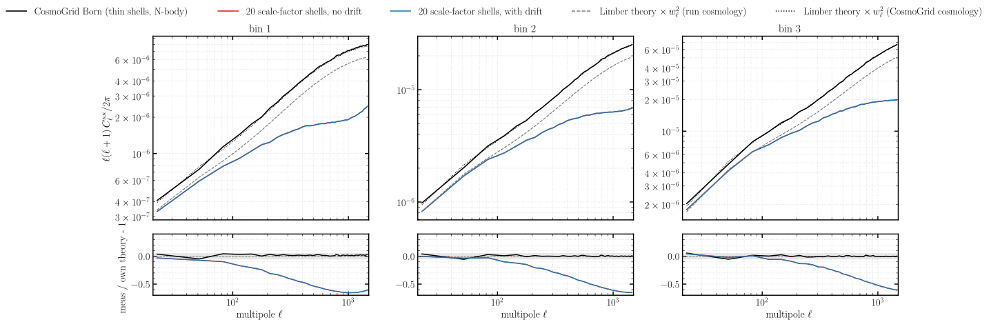

# Experiment 05b — Drift on the lightcone, 3-bin tomography

**Goal.** Carry the [Experiment 05a](../05a-spacing-n-stepping-drift/README.md) result — drifting particles to their lightcone-crossing epoch sharpens the per-shell density `C_ℓ` for **thick** shells — into **tomographic Born convergence with three source bins**. Exp 05a ran a 2 Gpc/h box, deep enough only for a single point source at `z = 0.35`; the radial projection there washes the drift effect out of the convergence. This experiment keeps 05a's **scale-factor** shell spacing but uses a **5 Gpc/h box at 2560³**, deep enough to place **three** tomographic source bins (the three lowest-`z` Stage-3 bins), and asks whether the density-shell improvement survives the deeper, multi-bin lensing projection. The short answer, below: the drift still cleans up the per-shell density `C_ℓ`, but — as in 05a — it barely moves the projected convergence.

| sweep | values |
|-------|--------|
| `--nb-shells` (no drift) | 5, 8, 10, 12, 16, 20, 25, 30, **40** |
| `--nb-shells` (with drift) | 5, 8, 10, 12, 16, 20, 25, 30, **40** |
| drift | (none), `--drift-on-lightcone` |
| `--shell-spacing` | `a` (scale factor, as in 05a) |
| lensing | 3-bin Born (`--nz-shear s3[:3]`) on each density run |

*Fixed across the sweep:* `--sim-mode pm`, **2560³**, box **`5000³` Mpc/h**, BullFrog (`bf`), `--nb-steps 50`, `--time-stepping D`, `--paint-order cic` (no force-window `--deconvolution`), `--scheme ngp`, `--nside 2048`, `--shells-per-file 1`, **`--min-width 5.0`**, `--seed 0`, **float64**. **128 GPU** (32 nodes × 4, `--pdim 128 1`). Runs are published to the [`ASKabalan/jax-fli-experiments`](https://huggingface.co/datasets/ASKabalan/jax-fli-experiments) dataset under `05-spacing-n-stepping/05b-3bins/` (raw per-shell density maps + precomputed per-shell density spectra, plus the 3-bin Born convergence maps and their spectra).

> **Halo (Exp 01 rule).** 2560³ on 128 GPUs (slab) gives local `20³` and an **even** halo `int(20·0.5) = 10` (an odd halo crashes jaxpm `slice_unpad`); local `20·2560·2560 = 1.31e8 ≈ 512³` fits float64. The physical ghost zone `0.5·5000/128 = 19.5` Mpc/h clears the end-of-run rms particle displacement. Drift-on-lightcone only repaints existing particles, so the displacement scale is unchanged.

## Method

Same drift / no-drift comparison as 05a, swept over shell count, then Born-integrated against a **3-bin** source distribution (`--nz-shear s3[:3]`, the three lowest-`z` Stage-3 bins matched to the 5 Gpc/h depth) into per-bin convergence `C_ℓ`. Born is order-invariant, so the comparison isolates the drift effect on the projected signal.

**fig01** is a small local illustration (256³ in the real 5 Gpc/h box): one particle cloud, coloured three ways by the redshift each particle is *assigned*, banded against the runs' real scale-factor shell edges.

**fig02** measures per-shell density `C_ℓ`. Because scale-factor shells nest cleanly (each coarse 10-shell shell contains four whole 40-shell shells), each column simply zooms into one 10-shell shell — near, mid, far — and builds a continuous-lightcone reference by summing the whole 40-shell no-drift shells that fall inside it (in particle counts, so per-pixel volume cancels), then converting to overdensity and transforming with `healpy`. **fig03-fig08** replace the reference with the analytic Limber number-counts theory and show *every* shell of every run.

## Results

### Redshift assignment under scale-factor shells


**Redshift assignment under scale-factor shells (fig01).** A wedge of the particle cloud, coloured by assigned redshift. **Left (10 shells, no drift):** scale-factor spacing gives ten concentric bands, each frozen to a single redshift — a staircase of discontinuities across the lightcone. **Middle (10 shells, with drift):** the drift replaces the staircase with the smooth true `z(r)`, so the same ten shells now carry a continuous gradient. **Right (40 shells, no drift):** more shells refine the staircase toward the smooth gradient — reaching it by brute force needs many shells, whereas the drift already recovers it with only ten.

### Per-shell density power spectra



**Per-shell density power spectra (fig02).** Density `C_ℓ` for the near, mid and far shell: the 10-shell no-drift (red) and with-drift (blue) runs against the 40-shell continuous-lightcone reference (black), with the ratio below. Scale-factor spacing keeps every shell thin, so the frozen-epoch bias is small to begin with — the no-drift run sits only **+1.7% / +0.6% / +0.6%** above the reference (near / mid / far) — and the drift removes even that, landing within a few tenths of a percent. This is the milder, well-behaved counterpart to 05c's equal-volume spacing, where the fat inner shell drives the no-drift bias to +21%: scale-factor spacing avoids the pathology, and the drift mops up the residual.

### Per-shell density census against theory

Each subplot is one shell compared to the Limber number-counts prediction (`compute_theory_cl_for_density`, comoving-volume weighted, times the HEALPix pixel window `w_ℓ²`): a log-log `C_ℓ` panel (no-drift red, with-drift blue, theory dashed) over a measured/theory ratio strip. Drift and no-drift share the seed and particles, so their Poisson shot noise is the *same* realisation and cancels between them — the physical signal is the **red↔blue gap**, not the distance from 1, and the shared rise above theory at high `ℓ` is that shot noise (meaningful only below the marked PM-Nyquist `ℓ_max ≈ πχ/dx`). Because 05b's shells are thin at every count, the red↔blue gap is small throughout and both curves track theory down to the resolution cutoff; the drift's correction shows up as the faint separation on the innermost, thickest shells of the low-count runs and vanishes as the shell count grows.



**Per-shell density census — 5 / 8 / 10 shells (fig03).**



**Per-shell density census — 16 shells (fig04).**



**Per-shell density census — 20 shells (fig05).**



**Per-shell density census — 25 shells (fig06).**



**Per-shell density census — 30 shells (fig07).**


**Per-shell density census — 40 shells (fig08).**

### Born convergence against the finest run and against theory

Each density run is Born-integrated against the three lowest-`z` Stage-3 source bins (`--nz-shear s3[:3]`) into per-bin convergence `C_ℓ`. fig09/fig10 stack the three source bins as row-pairs, with no-drift and with-drift in the two columns; fig09 ratios every shell count to its own 40-shell run (the finest lightcone), fig10 to the Limber weak-lensing theory (the same three bins, times `w_ℓ²`), and fig11 compares the 20-shell runs against an external Born reference.



**Born convergence vs the 40-shell run (fig09).** Convergence `C_ℓ` per source bin, each shell count ratioed to the 40-shell run (per-bin ratio window). The **no-drift and with-drift columns nearly coincide** — at fixed shell count the drift shifts the convergence by only a few percent at the coarsest 5–8 shells and below 1% by ~16 shells, because the thin scale-factor shells carry little frozen-epoch error and the Born projection averages out what little remains. What controls convergence is the **shell count**: the 5-shell run is ~20–30% high in the low-`z` bin 1 and settles to within a few percent by ~16 shells, with the higher-`z` bins 2 and 3 already tighter. This clean behaviour is a property of the spacing: scale-factor shells stay thin where the lensing kernel varies, so the shell-Born quadrature error (diagnosed in [05c](../05c-spacing-n-stepping-equal-vol/README.md)'s fig09) is ≤ 2% for this geometry at 20 shells — whereas equal-volume's fat inner shells inflate the convergence by up to ~1.7× through the identical `born()` code.



**Born convergence vs Limber theory (fig10).** The same convergence ratioed to Limber theory (40-shell included). All shell counts track the theory at large scales and fall below it at small scales, where the finite PM resolution and the Born projection suppress power — a common deficit shared by every run, again essentially independent of the drift. The shell-count spread of fig09 rides on top of this shared resolution roll-off rather than on the theory itself.



**Born convergence vs the CosmoGrid Born reference (fig11).** The external check: the 20-shell runs against the CosmoGrid Born convergence — the **same `born()` code** run on CosmoGrid's thin (~70–100 Mpc/h) shells, a full N-body at nside 2048 and a *different cosmology* (σ₈ = 0.90, h = 0.73), so each measurement is ratioed to the Limber theory at its **own** cosmology. The 20 scale-factor shells sit on their theory out to `ℓ ≈ 100` (the no-drift red curve is hidden under the with-drift blue one — the drift null again) and then roll off as the 2560³ PM mesh runs out of resolution, while the N-body CosmoGrid reference holds its theory to `ℓ = 1500`. No bulge anywhere: with thin shells the shell-Born integration is sound, and the only deficit is resolution.

## How to run

```bash
MODE=dryrun bash run.sh   # print the resolved commands (submit nothing)
bash run.sh               # submit the density sweep to SLURM
```

The density sweep writes one directory of per-shell parquet (`shell_NNNN.parquet`) per (drift, shell-count) to `results/exp5b/`; once pushed to HuggingFace, the `fli-born-rt` step reads them back and writes the 3-bin convergence maps. The figure script then renders the SVGs locally without a GPU:

```bash
JAX_PLATFORMS=cpu uv run --no-sync python build.py
```
