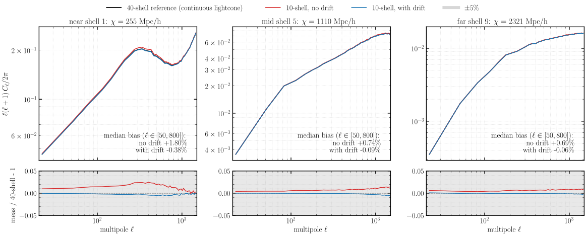
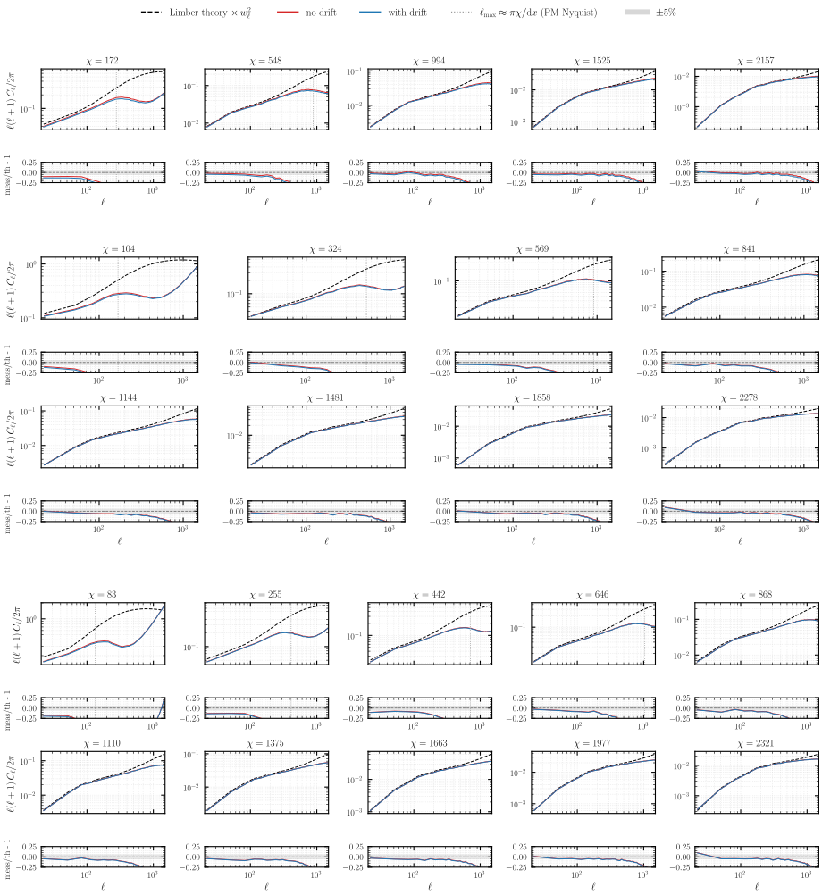
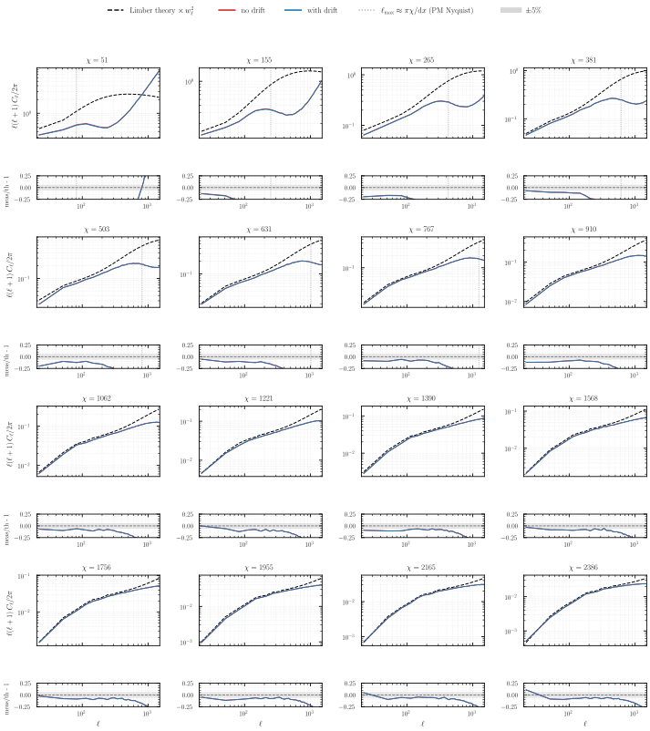
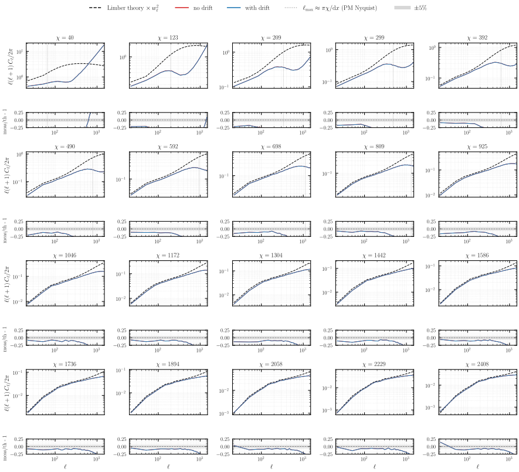
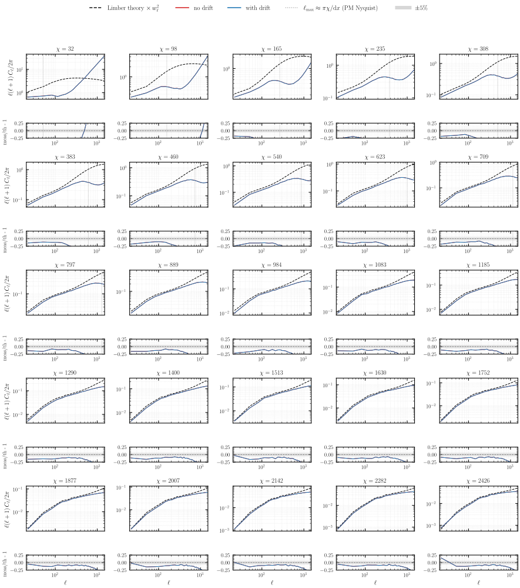
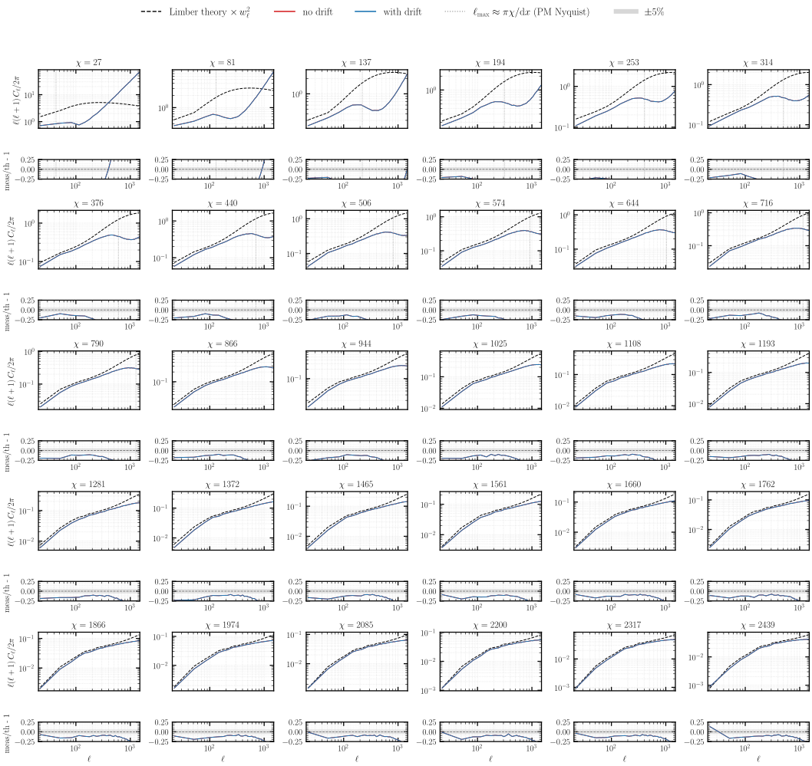
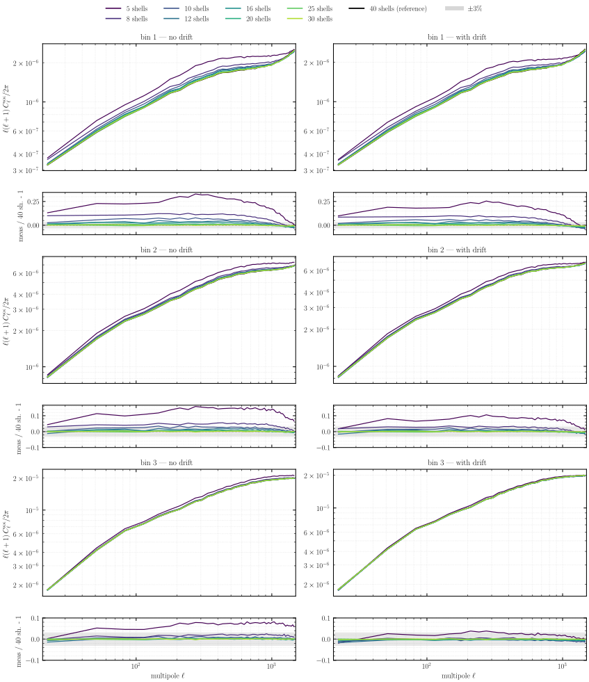
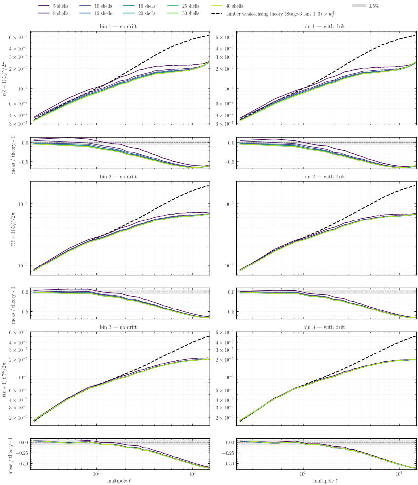

# Experiment 05b — Drift on the lightcone, 3-bin tomography

**Goal.** [Experiment 05a](../05a-spacing-n-stepping-drift/README.md) showed that drifting particles to their lightcone-crossing epoch sharpens the per-shell density `C_ℓ` of **thick** shells. Its 2 Gpc/h box reached only a point source at `z = 0.35`, whose radial projection washed the drift out of the convergence. Here we keep the **scale-factor** shell spacing of 05a in a **5 Gpc/h box at 2560³**, deep enough for **three** tomographic source bins (the three lowest-`z` Stage-3 bins), and ask whether the density improvement survives the multi-bin lensing projection. The drift still cleans the per-shell density `C_ℓ`, and, as in 05a, it barely moves the projected convergence.

| sweep | values |
|-------|--------|
| `--nb-shells` (no drift) | 5, 8, 10, 12, 16, 20, 25, 30, **40** |
| `--nb-shells` (with drift) | 5, 8, 10, 12, 16, 20, 25, 30, **40** |
| drift | (none), `--drift-on-lightcone` |
| `--shell-spacing` | `a` (scale factor, as in 05a) |
| lensing | 3-bin Born (`--nz-shear s3[:3]`) on each density run |

*Fixed:* `--sim-mode pm`, **2560³**, box **`5000³` Mpc/h**, BullFrog (`bf`), `--nb-steps 50`, `--time-stepping D`, `--paint-order cic` without force-window `--deconvolution`, `--scheme ngp`, `--nside 2048`, `--shells-per-file 1`, **`--min-width 5.0`**, `--seed 0`, **float64**, **128 GPUs** (32 nodes × 4, `--pdim 128 1`). The slab gives a local mesh of `20·2560·2560 = 1.31e8 ≈ 512³` cells, which fits in float64, with an even halo of `int(20·0.5) = 10` cells (an odd halo crashes the `slice_unpad` of jaxpm). The 19.5 Mpc/h ghost zone clears the end-of-run rms displacement, which the drift leaves unchanged, since it only repaints existing particles. The density maps, their spectra, the Born maps and their spectra are published under [`05-spacing-n-stepping/05b-3bins/`](https://huggingface.co/datasets/ASKabalan/jax-fli-experiments/tree/main/05-spacing-n-stepping/05b-3bins).

## Method

We repeat the drift comparison of 05a across the shell count and Born-integrate every run for the three source bins. Born is order-invariant, so the comparison isolates the effect of the drift on the projected signal. Scale-factor shells nest: each shell of the 10-shell run contains four whole shells of the 40-shell run. fig02 therefore zooms into the near, mid and far 10-shell shells and builds a continuous-lightcone reference by summing, in particle counts, the 40-shell shells without the drift that fall inside each one, before converting to overdensity and transforming with `healpy`. The census (fig03–fig08) replaces the reference with the Limber number-count prediction and shows every shell of every run.

## Results

### Redshift assignment under scale-factor shells


**Redshift assignment under scale-factor shells (fig01).** A wedge of a 256³ particle cloud in the 5 Gpc/h box, coloured by the redshift assigned to each particle, banded by the scale-factor shell edges of the runs. Left, 10 shells without the drift: ten concentric bands, each frozen at a single redshift, form a staircase across the lightcone. Middle, 10 shells with the drift: the same shells carry the continuous `z(r)`. Right, 40 shells without the drift: the staircase approaches the continuous gradient that the drift reaches with ten shells.

### Per-shell density power spectra



**Per-shell density power spectra (fig02).** The near, mid and far shells of the 10-shell runs without (red) and with (blue) the drift, against the 40-shell reference (black), with the ratio below. Scale-factor spacing keeps every shell thin, so the frozen-epoch bias is small: the run without the drift sits **+1.7% / +0.6% / +0.6%** above the reference (near / mid / far), and the drift brings it within a few tenths of a percent. The equal-volume spacing of 05c reaches +21% in its fat inner shell; scale-factor spacing avoids that case, and the drift removes the residual.

### Per-shell density census against theory

Each panel of the census is one shell against the Limber number-count prediction (`compute_theory_cl_for_density`, comoving-volume weighted, times the pixel window `w_ℓ²`): `C_ℓ` without (red) and with (blue) the drift and the theory (dashed), over the ratio to theory. The two runs share the seed and the particles, so their shot noise cancels and the red–blue gap isolates the drift. The shared rise above theory at high `ℓ` is shot noise, meaningful only below the marked PM-Nyquist `ℓ_max ≈ πχ/dx`. The shells of 05b are thin at every count, so both curves track theory down to the resolution cutoff, and the drift shows only as a faint separation on the innermost, thickest shells of the runs with few shells, which vanishes as the shell count grows.



**Per-shell density census — 5 / 8 / 10 shells (fig03).**



**Per-shell density census — 16 shells (fig04).**



**Per-shell density census — 20 shells (fig05).**



**Per-shell density census — 25 shells (fig06).**



**Per-shell density census — 30 shells (fig07).**


**Per-shell density census — 40 shells (fig08).**

### Born convergence



**Born convergence against the 40-shell run (fig09).** The three source bins in row pairs, without and with the drift in the two columns, each shell count divided by its own 40-shell run. The two columns nearly coincide: at fixed shell count the drift moves the convergence by a few percent at 5–8 shells and by less than 1% from ~16 shells, because the thin shells carry little frozen-epoch error and the Born projection averages the rest. The shell count controls the convergence: the 5-shell run is ~20–30% high in the low-`z` bin 1 and settles within a few percent by ~16 shells, and bins 2 and 3 are tighter from the start. Scale-factor shells stay thin where the lensing kernel varies, so the shell-Born quadrature error diagnosed in fig09 of [05c](../05c-spacing-n-stepping-equal-vol/README.md) is ≤ 2% at 20 shells, while the fat inner shells of equal-volume spacing inflate the convergence by up to ~1.7× through the same `born()` code.



**Born convergence against Limber theory (fig10).** The same convergence, the 40-shell run included, divided by the Limber weak-lensing theory of the three bins times `w_ℓ²`. Every shell count tracks the theory at large scales and falls below it at small scales, where the finite PM resolution and the Born projection suppress power, with or without the drift. The spread between shell counts in fig09 sits on top of this shared resolution roll-off.


**Born convergence against the CosmoGrid Born reference (fig11).** The 20-shell runs against the CosmoGrid Born convergence, computed by the same `born()` on the thin (~70–100 Mpc/h) shells of a full N-body run at nside 2048 in a different cosmology (σ₈ = 0.90, h = 0.73), so each measurement is divided by the Limber theory of its own cosmology. The 20 scale-factor shells sit on their theory out to `ℓ ≈ 100`, with the curve without the drift hidden under the one with it, and then roll off as the 2560³ mesh runs out of resolution, while CosmoGrid holds its theory to `ℓ = 1500`. With thin shells the shell-Born integration shows no excess anywhere, and the only deficit comes from resolution.

## How to run

```bash
MODE=dryrun bash run.sh   # print the resolved commands (submit nothing)
bash run.sh               # submit the density sweep to SLURM
JAX_PLATFORMS=cpu uv run --no-sync python build.py
```

The sweep writes one directory of `shell_NNNN.parquet` per drift and shell count to `results/exp5b/`. Once these are on HuggingFace, `fli-born-rt` reads them back and writes the 3-bin convergence maps, and `build.py` renders the SVGs without a GPU.
