# Experiment 05c — Spacing & stepping: equal-volume shells

**Goal.** Experiment [05a](../05a-spacing-n-stepping-drift/README.md) established the *drift on the lightcone*: moving each particle to the scale factor at which it actually crosses the lightcone removes the frozen-epoch error of a thick shell, so a coarse *drifted* lightcone matches a much finer undrifted one. 05a used **scale-factor** shell spacing, which makes the near-observer shells thin — thin shells hold few particles, so their per-shell `C_ℓ` is shot-noise dominated. This experiment swaps the spacing to **equal volume** (`--shell-spacing equal_vol`): every shell then encloses the same comoving volume, hence the same particle count, so no near shell is starved. The geometric price is that the innermost shell becomes a **fat ball** (here `[0, 1160]` Mpc/h) while the outer shells get thin and are floored to `--min-width 60`. That concentrates the frozen-epoch error into the fat inner shell — precisely where the drift buys the most. The question 05c answers is whether equal-volume spacing *plus* drift gives clean per-region `C_ℓ` across the whole lightcone, and how the choice of shell spacing interacts with the Born-lensing radial quadrature.

| sweep | values |
|-------|--------|
| `--nb-shells` (no drift) | 5, 8, 10, 12, 16, 20, 25, 30, **40** |
| `--nb-shells` (with drift) | 5, 8, 10, 12, 16, 20, 25, 30, **40** |
| drift | (none), `--drift-on-lightcone` |
| `--shell-spacing` | `equal_vol` (the one change vs 05a) |
| lensing | 3-bin Born (`--nz-shear s3[:3]`) on each density run, under three shell quadratures (`--quadrature`): midpoint, composite Simpson, Gauss–Legendre |

*Fixed across the sweep:* `--sim-mode pm`, **2560³**, box **`5000³` Mpc/h**, BullFrog (`bf`), `--nb-steps 50`, `--time-stepping D`, `--paint-order cic` (no force-window `--deconvolution`), `--scheme ngp`, `--nside 2048`, `--shells-per-file 1`, **`--min-width 60.0`** (the hybrid floor: equal-volume inner shells, ≥60 Mpc/h outer shells), `--seed 0`, **float64**. **128 GPU** (32 nodes × 4, `--pdim 128 1`). Runs are published to the [`ASKabalan/jax-fli-experiments`](https://huggingface.co/datasets/ASKabalan/jax-fli-experiments) dataset under `05-spacing-n-stepping/05c-equal-volume/` (raw per-shell density maps + precomputed per-shell density spectra, plus the 3-bin Born convergence maps and their spectra under each quadrature).

> **Halo (Exp 01 rule).** 2560³ on 128 GPUs (slab) gives local `20³` and an **even** halo `int(20·0.5) = 10`; local `20·2560·2560 = 1.31e8 ≈ 512³` fits float64. The physical ghost zone `0.5·5000/128 = 19.5` Mpc/h clears the end-of-run rms displacement.

## Method

The density figures (fig01–fig02) compare a coarse 10-shell lightcone to a much finer one at matched radial extent; the census (fig03–fig08) sweeps the full shell-count grid; and the Born convergence (fig09–fig18) contrasts the three shell quadratures and the two shell spacings.

**fig01** is a small local illustration (256³ in the real 5 Gpc/h box): one particle cloud, coloured three ways by the redshift each particle is *assigned*. The banding uses the runs' real equal-volume shell edges (reconstructed from the stored `comoving_centers ± density_width/2`).

**fig02** measures per-region density `C_ℓ`. Because equal-volume shells do not nest cleanly (the 40-shell run is floored to 60 Mpc/h and does not tile the un-floored 10-shell run), each column is a **radial region** — a group of consecutive 10-shell shells whose extent lines up with whole 40-shell edges (to within ~30 Mpc/h). The 10-shell measurement and the 40-shell reference are each summed from **whole** shells over that region (in particle counts, so per-pixel volume cancels), then converted to overdensity and transformed with `healpy`. The 40-shell no-drift run is the finest continuous-lightcone reference available (the reference is a no-drift sum by construction).

## Results

### Redshift assignment under equal-volume shells


**Redshift assignment under equal-volume shells (fig01).** A thin wedge of the particle cloud, coloured by assigned redshift. **Left (10 shells, no drift):** equal volume makes the innermost shell an enormous ball out to ~1160 Mpc/h — every particle in it is frozen to a single redshift, a huge discontinuity — while the outer shells thin out into narrow bands. **Middle (10 shells, with drift):** the drift replaces the freeze with the smooth true `z(r)`, so the same 10 shells now carry a continuous redshift gradient. **Right (30 shells, no drift):** more shells shrink the fat inner ball and refine the bands, approaching the smooth gradient — but reaching it by brute force needs many shells, whereas the drift already recovers it with only 10.

### Per-region density power spectra


**Per-region density power spectra (fig02).** Density `C_ℓ` for the near (fat inner ball), mid, and far regions: the 10-shell no-drift (red) and with-drift (blue) runs against the 40-shell continuous-lightcone reference (black); the lower panels show the ratio to the reference. In the **near** region the no-drift run is biased **+21%** high — the fat inner ball frozen at one epoch — and the drift pulls it back to **+2%**. In the **mid** and **far** regions the 10-shell shells are already thin, so the frozen-epoch error is sub-percent and drift and no-drift both sit on top of the reference. Equal-volume spacing thus localises the entire density-convergence problem to the inner ball, and the drift-on-lightcone resolves it there with a coarse 10-shell lightcone.

### Per-shell density census against theory

The region view above sums shells together; this census instead compares **every individual shell** of every run to the analytic Limber number-counts prediction (`compute_theory_cl_for_density`, comoving-volume weighted, times the HEALPix pixel window `w_ℓ²`). Each subplot is one shell: a log-log `C_ℓ` panel (no-drift red, with-drift blue, theory dashed) over a measured/theory ratio strip. Because the drift and no-drift runs share the seed and the particles, their Poisson shot noise is the *same* realisation and cancels between them — so the physical signal is the **red↔blue gap**, not the distance from 0. The shared rise of both curves above the theory at high `ℓ` is that shot noise (the theory carries none) and is meaningful only below the marked PM-Nyquist `ℓ_max ≈ πχ/dx`.

The whole story sits in the **fat inner shell**. At 5, 8 and 10 shells the innermost equal-volume shell is a ball spanning out past ~1000 Mpc/h, and its no-drift `C_ℓ` runs ~20-25% above theory — frozen at a single epoch across a huge radial span — while the drifted shell lands on the theory. Every thinner outer shell already tracks theory with or without the drift, so red and blue coincide there. As the shell count grows the inner ball shrinks and the gap closes: by 40 shells drift and no-drift agree on every shell and both follow theory down to the resolution cutoff, where the finite mesh suppresses the small-scale power common to all runs.


**Per-shell density census — 5 / 8 / 10 shells (fig03).**


**Per-shell density census — 16 shells (fig04).**


**Per-shell density census — 20 shells (fig05).**


**Per-shell density census — 25 shells (fig06).**


**Per-shell density census — 30 shells (fig07).**


**Per-shell density census — 40 shells (fig08).**

### Born convergence: the midpoint quadrature breaks on equal-volume fat shells

The density census above shows the drift is decisive *per shell* — it drags the fat inner ball's `C_ℓ` from +20% back onto theory. The Born lensing story is a **separate** effect, and it is about the radial **quadrature**, not the shells' redshift. `born()` sums `κ = Σᵢ Kᵢ δ̄ᵢ`: one weight `Kᵢ` per shell times that shell's volume-averaged map. `Kᵢ` is a quadrature of the continuous lensing kernel `w(χ) = χ (1+z)(1 − χ/χₛ)` over the shell — exact only when the kernel is nearly constant across it. The legacy default sampled the kernel at the shell **center** (the midpoint rule, `Kᵢ ∝ Δχᵢ · χᵢ/aᵢ · ⟨1 − χᵢ/χₛ⟩`); equal-volume's fat inner ball is exactly where that rule is most stressed — most so for the low-`z` bins whose kernel turns over inside it. We therefore recompute each density run's Born convergence under three quadratures — **midpoint**, composite **Simpson**, and **Gauss–Legendre** — via the shipped `--quadrature` option, and compare.

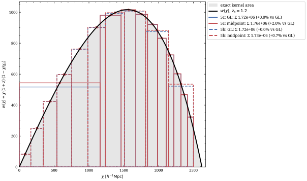

**Born shell windows — the quadrature made visible (fig09).** fig09 draws the exact kernel `w(χ)` for a source at `z_s = 1.2` (black curve, exact area shaded) and overlays both 10-shell geometries — equal-volume (05c, solid) and scale-factor ([05b](../05b-spacing-n-stepping-3bin/README.md), dashed) — with each shell a box whose **area is its Born weight** (box height = weight / width), coloured by quadrature: blue = the exact Gauss–Legendre integral, red = midpoint. (Composite Simpson is identical to Gauss–Legendre to `< 10⁻⁶` for these smooth truncated-kernel integrals, so only the two distinct windows are drawn.) The exact boxes tile the shaded kernel; the midpoint boxes sit flat at each shell's **center** value. Equal-volume's fat inner shell `[0, 1160]` Mpc/h is the one wide flat box — but for this far source the midpoint overshoots it by only **+2.0%** (scale-factor's thin near shells: **+0.7%**), because a distant source makes the kernel vary gently across even the fat ball. The overshoot turns severe only when the source sits close to (or inside) the fat shell — the low-`z` bins of fig10, where it reaches 2–3×.

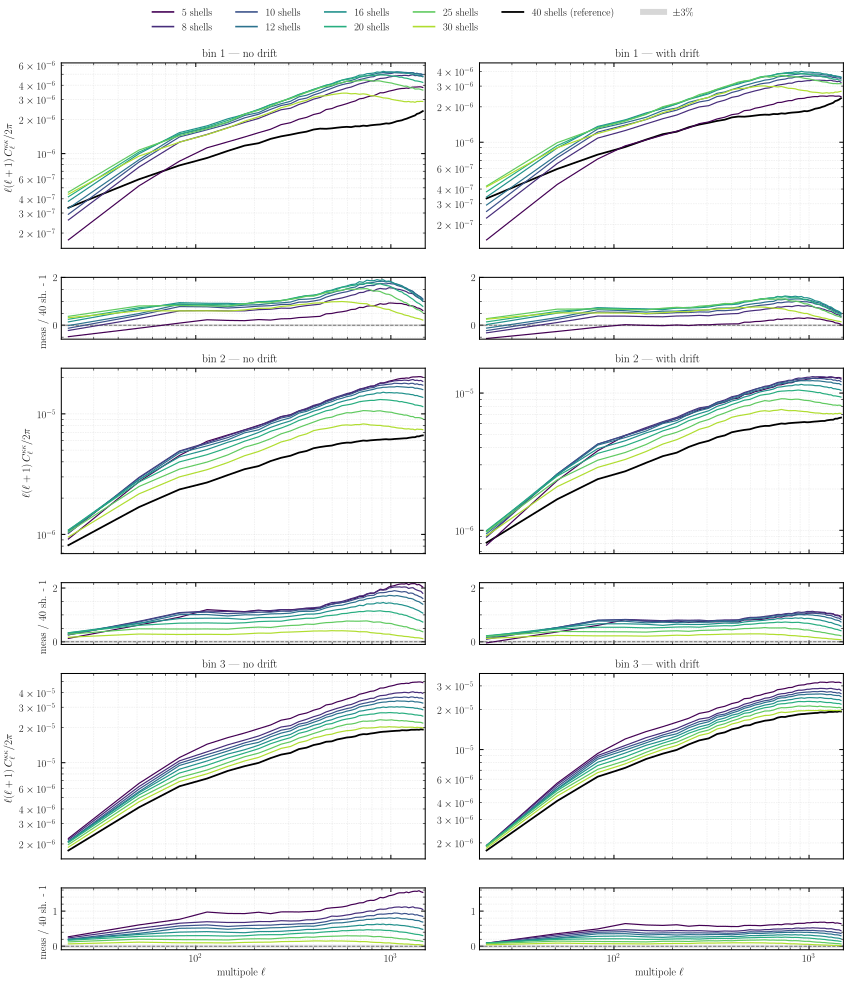

**Midpoint quadrature vs the 40-shell run (fig10).** Ratioed to its own 40-shell run, the midpoint convergence overshoots badly at coarse-to-moderate `N`: the low-`z` bins climb to **~2–3× the 40-shell reference** at small scales, with a non-monotonic `N`-trend, and the no-drift column (left) sits above the with-drift column (right) — the drift removes the fat shells' frozen-epoch error but not the quadrature overshoot. Bin 3 (whose kernel peaks far from the fat inner shell) is the mildest.

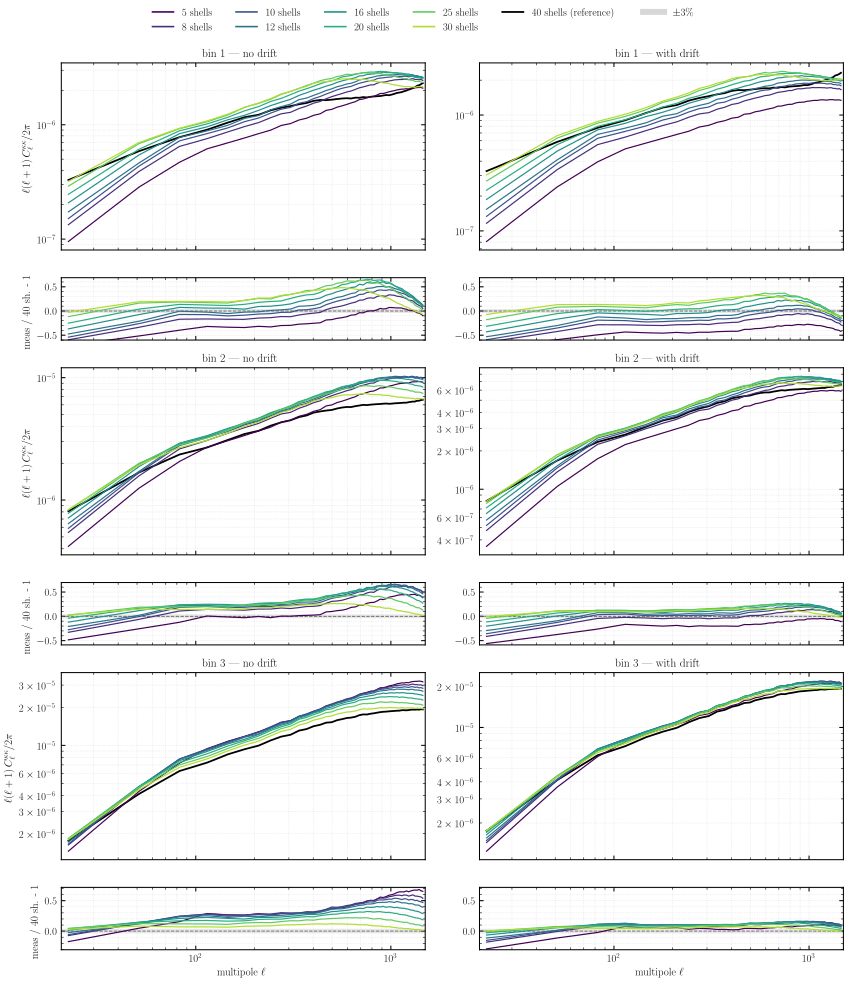

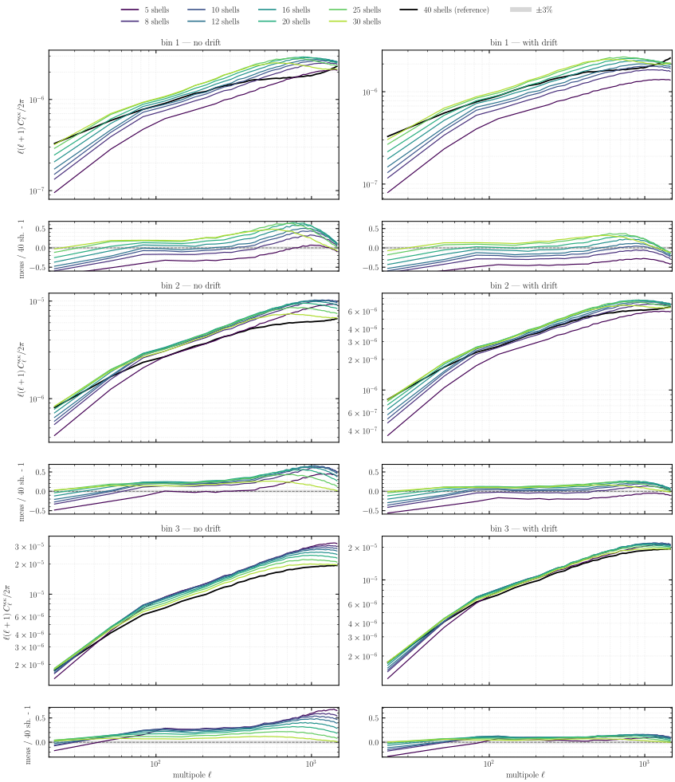

**Simpson and Gauss–Legendre vs the 40-shell run (fig11, fig12).** Integrating the kernel across each shell removes the overshoot. The two schemes are indistinguishable here (composite Simpson with 16 intervals is already exact for this smooth kernel), so we take Gauss–Legendre as the reference. The coarse-`N` runs no longer bulge above the 40-shell run; they **bracket** it — undershooting at large scales (a coarse lightcone simply loses radial resolution) and converging monotonically as `N` grows. **With the drift (right columns) the convergence is tight**, within a few percent of the 40-shell run for every bin. Without the drift the coarsest runs still carry a residual ~1.5× excess at the very smallest scales — but the catastrophic midpoint overshoot is gone across the board.

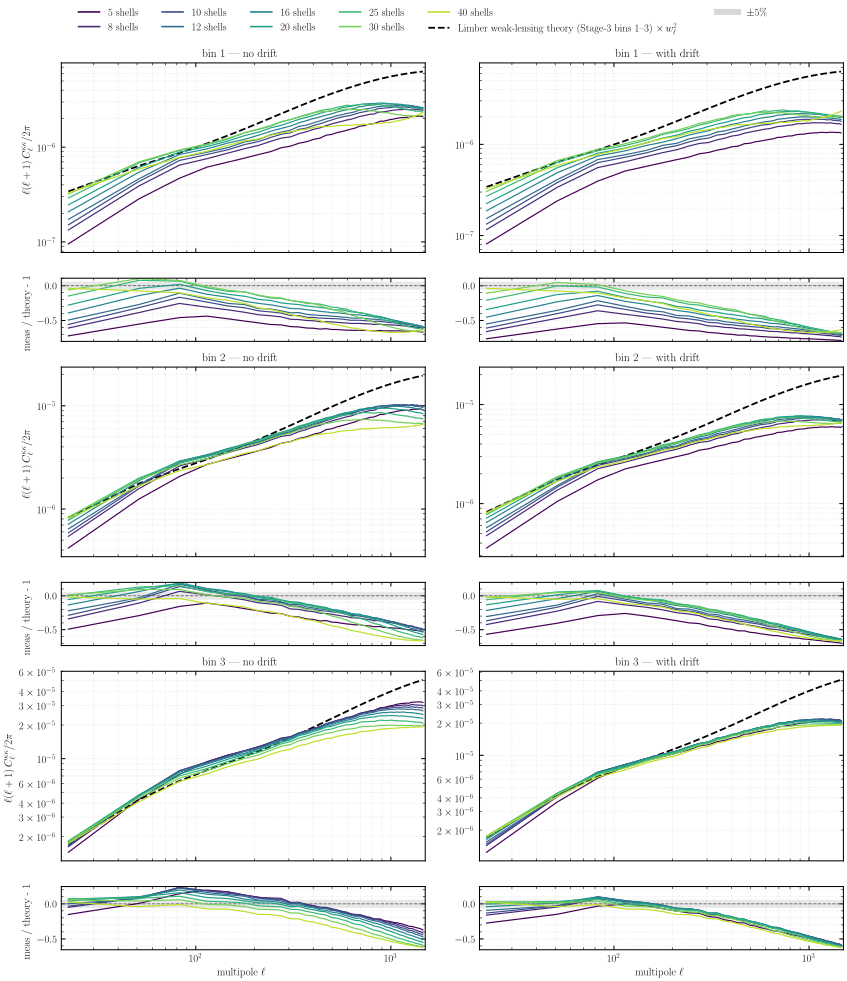

**Gauss–Legendre convergence vs Limber theory (fig13).** With the exact quadrature the Gauss–Legendre convergence climbs onto the Limber weak-lensing theory as `N` grows — by `N ≈ 25–30` all three bins sit within a few percent of theory over `ℓ ≈ 30–150` (at `N = 30`, bin 1 is essentially on theory there, bins 2–3 a percent or two above) — then rolls off at small scales on the common **PM-resolution transfer**, the ceiling any 2560³ run hits (close to the roll-off the scale-factor [05b](../05b-spacing-n-stepping-3bin/README.md) runs land on — fig14–fig18 compare the two spacings directly). The no-drift and with-drift columns now agree, since the radial projection no longer carries a quadrature bias. **Bin 1 rolls off fastest**: its low-`z` sources (`χₛ ≈ 856` Mpc/h) sit *inside* the `[0, 1160]` Mpc/h fat inner ball, so it is both the slowest to climb onto theory at coarse `N` and the most suppressed at small scales — median `C_ℓ/theory ≈ 0.74` over `ℓ ∈ [250,300]` versus `≈ 0.88` for bin 3. The Gauss–Legendre weight for that shell is still exact — but the shell's map is a single volume-average that has already erased the radial `δ` profile at paint time, so no per-shell weight can encode that the near half of the ball lenses the source while the far half does not. This is a geometry limit, not a quadrature one: equal-volume cannot fix it without changing the shelling.

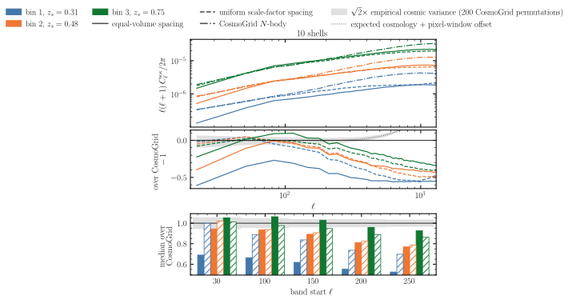

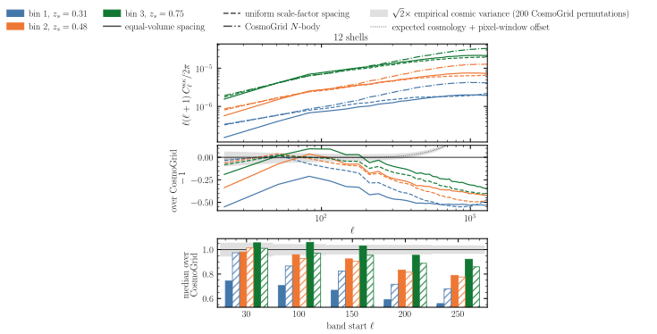

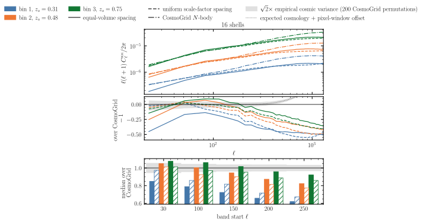

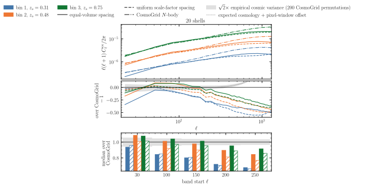

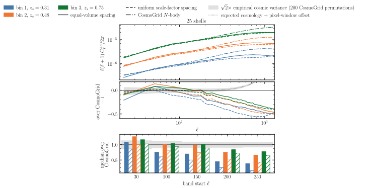

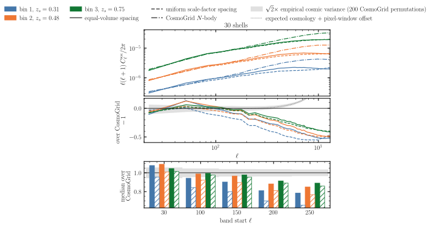

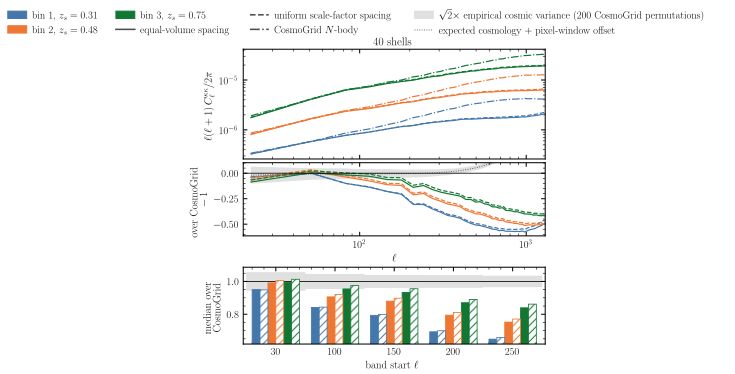


**Equal-volume vs scale-factor spacing across shell count (fig14–fig18).** With the quadrature pinned at Gauss–Legendre (drift), the equal-volume and scale-factor ([05b](../05b-spacing-n-stepping-3bin/README.md)) Born convergence are compared for all three tomographic bins across a shell-count ladder — `N` = 12, 20, 25, 30, 40 (fig17 / fig16 / fig18 / fig14 / fig15, shown here in increasing `N`). The top panel plots the `D_ℓ ≡ ℓ(ℓ+1) C_ℓ / 2π` power — solid = equal-volume, dashed = scale-factor, dotted = the Limber weak-lensing theory (× `w_ℓ²`) — and the bottom panel the fractional residual `C_ℓ / theory − 1` for each spacing, bandpower-binned in linear bins of `nlb` = 32 multipoles. Both spacings sit on theory around `ℓ ≈ 50–100` and roll off together below it at small scales on the shared PM-resolution transfer; the solid–dashed gap per colour is the spacing difference, and it **shrinks with shell count**. At `N` = 12 the equal-volume convergence carries the largest small-scale excess over 05b (its fat inner shell and floored-thin outer shells place the projected power differently from 05b's scale-factor shells); the gap narrows steadily through `N` = 20, 25, 30, and by `N` = 40 the two spacings overlay almost perfectly — the equal-volume geometry has converged onto the scale-factor result. Bin 1 sits lowest throughout, its low-`z` sources inside the fat inner ball. 05b was only run with the midpoint quadrature, but for its thin scale-factor shells midpoint and Gauss–Legendre agree to **< 0.2%** on the total per-bin lensing weight (individual shells deviate but cancel), so its midpoint spectra stand in for Gauss–Legendre here. The headline is the contrast with the midpoint runs of fig10: with the exact quadrature the two spacings differ modestly and converge with shell count, rather than the midpoint's 2–3× — the spacing was never the large lensing problem, the quadrature was.

### Which spacing and shell count converge best?

Holding the quadrature at Gauss–Legendre (drift), how close does each spacing get to the truth, and at which shell count? The tables below give the median `C_ℓ / theory` per tomographic bin (1.000 = matches theory) over five multipole bands; the equal-volume row closest to theory (smallest bin-averaged `|1 − median|`) is bold in each band.

**ℓ ∈ [30, 100]**

| N | equal-volume (bin1/2/3) | uniform-a (bin1/2/3) |
|---|---|---|
| 10 | 0.667 / 0.907 / 1.029 | 0.939 / 0.973 / 0.980 |
| 12 | 0.705 / 0.943 / 1.037 | 0.918 / 0.949 / 0.980 |
| 16 | 0.809 / 1.013 / 1.068 | 0.903 / 0.940 / 0.981 |
| 20 | 0.881 / 1.024 / 1.040 | 0.894 / 0.931 / 0.977 |
| 25 | 0.967 / 1.054 / 1.041 | 0.887 / 0.936 / 0.968 |
| **30** | **0.996 / 1.014 / 1.028** | 0.897 / 0.934 / 0.973 |
| 40 | 0.879 / 0.920 / 0.958 | 0.883 / 0.935 / 0.974 |

**ℓ ∈ [100, 150]**

| N | equal-volume (bin1/2/3) | uniform-a (bin1/2/3) |
|---|---|---|
| 10 | 0.639 / 0.902 / 1.025 | 0.831 / 0.889 / 0.945 |
| 12 | 0.681 / 0.934 / 1.036 | 0.831 / 0.876 / 0.936 |
| 16 | 0.757 / 0.955 / 1.021 | 0.821 / 0.878 / 0.932 |
| 20 | 0.799 / 0.966 / 1.001 | 0.800 / 0.876 / 0.935 |
| 25 | 0.865 / 0.961 / 0.985 | 0.796 / 0.877 / 0.937 |
| **30** | **0.908 / 0.949 / 0.957** | 0.799 / 0.871 / 0.943 |
| 40 | 0.797 / 0.863 / 0.916 | 0.798 / 0.875 / 0.939 |

**ℓ ∈ [150, 200]**

| N | equal-volume (bin1/2/3) | uniform-a (bin1/2/3) |
|---|---|---|
| 10 | 0.572 / 0.831 / 0.961 | 0.784 / 0.848 / 0.893 |
| 12 | 0.619 / 0.854 / 0.964 | 0.758 / 0.849 / 0.895 |
| 16 | 0.669 / 0.877 / 0.945 | 0.769 / 0.844 / 0.897 |
| 20 | 0.741 / 0.903 / 0.952 | 0.753 / 0.840 / 0.887 |
| **25** | **0.813 / 0.920 / 0.945** | 0.743 / 0.833 / 0.893 |
| 30 | 0.826 / 0.900 / 0.917 | 0.739 / 0.838 / 0.889 |
| 40 | 0.732 / 0.823 / 0.868 | 0.743 / 0.839 / 0.894 |

**ℓ ∈ [200, 250]**

| N | equal-volume (bin1/2/3) | uniform-a (bin1/2/3) |
|---|---|---|
| 10 | 0.535 / 0.788 / 0.942 | 0.709 / 0.797 / 0.865 |
| 12 | 0.572 / 0.814 / 0.938 | 0.690 / 0.789 / 0.861 |
| 16 | 0.634 / 0.854 / 0.941 | 0.690 / 0.789 / 0.867 |
| 20 | 0.705 / 0.882 / 0.944 | 0.682 / 0.785 / 0.869 |
| **25** | **0.757 / 0.880 / 0.908** | 0.680 / 0.787 / 0.866 |
| 30 | 0.782 / 0.856 / 0.895 | 0.681 / 0.788 / 0.869 |
| 40 | 0.668 / 0.770 / 0.847 | 0.676 / 0.785 / 0.868 |

**ℓ ∈ [250, 300]**

| N | equal-volume (bin1/2/3) | uniform-a (bin1/2/3) |
|---|---|---|
| 10 | 0.500 / 0.740 / 0.900 | 0.657 / 0.754 / 0.853 |
| 12 | 0.529 / 0.757 / 0.899 | 0.643 / 0.755 / 0.848 |
| 16 | 0.590 / 0.791 / 0.900 | 0.641 / 0.757 / 0.851 |
| 20 | 0.651 / 0.826 / 0.911 | 0.628 / 0.747 / 0.850 |
| **25** | **0.717 / 0.841 / 0.895** | 0.628 / 0.753 / 0.854 |
| 30 | 0.743 / 0.821 / 0.880 | 0.628 / 0.746 / 0.856 |
| 40 | 0.617 / 0.731 / 0.829 | 0.627 / 0.749 / 0.855 |

Equal-volume at **N ≈ 25–30 is the best-converged configuration in every band** — N=30 wins below `ℓ ≈ 100` (within 1–3% of theory on all bins), N=25 from `ℓ ≈ 150` up. Equal-volume is **non-monotonic**: both ends of the ladder (N=10–12 too coarse to fill the fat ball, N=40 over-resolved) are its worst and sit down at the scale-factor level, with the deviation falling smoothly to the N=25–30 minimum in between. Scale-factor spacing is nearly **flat in `N`** — already at its best by N≈10–12 — but is beaten by equal-volume's sweet spot everywhere except the highest band, where the shared PM-resolution roll-off dominates and the two meet. That roll-off is also why every row drifts further below 1.0 as `ℓ` grows — the bin-averaged deviation from theory rises from ~0.05 at `ℓ ∈ [30,100]` to ~0.25 at `ℓ ∈ [250,300]` for both spacings — it is the 2560³ mesh, not the shelling.

**Practical conclusion.** Equal-volume spacing is excellent for per-shell density statistics (census above, especially with the drift) and, *with the exact per-shell quadrature*, is usable for Born lensing for every source bin whose kernel lies in front of the fat inner shell. The legacy midpoint weight is a strict liability on thick shells and a numerical no-op on thin ones — so `born()` now integrates the kernel across each shell by default (the `--quadrature simpson`/`gauss_legendre` option), leaving thin-shell geometries like 05b unchanged (< 0.2% here). The only irreducible failure is the lowest source bin whose sources sit inside the fat inner ball; for that bin (or fewer shells) the geometry must change at paint time.

## How to run

```bash
MODE=dryrun bash run.sh   # print the resolved commands (submit nothing)
bash run.sh               # submit the density sweep to SLURM
```

The density sweep writes one directory of per-shell parquet (`shell_NNNN.parquet`) per (drift, shell-count) to `results/exp5c/`; `run.sh` then Born-integrates each density run into 3-bin convergence maps under each of the three quadratures (`fli-born-rt --quadrature {midpoint,simpson,gauss_legendre}`). Once pushed to HuggingFace, the figure script renders the SVGs locally without a GPU:

```bash
JAX_PLATFORMS=cpu uv run --no-sync python build.py
```
