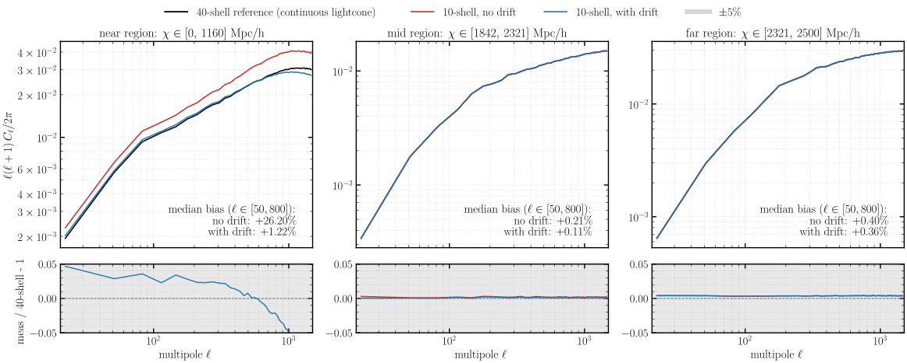
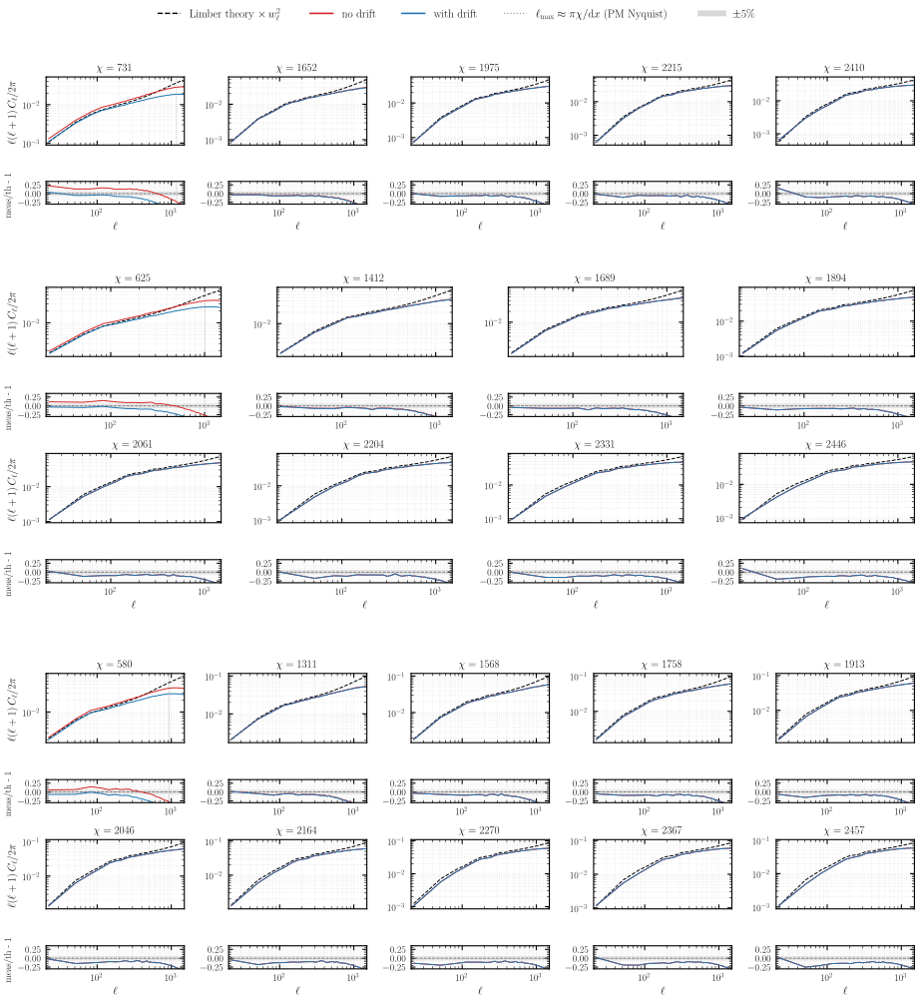
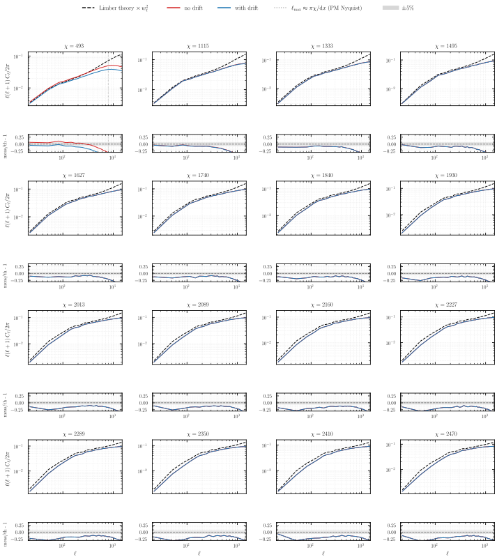
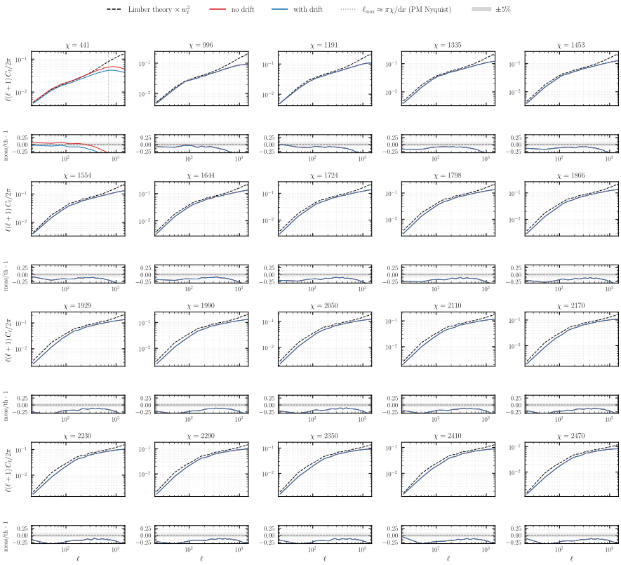
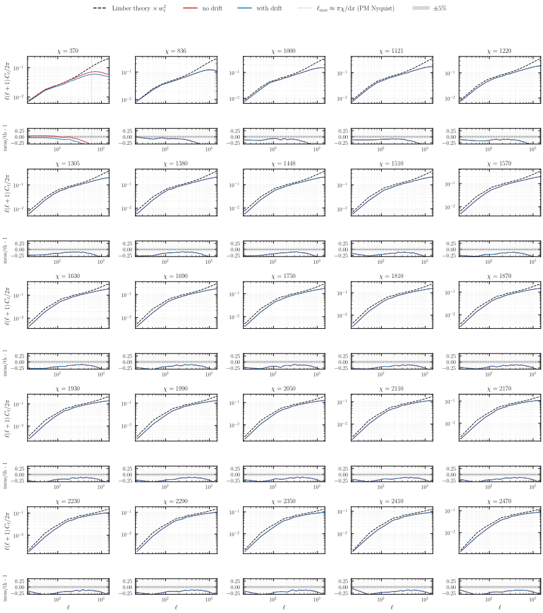
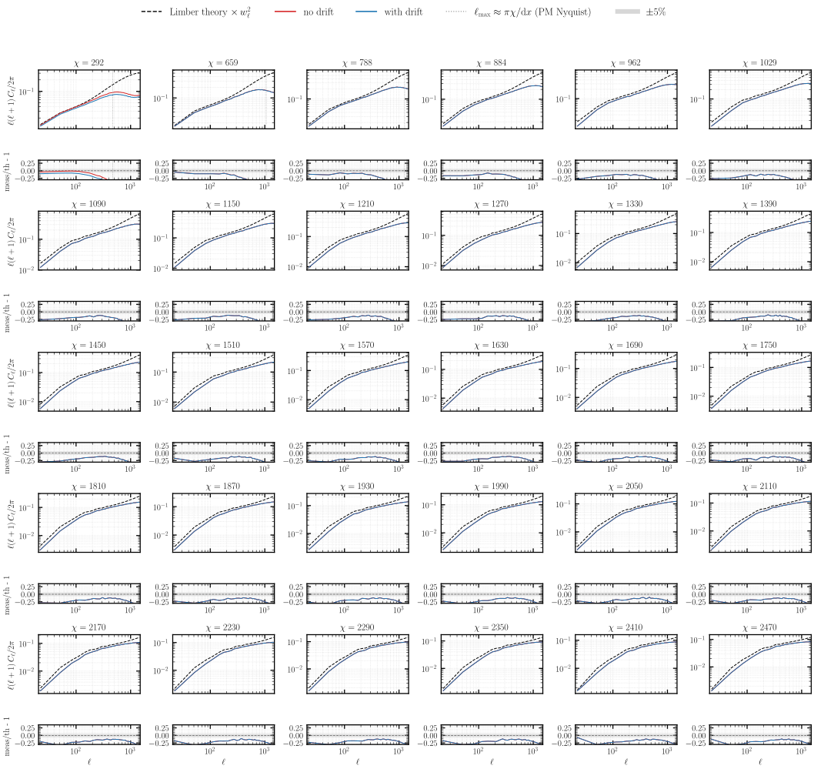
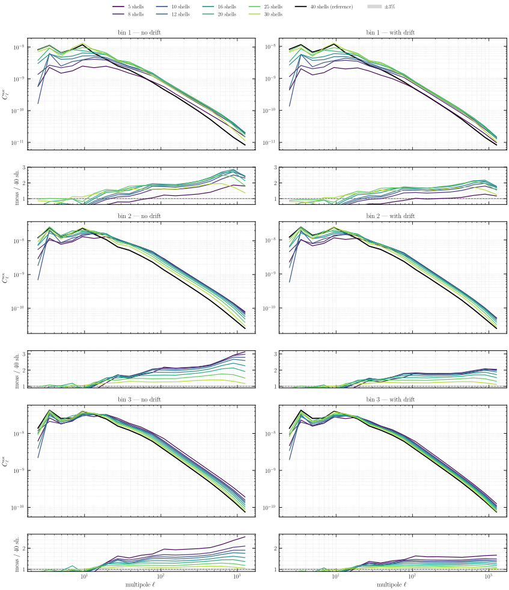
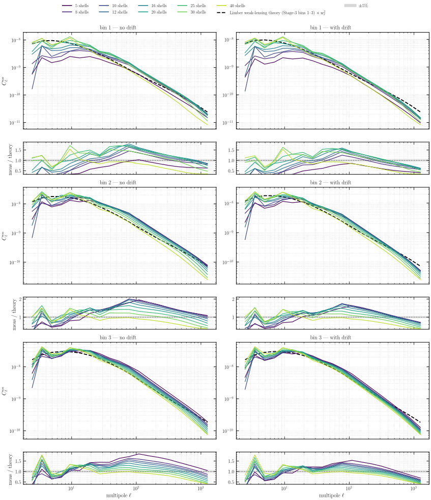
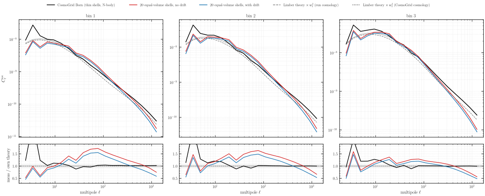

# Experiment 05c — Spacing & stepping: equal-volume shells

**Goal.** Experiment [05a](../05a-spacing-n-stepping-drift/README.md) established the *drift on the lightcone*: moving each particle to the scale factor at which it actually crosses the lightcone removes the frozen-epoch error of a thick shell, so a coarse *drifted* lightcone matches a much finer undrifted one. 05a used **scale-factor** shell spacing, which makes the near-observer shells thin — thin shells hold few particles, so their per-shell `C_ℓ` is shot-noise dominated. This experiment swaps the spacing to **equal volume** (`--shell-spacing equal_vol`): every shell then encloses the same comoving volume, hence the same particle count, so no near shell is starved. The geometric price is that the innermost shell becomes a **fat ball** (here `[0, 1160]` Mpc/h) while the outer shells get thin and are floored to `--min-width 60`. That concentrates the frozen-epoch error into the fat inner shell — precisely where the drift buys the most. The question 05c answers is whether equal-volume spacing *plus* drift gives clean per-region `C_ℓ` across the whole lightcone.

| sweep | values |
|-------|--------|
| `--nb-shells` (no drift) | 5, 8, 10, 12, 16, 20, 25, 30, **40** |
| `--nb-shells` (with drift) | 5, 8, 10, 12, 16, 20, 25, 30, **40** |
| drift | (none), `--drift-on-lightcone` |
| `--shell-spacing` | `equal_vol` (the one change vs 05a) |
| lensing | 3-bin Born (`--nz-shear s3[:3]`) on each density run |

*Fixed across the sweep:* `--sim-mode pm`, **2560³**, box **`5000³` Mpc/h**, BullFrog (`bf`), `--nb-steps 50`, `--time-stepping D`, `--paint-order cic` (no force-window `--deconvolution`), `--scheme ngp`, `--nside 2048`, `--shells-per-file 1`, **`--min-width 60.0`** (the hybrid floor: equal-volume inner shells, ≥60 Mpc/h outer shells), `--seed 0`, **float64**. **128 GPU** (32 nodes × 4, `--pdim 128 1`). Runs are published to the [`ASKabalan/jax-fli-experiments`](https://huggingface.co/datasets/ASKabalan/jax-fli-experiments) dataset under `05-spacing-n-stepping/05c-equal-volume/` (raw per-shell density maps + precomputed per-shell density spectra, plus the 3-bin Born convergence maps and their spectra).

> **Halo (Exp 01 rule).** 2560³ on 128 GPUs (slab) gives local `20³` and an **even** halo `int(20·0.5) = 10`; local `20·2560·2560 = 1.31e8 ≈ 512³` fits float64. The physical ghost zone `0.5·5000/128 = 19.5` Mpc/h clears the end-of-run rms displacement.

## Method

The density figures (fig01–fig02) compare a coarse 10-shell lightcone to a much finer one at matched radial extent; the census (fig03–fig08) and the Born convergence (fig09–fig10) then sweep the full shell-count grid.

**fig01** is a small local illustration (256³ in the real 5 Gpc/h box): one particle cloud, coloured three ways by the redshift each particle is *assigned*. The banding uses the runs' real equal-volume shell edges (reconstructed from the stored `comoving_centers ± density_width/2`).

**fig02** measures per-region density `C_ℓ`. Because equal-volume shells do not nest cleanly (the 40-shell run is floored to 60 Mpc/h and does not tile the un-floored 10-shell run), each column is a **radial region** — a group of consecutive 10-shell shells whose extent lines up with whole 40-shell edges (to within ~30 Mpc/h). The 10-shell measurement and the 40-shell reference are each summed from **whole** shells over that region (in particle counts, so per-pixel volume cancels), then converted to overdensity and transformed with `healpy`. The 40-shell no-drift run is the finest continuous-lightcone reference available (the reference is a no-drift sum by construction).

## Results

### Redshift assignment under equal-volume shells


A thin wedge of the particle cloud, coloured by assigned redshift. **Left (10 shells, no drift):** equal volume makes the innermost shell an enormous ball out to ~1160 Mpc/h — every particle in it is frozen to a single redshift, a huge discontinuity — while the outer shells thin out into narrow bands. **Middle (10 shells, with drift):** the drift replaces the freeze with the smooth true `z(r)`, so the same 10 shells now carry a continuous redshift gradient. **Right (30 shells, no drift):** more shells shrink the fat inner ball and refine the bands, approaching the smooth gradient — but reaching it by brute force needs many shells, whereas the drift already recovers it with only 10.

### Per-region density power spectra



Density `C_ℓ` for the near (fat inner ball), mid, and far regions: the 10-shell no-drift (red) and with-drift (blue) runs against the 40-shell continuous-lightcone reference (black); the lower panels show the ratio to the reference. In the **near** region the no-drift run is biased **+21%** high — the fat inner ball frozen at one epoch — and the drift pulls it back to **+2%**. In the **mid** and **far** regions the 10-shell shells are already thin, so the frozen-epoch error is sub-percent and drift and no-drift both sit on top of the reference. Equal-volume spacing thus localises the entire convergence problem to the inner ball, and the drift-on-lightcone resolves it there with a coarse 10-shell lightcone.

### Per-shell density census against theory

The region view above sums shells together; this census instead compares **every individual shell** of every run to the analytic Limber number-counts prediction (`compute_theory_cl_for_density`, comoving-volume weighted, times the HEALPix pixel window `w_ℓ²`). Each subplot is one shell: a log-log `C_ℓ` panel (no-drift red, with-drift blue, theory dashed) over a measured/theory ratio strip. Because the drift and no-drift runs share the seed and the particles, their Poisson shot noise is the *same* realisation and cancels between them — so the physical signal is the **red↔blue gap**, not the distance from 1. The shared rise of both curves above the theory at high `ℓ` is that shot noise (the theory carries none) and is meaningful only below the marked PM-Nyquist `ℓ_max ≈ πχ/dx`.

The whole story sits in the **fat inner shell**. At 5, 8 and 10 shells the innermost equal-volume shell is a ball spanning out past ~1000 Mpc/h, and its no-drift `C_ℓ` runs ~20-25% above theory — frozen at a single epoch across a huge radial span — while the drifted shell lands on the theory. Every thinner outer shell already tracks theory with or without the drift, so red and blue coincide there. As the shell count grows the inner ball shrinks and the gap closes: by 40 shells drift and no-drift agree on every shell and both follow theory down to the resolution cutoff, where the finite mesh suppresses the small-scale power common to all runs.












### Born convergence: equal-volume shells break the lensing quadrature

The density census above shows the drift is decisive *per shell* — it drags the fat inner ball's `C_ℓ` from +20% back onto theory. The lensing story is very different: the Born convergence built from these same shells is **catastrophically biased at coarse-to-moderate shell counts (up to ~1.7× the Limber theory, ~2–3× the 40-shell run), even though every individual shell's density `C_ℓ` is fine**. Each density run is Born-integrated against the three lowest-`z` Stage-3 source bins (`--nz-shear s3[:3]`) into per-bin convergence `C_ℓ`; fig09/fig10 stack the three source bins as row-pairs with no-drift and with-drift in the two columns (per-bin ratio windows), fig11 compares against an external Born reference, and fig12 pins down the cause.



Against the 40-shell run, the low-`z` bins sit far above the reference — up to ~2–3× at small scales — with a **non-monotonic** shell-count trend, and the with-drift column lies visibly below the no-drift one (the drift removes the fat shells' frozen-epoch error, worth ~20% in bin 1 at fixed shell count, but the large excess survives). The excess is *not* a radial-coverage artifact — every run tiles exactly the same `[0, 2500]` Mpc/h with no gaps or overlaps — and it is *not* a bug in the Born code, as fig11/fig12 show: it is the shell-discretization error of the lensing integral itself, whose non-monotonic `N`-dependence fig12's prediction reproduces.



Ratioed to the Limber theory, the `N`=8–30 runs bulge to ~1.4–1.7 over `ℓ≈30–300` in bins 1–2 before the common small-scale resolution roll-off, while the 40-shell run lands on the same clean roll-off as the scale-factor [05b](../05b-spacing-n-stepping-3bin/README.md) runs (`≈0.74–0.88` median over `ℓ∈[50,300]` — the PM-resolution transfer, identical across the two experiments). The drift lowers the bulge toward theory (compare the columns) without curing it.



The external check: the **same `born()` code** run on CosmoGrid's thin (~70–100 Mpc/h) shells — a full N-body at nside 2048, and a *different cosmology* (σ₈ = 0.90, h = 0.73), so each measurement is ratioed to the Limber theory at its **own** cosmology. The CosmoGrid convergence hugs its theory at the few-percent level across `ℓ = 10–1500`; the 20 equal-volume shells, through the identical code, bulge to ~1.4–1.6. Same integrator, different shelling — the shelling is the problem.


**The mechanism.** `born()` computes `κ = Σᵢ Kᵢ δ̄ᵢ`: one midpoint kernel weight `Kᵢ = (3/2) Ωm (H₀/c)² Δχᵢ (χᵢ/aᵢ) ⟨1 − χᵢ/χₛ⟩ₙ₍ᵤ₎` times the **volume-averaged** map of each shell. That is a quadrature of the lensing integral which is only accurate when the kernel is nearly constant across each shell. Two verifications: (i) on the published data, `Σᵢ Kᵢ² C_ℓ^{ii,meas}` rebuilt from the per-shell density spectra matches the published κ spectra to ≤ 4% at `ℓ ≥ 50` — `born()` is exactly the weighted sum it claims to be; (ii) feeding that same sum the *analytic* per-shell Limber theory (`compute_theory_cl_for_density`, exact edges) and dividing by the exact continuous lensing theory gives the pure quadrature error with no simulation input: for the equal-volume geometry it reaches **1.4–1.7 at `N` = 8–30** in the low-`z` bins (dropping to ~1.02–1.05 only at `N` = 40, and staying ≤ 2% for 05b's scale-factor geometry at `N` = 20). fig12 overlays the measured (drifted) `κ_N/κ_40` with this prediction: the dashed pure-theory curves reproduce the measured excess and its shape (bin 3 exactly; bins 1–2 up to `ℓ ≈ 300`, beyond which the measurement rises further because the fat shells' volume-weighted power lives at their outer radii — larger transverse scales that evade the PM-resolution suppression the 40-shell reference suffers at the same `ℓ`). The error is worst precisely here because the χ²-volume weighting of a fat shell concentrates its angular power at the shell's outer edge while the single kernel weight averages over the whole shell — and the lensing kernel varies enormously (even crossing the source plane, at `N` = 5) across equal-volume's fat inner shells. The information needed to fix this — the radial profile of δ *inside* each shell — is destroyed at painting time, so no post-hoc reweighting in `born()` can repair it.

**Practical conclusion.** Equal-volume spacing is excellent for per-shell density statistics (census above, especially with the drift) but is the *worst possible* allocation for Born lensing at coarse `N`: it puts the fattest shells exactly where the low-`z` lensing kernel varies fastest. For lensing, shells must be thin relative to the kernel variation — scale-factor spacing at `N` ≳ 16 or equal-volume only at `N` ≳ 40 (where its inner shell has shrunk to ~160 Mpc/h) keep the quadrature error at the few-percent level.

### Can the existing shells still be used for lensing? Shell-inferred Born weights

Since the shells themselves are fine, the only post-paint lever is the **lens-side per-shell weight** (the Simpson quadrature over the source `n(z)` is *not* the problem and is kept identical). Any reweighted Born is `κ = Σᵢ K̃ᵢ δ̄ᵢ` with an effective radial kernel `K̃ᵢ·χ²/Vᵢ` per shell — a piecewise-χ² shape whose amplitude is the only freedom — so a full cure is impossible, but the amplitude can be chosen far better than the midpoint. Three parameter-free candidates, each computed from the shell's own edges + cosmology + `n(z)` with the source-efficiency clip **inside** the shell integral, were screened against the pure-Limber quadrature and then validated on the real drifted 10-shell maps ([`born_quadrature_fix.py`](born_quadrature_fix.py); the midpoint variant rebuilt from the raw shells reproduces the published spectra to **10⁻⁴** — the harness *is* `born()`):

- **integrated kernel** `K̃ᵢ = ∫_shell W(χ)dχ` — the winner (below);
- χ²-projection `Vᵢ∫Wχ²/∫χ⁴` — the map-MSE optimum, which is a *shrinkage* estimator: it collapses the C_ℓ to the usable signal fraction (0.1–0.7× here), instructive but not what a spectrum needs;
- variance-matching `√(Vᵢ∫W²/χ²)` — exact for P constant across the shell, but poisoned by the behind-source part of the fat shell, where the kernel vanishes yet the χ²-weighted map power lives (it lands at 1.5–3.3× theory).


The winner is implemented as a **drop-in modified `born()`** (`born_exact` in the script — identical pipeline to `jax_fli.lensing.born`, with the single change that the midpoint factor `Δχ·χᵢ/aᵢ·clip(1−χᵢ/χₛ)` becomes the exact per-shell integral `∫_shell dχ (χ/a)·clip(1−χ/χₛ)`), run end-to-end on the drifted 10-shell lightcone. **Top row:** against theory, all runs share the PM-resolution roll-off — the 40-shell black curve *is* the ceiling any 2560³ run can reach — and the modified born (blue) sits on it for bins 2–3 while the midpoint born (red) bulges far above. **Bottom row**, the metric the fix targets — the 10-shell run over the 40-shell run (median `ℓ∈[50,300]` | `[300,800]`): bin 2 goes from **1.77|1.91 (midpoint) to 1.02|1.09**, bin 3 from 1.38|1.41 to 1.10|1.13, i.e. the coarse equal-volume run now reproduces the fine one to ~2–13%. **Bin 1 cannot be rescued**: its sources (`χₛ ≈ 856` Mpc/h) sit *inside* the `[0, 1160]` fat ball, so the midpoint overshoots (1.53|1.82) while the exact kernel undershoots (0.79|0.94) — a shell cannot lens sources it contains, and that radial information was destroyed at painting time. The practical rule: with the exact per-shell kernel, equal-volume shells are usable for Born lensing for every source bin whose lensing kernel lies *in front of* the fat inner shell; for lower bins (or fewer shells) the geometry must change at paint time. Upstream, this suggests replacing `born()`'s midpoint weight with the per-shell kernel integral — a strict improvement for thick shells and a numerical no-op for thin ones (05b and CosmoGrid are unchanged at their ≲1% level).

## How to run

```bash
MODE=dryrun bash run.sh   # print the resolved commands (submit nothing)
bash run.sh               # submit the density sweep to SLURM
```

The density sweep writes one directory of per-shell parquet (`shell_NNNN.parquet`) per (drift, shell-count) to `results/exp5c/`; once pushed to HuggingFace, the figure script renders the SVGs locally without a GPU:

```bash
JAX_PLATFORMS=cpu uv run --no-sync python build.py
```

fig13 (the shell-inferred Born-weight study) is rendered by the standalone sibling script, which re-runs the Born sums on the raw drifted 10-shell maps (CPU, ~15 GB RAM, ~10–20 min of `healpy` transforms):

```bash
JAX_PLATFORMS=cpu uv run --no-sync python born_quadrature_fix.py
```
