# Experiment 05c — Spacing & stepping: equal-volume shells

**Goal.** Experiment [05a](../05a-spacing-n-stepping-drift/README.md) showed that the *drift on the lightcone* removes the frozen-epoch error of thick shells spaced uniformly in scale factor. That spacing makes the near shells thin, and a thin shell holds few particles, so its `C_ℓ` is dominated by shot noise. Here we space the shells by **equal volume** (`--shell-spacing equal_vol`), so that every shell holds the same number of particles. The innermost shell then becomes a ball (`[0, 1160]` Mpc/h at 10 shells), and the outer shells are floored at `--min-width 60`. We test whether equal-volume spacing with the drift gives clean per-region density `C_ℓ` across the whole lightcone, and how the spacing interacts with the radial quadrature of the Born integral.

| sweep | values |
|-------|--------|
| `--nb-shells` (no drift) | 5, 8, 10, 12, 16, 20, 25, 30, **40** |
| `--nb-shells` (with drift) | 5, 8, 10, 12, 16, 20, 25, 30, **40** |
| drift | (none), `--drift-on-lightcone` |
| `--shell-spacing` | `equal_vol` (the one change from 05a) |
| lensing | 3-bin Born (`--nz-shear s3[:3]`) on each density run, under three shell quadratures (`--quadrature`): midpoint, composite Simpson, Gauss–Legendre |

*Fixed:* `--sim-mode pm`, **2560³**, box **5000³ Mpc/h**, BullFrog (`bf`), `--nb-steps 50`, `--time-stepping D`, `--paint-order cic` without force-window deconvolution, `--scheme ngp`, `--nside 2048`, `--shells-per-file 1`, **`--min-width 60.0`**, `--seed 0`, **float64**, **128 GPUs** (32 nodes × 4, `--pdim 128 1`). The slab gives a local mesh of `20·2560·2560 = 1.31e8 ≈ 512³` cells, which fits in float64, with an even halo of `int(20·0.5) = 10` cells, and the 19.5 Mpc/h ghost zone clears the end-of-run rms displacement. The density maps, their spectra and the Born maps under each quadrature are published under [`05-spacing-n-stepping/05c-equal-volume/`](https://huggingface.co/datasets/ASKabalan/jax-fli-experiments/tree/main/05-spacing-n-stepping/05c-equal-volume).

## Method

Equal-volume shells do not nest: the 40-shell run is floored at 60 Mpc/h and does not tile the 10-shell one. fig02 therefore groups consecutive 10-shell shells into radial regions whose edges match whole 40-shell edges to within ~30 Mpc/h. It sums the whole shells of both runs over each region in particle counts, converts the sum to overdensity and transforms it with `healpy`, with the 40-shell run without the drift as the reference. The census (fig03–fig08) compares every shell of every run with the Limber number-count prediction (`compute_theory_cl_for_density`, times the pixel window `w_ℓ²`). Each density run is then Born-integrated into three source bins under the three quadratures.

## Results

### Redshift assignment under equal-volume shells


**Redshift assignment under equal-volume shells (fig01).** A thin wedge of a 256³ particle cloud in the 5 Gpc/h box, coloured by the redshift assigned to each particle, with the shell edges of the runs (`comoving_centers ± density_width/2`). Left, 10 shells without the drift: the inner shell is a ball out to ~1160 Mpc/h, frozen at a single redshift, and the outer shells thin into narrow bands. Middle, 10 shells with the drift: the same shells carry the continuous `z(r)`. Right, 30 shells without the drift: the bands approach the continuous gradient that the drift reaches with 10 shells.

### Per-region density power spectra

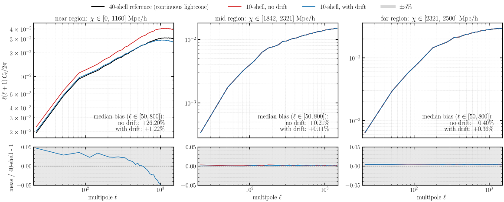

**Per-region density power spectra (fig02).** The 10-shell runs without (red) and with (blue) the drift against the 40-shell reference (black), for the near region (the inner ball), the mid region and the far region, with the ratio to the reference below. The near region sits **+21%** above the reference without the drift and **+2%** with it. In the mid and far regions the 10-shell shells are already thin, and both runs lie within a percent of the reference. Equal-volume spacing confines the density error to the inner ball, where the drift removes it with a 10-shell lightcone.

### Per-shell density census against theory

Each panel of the census is one shell: `C_ℓ` without (red) and with (blue) the drift against the Limber prediction (dashed), over the ratio to theory. The two runs share the seed and the particles, so their shot noise cancels and the red–blue gap isolates the drift. The shared rise above theory at high `ℓ` is shot noise, meaningful only below the marked PM-Nyquist `ℓ_max ≈ πχ/dx`. At 5, 8 and 10 shells the inner ball reaches past ~1000 Mpc/h, and its `C_ℓ` without the drift sits 20–25% above theory while the drifted shell follows theory. Every thinner outer shell follows theory with or without the drift. The gap closes as the inner ball shrinks, and at 40 shells both runs follow theory on every shell down to the resolution cutoff of the mesh.

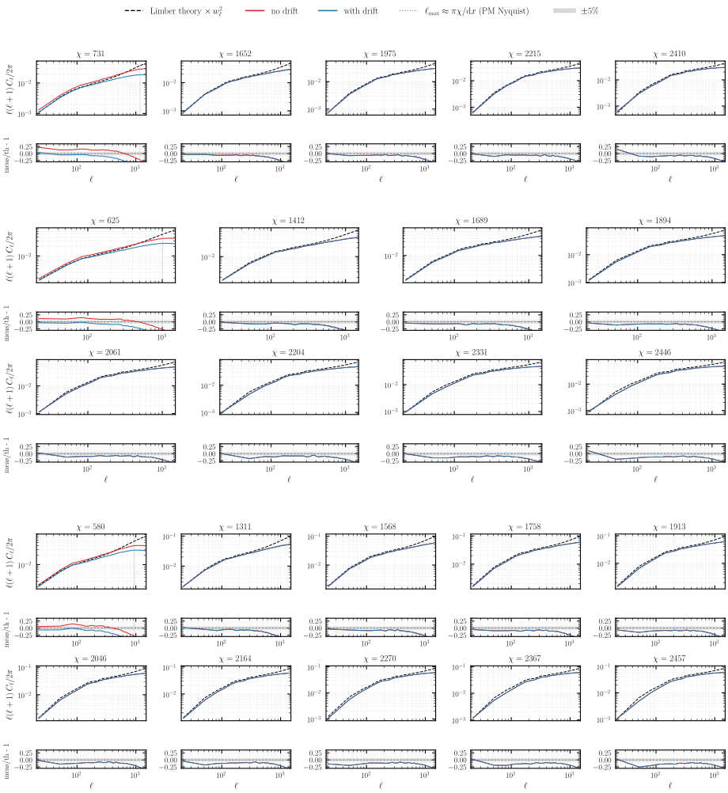

**Per-shell density census — 5 / 8 / 10 shells (fig03).**

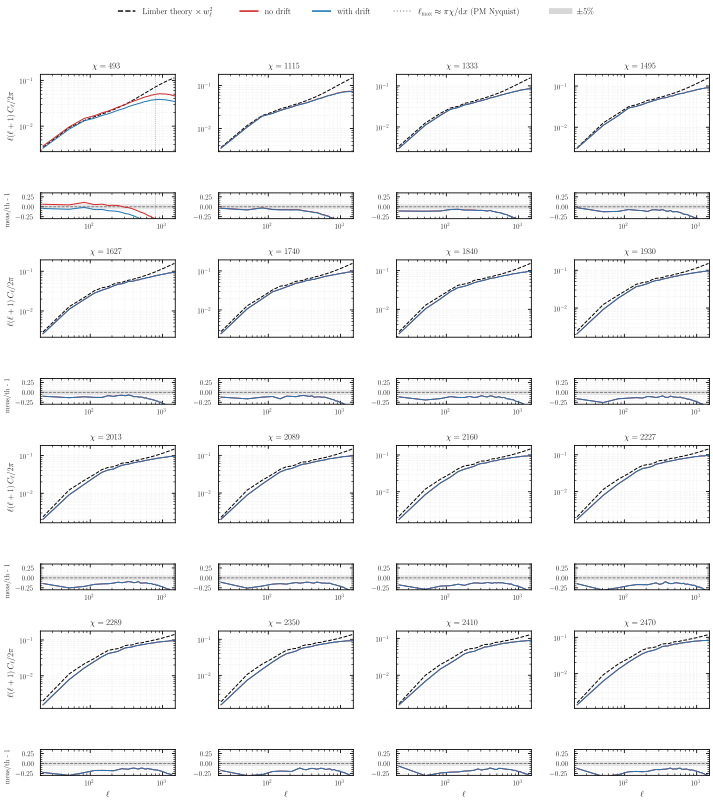

**Per-shell density census — 16 shells (fig04).**

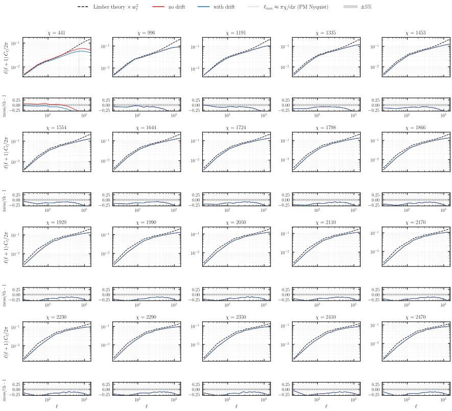

**Per-shell density census — 20 shells (fig05).**

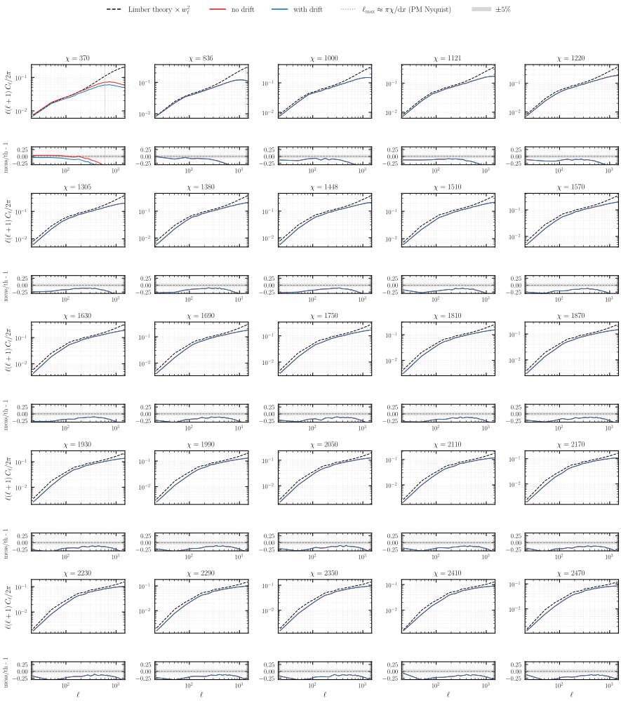

**Per-shell density census — 25 shells (fig06).**

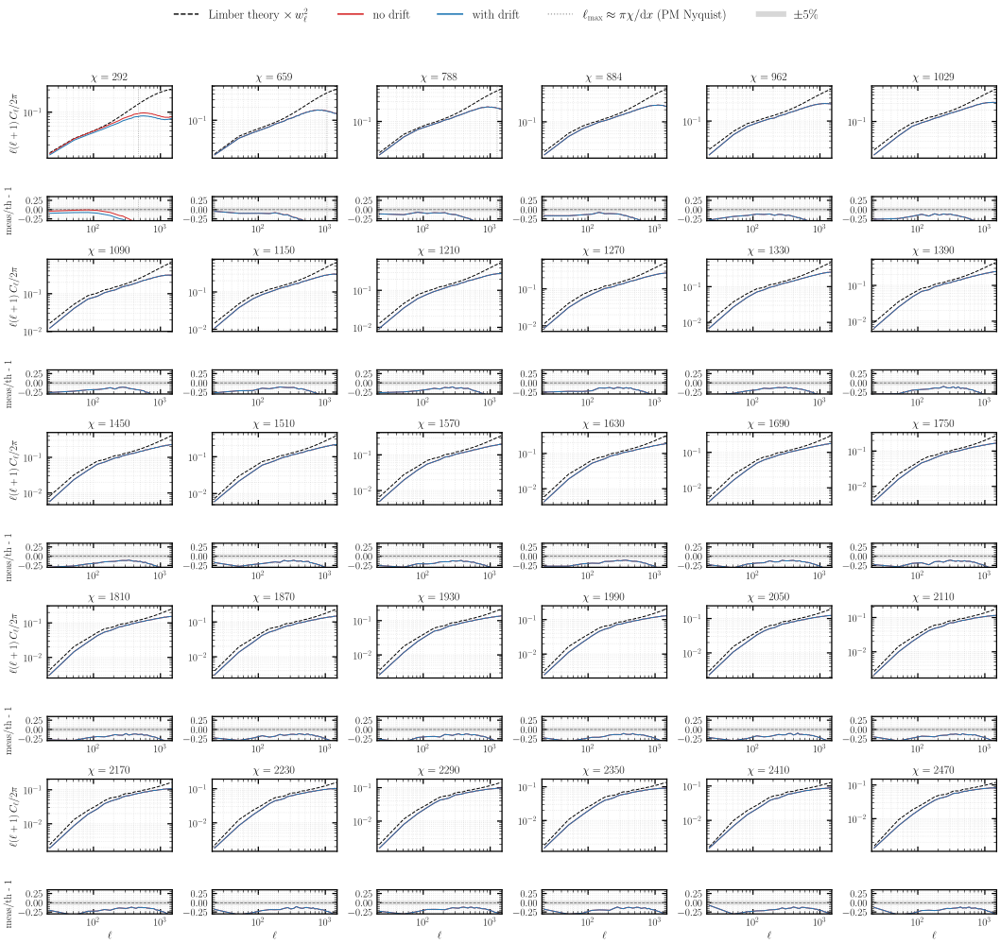

**Per-shell density census — 30 shells (fig07).**


**Per-shell density census — 40 shells (fig08).**

### Born convergence and the shell quadrature

`born()` computes `κ = Σᵢ Kᵢ δ̄ᵢ`, one weight `Kᵢ` per shell times the volume-averaged map of that shell. `Kᵢ` integrates the lensing kernel `w(χ) = χ (1+z)(1 − χ/χₛ)` over the shell. The legacy midpoint rule samples the kernel at the shell centre (`Kᵢ ∝ Δχᵢ · χᵢ/aᵢ · ⟨1 − χᵢ/χₛ⟩`), which is exact only when the kernel varies little across the shell. The fat inner ball of equal-volume spacing stresses it most, above all for the low-`z` bins whose kernel turns over inside the ball, so we compare the midpoint rule with composite Simpson and Gauss–Legendre.

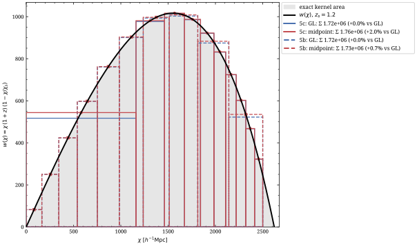

**Born shell windows (fig09).** The exact kernel `w(χ)` for a source at `z_s = 1.2` (black, area shaded), with each shell of the two 10-shell geometries drawn as a box whose area is its Born weight: equal volume (05c, solid) and scale factor ([05b](../05b-spacing-n-stepping-3bin/README.md), dashed), under Gauss–Legendre (blue) and midpoint (red). Composite Simpson matches Gauss–Legendre to `< 10⁻⁶` and is not drawn. The Gauss–Legendre boxes tile the shaded kernel, and the midpoint boxes sit flat at the centre value. For this distant source the midpoint overshoots the inner ball `[0, 1160]` Mpc/h by **+2.0%**, and the thin near shells of the scale-factor geometry by **+0.7%**. The overshoot grows to 2–3× for the low-`z` bins of fig10, whose sources sit close to or inside the fat shell.

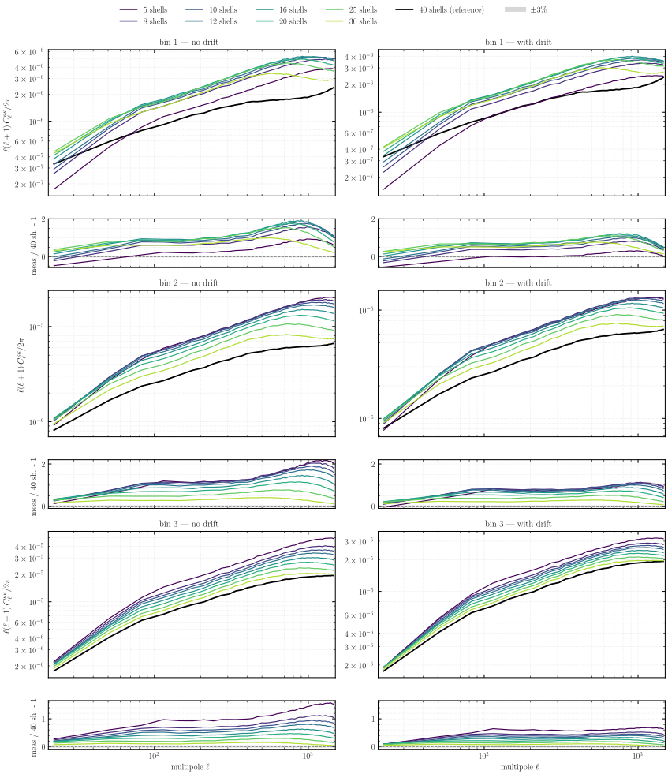

**Midpoint quadrature against the 40-shell run (fig10).** Without the drift (left) and with it (right). At small scales the low-`z` bins climb to ~2–3× the 40-shell reference, with a trend in `N` that is not monotonic, and the column without the drift sits above the column with it. Bin 3, whose kernel peaks far from the inner shell, is the mildest. The drift removes the frozen-epoch error of the fat shells, and the quadrature overshoot remains.

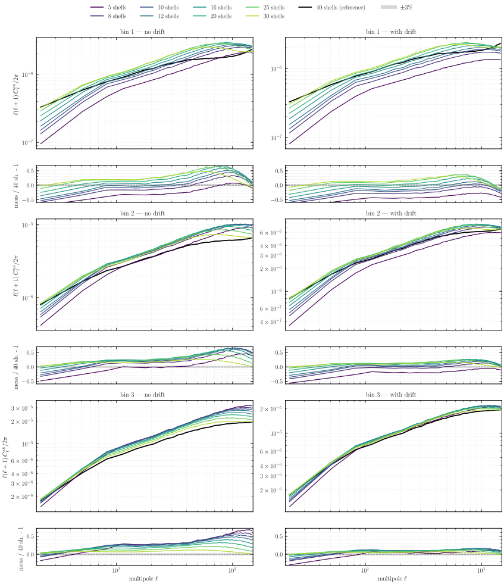

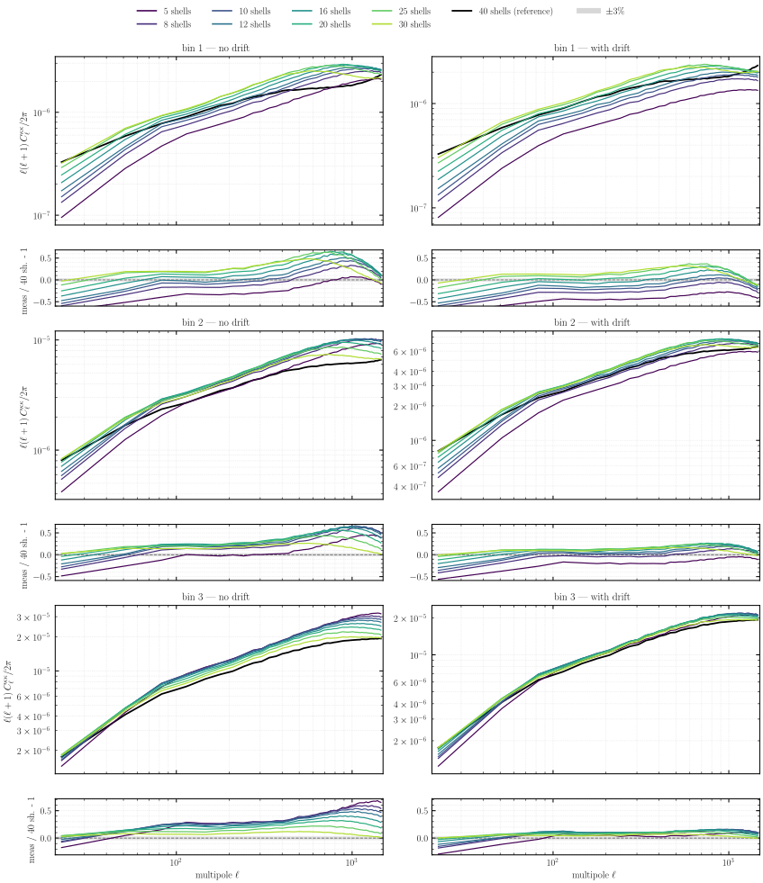

**Simpson and Gauss–Legendre against the 40-shell run (fig11, fig12).** Integrating the kernel across each shell removes the overshoot. The two schemes agree, since composite Simpson with 16 intervals is exact for this kernel, and we take Gauss–Legendre as the reference. The coarse runs now bracket the 40-shell run: they fall below it at large scales, where a coarse lightcone loses radial resolution, and converge monotonically as `N` grows. With the drift (right) every bin lies within a few percent of the 40-shell run. Without it the coarsest runs keep a ~1.5× excess at the smallest scales.

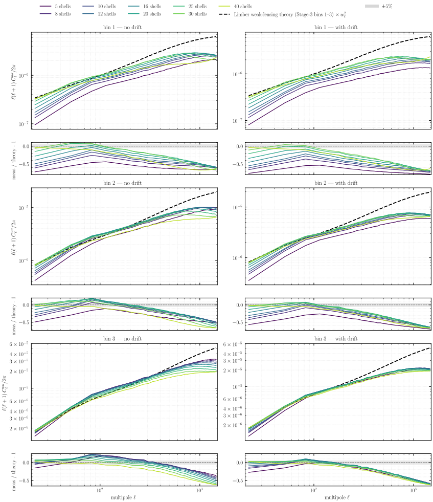

**Gauss–Legendre convergence against Limber theory (fig13).** By `N ≈ 25–30` all three bins lie within a few percent of theory over `ℓ ≈ 30–150`; at `N = 30` bin 1 is on theory there and bins 2–3 a percent or two above. They then roll off at small scales on the PM-resolution transfer of the 2560³ mesh, close to the roll-off of the scale-factor runs of 05b. The columns with and without the drift agree. Bin 1 rolls off fastest, with a median `C_ℓ/theory ≈ 0.74` over `ℓ ∈ [250, 300]` against `≈ 0.88` for bin 3, because its sources (`χₛ ≈ 856` Mpc/h) sit inside the `[0, 1160]` Mpc/h ball. The map of that shell is a single volume average, so no shell weight can express that the near half of the ball lenses these sources and the far half does not. Only a change of shelling removes this limit.

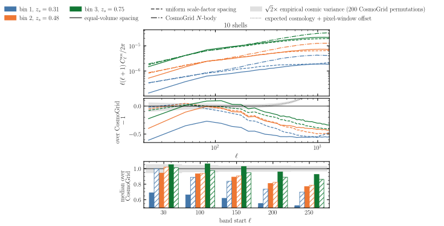

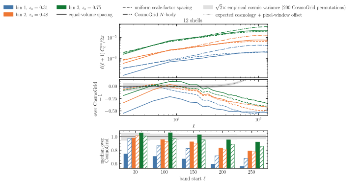

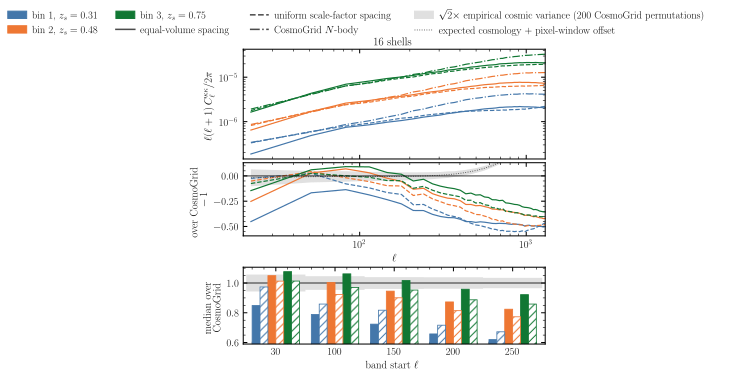


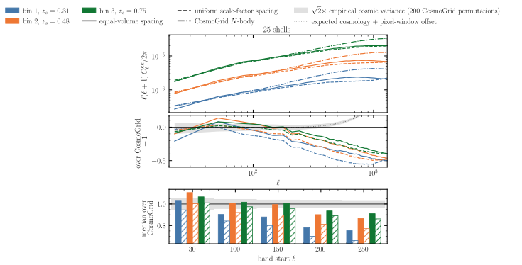

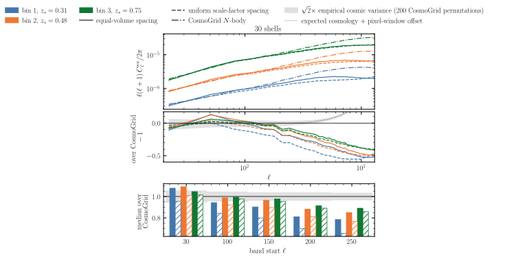

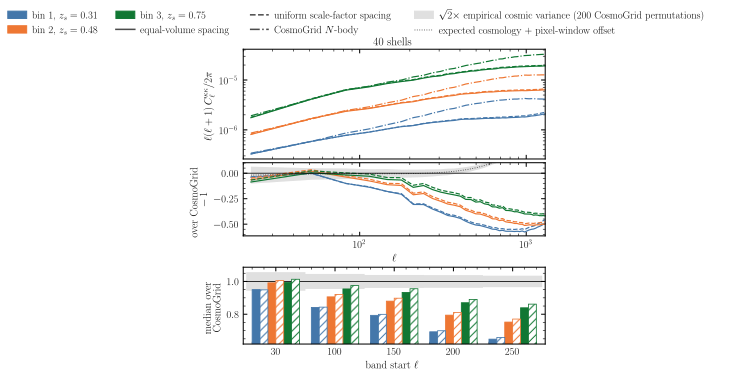

**Equal-volume against scale-factor spacing, `N` = 10 to 40 (fig14–fig20).** Gauss–Legendre with the drift, three source bins. The top panel shows `D_ℓ ≡ ℓ(ℓ+1) C_ℓ / 2π` for equal volume (solid), scale factor ([05b](../05b-spacing-n-stepping-3bin/README.md), dashed) and the CosmoGrid Stage-3 forecast at `cosmo_172798` (dash-dotted), the grid point closest to the run cosmology. The middle panel shows `C_ℓ / CosmoGrid − 1` against an acceptance band: the expected cosmology and nside-512 pixel-window offset (`th_run/th_172798 − 1`, thin dotted, ≤ 2.5% in the window) ± `√2` times the empirical CV of the 200 fiducial CosmoGrid permutations (worst bin), since the run and the reference are independent single realisations. The bottom panel gives the median bandpower ratio in `ℓ` ∈ [30,100), [100,150), [150,200), [200,250), [250,300), solid for equal volume and hatched for scale factor, in bandpowers of `nlb` = 32 multipoles.

Both spacings sit on the reference around `ℓ ≈ 50–100` and roll off together below it and at small scales, on the shared PM-resolution transfer. The gap between them is largest at `N = 12`, where the fat inner shell and the floored outer shells place the projected power differently from the scale-factor shells, and it narrows through `N` = 20, 25 and 30 until the two overlay at `N = 40`. Bin 1 sits lowest throughout, its sources inside the inner ball. 05b ran only with the midpoint quadrature, but for its thin shells midpoint and Gauss–Legendre agree to **< 0.2%** on the total per-bin weight, so its spectra stand in for Gauss–Legendre. With the exact quadrature the two spacings differ modestly and converge with the shell count, against the 2–3× excess of the midpoint runs in fig10: the large lensing error came from the quadrature and not from the spacing.

### Which spacing and shell count converge best?

We take the median `C_ℓ / theory` per source bin in five multipole bands, for both spacings under Gauss–Legendre with the drift. Equal volume at **`N ≈ 25–30` is the closest to theory in every band**: `N = 30` wins below `ℓ ≈ 100`, within 1–3% of theory on all bins, and `N = 25` from `ℓ ≈ 150`. Equal volume varies with `N` in a way that is not monotonic. `N` = 10–12 is too coarse to fill the fat ball and `N = 40` is over-resolved, and both ends fall to the level of the scale-factor runs. Scale-factor spacing is nearly flat in `N` and at its best by `N ≈ 10–12`, and equal volume beats it in every band except the highest, where the shared PM-resolution roll-off dominates. For both spacings the bin-averaged deviation from theory rises from ~0.05 at `ℓ ∈ [30, 100]` to ~0.25 at `ℓ ∈ [250, 300]`, set by the 2560³ mesh.

<details>
<summary>Median <code>C_ℓ / theory</code> per band (bold: the equal-volume row closest to theory)</summary>

**ℓ ∈ [30, 100]**

| N | equal-volume (bin1/2/3) | uniform-a (bin1/2/3) |
|---|---|---|
| 10 | 0.667 / 0.907 / 1.029 | 0.939 / 0.973 / 0.980 |
| 12 | 0.705 / 0.943 / 1.037 | 0.918 / 0.949 / 0.980 |
| 16 | 0.809 / 1.013 / 1.068 | 0.903 / 0.940 / 0.981 |
| 20 | 0.881 / 1.024 / 1.040 | 0.894 / 0.931 / 0.977 |
| 25 | 0.967 / 1.054 / 1.041 | 0.887 / 0.936 / 0.968 |
| **30** | **0.996 / 1.014 / 1.028** | 0.897 / 0.934 / 0.973 |
| 40 | 0.879 / 0.920 / 0.958 | 0.883 / 0.935 / 0.974 |

**ℓ ∈ [100, 150]**

| N | equal-volume (bin1/2/3) | uniform-a (bin1/2/3) |
|---|---|---|
| 10 | 0.639 / 0.902 / 1.025 | 0.831 / 0.889 / 0.945 |
| 12 | 0.681 / 0.934 / 1.036 | 0.831 / 0.876 / 0.936 |
| 16 | 0.757 / 0.955 / 1.021 | 0.821 / 0.878 / 0.932 |
| 20 | 0.799 / 0.966 / 1.001 | 0.800 / 0.876 / 0.935 |
| 25 | 0.865 / 0.961 / 0.985 | 0.796 / 0.877 / 0.937 |
| **30** | **0.908 / 0.949 / 0.957** | 0.799 / 0.871 / 0.943 |
| 40 | 0.797 / 0.863 / 0.916 | 0.798 / 0.875 / 0.939 |

**ℓ ∈ [150, 200]**

| N | equal-volume (bin1/2/3) | uniform-a (bin1/2/3) |
|---|---|---|
| 10 | 0.572 / 0.831 / 0.961 | 0.784 / 0.848 / 0.893 |
| 12 | 0.619 / 0.854 / 0.964 | 0.758 / 0.849 / 0.895 |
| 16 | 0.669 / 0.877 / 0.945 | 0.769 / 0.844 / 0.897 |
| 20 | 0.741 / 0.903 / 0.952 | 0.753 / 0.840 / 0.887 |
| **25** | **0.813 / 0.920 / 0.945** | 0.743 / 0.833 / 0.893 |
| 30 | 0.826 / 0.900 / 0.917 | 0.739 / 0.838 / 0.889 |
| 40 | 0.732 / 0.823 / 0.868 | 0.743 / 0.839 / 0.894 |

**ℓ ∈ [200, 250]**

| N | equal-volume (bin1/2/3) | uniform-a (bin1/2/3) |
|---|---|---|
| 10 | 0.535 / 0.788 / 0.942 | 0.709 / 0.797 / 0.865 |
| 12 | 0.572 / 0.814 / 0.938 | 0.690 / 0.789 / 0.861 |
| 16 | 0.634 / 0.854 / 0.941 | 0.690 / 0.789 / 0.867 |
| 20 | 0.705 / 0.882 / 0.944 | 0.682 / 0.785 / 0.869 |
| **25** | **0.757 / 0.880 / 0.908** | 0.680 / 0.787 / 0.866 |
| 30 | 0.782 / 0.856 / 0.895 | 0.681 / 0.788 / 0.869 |
| 40 | 0.668 / 0.770 / 0.847 | 0.676 / 0.785 / 0.868 |

**ℓ ∈ [250, 300]**

| N | equal-volume (bin1/2/3) | uniform-a (bin1/2/3) |
|---|---|---|
| 10 | 0.500 / 0.740 / 0.900 | 0.657 / 0.754 / 0.853 |
| 12 | 0.529 / 0.757 / 0.899 | 0.643 / 0.755 / 0.848 |
| 16 | 0.590 / 0.791 / 0.900 | 0.641 / 0.757 / 0.851 |
| 20 | 0.651 / 0.826 / 0.911 | 0.628 / 0.747 / 0.850 |
| **25** | **0.717 / 0.841 / 0.895** | 0.628 / 0.753 / 0.854 |
| 30 | 0.743 / 0.821 / 0.880 | 0.628 / 0.746 / 0.856 |
| 40 | 0.617 / 0.731 / 0.829 | 0.627 / 0.749 / 0.855 |

</details>

## Conclusion

Equal-volume spacing gives clean per-shell density statistics, above all with the drift. With the exact per-shell quadrature it also serves Born lensing for every source bin whose kernel lies in front of the inner ball. The midpoint weight biases thick shells and leaves thin ones unchanged (< 0.2% for 05b), so `born()` now integrates the kernel across each shell by default (`--quadrature simpson` / `gauss_legendre`). For the lowest source bin, whose sources sit inside the inner ball, and for small shell counts, the geometry must change at paint time.

## How to run

```bash
MODE=dryrun bash run.sh   # print the resolved commands (submit nothing)
bash run.sh               # submit the density sweep to SLURM
```

The sweep writes one directory of `shell_NNNN.parquet` per drift and shell count to `results/exp5c/`, then Born-integrates each density run into 3-bin convergence maps under each quadrature (`fli-born-rt --quadrature {midpoint,simpson,gauss_legendre}`). Once the maps are on HuggingFace, the figures render locally without a GPU:

```bash
JAX_PLATFORMS=cpu uv run --no-sync python build.py
```
