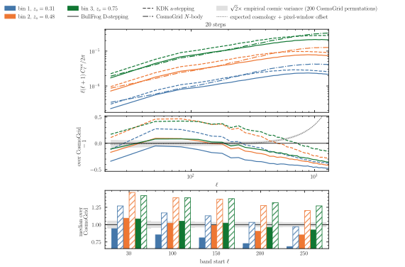
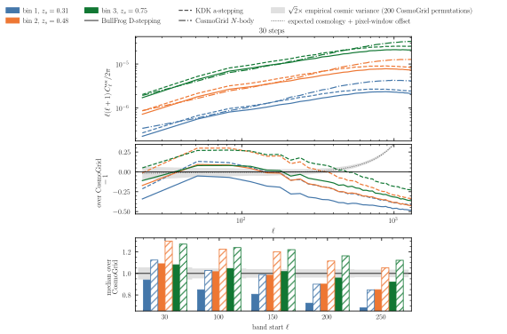
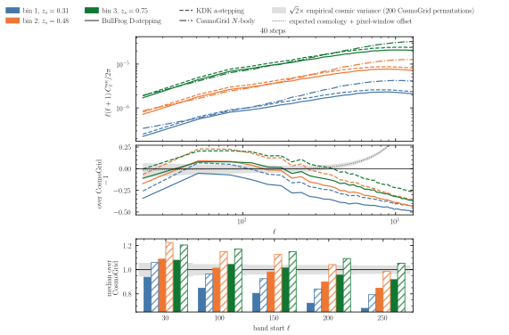

# Experiment 05d — Step & stepping convergence at the production geometry

**Goal.** Experiment [04](../04-step-convergence/README.md) fixed the step budget at 20–30 steps on the accuracy box (2048³, 2 Gpc/h, 10 scale-factor shells), judged on the per-shell density `C_ℓ`. The production lightcone differs on every one of these axes: a **5 Gpc/h box at 2560³**, **20 equal-volume shells** with the **drift on the lightcone**, judged on the **tomographic Born convergence** of the three lowest-`z` Stage-3 source bins. We repeat the step sweep there, `--nb-steps ∈ {20, 30, 40, 50}`, in two arms that `run.sh` runs as `bf D` (BullFrog in the growth factor `D`, the production choice, runs `bfbf_*`) and `kdk a` (kick–drift–kick in the scale factor `a`, runs `bfkdk_*`), and measure how the 3-bin Born κ `C_ℓ` approaches the 50-step anchor. The 50-step `D` point is the 05c run `exp5c_drift_20`, whose Gauss–Legendre Born spectra are already published; it anchors this experiment and the mesh ladder of [05e](../05e-spacing-n-stepping-mesh/README.md).

| sweep | values |
|-------|--------|
| `--nb-steps` | 20, 30, 40, 50 |
| stepping | `bf` with `--time-stepping D`, `kdk` with `--time-stepping a` |

*Fixed:* `--sim-mode pm`, **2560³**, box **`5000³` Mpc/h**, **equal-volume** shells (`--shell-spacing equal_vol`, `--min-width 60.0`), **20 shells**, `--drift-on-lightcone`, `--paint-order cic` without force-window `--deconvolution`, `--scheme ngp`, `--nside 2048`, `--shells-per-file 1`, `--halo-multiplier 0.5`, `--seed 0`, **float64**, **128 GPUs** (32 nodes × 4, `--pdim 128 1`), with the 19.5 Mpc/h ghost zone (`0.5·5000/128`) of the 05c anchor and a local `20·2560·2560 ≈ 512³` cells that fits in float64. Born: 3-bin `--nz-shear s3[:3]`, `--quadrature gauss_legendre` (the midpoint weight fails on the fat inner shell of equal volume, 05c), `--normalization global`. The density maps, the Born maps and their spectra are published under [`05-spacing-n-stepping/05d-steps/`](https://huggingface.co/datasets/ASKabalan/jax-fli-experiments/tree/main/05-spacing-n-stepping/05d-steps).

The ladder starts at 20 because `--nb-steps` must reach `--nb-shells` (the Exp 04 finding): the integrator visits each shell snapshot with at least one clipped step, so runs with fewer steps than shells fail, and the requested 5, 6 and 10-step runs were dropped. Every run fits a **40-minute** SLURM limit, since the same 2560³/50-step configuration in 05c takes ≈ 49 s per simulation iteration plus ≈ 1 min of JIT on 128 GPUs.

## Method

Every run shares the seed, mesh, box and cosmology of the 05c anchor, so the IC white noise is **identical across step counts**, and the per-multipole ratio of the Born `C_ℓ` of each run to the 50-step anchor is phase-matched and free of cosmic variance at fixed `ℓ`. The step count at which these ratios settle is the convergence point. The pair of steppings re-tests the null result of Exp 04, where the two steppings were indistinguishable at 2048³ with 10 shells, at 2560³ with 20 equal-volume shells, where the placement of the steps relative to the shell targets differs between the two time variables. 05c showed that the drift removes the frozen-epoch error of the fat inner shell, so the sweep runs the drift arm only. The endpoint is the Gauss–Legendre Born `C_ℓ` per source bin, the quantity of the CosmoGrid comparison of the production analysis, to which a saving in the step budget transfers directly.

## Results








**Born convergence per step count against CosmoGrid (fig01–fig04).** One figure per step count (20 / 30 / 40 / 50), the three Stage-3 source bins overlaid. Top: `D_ℓ` for BullFrog D-stepping (solid, the production choice, byte-identical to the 05c anchor at 50 steps) and KDK a-stepping (dashed). Middle: `C_ℓ`/CosmoGrid − 1 against an acceptance band, the expected cosmology and nside-512 pixel-window offset (thin dotted) ± √2 times the empirical CV of the 200 fiducial CosmoGrid permutations (worst bin). Bottom: the median bandpower ratio per `ℓ` band from [30,100) to [250,300), one bar per stepping and bin (solid for D, hatched for a), in bandpowers of `nlb` = 32 multipoles.

**The D-stepping arm is step-converged across the whole sweep.** Its band medians move by at most 0.01 between 20 and 50 steps (+0.08 / +0.01 / −0.01 / −0.10 / −0.15 → +0.08 / −0.00 / −0.02 / −0.10 / −0.16), and every run is phase-matched to the anchor, so the step error is sub-percent and free of cosmic variance: 20 steps suffice for the production stepping at this geometry. **The KDK a-stepping arm converges from above, slowly.** Its excess over the anchor is nearly the same in every band, ≈ +36% of the anchor power at 20 steps, +21% at 30, +14% at 40 and still +8% at 50, visible in the middle panel as the dashed curves running above the solid ones at every `ℓ`. This excess lies far outside the CV band and is a systematic effect of the stepping. At coarse budgets the a-stepping overshoots the tomographic power, so the null result of Exp 04 does not carry over to the production geometry, and D-stepping converges at every budget: the production configuration (50 steps, `D`) has room to spare.

## How to run

```bash
MODE=dryrun bash run.sh    # print the resolved commands (submit nothing)
bash run.sh                # submit the density sweep to SLURM
SIM_MODE=BORN bash run.sh  # after pushing the density parquet to HF: the 3-bin Born pass
JAX_PLATFORMS=cpu uv run --no-sync python build.py
```

The sweep writes one directory of `shell_NNNN.parquet` per stepping and step count to `results/exp5d/density/`. Once these are on HuggingFace, `SIM_MODE=BORN` reads the published shells back and writes the 3-bin maps to `results/exp5d/kappa_gl/` (`fli-born-rt --quadrature gauss_legendre --perf --iterations 3`), and `tools/make_spectra.py` derives the κ spectra published under `05-spacing-n-stepping/05d-steps/kappa_spectra/`, from which `build.py` renders the SVGs without a GPU.
