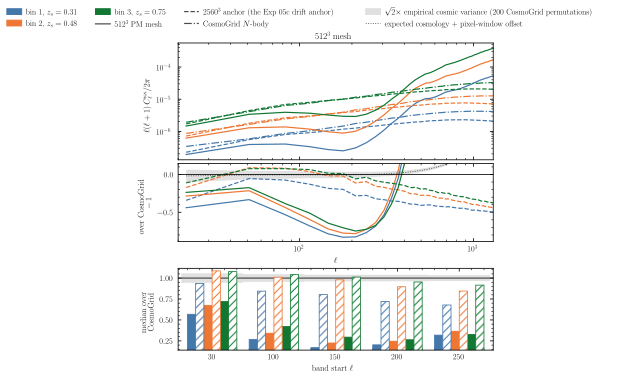
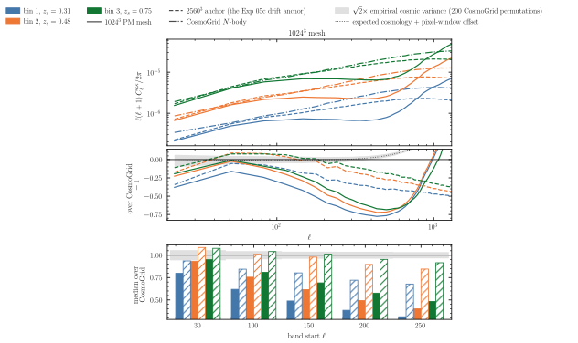
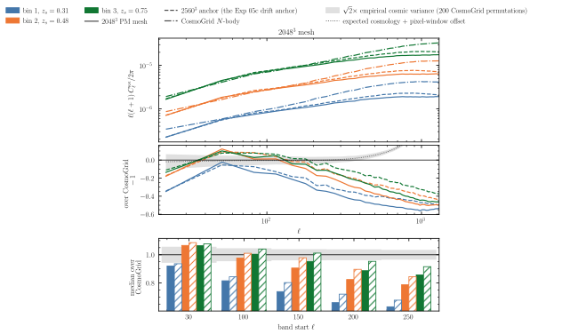
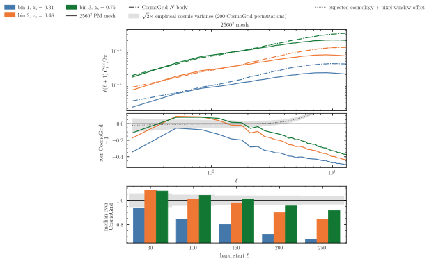
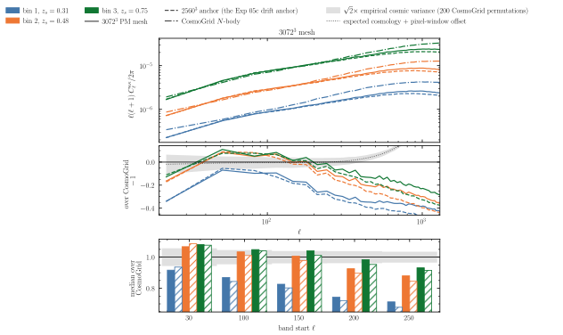
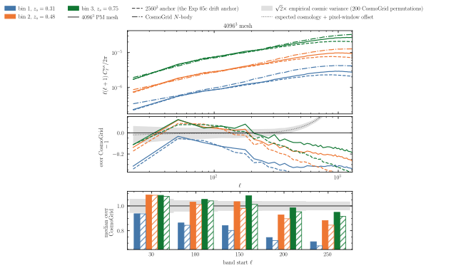

# Experiment 05e — Mesh ladder at the production step budget

**Goal.** Experiments [01](../01-resolution-convergence/README.md) (mesh) and [04](../04-step-convergence/README.md) (steps) each pinned one numerical knob on the 2 Gpc/h accuracy box, with the per-shell density `C_ℓ` as the endpoint. The production lightcone couples the two: the tomographic Born κ this Chapter reports sees the PM resolution **and** the step budget at once. [05d](../05d-spacing-n-stepping-steps/README.md) re-checks the step budget at the production geometry; this experiment holds that budget — BullFrog, **50 steps**, `D`-stepping — and all of the [05c](../05c-spacing-n-stepping-equal-vol/README.md) drift-anchor physics fixed, and pushes the **mesh** through 512³ → 4096³, all painted at **nside 2048** and judged on the 3-bin Born κ `C_ℓ` per Stage-3 source bin. The question: where does the tomographic convergence stop improving with resolution? The 2560³ point is **not re-run** — it is exactly 05c's `exp5c_drift_20`, whose Gauss–Legendre Born maps and spectra are already published: the shared anchor of this ladder and of 05d's step sweep.

| mesh | GPUs (`pₓ`) | nodes | `--halo-multiplier` | halo pad | clean ghost (pad/2) | padded cells/GPU | est. peak |
|------|----:|----:|-----:|---:|---:|---:|---:|
| 512³  | 4   | 1   | 0.5 | 625 Mpc/h | 313 Mpc/h | 6.7e7 | ~8 GB |
| 1024³ | 8   | 2   | 0.5 | 312 | 156 | 2.7e8 | ~30 GB |
| 2048³ | 64  | 16  | 0.5 | 39  | 19.5 | 2.7e8 | ~30 GB |
| 2560³ | 128 | 32  | 0.5 | 19.5 | 9.8  | 2.6e8 | ~29 GB |
| 3072³ | 256 | 64  | **1.0** | 19.5 | 9.8 | 3.4e8 | ~37 GB |
| 4096³ | 512 | 128 | **1.5** | 14.6 | 7.3 | 5.4e8 | ~57 GB |

*Fixed across the ladder:* `--sim-mode pm`, box **`5000³` Mpc/h**, BullFrog (`bf`), `--nb-steps 50`, `--time-stepping D`, **equal-volume** shells (`--shell-spacing equal_vol`, `--min-width 60.0`), **20 shells**, `--drift-on-lightcone`, `--paint-order cic` (no force-window `--deconvolution`), `--scheme ngp`, `--nside 2048`, `--shells-per-file 1`, `--seed 0`, **float64**, `--perf --iterations 3`. Slab decompositions throughout (`--pdim pₓ 1`, no pencils); the GPU count per run is the Exp-01 sizing — the smallest `pₓ` (dividing the mesh, `mesh/pₓ` a multiple of 4) keeping the unpadded local mesh ≤ 512³ on a float64 H100. Born: 3-bin `--nz-shear s3[:3]`, `--quadrature gauss_legendre`, `--normalization global`. Runs are published to the [`ASKabalan/jax-fli-experiments`](https://huggingface.co/datasets/ASKabalan/jax-fli-experiments) dataset under `05-spacing-n-stepping/05e-mesh/`.

## Sizing the halo (the Exp-01 rule, computed)

The ghost zone along the sharded axis has width `halo = halo_multiplier · box / pₓ`, and of that pad the **exchange fills half** (`halo_ext = halo_size/2` in the pinned jaxpm) — so the operative clearance is `pad/2` against the per-axis particle displacement. For the fiducial cosmology, the Exp-01 formula `σ_disp = √((1/2π²) ∫ P_lin(k, z=0) dk)` gives **σ_disp = 11.5 Mpc/h** (3D rms; Exp 01 measured 8.5–10.2 on the actual particles — linear theory is the conservative end), per-axis `σ₁D = σ_disp/√3 ≈ 6.7 Mpc/h`.

Applying the rule `pad = hm · 5000/pₓ ≥ 1.5 σ_disp`, rounded **up** to the next even cell count (an odd halo crashes jaxpm's `slice_unpad`; `int()` truncation must not eat the margin):

| mesh | hm_min (formula) | cells (even) | pad | pad/2 vs σ₁D |
|------|-----:|---:|---:|---|
| 512³–2048³ | ≤ 0.22 | default `hm 0.5` (16–64 cells) | 39–625 | ≥ 2.9× |
| 2560³ (anchor) | 0.44 | `hm 0.5` → 10 | 19.5 | 1.5× |
| 3072³ | 0.89 → 10.6 cells | `hm 1.0` → 12 | 19.5 | 1.5× |
| 4096³ | 1.77 → 14.2 cells | `hm 1.5` → 12 | 14.6 | 1.1× |

Every pad clears σ at least once, and every run from 2560³ up carries the same 19.5 Mpc/h pad — the proven production anchor value — except the top run (caveat below).

> **The 4096³ caveat.** At the 512-GPU cap (the QOS maximum) the unpadded local mesh is already exactly the float64 512³/GPU ceiling, so every halo cell is pure overhead. `hm 1.5` keeps the predicted peak at ≈ 72% of an H100 — the scaling law ≈ 105 B per padded float64 cell is pinned by the three measured slab runs (2048³/64: 28.3 GB at 2.68e8 cells; 2560³/128: 27.6 GB at 2.62e8; 3072³/256: 23.8 GB at 2.27e8) — but its clean ghost **7.3 Mpc/h sits 6% below the only empirically-validated converged halo** (Exp 01's 2048³ at 7.8, which matched CosmoGrid to 2–3%; its starved runs lost 8% of power at 3.9 and 29% at 2.4). The pad itself clears σ₃D once (14.6 = 1.27× the linear-theory σ, 1.43× the measured upper edge). **Contingency:** any low-bias of the 4096³ spectra relative to 2048³/3072³ triggers a `--halo-multiplier 2.0` diagnostic re-run (pad 19.5, clean 9.8 — the anchor value; predicted peak ≈ 89% of the H100, dry-run first). `MODE=dryrun` the 512-GPU line before submitting either.

> **Wall-time.** Every run is bounded by a **40-minute** SLURM limit, regardless of mesh: the 05c anchor (2560³, 50 steps) records ≈ 49 s per simulation iteration plus ≈ 1 min of JIT on 128 GPUs, and per-step time grows only with the padded cells per GPU — even the 4096³ run sits minutes under the cap. The binding constraint at 4096³ is **memory**, not time (caveat above).

> **Independent realisations.** The IC white noise is drawn per mesh cell, so each mesh is a **different universe** at the same cosmology (the Exp 01 finding): mesh ratios of the Born `C_ℓ` carry cosmic variance and are read against theory and the CosmoGrid reference, not against each other. (The step ratios in [05d](../05d-spacing-n-stepping-steps/README.md), by contrast, are phase-matched at fixed seed and mesh.) Every run in this ladder shares the 05c seed and cosmology, so each mesh point is directly comparable to the published 2560³ anchor maps.

## Method

Each run is one PM simulation identical to the 05c drift anchor but for the mesh (and the GPU count and halo the mesh forces), painted into the same 20-shell equal-volume lightcone at nside 2048 and Born-integrated against the three lowest-`z` Stage-3 source bins under the Gauss–Legendre quadrature. The figure this experiment feeds is the thesis's `lensing_vs_cosmogrid` plot re-drawn per mesh: each mesh point's three tomographic `C_ℓ` divided bandpower-wise by the CosmoGrid Born reference (`cosmo_172798`, the grid point matching the runs' cosmology to 1.7%), with the coarse-mesh points expected to roll off early on the PM-Nyquist transfer `ℓ_max ≈ πχ/dx` and the fine-mesh points to track the anchor's resolution ceiling. Per-shell density `C_ℓ` (the `fli-summary-stats` census) accompanies each Born point so a mesh effect can be separated from a shelling effect.

## Results

The ladder has run. The figures below are rendered by [`build.py`](build.py) from the κ spectra under `05-spacing-n-stepping/05e-mesh/kappa_spectra/` (HuggingFace push pending).













**Born convergence per mesh against CosmoGrid (fig01–fig06).** One figure per mesh (in increasing mesh), the three Stage-3 source bins overlaid. Top: the `D_ℓ` power — solid = the mesh, dashed = the 2560³ anchor (absent on fig04, the anchor's own figure and the production baseline of the set). Middle: `C_ℓ`/CosmoGrid − 1 against the acceptance band = the expected cosmology + nside-512-pixwin offset (thin dotted) ± √2 × the empirical CV of the 200 fiducial CosmoGrid permutations (worst bin) — each mesh is an independent universe, so the band is the honest scatter of the comparison. Bottom: the median bandpower ratio per ℓ band ([30,100) … [250,300)), one bar per variant and bin, in the bin colours (solid = the mesh, hatched = the anchor); spectra are bandpower-binned in linear bins of `nlb` = 32 multipoles. **The ladder converges at 2048³**: its band medians (+0.02 / −0.05 / −0.09 / −0.17 / −0.21) sit within a few per cent of the anchor's (+0.08 / −0.00 / −0.02 / −0.10 / −0.15) through `ℓ ≈ 150` and roll off only slightly earlier at the finest bands, while **3072³ and 4096³ sit on the anchor at every band** (4096³: +0.05 / +0.03 / +0.03 / −0.07 / −0.12) with marginally *shallower* small-scale roll-off — their PM-Nyquist ceiling `ℓ_max ≈ πχ/dx` has moved past the plotted window. The coarse end collapses: 1024³ loses 10–60% of power across the band (−0.10 → −0.60) and 512³ carries medians of −0.36 → −0.78, both far outside the CV band — systematic mesh effects, not universe scatter — and both show a sharp particle shot-noise excess that lifts them back above the anchor beyond `ℓ ≈ 500` (the re-cross at the right edge of fig01/fig02 is discreteness, not recovered signal). The 4096³ spectra show **no low-bias** relative to the anchor, so the `--halo-multiplier 2.0` contingency of the caveat above is not triggered.

## How to run

```bash
MODE=dryrun bash run.sh    # print the resolved commands (submit nothing) — inspect the 4096³ line first
bash run.sh                # submit the mesh ladder to SLURM
SIM_MODE=BORN bash run.sh  # after pushing the density parquet to HF: the 3-bin Born pass
```

The ladder writes one directory of per-shell parquet (`shell_NNNN.parquet`) per mesh to `results/exp5e/density/`; once pushed to HuggingFace, `SIM_MODE=BORN` reads the published shells back and writes the 3-bin convergence maps under `results/exp5e/kappa_gl/` (`fli-born-rt --quadrature gauss_legendre --perf --iterations 3`). The κ spectra parquet are then derived with `tools/make_spectra.py` and published under `05-spacing-n-stepping/05e-mesh/kappa_spectra/`. Once those are in place, the figure script renders the SVGs locally without a GPU:

```bash
JAX_PLATFORMS=cpu uv run --no-sync python build.py
```
