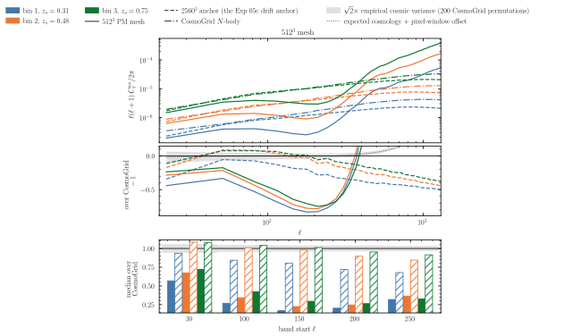
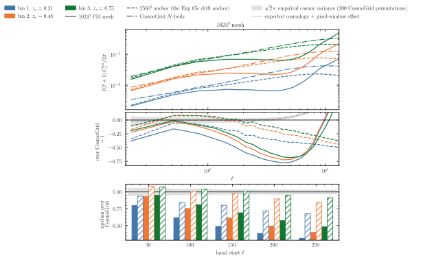
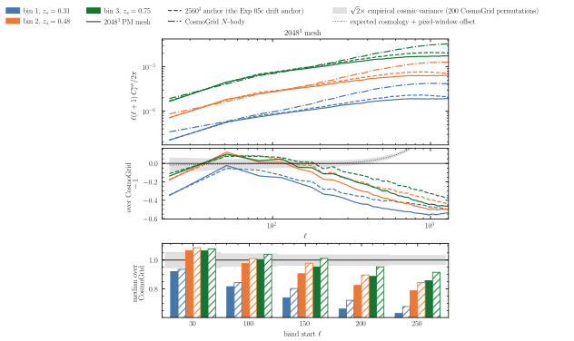
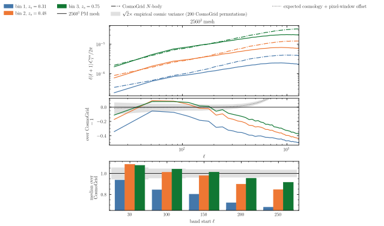
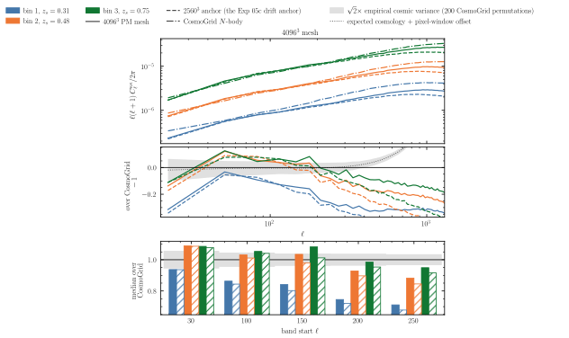

# Experiment 05e — Mesh ladder at the production step budget

**Goal.** Experiments [01](../01-resolution-convergence/README.md) (mesh) and [04](../04-step-convergence/README.md) (steps) each fixed one numerical knob on the 2 Gpc/h accuracy box, with the per-shell density `C_ℓ` as the endpoint. The production lightcone couples the two, since the tomographic Born κ sees the PM resolution and the step budget at once. [05d](../05d-spacing-n-stepping-steps/README.md) re-checks the step budget at the production geometry. This experiment holds that budget (BullFrog, **50 steps**, `D`-stepping) and all the drift-anchor physics of [05c](../05c-spacing-n-stepping-equal-vol/README.md), and pushes the **mesh** from 512³ to 4096³, painted at **nside 2048** and judged on the 3-bin Born κ `C_ℓ` per Stage-3 source bin, to find where the tomographic convergence stops improving with resolution. The 2560³ point is the 05c run `exp5c_drift_20`, whose Gauss–Legendre Born maps and spectra are already published; it anchors this ladder and the step sweep of 05d.

| mesh | GPUs (`pₓ`) | nodes | `--halo-multiplier` | halo pad | clean ghost (pad/2) | padded cells/GPU | est. peak |
|------|----:|----:|-----:|---:|---:|---:|---:|
| 512³  | 4   | 1   | 0.5 | 625 Mpc/h | 313 Mpc/h | 6.7e7 | ~8 GB |
| 1024³ | 8   | 2   | 0.5 | 312 | 156 | 2.7e8 | ~30 GB |
| 2048³ | 64  | 16  | 0.5 | 39  | 19.5 | 2.7e8 | ~30 GB |
| 2560³ | 128 | 32  | 0.5 | 19.5 | 9.8  | 2.6e8 | ~29 GB |
| 3072³ | 256 | 64  | **1.0** | 19.5 | 9.8 | 3.4e8 | ~37 GB |
| 4096³ | 512 | 128 | **1.5** | 14.6 | 7.3 | 5.4e8 | ~57 GB |

*Fixed:* `--sim-mode pm`, box **`5000³` Mpc/h**, BullFrog (`bf`), `--nb-steps 50`, `--time-stepping D`, **equal-volume** shells (`--shell-spacing equal_vol`, `--min-width 60.0`), **20 shells**, `--drift-on-lightcone`, `--paint-order cic` without force-window `--deconvolution`, `--scheme ngp`, `--nside 2048`, `--shells-per-file 1`, `--seed 0`, **float64**, `--perf --iterations 3`. Every run is a slab (`--pdim pₓ 1`), sized by the Exp 01 rule: the smallest `pₓ`, dividing the mesh with `mesh/pₓ` a multiple of 4, that keeps the unpadded local mesh ≤ 512³ on a float64 H100. Born: 3-bin `--nz-shear s3[:3]`, `--quadrature gauss_legendre`, `--normalization global`. The runs are published under [`05-spacing-n-stepping/05e-mesh/`](https://huggingface.co/datasets/ASKabalan/jax-fli-experiments/tree/main/05-spacing-n-stepping/05e-mesh).

## Sizing the halo

The ghost zone along the sharded axis has the width `halo = halo_multiplier · box / pₓ`, and the exchange fills half of that pad (`halo_ext = halo_size/2` in the pinned jaxpm), so the clearance against the per-axis displacement is `pad/2`. For the fiducial cosmology the Exp 01 formula `σ_disp = √((1/2π²) ∫ P_lin(k, z=0) dk)` gives **σ_disp = 11.5 Mpc/h** (3D rms; Exp 01 measured 8.5–10.2 on the particles, so linear theory is the conservative end), and `σ₁D = σ_disp/√3 ≈ 6.7 Mpc/h` per axis. We apply `pad = hm · 5000/pₓ ≥ 1.5 σ_disp`, rounded **up** to the next even cell count, because an odd halo crashes the `slice_unpad` of jaxpm and `int()` truncation must keep the margin:

| mesh | hm_min (formula) | cells (even) | pad | pad/2 vs σ₁D |
|------|-----:|---:|---:|---|
| 512³–2048³ | ≤ 0.22 | default `hm 0.5` (16–64 cells) | 39–625 | ≥ 2.9× |
| 2560³ (anchor) | 0.44 | `hm 0.5` → 10 | 19.5 | 1.5× |
| 3072³ | 0.89 → 10.6 cells | `hm 1.0` → 12 | 19.5 | 1.5× |
| 4096³ | 1.77 → 14.2 cells | `hm 1.5` → 12 | 14.6 | 1.1× |

Every pad clears σ at least once, and every run from 2560³ up carries the 19.5 Mpc/h pad of the production anchor, except 4096³. At the 512-GPU cap (the QOS maximum) the unpadded local mesh of 4096³ already sits at the float64 ceiling of 512³ per GPU, so every halo cell is overhead. `hm 1.5` keeps the predicted peak at ≈ 72% of an H100, from a scaling of ≈ 105 B per padded float64 cell fixed by three measured slab runs (2048³/64: 28.3 GB at 2.68e8 cells; 2560³/128: 27.6 GB at 2.62e8; 3072³/256: 23.8 GB at 2.27e8). Its clean ghost of **7.3 Mpc/h** sits 6% below the only converged halo validated empirically, the 7.8 of the Exp 01 2048³ run, which matched CosmoGrid to 2–3% while its starved runs lost 8% of power at 3.9 and 29% at 2.4. The pad itself clears σ₃D once (14.6 = 1.27× the linear-theory σ, 1.43× the measured upper edge). A low bias of 4096³ against 2048³/3072³ would have triggered a `--halo-multiplier 2.0` re-run (pad 19.5, clean 9.8, predicted peak ≈ 89% of the H100).

Every run fits a **40-minute** SLURM limit: the 2560³ anchor takes ≈ 49 s per simulation iteration plus ≈ 1 min of JIT on 128 GPUs, and the time per step grows only with the padded cells per GPU, so memory binds 4096³ before time does.

## Method

Each run is the 05c drift anchor with a different mesh, and with the GPU count and halo that the mesh forces, painted into the same 20-shell equal-volume lightcone at nside 2048 and Born-integrated for the three lowest-`z` Stage-3 source bins with Gauss–Legendre quadrature. The IC white noise is drawn per mesh cell, so each mesh is a **different universe** at the same cosmology (the Exp 01 finding): we read the mesh ratios of the Born `C_ℓ` against theory and the CosmoGrid reference, while the step ratios of 05d are phase-matched. Every run shares the seed and cosmology of 05c, so each mesh compares directly with the published 2560³ anchor maps. The figures redraw the `lensing_vs_cosmogrid` plot of the thesis per mesh, with the three tomographic `C_ℓ` divided bandpower-wise by the CosmoGrid Born reference (`cosmo_172798`, the grid point that matches the run cosmology to 1.7%). The per-shell density `C_ℓ` of the `fli-summary-stats` census accompanies each Born point, to separate a mesh effect from a shelling effect.

## Results












**Born convergence per mesh against CosmoGrid (fig01–fig06).** One figure per mesh in increasing order, with the three Stage-3 source bins overlaid. Top: `D_ℓ` of the mesh (solid) and of the 2560³ anchor (dashed, absent from fig04, which is the anchor itself). Middle: `C_ℓ`/CosmoGrid − 1 against an acceptance band, the expected cosmology and nside-512 pixel-window offset (thin dotted) ± √2 times the empirical CV of the 200 fiducial CosmoGrid permutations (worst bin), which is the scatter expected between independent universes. Bottom: the median bandpower ratio per `ℓ` band from [30,100) to [250,300), one bar per variant and bin (solid for the mesh, hatched for the anchor), in bandpowers of `nlb` = 32 multipoles.

**The ladder converges at 2048³.** Its band medians (+0.02 / −0.05 / −0.09 / −0.17 / −0.21) lie within a few percent of the anchor's (+0.08 / −0.00 / −0.02 / −0.10 / −0.15) through `ℓ ≈ 150` and roll off slightly earlier in the finest bands. **3072³ and 4096³ sit on the anchor in every band** (4096³: +0.05 / +0.03 / +0.03 / −0.07 / −0.12), with a marginally shallower roll-off, because their PM-Nyquist ceiling `ℓ_max ≈ πχ/dx` has moved past the plotted window. At the coarse end, 1024³ loses 10–60% of the power across the band (−0.10 → −0.60) and 512³ carries medians of −0.36 → −0.78, far outside the CV band, so these are systematic mesh effects. Both coarse meshes show a sharp shot-noise excess that lifts them back above the anchor beyond `ℓ ≈ 500`, and the re-crossing at the right edge of fig01/fig02 is discreteness. The 4096³ spectra carry no low bias against the anchor, so the `--halo-multiplier 2.0` contingency was not needed.

## How to run

```bash
MODE=dryrun bash run.sh    # print the resolved commands; inspect the 4096³ line first
bash run.sh                # submit the mesh ladder to SLURM
SIM_MODE=BORN bash run.sh  # after pushing the density parquet to HF: the 3-bin Born pass
JAX_PLATFORMS=cpu uv run --no-sync python build.py
```

The ladder writes one directory of `shell_NNNN.parquet` per mesh to `results/exp5e/density/`. Once these are on HuggingFace, `SIM_MODE=BORN` reads the published shells back and writes the 3-bin maps to `results/exp5e/kappa_gl/` (`fli-born-rt --quadrature gauss_legendre --perf --iterations 3`), and `tools/make_spectra.py` derives the κ spectra published under `05-spacing-n-stepping/05e-mesh/kappa_spectra/`, from which `build.py` renders the SVGs without a GPU.
