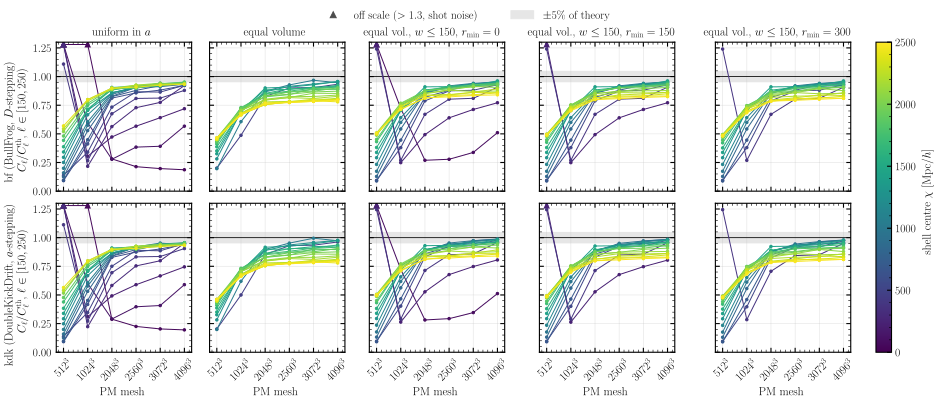
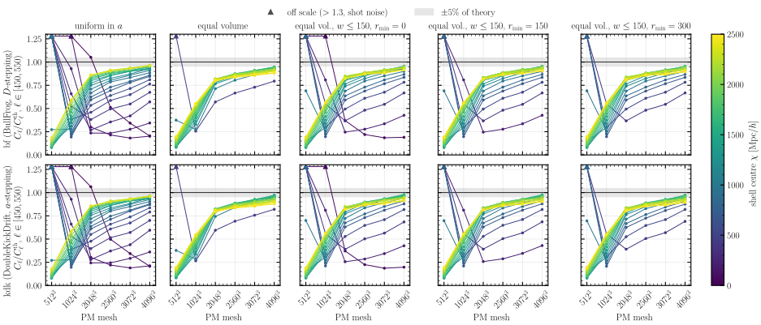
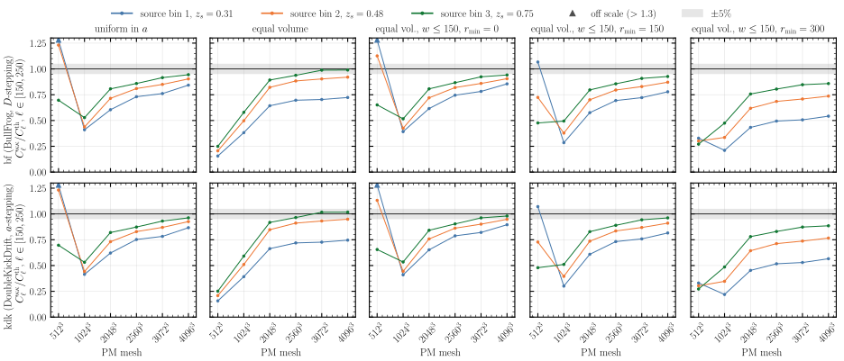
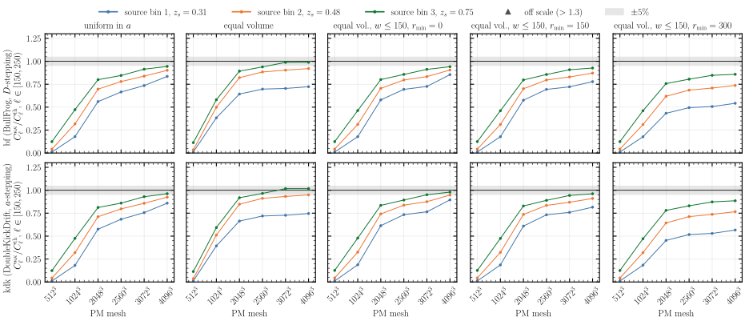
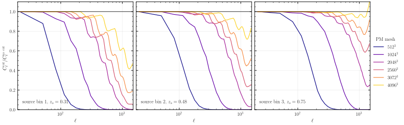
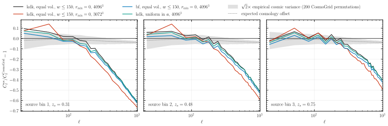

# Experiment 05f — Mesh plateau diagnosis: mesh × solver × spacing × resolution cut

**Goal.** This experiment chooses a production configuration for the tomographic Born κ from four knobs: the PM mesh, the solver, the shell spacing, and whether each shell is low-passed at its resolution limit before the Born integral. We ran the full factorial at 100 steps and judged every run against Limber theory, first per density shell and then per source bin. The best candidates were then compared with CosmoGrid.

| knob | values |
|---|---|
| mesh | 512³, 1024³, 2048³, 2560³, 3072³, 4096³ |
| solver | **bf** (BullFrog, `--time-stepping D`), **kdk** (DoubleKickDrift, `--time-stepping a`) |
| spacing | `a` (uniform in scale factor, shells 81–183 Mpc/h wide); `equal_vol` (equal volume, first shell a 0–912 Mpc/h ball); `eqvolc_w150_r{0,150,300}` (equal volume with width capped at 150 Mpc/h, lightcone starting at `r_min` = 0 / 150 / 300 Mpc/h) |
| Born resolution cut | off (nside 2048); on (nside 512, each shell low-passed at `ℓ_res = k_Nyq r_eff`) |

| mesh | GPUs | pdim | local mesh | halo (Mpc/h) |
|---|---:|---|---|---|
| 512³ | 4 | slab 4×1 | 128 | 64 |
| 1024³ | 8 | slab 8×1 | 128 | 64 |
| 2048³ | 64 | pencil 8×8 | 256 | 128 |
| 2560³ | 128 | pencil 16×8 | 160/320 | 80/160 |
| 3072³ | 256 | pencil 16×16 | 192 | 96 |
| 4096³ | 512 | pencil 32×16 | 128/256 | 64/128 |

*Fixed:* box 5000³ Mpc/h, 100 steps, 20 shells (`--min-width 50`), `--drift-on-lightcone`, CIC paint, NGP spherical scheme, nside 2048, `--halo-multiplier 0.5`, seed 0, float64. Born uses 3 Stage-3 bins (`s3[:3]`) with Gauss–Legendre quadrature and global normalisation. The grid has 60 simulations and 120 Born maps, published under [`05-spacing-n-stepping/05f-mesh/`](https://huggingface.co/datasets/ASKabalan/jax-fli-experiments/tree/main/05-spacing-n-stepping/05f-mesh).

## Method

Every spectrum is binned in 32-multipole bandpowers and divided by the Limber prediction for its shell or source bin, with the prediction multiplied by the HEALPix pixel window of the map (nside 2048, or nside 512 for the cut). The mesh figures reduce each ratio to its median over ℓ ∈ [150, 250), which we call "ℓ ≈ 200". Each mesh draws its own white noise, so meshes are different universes. Solvers and spacings share their phases at a fixed mesh.

## Results

### Density shells against theory



**Density shells, ℓ ≈ 200.** Shells beyond χ ≈ 1000 Mpc/h reach a plateau at 2048³–2560³: they sit at 0.75–0.93 of theory at 2048³ and gain at most 5% by 4096³ (0.78–0.98). The near shells keep gaining power up to 4096³, in the `a` spacing (nearest shell, χ = 40 Mpc/h: 0.19 at 4096³) and in `eqvolc_w150_r0` (0–150 Mpc/h shell: 0.51). At 512³ the near shells are shot-noise dominated, with a ratio of up to 13. Plain `equal_vol` has no thin near shell, so all its shells sit between 0.77 and 1.00 from 2560³ onwards. kdk sits 1–3% above bf at every mesh.



**Density shells, ℓ ≈ 500.** At smaller scales no spacing reaches a plateau. Shells beyond χ ≈ 1000 Mpc/h rise from 0.71–0.86 of theory at 2048³ to 0.88–0.98 at 4096³, and near shells gain more.

### Born κ against theory



**Born κ, no cut.** κ keeps rising up to 4096³ in every spacing and every bin. At 4096³, kdk with `eqvolc_w150_r0` gives 0.90 / 0.95 / 0.98 of theory for bins 1 / 2 / 3, the best result in the grid. `equal_vol` reaches 1.02 in bin 3, but bin 1 stays at 0.75 because its 912 Mpc/h first shell smooths the low-z lenses. `r_min` = 150 and 300 Mpc/h drop the nearest matter and lose bin 1 power (0.82 and 0.57 at 4096³). At 512³ the near-shell shot noise lifts κ above theory by up to 2.2×.



**Born κ, resolution cut.** The cut removes the 512³ shot-noise excess, and with it every signal below 1024³. At 2048³ and above it changes ℓ ≈ 200 by less than 1% in `equal_vol`, `r150` and `r300`. In `a` and `r0` it lowers bin 1 by 3–9% at 2048³–3072³, and by less than 1% at 4096³.



**What the cut removes (kdk, `eqvolc_w150_r0`, pixel windows divided out).** Each mesh has a cut scale that moves to higher ℓ as the mesh grows. At 4096³ the cut keeps bin 1 within 5% of the uncut spectrum up to ℓ ≈ 500, then removes up to 60% by ℓ = 1300. The uncut maps are closer to theory at every mesh from 2048³ upwards (fig03 against fig04), so the cut costs power without removing an excess.

### Candidates against CosmoGrid



**Candidates against CosmoGrid `cosmo_172798`.** We took the best spacing from fig03 (`eqvolc_w150_r0`) at the two finest meshes, and added bf and the `a` spacing at 4096³ as single-knob alternatives. No candidate uses the cut (fig05). The three 4096³ candidates stay within 10% of CosmoGrid up to ℓ ≈ 200 in every bin, then fall to −0.6 / −0.5 / −0.4 (bins 1 / 2 / 3) by ℓ = 1000. 3072³ falls 5–8% faster.

| solver | spacing | mesh | cut | κ/theory, ℓ ≈ 200 (bins 1/2/3) | κ/CosmoGrid − 1, median ℓ ∈ [30, 300) | PM time × GPUs |
|---|---|---|---|---|---|---|
| **kdk** | **eqvolc_w150_r0** | **4096³** | **no** | **0.90 / 0.95 / 0.98** | **−0.02 / +0.00 / +0.00** | 246 s × 512 |
| kdk | eqvolc_w150_r0 | 3072³ | no | 0.82 / 0.90 / 0.96 | −0.09 / −0.03 / −0.00 | 190 s × 256 |
| bf | eqvolc_w150_r0 | 4096³ | no | 0.86 / 0.91 / 0.94 | −0.07 / −0.04 / −0.03 | 239 s × 512 |
| kdk | a | 4096³ | no | 0.87 / 0.93 / 0.96 | −0.05 / −0.02 / −0.02 | 235 s × 512 |

## Decision

We choose **kdk, `eqvolc_w150_r0`, 4096³, no resolution cut**. It is the closest to both theory and CosmoGrid in every bin. 3072³ costs 2.6× fewer GPU-seconds for about 8% less bin 1 power. kdk leads bf by about 4%. [05d](../05d-spacing-n-stepping-steps/README.md) found that kdk with a-stepping converges from above (+8% at 50 steps), so part of that lead may be step error.

## How to run

```bash
MODE=dryrun bash run.sh                    # density stage: print the commands
bash run.sh                                # density stage: submit to SLURM
SIM_MODE=LENSING bash run.sh               # Born stage (with and without the cut), reads the density shells from HF
```

After the density and κ spectra are pushed to HuggingFace, the figures render locally without a GPU, and the script prints the candidate table:

```bash
JAX_PLATFORMS=cpu uv run --no-sync python docs/5-experiments/05f-mesh-plateau-diagnosis/build.py
```
