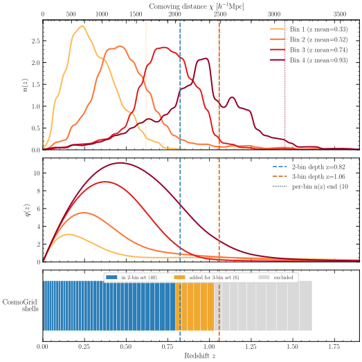

# Experiment 06 — Match the CosmoGrid density shells (DES Y3 depth)

## Goal

Simulate, with jax-fli's PM engine, the **same radial density shells as CosmoGrid at nside 2048**
(the reference of [Experiment 00](../00-cosmogrid-reference/)) — i.e. reproduce CosmoGrid's shell
`z`-edges exactly — so the per-shell density `C_ℓ` and shell-to-shell cross-correlation can be
compared directly, isolating **geometry** (shell placement) from resolution and painting effects.

How *deep* in redshift we must simulate is set by the **DES Y3** weak-lensing source bins (not the
Stage-3 forecast): the box only needs to contain the structure that lenses those sources. We size a
grid over two source depths × two observer placements × two device decompositions — **8 runs**:

- **2-bin set** — DES Y3 bins 1+2 (shallower, `z ≲ 0.82`).
- **3-bin set** — DES Y3 bins 1+2+3 (deeper, `z ≲ 1.06`). Bin 4 is dropped (its sources sit too far,
  forcing a deeper, coarser box — see below).
- **full sky** — observer at the box centre `(0.5, 0.5, 0.5)` → an isotropic `2r` cube.
- **big quadrant** — **exactly** the [Experiment 08](../08-masked-shear/) corner geometry: observer
  `(0.1, 0.5, 0.9)`, so the lightcone visibility footprint is **identical** to Exp 08's and a later
  masking analysis recovers the same mask. The DES footprint sits entirely inside the visible cone.
- **slab / pencil** — each of the four geometries above is run under both a **1-D slab**
  (`--pdim 128 1`) and a **2-D pencil** (`--pdim 32 4`) device decomposition (see §4).

## Method

Everything below is computed by [`prep_geometry.py`](prep_geometry.py) (CPU only) and written into
`geometry.sh`, which [`run.sh`](run.sh) sources — the eight launches carry no hand-typed numbers.

**1. Source depth from DES Y3 `n(z)`.** Each tomographic bin's `n(z)` (`jax_fli.data.get_des_y3_nz_shear`)
shares one `z`-grid (0.005–2.995), so its nominal `zmax` can't distinguish bins. We instead take each
bin's **effective end** — the last redshift where `n(z) ≥ 10 % of its peak`. The DES Y3 bins carry a
thin (~0.5–1 % of peak) high-`z` noise floor, so a 1–2 % cut clips to the grid edge and even inverts
the bin order; **10 % of peak** is robust, monotonic, and lands bin 3 at `z ≈ 1.06` — matching the
"bin 3 reaches `z ≈ 1`" read off the curve. The box scales directly with this choice, so the table
also lists the 5 %/20 % bracket; **the 10 % cut deliberately trims the upper tail** (at `z = 1.0`,
bin 3 is still ~34 % of peak; it falls to ~2 % only by `z ≈ 1.2`), which is the right trade for keeping
the box affordable.

| DES Y3 bin | `z_mean` | end (10 % peak) | (5 %) | (20 %) | |
|:--:|:--:|:--:|:--:|:--:|:--|
| 1 | 0.33 | 0.62 | 0.70 | 0.56 | |
| 2 | 0.52 | **0.82** | 0.99 | 0.75 | → 2-bin depth |
| 3 | 0.74 | **1.06** | 1.14 | 1.01 | → 3-bin depth |
| 4 | 0.93 | 1.45 | 1.51 | 1.30 | excluded (box → 6171³, dx → 2.4) |

**2. Box from redshift + observer.** `jax_fli.compute_box_size_from_redshift(cosmo, z_max, observer)`
returns `(L_x, L_y, L_z) = factor · r(z_max)` with `factor_i = 1 + 2·min(f_i, 1−f_i)` and
`r = ` radial comoving distance (CosmoGrid run000 cosmology, to match its distances). The full-sky
observer `(0.5,0.5,0.5)` gives an isotropic `2r` cube; the quadrant `(0.1,0.5,0.9)` keeps the **centred
(second) axis** at `2.0r` and clips the other two to `1.2r` → a `(1.2r, 2.0r, 1.2r)` box. We round `2r`
up to a tidy side `L` (`4200` for the 2-bin, `5000` for the 3-bin) that still contains the shells, and
take the quadrant as `(0.6L, L, 0.6L)` off the same `L`.

**3. CosmoGrid shell edges.** The published nside-2048 density (HuggingFace
`ASKabalan/jax-fli-experiments`, config `00-cosmogrid-density`) is loaded back, **down-sampled to
nside 4** purely to free memory (we only need the per-shell metadata), and each shell's comoving
edges → scale-factor edges `a_near > a_far`. For each set we keep the shells fully inside the box
(far edge `≤ r(z_max)`) and emit them as `--ts-near` / `--ts-far`. The 3-bin selection (46 shells)
nests the 2-bin one (40 shells); both run from `z = 0`.

**4. Mesh, decomposition & GPU layout (float64, 128 GPUs each).** The full-sky runs use a fixed
**2560³** mesh (the `m2560` template) on **128 GPUs** (32 nodes × 4); the box grows with depth, so
`dx = L/2560` is `1.64` (2-bin) / `1.95` (3-bin). The quadrant packs the **same ~2560³ cell budget**
(≈1.3×10⁸ cells/GPU, the float64 ceiling) into its smaller `(1.2r, 2.0r, 1.2r)` volume at **isotropic**
`dx`. With the corrected observer the long (centred) axis is now **second**, so the short, sharded axis
is first; the `0.6 : 1 : 0.6` ratio at that budget gives **2176 × 3584 × 2176** — a **finer** `dx ≈ 1.16`
(2-bin) / `1.38` (3-bin), closer to CosmoGrid's own.

The mesh is sized so the **same** array runs under both decompositions, under two constraints. (i) The
halo `int((axis ÷ p) · 0.5)` must be **even** (an odd halo crashes jaxpm's `slice_unpad`). (ii) Under the
**pencil**, the distributed-FFT all-to-all transposes *every* axis across **both** process-grid dimensions,
so each axis must be divisible by **both** `pdim` factors — not just its initial owner. (An earlier mesh used
`3600`, divisible by `pdim_y = 4` but **not** `pdim_x = 32`, and jaxpm aborted: `all_to_all split_axis (3600)
has to be divisible by … x (32)`.) With `pdims {(128,1),(32,4)}` the safe step is `lcm = 128`, so every axis
is a multiple of 128: `2176 = 128·17`, `3584 = 128·28`, `2176 = 128·17` (halos 8 / 14 / 8 — all even). So both
`2176 × 3584 × 2176` and the cubic `2560³` are valid under the **slab** `--pdim 128 1` (shard axis 0) and the
**pencil** `--pdim 32 4` (shard axes 0 and 1, transposing across both); `pdim₀ = 32` is also a multiple of the
4 GPUs/node.

One subtlety of sharding the **short** axis first: the quadrant **slab** halo is only 8 cells
(≈ 9–11 `h⁻¹`Mpc) at the default `0.5` multiplier — tighter than the ≥ 16 `h⁻¹`Mpc elsewhere — so those
two launches pass `--halo-multiplier 0.85` (→ 14 cells, ≈ 16–19 `h⁻¹`Mpc, still even) to cover the largest
PM displacements; the quadrant **pencil** already has a 34-cell halo. The nside-2048 lightcone is sharded
over the first axis (`pdim_x`), a few hundred MB/device — larger under the pencil (`pdim_x = 32`) than the
slab (`128`) — still small beside the float64 mesh.
*(A later masking analysis must use the same observer `(0.1, 0.5, 0.9)` to recover the footprint.)*

## Results

The figure below records the whole geometry decision: the DES Y3 source `n(z)` and lensing efficiency
`q(z)`, the two depth cuts, and which CosmoGrid shells each set simulates.



- **Top —** DES Y3 `n(z)` per bin (dotted = each bin's 10 %-of-peak end); the dashed lines are the
  2-bin (`z = 0.82`) and 3-bin (`z = 1.06`) depths. The top axis is comoving distance `χ`.
- **Middle —** weak-lensing efficiency `q(z)`: support ends at the source plane, confirming the box
  must reach the chosen depth.
- **Bottom —** the CosmoGrid shell tessellation in `z`: 40 shells inside the 2-bin box (blue),
  6 more added for the 3-bin box (orange), the rest excluded (grey).

The big-quadrant observer's visibility footprint — built with the same
`jaxpm.spherical.spherical_visibility_mask` that Exp 08 uses — is a clean centred cap: the Exp 08
corner geometry, **not** the earlier X/Y-reflected one. An earlier revision X/Y-reoriented the observer
to `(0.5, 0.1, 0.9)` to keep the long box axis first; that reflected this footprint across the `x=y`
plane and no longer matched Exp 08 — corrected to `(0.1, 0.5, 0.9)`.


**The four geometries** — each run as a slab (`--pdim 128 1`) and a pencil (`--pdim 32 4`), so **8 runs**
in total, all on **128 GPUs** (32 nodes × 4):

| Run | depth | observer | box [`h⁻¹`Mpc] | mesh | `dx` [`h⁻¹`Mpc] | shells |
|:--|:--:|:--:|:--:|:--:|:--:|:--:|
| 2-bin · full sky | `z ≤ 0.82` | (0.5, 0.5, 0.5) | 4200³ | 2560³ | 1.64 | 40 |
| 2-bin · quadrant | `z ≤ 0.82` | (0.1, 0.5, 0.9) | 2520 × 4200 × 2520 | 2176 × 3584 × 2176 | 1.16 | 40 |
| 3-bin · full sky | `z ≤ 1.06` | (0.5, 0.5, 0.5) | 5000³ | 2560³ | 1.95 | 46 |
| 3-bin · quadrant | `z ≤ 1.06` | (0.1, 0.5, 0.9) | 3000 × 5000 × 3000 | 2176 × 3584 × 2176 | 1.38 | 46 |

**Resolution caveat — where the comparison is geometry-limited.** This experiment isolates geometry, so
the resolution budget matters. A force-mesh cell `dx` at comoving distance `d` subtends a Nyquist
multipole `ℓ_max ≈ π·d/dx`, ranging per shell from the innermost to the outermost: **full sky
`ℓ ≈ 30–36` → `≈ 3780–3860`**, and the finer **quadrant `ℓ ≈ 43–51` → `≈ 5350–5460`** — the quadrant
nearly reaches nside-2048's `ℓ ≈ 6000`, the full-sky runs sit below it. So the nside-2048 maps
over-resolve the full-sky mesh (most severely the near shells), and any `C_ℓ` disagreement with
CosmoGrid above each shell's `ℓ_max` is resolution/painting, not geometry — restrict the comparison to
`ℓ ≲ ℓ_max(shell)`. Note CosmoGrid itself is a 900 `h⁻¹`Mpc / 832³ run (particle spacing ≈ 1.08
`h⁻¹`Mpc) **tiled** to fill the lightcone; we instead use a single ~4–5 `h⁻¹`Gpc box with **no tiling**.
The quadrant's `dx ≈ 1.16` is now comparable to CosmoGrid's spacing, so the clean comparison trades only
the full-sky runs' coarser small-scale resolution for our faithful (untiled) large-scale modes.

## How to run

```bash
# 1. Geometry prep (CPU): writes geometry.sh + assets/exp06-*.svg
python prep_geometry.py

# 2. Inspect the eight resolved fli-launcher commands without submitting
MODE=dryrun bash run.sh

# 3. Submit to SLURM. Each run writes a *directory* results/exp6/cosmogrid_{2bin,3bin}_{fullsky,quadrant}_{slab,pencil}/
#    holding one parquet per shell (shell_0000.parquet, …) — see --shells-per-file below.
bash run.sh
```

The wall-times in `run.sh` are first-guess estimates — tune after the first run. The catalogs are
then published to HuggingFace and studied locally against the CosmoGrid reference, per the
[experiments lifecycle](../CLAUDE.md).

> **Gate before cluster hours.** `MODE=dryrun` only *resolves* the eight commands — it does not run the
> simulator. The `m2560` template validated a *cubic* mesh, nside 512, centred observer, slab
> decomposition; these runs add several untested axes — a **non-cubic** `2176×3584×2176` mesh,
> **nside-2048** spherical painting, an **off-centre** observer, and a **2-D pencil** `--pdim 32 4`
> decomposition. Smoke-test the plumbing locally first (a small *cubic* run, then a small *non-cubic*
> run, both as a slab and a pencil, at tiny mesh/nside with a handful of `ts` edges) before committing
> 128-GPU hours; only non-cubic painting *under multi-host sharding* can't be reproduced locally.
