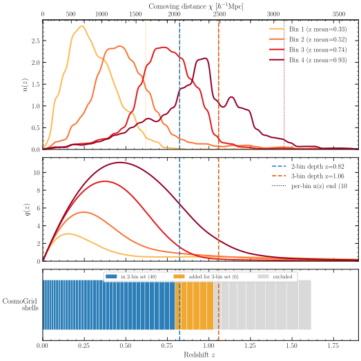
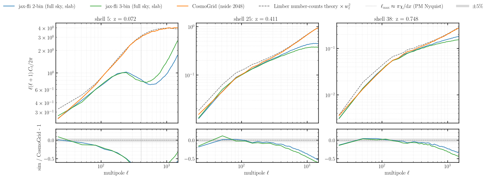
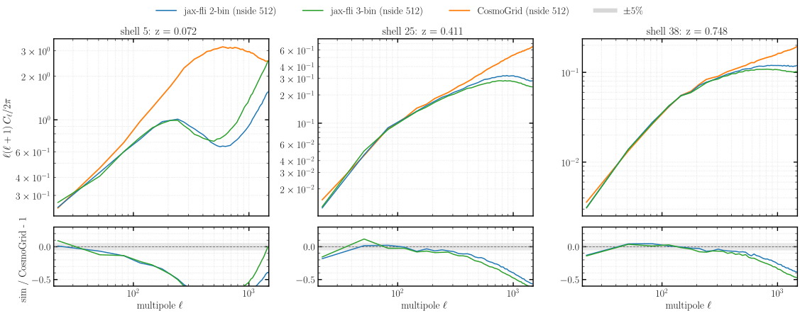
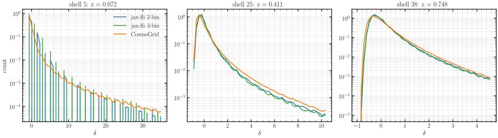
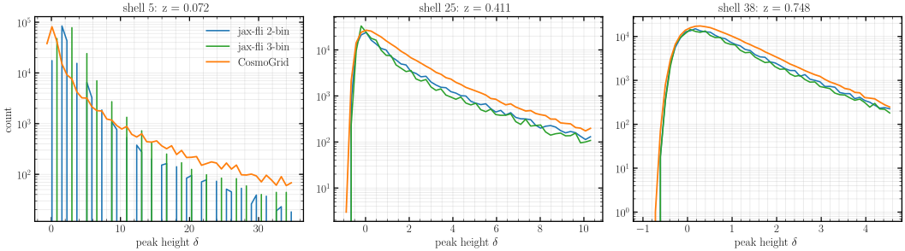
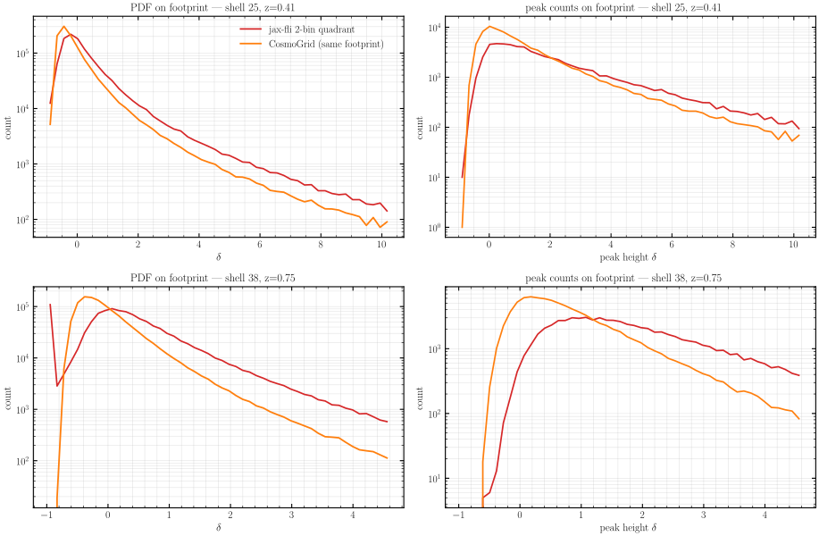
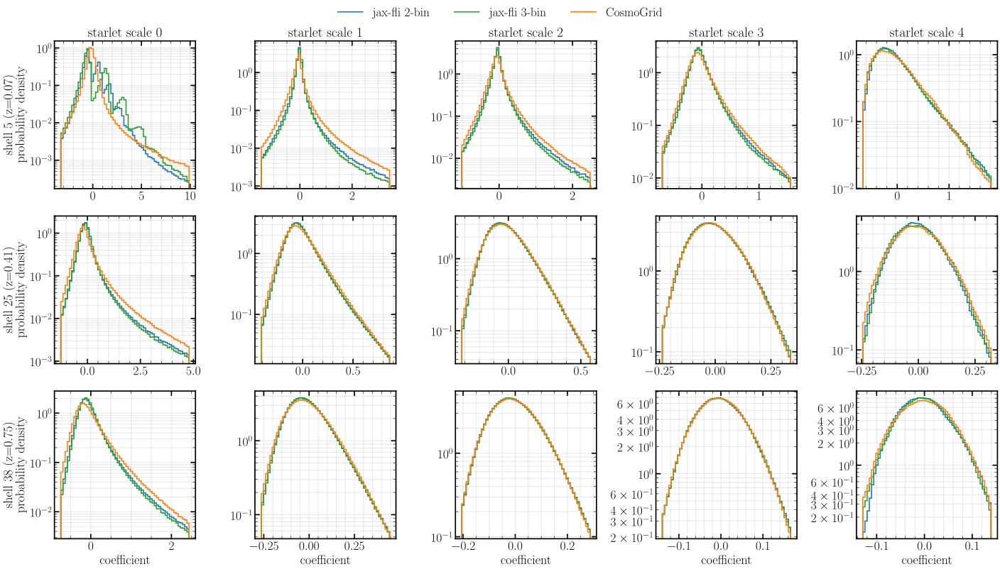

# Experiment 06 — Match the CosmoGrid density shells (DES Y3 depth)

**Goal.** We simulate with the jax-fli PM engine the radial density shells of CosmoGrid at nside 2048, the reference of [Experiment 00](../00-cosmogrid-reference/README.md), with the CosmoGrid shell `z`-edges reproduced exactly. The per-shell density `C_ℓ` and shell-to-shell statistics can then be compared directly, which isolates the shell **geometry** from resolution and painting effects. The depth follows the **DES Y3** weak-lensing source bins, since the box needs only the structure that lenses those sources. The **big-quadrant** observer reproduces the corner geometry of [Experiment 08](../08-masked-shear/README.md), so its visibility footprint is identical to the one of Exp 08 and contains the whole DES footprint. Two depths, two observers and two device decompositions give **8 runs**.

| dimension | values |
|-----------|--------|
| source depth | 2-bin, DES Y3 bins 1+2 (`z ≲ 0.82`, 40 shells); 3-bin, bins 1+2+3 (`z ≲ 1.06`, 46 shells) |
| observer | full sky `(0.5, 0.5, 0.5)`, big quadrant `(0.1, 0.5, 0.9)` |
| decomposition | slab `--pdim 128 1`, pencil `--pdim 32 4` |

| Run | depth | observer | box [`h⁻¹`Mpc] | mesh | `dx` [`h⁻¹`Mpc] | shells |
|:--|:--:|:--:|:--:|:--:|:--:|:--:|
| 2-bin · full sky | `z ≤ 0.82` | (0.5, 0.5, 0.5) | 4200³ | 2048³ | 2.05 | 40 |
| 2-bin · quadrant | `z ≤ 0.82` | (0.1, 0.5, 0.9) | 2520 × 4200 × 2520 | 1792 × 2944 × 1792 | 1.41 | 40 |
| 3-bin · full sky | `z ≤ 1.06` | (0.5, 0.5, 0.5) | 5000³ | 2048³ | 2.44 | 46 |
| 3-bin · quadrant | `z ≤ 1.06` | (0.1, 0.5, 0.9) | 3000 × 5000 × 3000 | 1792 × 2944 × 1792 | 1.67 | 46 |

*Fixed:* 128 GPUs (32 nodes × 4), BullFrog, 50 steps, CIC without `--deconvolution`, NGP nside-2048 painting, `--shells-per-file 1`, CosmoGrid run000 cosmology, float64.

## Method

[`prep_geometry.py`](prep_geometry.py) computes the geometry on CPU and writes `geometry.sh`, which [`run.sh`](run.sh) sources, so the eight launches carry no hand-typed numbers.

**Source depth.** The DES Y3 bins (`jax_fli.data.get_des_y3_nz_shear`) share one `z`-grid (0.005–2.995), so we end each bin at the last redshift where `n(z) ≥ 10%` of its peak. The bins carry a high-`z` noise floor at ~0.5–1% of the peak, and a 1–2% cut reaches the grid edge and inverts the bin order. The 10% cut is monotonic and puts bin 3 at `z ≈ 1.06`. It trims the upper tail on purpose, to keep the box affordable: bin 3 is still at ~34% of its peak at `z = 1.0` and falls to ~2% by `z ≈ 1.2`. Bin 4 would push the box to 6171³ at `dx ≈ 3.0`, so we drop it.

| DES Y3 bin | `z_mean` | end (10 % peak) | (5 %) | (20 %) | |
|:--:|:--:|:--:|:--:|:--:|:--|
| 1 | 0.33 | 0.62 | 0.70 | 0.56 | |
| 2 | 0.52 | **0.82** | 0.99 | 0.75 | → 2-bin depth |
| 3 | 0.74 | **1.06** | 1.14 | 1.01 | → 3-bin depth |
| 4 | 0.93 | 1.45 | 1.51 | 1.30 | excluded (box → 6171³, dx → 3.0) |

**Box.** `jax_fli.compute_box_size_from_redshift(cosmo, z_max, observer)` returns `factor · r(z_max)` along each axis, with `factor_i = 1 + 2·min(f_i, 1−f_i)` and `r` the radial comoving distance in the CosmoGrid run000 cosmology. The full-sky observer gives an isotropic `2r` cube, which we round up to `L` = 4200 (2-bin) or 5000 (3-bin). The quadrant observer keeps the centred second axis at `2r` and clips the other two to `1.2r`, which gives `(0.6L, L, 0.6L)` for the same `L`.

**Shell edges.** We load the published CosmoGrid density (config `00-cosmogrid-000001-density`), down-sampled to nside 4 to keep only the per-shell metadata, and convert the comoving edges of each shell to scale-factor edges `a_near > a_far`. The shells whose far edge lies inside `r(z_max)` are passed as `--ts-near` / `--ts-far`. The 46 shells of the 3-bin set contain the 40 of the 2-bin set, and both start at `z = 0`.

**Mesh and decomposition.** The full-sky runs use a 2048³ mesh, so `dx = L/2048`. The quadrant packs the same cell budget (≈6.7×10⁷ cells per GPU, under the ~1.34×10⁸ float64 ceiling that 2560³ overshot) into its smaller volume at isotropic `dx`, which gives 1792 × 2944 × 1792 and a `dx` closer to CosmoGrid's. Under the pencil, the all-to-all of the distributed FFT transposes every axis across both process-grid dimensions, so every axis must be divisible by both `pdim` factors. With `pdims {(128,1),(32,4)}` every axis is therefore a multiple of `lcm = 128`: `2048 = 128·16`, `1792 = 128·14` and `2944 = 128·23`, and `pdim₀ = 32` is a multiple of the 4 GPUs per node. The quadrant slab shards the short 1792 axis into 14 cells per GPU, so the default multiplier gives a halo of 7 cells (≈ 10 `h⁻¹`Mpc), tighter than the ≥ 16 `h⁻¹`Mpc of the other runs. Those two launches pass `--halo-multiplier 0.85` (11 cells, ≈ 15–16 `h⁻¹`Mpc), since jaxpm accepts odd halos from b56d7e9 onwards, and the quadrant pencil already has a 28-cell halo. The nside-2048 lightcone, sharded over `pdim_x`, takes a few hundred MB per device, small beside the float64 mesh.

## Setup: geometry and footprint



**Experiment 06 geometry.** Top: the DES Y3 `n(z)` of each bin, with its 10%-of-peak end dotted and the 2-bin (`z = 0.82`) and 3-bin (`z = 1.06`) depths dashed; the top axis is the comoving distance `χ`. Middle: the lensing efficiency `q(z)`, whose support ends at the source plane, so the box must reach the chosen depth. Bottom: the CosmoGrid shells in `z`, with the 40 shells of the 2-bin box (blue), the 6 added for the 3-bin box (orange) and the excluded ones (grey).


**Big-quadrant visibility footprint.** The footprint of the observer at `(0.1, 0.5, 0.9)`, built with the `jaxpm.spherical.spherical_visibility_mask` of Exp 08, is the centred cap of the Exp 08 corner geometry. A later masking analysis must use the same observer to recover it.

The mesh cell `dx` at comoving distance `d` subtends a Nyquist multipole `ℓ_max ≈ π·d/dx`. From the innermost to the outermost shell it runs from `ℓ ≈ 24–29` to `≈ 3020–3090` for the full sky, and from `ℓ ≈ 35–42` to `≈ 4400–4490` for the finer quadrant, below the `ℓ ≈ 6000` of nside 2048. The nside-2048 maps therefore over-resolve the mesh, most in the near shells, and the comparison with CosmoGrid measures geometry for `ℓ ≲ ℓ_max(shell)`. CosmoGrid is a 900 `h⁻¹`Mpc, 832³ run (particle spacing ≈ 1.08 `h⁻¹`Mpc) **tiled** to fill the lightcone, while our runs use a single untiled 4–5 `h⁻¹`Gpc box. The quadrant's `dx ≈ 1.41` approaches the CosmoGrid spacing, so only the full-sky runs trade small-scale resolution for untiled large-scale modes.

## Results: matching the CosmoGrid density

Our runs share the cosmology and the shell `z`-edges of CosmoGrid but draw independent initial phases, so the comparison is statistical: angular `C_ℓ`, one-point PDF, peak counts and starlet wavelets. Our shells are stored as `DENSITY` and the CosmoGrid ones as raw `COUNTS`, so we reduce both to the overdensity `δ = ρ/ρ̄ − 1`, each shell normalised by its own mean. Every comparison is at a matched nside, so the HEALPix pixel window cancels in every ratio.



**Per-shell density spectra.** Same-nside overdensity `C_ℓ` of the near, mid and far shells, PM against CosmoGrid, with the Limber number-count theory as a faint reference. Over the band set by geometry the two agree to a few percent. At high `ℓ` the ratio falls under three stacked effects: the PM Nyquist `ℓ_max ≈ π·χ/dx` (dotted), the CIC force window, which these runs leave un-deconvolved, and the shot-noise floor. The near shell (`z = 0.07`) is further limited by its thinness and by particle discreteness. The spectra match for `ℓ ≲ ℓ_max(shell)`, and above it the comparison measures resolution and painting.


**Spectra agreement across distance.** The `(2ℓ+1)`-weighted ratio of every shell sits near unity over an intermediate-`χ` plateau and degrades with `ℓ`, worst at `ℓ ≈ 800`. The slab and pencil decompositions overlie, so the device layout leaves the field unbiased, and the decoupled quadrant tracks the full sky, so the masked measurement recovers the same spectrum. The finer quadrant mesh holds up better at high `ℓ` than the full-sky mesh, as the resolution budget predicts.



**nside-512 cross-check.** At a matched nside of 512, which keeps the large and intermediate scales that the higher-order statistics also use, the mid and far shells agree with CosmoGrid within `±5%` across a broad band.


**Full-sky δ maps.** Independent realisations share statistics and no structures, so we read the maps for texture and geometry. The near shell shows the same cosmic-web texture in our PM runs and in CosmoGrid, and the thicker far shells are smoother.


**Big-quadrant δ maps.** The quadrant runs paint only the visibility cone of the observer, which shrinks as the shell recedes: nearly the full sky at the near shell, a cap at the far shell.



**Overdensity PDF.**



**Peak counts.** The higher-order statistics do not normalise themselves, so we compute them on the matched-nside `δ` maps. The PDF and the peak counts agree through the bulk, and at the near shell both break into a discreteness comb from the low occupancy. CosmoGrid carries a slightly heavier high-`δ` tail than the coarser full-sky PM, since a full N-body run resolves more massive collapsed structures than CIC-PM.



**Higher-order statistics on the masked sky.** The PDF and the peak counts have no MASTER-style deconvolution, so we compute them on the footprint pixels only: the visible pixels for the PDF, and an apodised then tapered map for the peaks. CosmoGrid is measured on the same pixels. The finer quadrant run shows more peaks than CosmoGrid, the opposite of the coarse full-sky run, consistent with its `dx ≈ 1.41` approaching the CosmoGrid particle spacing.



**Starlet coefficient distributions.** Spherical starlet coefficients of the near, mid and far shells (5, 25, 38) in rows. The distributions agree at the coarse scales and diverge at the finest, where the CIC window and the shot noise act, at every depth. The wavelets resolve the result of the spectra scale by scale.


**Starlet coefficient maps.** The fine scales (left) carry the small-scale detail and the coarse scales (right) the smooth large-scale field, with the same texture in PM and CosmoGrid at every scale. The bottom row is PM − CosmoGrid. The realisations are independent, so the difference keeps the full amplitude of each scale: two uncorrelated fields that share the same statistics scale by scale.

## How to run

```bash
python prep_geometry.py          # geometry on CPU: writes geometry.sh and assets/exp06-*.svg
MODE=dryrun bash run.sh          # print the eight resolved fli-launcher commands
bash run.sh                      # submit; each run writes results/exp6/cosmogrid_{2bin,3bin}_{fullsky,quadrant}_{slab,pencil}/shell_*.parquet
JAX_PLATFORMS=cpu uv run --no-sync python build.py   # fig01–fig10 from the published HuggingFace products (starlet: uv sync --extra starlet)
```

`build.py` reads only the published spectra and maps of `ASKabalan/jax-fli-experiments`, with no GPU. The wall-times in `run.sh` are first estimates. Before spending cluster hours on a rerun, smoke-test locally at tiny mesh and nside the axes that the `m2560` template never covered: the non-cubic `1792×2944×1792` mesh, nside-2048 spherical painting, the off-centre observer and the `--pdim 32 4` pencil, each as slab and pencil. Only non-cubic painting under multi-host sharding cannot be reproduced locally.
