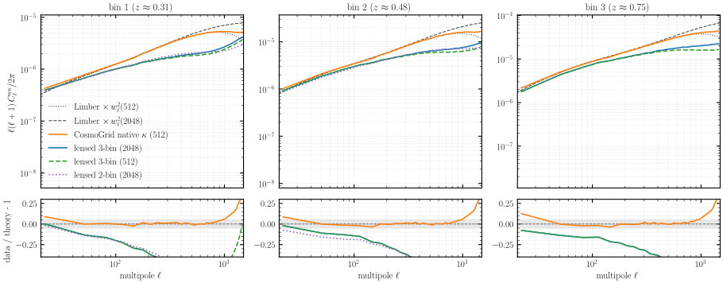
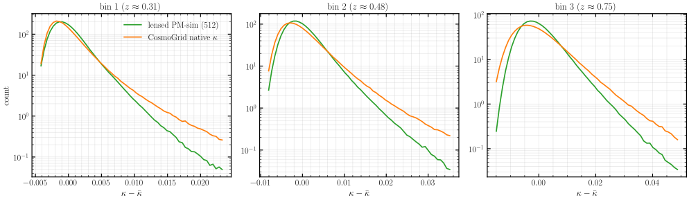
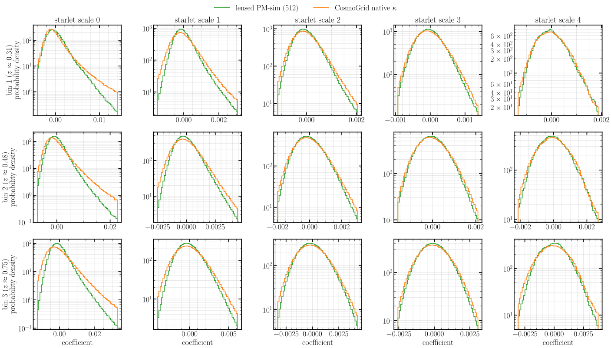
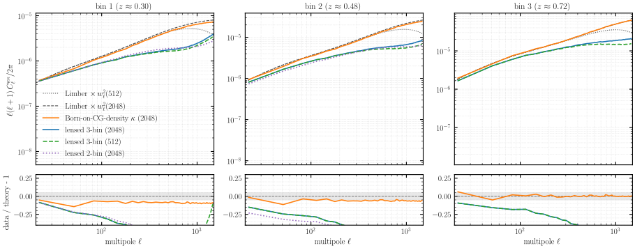
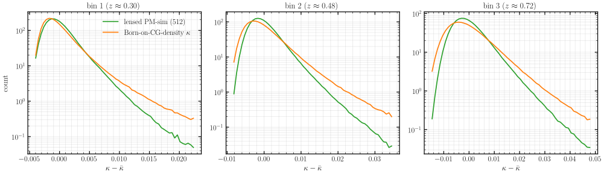
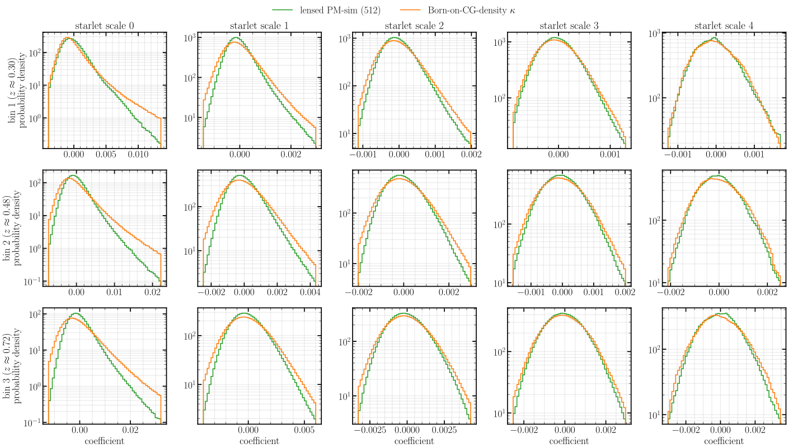

# Experiment 07 — Born lensing on the CosmoGrid shells

## Goal

Validate jax-fli's Born-approximation weak lensing **end to end**: integrate the
[experiment 06](../06-cosmogrid-shells/) PM density lightcones into tomographic convergence (κ) and
check, statistically, that it reproduces a trusted reference — for two weak-lensing source
distributions.

- **Stage-3** — vs **CosmoGrid's own** convergence (`cosmogrid_sample_kappa`, the gold standard from
  CosmoGrid's native lensing pipeline). This is the strict end-to-end test: does *our* density →
  Born → κ chain reproduce *CosmoGrid's* lensing?
- **DES Y3** — vs our **Born-on-CosmoGrid-density** κ (`kappa_born_des`). There is no native CosmoGrid
  DES convergence, so the Born integral of CosmoGrid's *own* published density (validated against
  Limber theory in [experiment 00](../00-cosmogrid-reference/)) is the reference; the comparison then
  isolates the **density** difference (CosmoGrid's N-body vs our PM), the Born method being identical.

Both source sets are also put against **Limber weak-lensing theory**.

The runs — every published exp-06 density lightcone Born-integrated for both sources:

| dimension | values |
|-----------|--------|
| source `n(z)` | Stage-3, DES Y3 |
| tomographic depth | 2-bin (sources `[:2]`, `z ≤ 0.82`), 3-bin (sources `[:3]`, `z ≤ 1.06`) |
| footprint | full-sky, big-quadrant |
| decomposition | slab, pencil |

That is `2 × 2 × 2 = 8` density lightcones × 2 source distributions = **16 Born runs** (`fli-born-rt`,
`--min-z 0.01`, `--n-integrate 32`, `--normalization global`, float64, **8 GPU** = 2 nodes × 4, slab
`--pdim 8 1`). The figures below use the **full-sky slab** pair (2-bin and 3-bin); the Born integral is
geometry-agnostic, so the footprint/decomposition variants ride on the exp-06 density cross-checks.

## Method

`run.sh` runs `fli-born-rt`, Born-integrating the published exp-06 nside-2048 density lightcones
(fullsky-slab, the 2-bin and 3-bin source depths) for the Stage-3 and DES-Y3 source `n(z)`, each
sliced to the lightcone's depth (`s3[:n]` / `des_y3[:n]`, so sim bin *i* matches reference bin *i*).
float64. The convergence catalogs are pushed to HuggingFace
(`07-cosmogrid-lensing/kappa/…`, with measured spectra under `07-cosmogrid-lensing/spectra/…`) and
studied locally by [`build.py`](build.py).

A few lensing-specific points shape every figure:

- **κ is dimensionless** — unlike the density (overdensity), no unit conversion is needed.
- **Independent realisations.** Our PM density and CosmoGrid's density are different IC fields, so the
  comparison is purely statistical (κ `C_ℓ`, PDF, starlet); a pixel-wise map difference is
  **uncorrelated** (it keeps the full amplitude, no cancellation — the bottom row of the map figures).
- **Monopole.** CosmoGrid's κ carries the (positive, growing-with-depth) mean convergence; ours is
  mean-zero. The angular `C_ℓ` at `ℓ ≥ 2` is monopole-free, but the **PDF / starlet / maps subtract
  the per-bin mean** (`κ − κ̄`) so the two are compared like-for-like.
- **Resolution.** Theory is always put on the measured pixel-window footing
  (`× pixwin²(nside)` before binning, per series' nside). Our lensed κ is shown at its native
  **nside 2048** *and* downsampled to **512**; pixel-wise **differences are taken at the matched 512**.

## Results — Stage-3: lensed PM-sim vs CosmoGrid native

The convergence angular power spectrum, per tomographic bin, against CosmoGrid's own κ and Limber
theory:



CosmoGrid's native κ and our lensed PM-sim both track the theory through the intermediate band; the
2-bin and 3-bin runs overlie on their shared bins (the box depth does not bias the shared sources).
The 512-downsampled lensed curve loses power earlier than the native-2048 one — the un-deconvolved CIC
window and the lower-resolution map, exactly the high-`ℓ` story of experiment 06, now propagated
through the Born integral. The headline caveat is the **nearest bin**: convergence is **worst in bin 1**
(`z ≈ 0.31`), whose ratio scatters most and sits furthest from theory, while the deeper bins (2, 3) track
it cleanly. That is expected — the low-redshift bin's lensing kernel weights the **near shells**, which
experiment 06 showed are the least converged (the PM gravity is least accurate closest in), so the
deepest, best-converged density feeds the best κ and the nearest, lowest-signal bin the worst.

The one-point PDF (monopole removed, matched nside 512):



Both peak just below `κ = 0` (the typical under-dense line of sight) with the characteristic positive
lensing tail. CosmoGrid carries a **heavier high-κ tail** — a real N-body resolves more massive
collapsed structures than our CIC-PM, the lensing echo of the density-PDF tail in experiment 06.

The starlet (spherical-wavelet) coefficients resolve that statement by scale, with the three
tomographic bins stacked as rows:



The coarse scales agree; the divergence is confined to the finest scale, where the CIC window and the
resolution gap live. The same coefficients as maps (deepest bin), per scale:


fine scales (left) carry the small-scale detail, coarse scales (right) the smooth field; the bottom
row is the lensed − reference difference, structureless at full amplitude (independent realisations).

The convergence itself (magma; clusters bright, voids dark) — read for texture, not coincidence:


Top row our lensed κ, middle CosmoGrid's, bottom their (diverging) difference. The textures match per
bin; the difference is structureless at full amplitude — two uncorrelated fields sharing their statistics.

## Results — DES Y3: lensed PM-sim vs Born-on-CG-density

The same five panels for the DES Y3 sources, with the Born-on-CosmoGrid-density κ as the reference:






Here both sides use the **same Born method** — the reference integrates CosmoGrid's density, our sim
integrates its own PM density — so the comparison isolates the underlying density field. The spectra
agree with theory over the intermediate band; the PDF and starlet again show the reference's heavier
small-scale tail (CosmoGrid's N-body density vs our PM), and the map difference is again the
full-amplitude, uncorrelated signature of independent realisations.

## How to run

```bash
# 1. Born-integrate the exp-06 density lightcones into convergence (SLURM); pushes to HuggingFace.
MODE=dryrun bash run.sh    # resolve the launches without submitting
bash run.sh

# 2. Build the figures (fig01–fig08) from the published κ products (CPU; float64; loads two ~1.2 GB
#    nside-2048 κ maps from the HF cache). Starlet figures (fig03/04/08/09) need `uv sync --extra starlet`.
JAX_PLATFORMS=cpu uv run --no-sync python build.py
```

`build.py` loads only the published spectra/maps from the `ASKabalan/jax-fli-experiments`
dataset — no GPU and no re-simulation.
