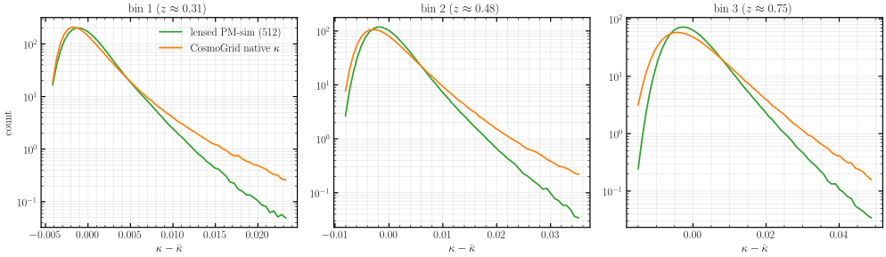
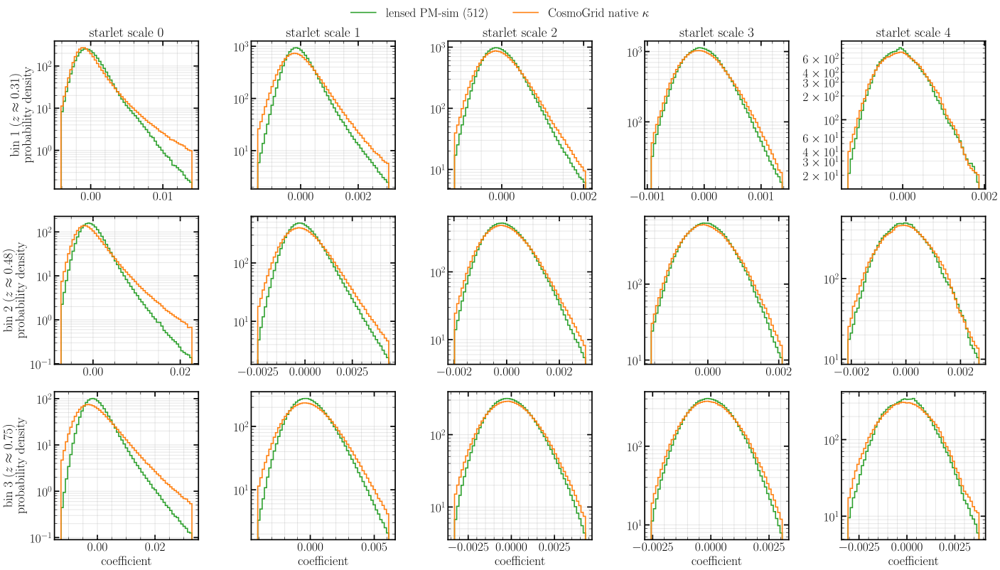
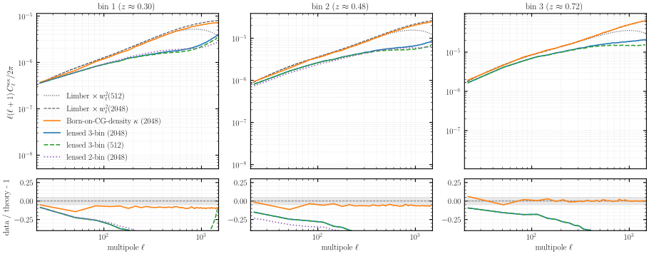
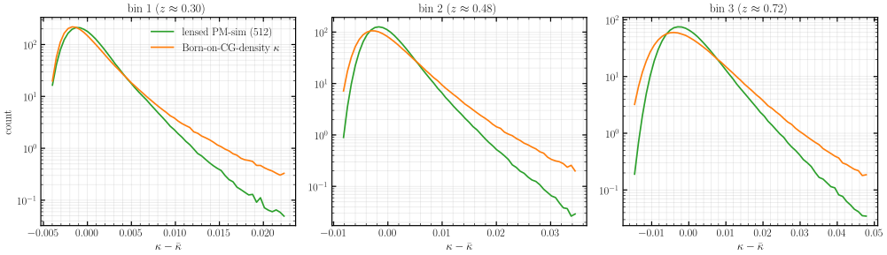
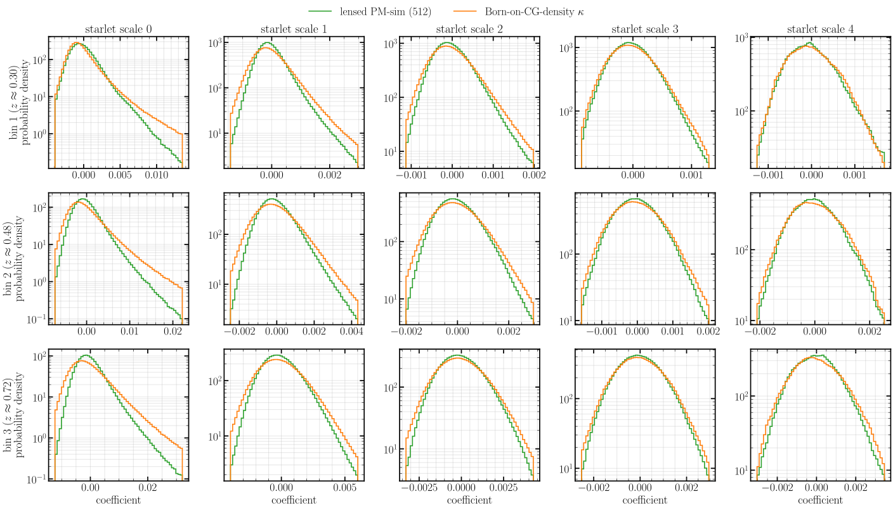

# Experiment 07 — Born lensing on the CosmoGrid shells

**Goal.** We validate the Born-approximation weak lensing of jax-fli **end to end**: the PM density lightcones of [Experiment 06](../06-cosmogrid-shells/README.md) are integrated into tomographic convergence κ and compared statistically with a trusted reference for two source distributions. For **Stage-3** the reference is the **native CosmoGrid** convergence (`cosmogrid_sample_kappa`), which makes this the strict test of our density → Born → κ chain against the CosmoGrid lensing pipeline. For **DES Y3** CosmoGrid has no native convergence, so the reference is the Born integral of the CosmoGrid density itself (`kappa_born_des`, validated against Limber theory in [Experiment 00](../00-cosmogrid-reference/README.md)); with the same Born method on both sides, the comparison isolates the density, CosmoGrid N-body against our PM. Both source sets are also compared with Limber weak-lensing theory.

| dimension | values |
|-----------|--------|
| source `n(z)` | Stage-3, DES Y3 |
| tomographic depth | 2-bin (sources `[:2]`, `z ≤ 0.82`), 3-bin (sources `[:3]`, `z ≤ 1.06`) |
| footprint | full-sky, big-quadrant |
| decomposition | slab, pencil |

*Fixed:* `2 × 2 × 2 = 8` density lightcones × 2 source distributions = **16 Born runs** (`fli-born-rt`, `--min-z 0.01`, `--n-integrate 32`, `--normalization global`, float64, **8 GPUs** = 2 nodes × 4, slab `--pdim 8 1`). The figures use the **full-sky slab** pair (2-bin and 3-bin); the Born integral does not depend on the geometry, so the footprint and decomposition variants rest on the density cross-checks of Exp 06.

## Method

`run.sh` Born-integrates the published nside-2048 density lightcones of Exp 06 for the Stage-3 and DES Y3 source `n(z)`, each sliced to the depth of the lightcone (`s3[:n]` / `des_y3[:n]`), so that simulated bin *i* matches reference bin *i*. The convergence maps go to HuggingFace under `07-cosmogrid-lensing/kappa/`, with their spectra under `07-cosmogrid-lensing/spectra/`, and [`build.py`](build.py) studies them locally. κ is dimensionless and needs no unit conversion. Our PM density and the CosmoGrid density come from different initial conditions, so we compare `C_ℓ`, PDF and starlet statistics, and a pixel-wise difference keeps the full amplitude of two uncorrelated fields. The CosmoGrid κ carries the positive mean convergence, which grows with depth, while ours has zero mean; `C_ℓ` at `ℓ ≥ 2` is free of the monopole, and the PDF, starlet and map figures subtract the per-bin mean (`κ − κ̄`). The theory is multiplied by `pixwin²(nside)` of each series before binning. Our κ is shown at its native **nside 2048** and down-sampled to **512**, and every pixel-wise difference is taken at the matched 512.

## Results — Stage-3: lensed PM against native CosmoGrid


**Stage-3 convergence spectra.** Per tomographic bin, the native CosmoGrid κ and our lensed PM track the theory through the intermediate band, and the 2-bin and 3-bin runs overlie on their shared bins, so the box depth leaves the shared sources unbiased. Our curve down-sampled to 512 loses power earlier than the native 2048 one, from the un-deconvolved CIC window and the coarser map, the high-`ℓ` behaviour of Exp 06 carried through the Born integral. The agreement is worst in **bin 1** (`z ≈ 0.31`), whose ratio scatters most and sits furthest from theory, while bins 2 and 3 track it cleanly. The low-redshift kernel weights the near shells, which Exp 06 found the least converged.



**Stage-3 convergence PDF.** Monopole removed, matched nside 512. Both PDFs peak just below `κ = 0`, the typical underdense line of sight, with the positive lensing tail. CosmoGrid carries a **heavier high-κ tail**, since a full N-body run resolves more massive collapsed structures than our CIC-PM, the lensing counterpart of the density-PDF tail of Exp 06.



**Stage-3 starlet coefficients.** The three tomographic bins in rows. The coarse scales agree, and the divergence is confined to the finest scale, where the CIC window and the resolution gap act.


**Stage-3 starlet coefficient maps, deepest bin.** Fine scales (left) carry the small-scale detail and coarse scales (right) the smooth field. The bottom row, lensed minus reference, keeps the full amplitude without structure, as expected for independent realisations.


**Stage-3 convergence maps.** Our lensed κ (top), CosmoGrid (middle) and their difference (bottom, diverging scale), with clusters bright and voids dark. The textures match per bin, and the difference keeps the full amplitude of two uncorrelated fields that share their statistics.

## Results — DES Y3: lensed PM against Born on the CosmoGrid density






**DES Y3 convergence: spectra, PDF, starlet and maps.** The same five panels, with the Born integral of the CosmoGrid density as the reference. Both sides use the same Born method, so the comparison isolates the underlying density field. The spectra agree with theory over the intermediate band, the PDF and starlet again show the heavier small-scale tail of the CosmoGrid N-body density, and the map difference keeps the full amplitude of independent realisations.

## How to run

```bash
MODE=dryrun bash run.sh    # resolve the launches without submitting
bash run.sh                # Born-integrate the Exp 06 lightcones (SLURM) and push to HuggingFace
JAX_PLATFORMS=cpu uv run --no-sync python build.py   # fig01–fig10 from the published κ; starlet figures need `uv sync --extra starlet`
```

`build.py` loads only the published spectra and maps of `ASKabalan/jax-fli-experiments`, including two ~1.2 GB nside-2048 κ maps from the HF cache, with no GPU and no re-simulation.
