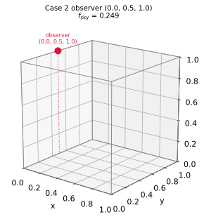
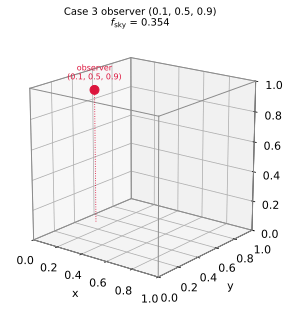
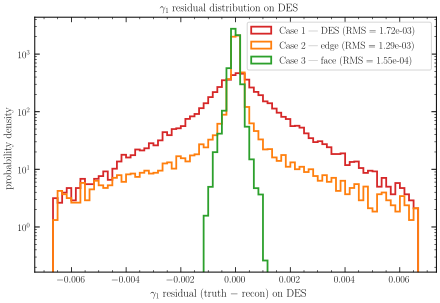
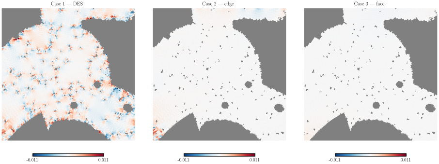
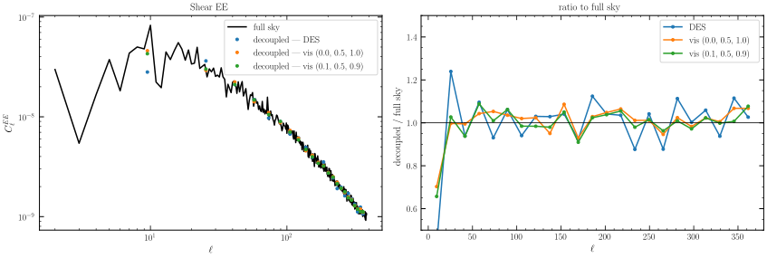

# Experiment 08 — Masked shear from a CosmoGrid convergence map

Weak-lensing surveys observe shear only inside a survey **footprint**. Recovering shear from a convergence map with a Kaiser–Squires (KS) κ → γ transform is a non-local, full-sky operation, so applying it on a **cut sky** leaks power across the mask boundary and biases the recovered shear near the edge. This experiment quantifies that leakage on a real CosmoGrid convergence map for three footprints, and checks that the **mask-decoupled** shear `EE` spectrum still tracks the full-sky truth.

The runnable script is [`08-masked-shear.py`](08-masked-shear.py); it drives the `jax-fli` package end-to-end (no inline spherical-harmonic code) and saves every figure below as SVG.

> Float64 is mandatory here: the masked spin-2 mode-coupling (decoupling) solve is ill-conditioned in float32 and silently returns **all-NaN** spectra. The script enables `jax_enable_x64` *before* importing `jax_fli`.

---

## The three footprints

We compare a real survey mask against two **observer-visibility** masks:


*Left:* the **DES Y3** survey footprint (`jax_fli.data.get_desy3_mask`) — a contiguous southern cap riddled with interior holes (masked stars, bad fields). *Middle/right:* the two **visibility** footprints, the set of sky directions whose ray from an off-center observer crosses the simulation box (`jaxpm.spherical.spherical_visibility_mask`). These are clean, hole-free caps.

The visibility geometry is a **cone about the observer's nearest box-face normal** — *not* a θ/φ rectangle. For an observer a fractional depth `δ` inside a face with inward normal `n̂`, a direction `d` is visible iff `d·n̂ ≥ −δ/R_min`, giving `f_sky = (1 + δ/R_min)/2`. An observer **on a face** (`δ=0`) sees a clean hemisphere; an **edge** observer sees a quarter sky; pulling slightly inside a face grows the cap past a hemisphere.

### Where the observer sits

The footprint is set entirely by *where the observer stands relative to the box*. The two panels below place each visibility observer in the unit box `[0,1]³`:




*Case 2* sits exactly on the `x=0, z=1` **edge** → a quarter-sky cap (`f_sky ≈ 0.25`). *Case 3* is pulled a little inside (`δ=0.1` from the `x=0` and `z=1` faces) → the cap grows to `f_sky ≈ 0.35`, just large enough that **DES sits entirely inside it** (100 % coverage).

| case | observer | f_sky | DES coverage |
|------|----------|------:|-------------:|
| 1 — DES Y3 | survey mask | — | — |
| 2 — visibility (edge) | `(0.0, 0.5, 1.0)` | 0.249 | 0.915 |
| 3 — visibility (face) | `(0.1, 0.5, 0.9)` | 0.354 | 1.000 |

Every footprint is apodized with a 2° C2 window before the KS transform.

---

## Masked vs full-sky shear

For each footprint we apply KS to the apodized-masked κ (the cut-sky estimate) and compare it to the full-sky truth. Each panel is `(κ / γ1 / γ2)` rows × `(full sky / masked / residual)` columns; full-sky and masked maps use `magma`, the **residual** (cut-sky minus full-sky, on the DES footprint) uses diverging `RdBu_r`. We report the shear residual RMS relative to the full-sky RMS over DES.

### Case 1 — bare DES mask


KS through the survey footprint leaks strongly, and the masked maps inherit the survey's interior holes — the residual map lights up *inside* DES, not just at the edge. **Residual RMS / full-sky = 0.408.**

### Case 2 — visibility mask (edge), observer `(0.0, 0.5, 1.0)`


A *contiguous* footprint with no interior holes, so the in-DES leakage drops (**residual RMS / full-sky = 0.302**, down from 0.408). But DES is only 92 % covered: the cap boundary cuts across the survey, so a substantial residual remains — concentrated toward the under-covered side rather than spread evenly through the interior.

### Case 3 — visibility mask (near-edge), observer `(0.1, 0.5, 0.9)`


The cap now **fully contains DES** (100 % coverage) with a clean apodized margin, so the KS leakage falls almost entirely outside the survey region; only faint residual remains near the boundary. **Residual RMS / full-sky = 0.038** — a clean reconstruction.

---

## γ1 residual across the three masks

We focus on one shear component, **γ1**, and look at its residual (`truth − recon`) over the DES pixels two ways: the *distribution* of residual values, and a *map* of where they sit.

### Residual distribution



The probability density of the γ1 residual over DES pixels, one curve per mask (log density; the legend carries each curve's RMS). The DES mask is the broadest, the containing cap the most sharply peaked at zero — the same 0.408 → 0.302 → 0.038 ordering, now as a width of the error distribution.

### Residual map (DES zoom)



A `gnomview` zoom onto the DES field for each mask, on a single shared `RdBu_r` scale set by the full-sky signal (colour = a real mis-reconstruction, white = recovered). The residual decreases left → right; the grey specks are DES interior holes (no data → NaN).

---

## Mask-decoupled shear EE spectrum

`SphericalShearField.angular_cl(mask=…)` returns mode-decoupled `(EE, EB, BB)` bandpowers (no E/B purification). The decoupled `EE` should recover the full-sky `EE`; the bare-DES mask (holes, hard edges) decouples worst.



Median decoupled-EE / full-sky ratio over the reliable band (40 < ℓ < 1.5·nside = 192):

| footprint | ratio |
|-----------|------:|
| DES Y3 | 1.030 |
| visibility `(0.0, 0.5, 1.0)` | 1.026 |
| visibility `(0.1, 0.5, 0.9)` | 0.997 |

All three recover the full-sky `EE` to a few percent over the band, and the **containing cap is essentially unbiased** (0.997). So even where the map-space residual is large (Case 1), the decoupled *spectrum* is accurate to ≈ 3 %; the leakage is a boundary effect that the mode-coupling deconvolution mostly removes, and it disappears once the footprint cleanly contains the survey.

---

## Reproduce

```bash
# from this directory; sets jax_enable_x64 internally, loads the kappa from HuggingFace
python 08-masked-shear.py
```

The script loads the CosmoGrid convergence from the `00-cosmogrid-kappa` HuggingFace config (Experiment 0), downgrades to `nside = 128`, picks tomographic bin 3, and writes the SVG figures into `assets/` (committed — Read the Docs builds without a GPU or HuggingFace access) plus a `data/masked_shear.npz` cache of the headline arrays.
