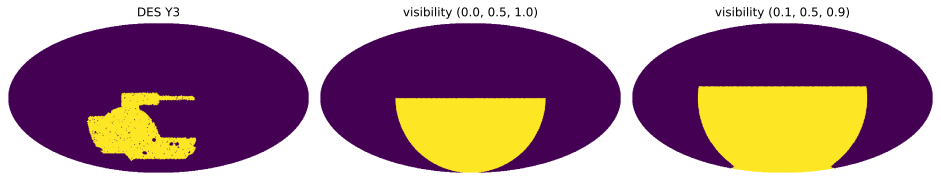
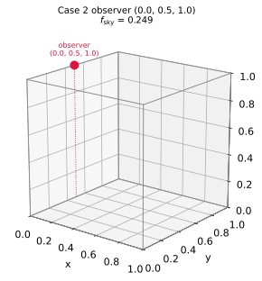
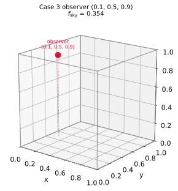
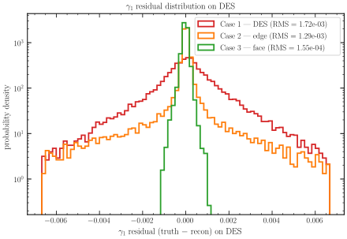

# Experiment 08 — Masked shear from a CosmoGrid convergence map

**Goal.** Weak-lensing surveys observe shear only inside a survey **footprint**. The Kaiser–Squires (KS) transform κ → γ is a non-local, full-sky operation, so on a **cut sky** it leaks power across the mask boundary and biases the recovered shear near the edge. We measure this leakage on a CosmoGrid convergence map for three footprints, and check that the **mask-decoupled** shear `EE` spectrum still tracks the full-sky truth.

| case | footprint | observer | f_sky | DES coverage |
|------|-----------|----------|------:|-------------:|
| 1 | DES Y3 survey mask | — | — | — |
| 2 | visibility (edge) | `(0.0, 0.5, 1.0)` | 0.249 | 0.915 |
| 3 | visibility (face) | `(0.1, 0.5, 0.9)` | 0.354 | 1.000 |

*Fixed:* CosmoGrid convergence of the `00-cosmogrid-000001-kappa` config (Experiment 00), down-graded to `nside = 128`, tomographic bin 3; every footprint apodised with a 2° C2 window before the KS transform; float64. The masked spin-2 mode-coupling solve is ill-conditioned in float32 and returns **all-NaN** spectra, so [`build.py`](build.py) enables `jax_enable_x64` before importing `jax_fli`.

## Method

The DES Y3 footprint comes from `jax_fli.data.get_desy3_mask`. A visibility footprint is the set of sky directions whose ray from an off-centre observer crosses the simulation box (`jaxpm.spherical.spherical_visibility_mask`), a cone about the nearest box-face normal of the observer. For an observer a fractional depth `δ` inside a face with inward normal `n̂`, a direction `d` is visible when `d·n̂ ≥ −δ/R_min`, which gives `f_sky = (1 + δ/R_min)/2`: an observer on a face (`δ=0`) sees a hemisphere, one on an edge a quarter of the sky, and one pulled slightly inside a face a cap larger than a hemisphere. For each footprint we apply KS to the apodised masked κ and compare the result with the full-sky truth, reporting the RMS of the shear residual over DES relative to the full-sky RMS. `build.py` drives the `jax-fli` package end to end, with no inline spherical-harmonic code.

## Results



**Survey and visibility footprints.** Left: the DES Y3 footprint, a contiguous southern cap with interior holes (masked stars, bad fields). Middle and right: the two visibility footprints, clean caps without holes.




**Observer placement in the unit box `[0,1]³`.** Case 2 sits on the `x=0, z=1` edge and sees a quarter-sky cap (`f_sky ≈ 0.25`). Case 3 is pulled inside by `δ=0.1` from the `x=0` and `z=1` faces, which grows the cap to `f_sky ≈ 0.35`, large enough to contain DES entirely.


**Case 1, DES mask.** Rows κ, γ1 and γ2; columns full sky, masked and residual (cut sky minus full sky, on the DES footprint), with `magma` for the maps and `RdBu_r` for the residual. KS through the survey footprint leaks strongly, and the masked maps inherit the interior holes, so the residual lights up inside DES as well as at the edge. **Residual RMS / full-sky = 0.408.**


**Case 2, visibility mask on the edge, observer `(0.0, 0.5, 1.0)`.** The contiguous footprint has no interior holes, and the leakage inside DES drops to **0.302**. The cap covers 92% of DES, so its boundary cuts across the survey and a substantial residual remains, concentrated toward the under-covered side.


**Case 3, visibility mask near the edge, observer `(0.1, 0.5, 0.9)`.** The cap contains DES entirely with a clean apodised margin, so the KS leakage falls almost entirely outside the survey, and only a faint residual remains near the boundary. **Residual RMS / full-sky = 0.038.**



**Distribution of the γ1 residual (truth − recon) over the DES pixels.** One curve per mask on a log density, with the RMS of each in the legend. The DES mask gives the broadest distribution and the containing cap the most sharply peaked, the same 0.408 → 0.302 → 0.038 ordering expressed as the width of the error distribution.


**γ1 residual on the DES field, three masks.** A `gnomview` zoom on one shared `RdBu_r` scale set by the full-sky signal, where colour marks a mis-reconstruction and white a recovered pixel. The residual decreases from left to right, and the grey specks are DES interior holes (no data, NaN).


**Mask-decoupled shear `EE` against the full sky.** `SphericalShearField.angular_cl(mask=…)` returns mode-decoupled `(EE, EB, BB)` bandpowers, without E/B purification. The median decoupled-EE / full-sky ratio over the reliable band 40 < ℓ < 1.5·nside = 192 is 1.030 for DES Y3, 1.026 for the edge cap `(0.0, 0.5, 1.0)` and 0.997 for the containing cap `(0.1, 0.5, 0.9)`. All three recover the full-sky `EE` to a few percent, and the containing cap is essentially unbiased. Even where the residual in map space is large (Case 1), the decoupled spectrum is accurate to ≈ 3%: the mode-coupling deconvolution removes most of the boundary leakage, and a footprint that contains the survey removes the rest.

## How to run

```bash
JAX_PLATFORMS=cpu uv run --no-sync python build.py   # enables jax_enable_x64 itself; loads κ from HuggingFace
```

The script writes the SVG figures to `assets/` and caches the headline arrays in `data/masked_shear.npz`.
