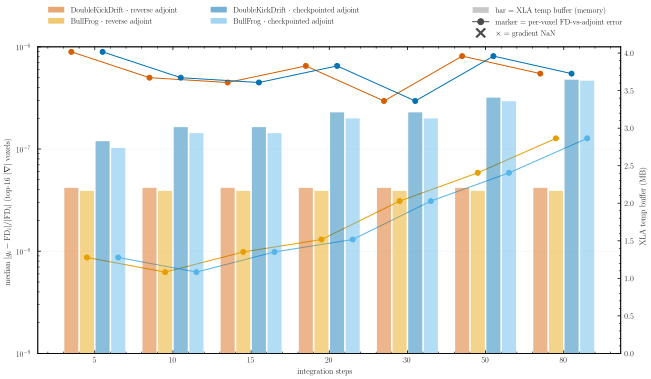
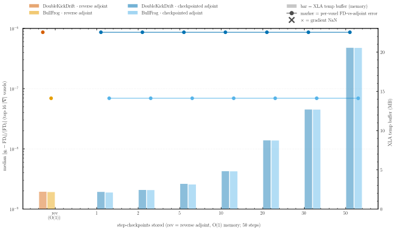
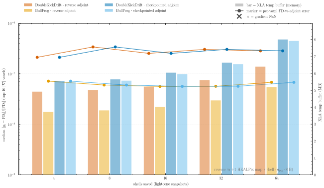

# Experiment 09 — Gradient validation

Field-level inference needs the gradient of the forward model with respect to the initial conditions, `∂L/∂δ`. This experiment checks that `jax-fli` computes that gradient **correctly** — by comparing the reverse-mode adjoint against an **independent per-voxel finite difference** — and characterises the **memory** each of its two adjoints needs, for the spherical output the weak-lensing science actually uses:

- **single spherical output** — one HEALPix lightcone shell (`nb_shells=1`), i.e. just the last shell at `a=1.0`.
- **spherical lightcone** — several saved HEALPix shells (`nb_shells > 1`).

Everything runs in **float64 on GPU** at a small **16³** mesh, where the finite difference is clean and cheap and a full accuracy + memory sweep is fast. Memory is the XLA scratch buffer (`temp_size_in_bytes`) of the compiled gradient; at 16³ it is a few MB, so the figures show the **scaling trend** — `reverse` flat, `checkpointed` growing with what it stores — not production magnitudes. The multi-GB production-scale trade at 64³ is [Experiment 12](../12-scaling-gradient/README.md).

`jax-fli` offers two adjoints:

- **`reverse`** — a reversible backsolve. It stores *no* trajectory (O(1) memory in the integration steps) and reconstructs it on the backward pass by *inverting* each step.
- **`checkpointed`** — an equinox checkpointed scan. It *recomputes* forward segments instead of inverting them, storing a tunable number of checkpoints.

```python
from jax_fli import nbody

result = nbody(
    cosmo, dx, p, solver=solver, nb_shells=4,
    adjoint="checkpointed",   # or "reverse" for the O(1)-memory backsolve, or None for forward-mode AD
    checkpoints=10,           # checkpoints the outer scan over SAVED SHELLS   (memory control, see Exp 12)
    step_checkpoints=6,       # checkpoints the inner INTEGRATION-STEP loop within each shell
)
```

The two checkpoint controls are independent: `checkpoints` checkpoints the outer scan over the saved shells, `step_checkpoints` the inner integration-step loop between two consecutive shells. Both trade recompute for memory and — as the tests below show — **neither changes the gradient value**. For more on running PM simulations, see [03-PM-Simulation](../../1-introduction-and-basics/03-PM-Simulation.ipynb).

## Goal of this experiment

We check two things about the two adjoints — `reverse` and `checkpointed`:

1. **Accuracy** — do they return the *true* gradient? Cross-checked against a per-voxel finite difference, in [§ Correctness](#correctness--finite-differences-vs-the-adjoint).
2. **Cost** — how much scratch memory does each need, and how does that scale with the three controls the forward model exposes? Each test below fixes every degree of freedom but one and sweeps it:
   - **number of integration steps** → [§ Number of integration steps](#number-of-integration-steps);
   - **number of step-checkpoints** → [§ Number of step-checkpoints](#number-of-step-checkpoints);
   - **number of saved lightcone shells** → [§ Number of saved shells](#number-of-saved-shells).

The wall-time and peak-memory side of "cost" at **production resolution** is quantified in [Experiment 12](../12-scaling-gradient/README.md); here we settle accuracy and show how the adjoint *temp* (scratch) memory scales.

## Method

**Loss and outputs.** The observable is the **scalar** loss `L = ½ Σ observable.array²` — exactly the loss `fli-simulate --grad` differentiates ([`scripts/entry/fli_simulate.py`](../../../src/jax_fli/scripts/entry/fli_simulate.py)) — where `observable` is a **spherical HEALPix** painting, either one shell (`nb_shells=1`) or a multi-shell lightcone.

**The finite-difference test.** For the **16 voxels with the largest `|∂L/∂δ|`** we compare the adjoint's gradient component `g_i` to a central finite difference of the scalar loss,

FD_i  =  [ L(δ + ε e_i) − L(δ − ε e_i) ] / (2 ε),   ε = machine_eps^(1/3),

and report the **median** relative error `|g_i − FD_i| / |FD_i|` over those 16 voxels. Picking high-signal voxels (large `|g_i|`) and taking the median keeps the FD denominator away from zero, so the check lands at the float64 central-difference floor. That floor is set by the **finite difference's own truncation error** (`∝ ε²·L‴`), so it depends on the solver's loss curvature: BullFrog lands at **~1e-8**, DoubleKickDrift at **~5e-7** — both far below 1, and both **backend-independent** (CPU and GPU agree per solver). The gap is a property of the FD *reference*, not of the adjoint: `reverse ≡ checkpointed` bit-for-bit for each solver, and the transpose test below pins the gradient itself to `~10⁻¹²`.

The finite difference is the **looser, independent** cross-check. The sharp, finite-difference-**free** correctness proof is the **AD-vs-AD transpose test**: forward-mode AD `⟨w, Jv⟩` equals the adjoint `⟨Jᵀw, v⟩`, so `reverse ≡ checkpointed ≡ forward-mode AD` to `~10⁻¹²` in float64 — verified for **both** the single output *and* the **4-shell lightcone** (the novel multi-shell accumulation described below, where with one shell there is nothing to accumulate). The N-body suite covers this: the single-output transpose in `tests/nbody/test_adjoints.py::test_adjoint_transpose`, and the lightcone `reverse ≡ checkpointed` equality through *saved snapshots* in `test_reverse_vs_checkpointed_lightcone`.

A lightcone observable is **not** a single final-state output: the forward model saves many intermediate snapshots and paints each onto the sky, so its gradient must **accumulate** the cotangent of *every* saved shell back through the one shared particle trajectory. The differentiable particle-mesh codes that predate this — [pmwd](https://github.com/eelregit/pmwd) and [DISCO-DJ](https://github.com/cosmo-sims/DISCO-DJ) — implement the adjoint for the **final state only**; they do not propagate gradients through a multi-snapshot lightcone. `jax-fli` adds that accumulation in its custom reverse-mode: sweeping from the outermost shell inward, it injects each shell's painting cotangent into the running trajectory adjoint, then propagates it back through the integration steps to the initial conditions.


*(Rendered from [`lightcone-gradient-algorithm.tex`](lightcone-gradient-algorithm.tex).)*

**How we measure memory.** The XLA scratch buffer `temp_size_in_bytes`, read from the compiled reverse/checkpointed gradient (`jax.jit(jax.grad(...)).lower(x).compile().memory_analysis()`). The `checkpointed` adjoint's stored trajectory lands in this scratch (it appears in the HLO as stacked `[n_stored, …, 3]` particle buffers), so `temp` tracks the memory that distinguishes the two adjoints. On GPU this buffer fully captures the FFT scratch (verified: `reverse` temp scales with the mesh, 6.95× from 16³→32³), but cuFFT is leaner in absolute terms than a CPU run — so the **absolute MB are backend-specific and small at 16³** (single-digit MB). Read the figures for the *scaling trend*; Experiment 12 has the production magnitudes.

**Configs.** **float64 on GPU**, **16³** mesh (`nside=16`, box 1000 Mpc/h). **Accuracy** (fig01): DoubleKickDrift + BullFrog, single spherical output and a 4-shell lightcone. **Memory** sweeps (fig02–04): both solvers, `reverse` vs `checkpointed` — the memory behaviour is solver-independent (the two solvers' scratch matches to ~0.1 MB).

## Results

### Correctness — finite differences vs the adjoint

*Do the adjoints return the true gradient?* The panel plots the median per-voxel FD-vs-adjoint relative error for the four solver×adjoint series, for the single spherical output and the 4-shell lightcone.

| Setting | Value |
| --- | --- |
| Mesh resolution | 16³ |
| HEALPix `nside` | 16 |
| Box size | 1000 Mpc/h |
| Integration | a = 0.001 → 1.0, 20 steps |
| Outputs | single spherical (`nb_shells=1`), lightcone (`nb_shells=4`) |
| Solvers | DoubleKickDrift, BullFrog |
| Adjoints | reverse, checkpointed |
| Reference | per-voxel central finite difference, median over the 16 largest-`\|grad\|` voxels |
| Precision | float64 |


The `reverse` and `checkpointed` markers **overlap exactly** within each solver group — the two adjoints compute the **same** gradient (bit-for-bit). The per-voxel finite difference confirms that gradient to **~1 × 10⁻⁸ (BullFrog)** and **~5 × 10⁻⁷ (DoubleKickDrift)** for both the single output and the lightcone — both far below 1, confirming the gradient independently of autodiff. The two solvers differ only because the finite difference's *own* truncation error (`∝ ε²·L‴`) sees a different loss curvature for each; it is **not** an adjoint difference (CPU and GPU give the same floor per solver, and `reverse ≡ checkpointed` exactly). The sharper, finite-difference-free proof is the transpose test: `reverse ≡ checkpointed ≡ forward-mode AD` to `~10⁻¹²`. So the gradient is **correct**; the finite difference shown here is the looser, independent cross-check.

### Number of integration steps

*How does each adjoint's scratch scale as the integration deepens?* Single spherical output at **16³**; `checkpointed` stores ~`log₂(steps)` integration-step states.

| Setting | Value |
| --- | --- |
| Mesh resolution | 16³ |
| HEALPix `nside` | 16 |
| **Swept — integration steps** | **5, 10, 15, 20, 30, 50, 80** |
| Output | single spherical (`nb_shells=1`) |
| Solvers / Adjoints | DoubleKickDrift, BullFrog / reverse, checkpointed |



**`reverse` is flat — `2.2 MB` at every step count (5 → 80):** it stores *no* trajectory, so it is **O(1) in the integration steps** (it reconstructs each state by inverting the step). `checkpointed` grows — **2.8 → 3.6 MB** — because it stores ~`log₂(steps)` particle-states. Reverse is the lean, flat baseline; the deeper the integration, the more checkpointed pays to keep its stored states. (The accuracy markers also creep upward with steps — more steps is a genuinely different, more nonlinear integration, so the finite difference's truncation grows; it is not a change in the adjoint, and `reverse ≡ checkpointed` throughout.)

### Number of step-checkpoints

*At a fixed 50 steps, what does storing more `step_checkpoints` cost?* `reverse` (flat) vs `checkpointed` storing 1 → 50 integration-step states.

| Setting | Value |
| --- | --- |
| Mesh resolution | 16³ |
| HEALPix `nside` | 16 |
| Integration steps | 50 (fixed) |
| **Swept — step-checkpoints** | **1, 2, 5, 10, 20, 30, 50** |
| Output | single spherical (`nb_shells=1`) |
| Solvers / Adjoints | DoubleKickDrift, BullFrog / reverse, checkpointed |



This is the pure **memory↔recompute trade**, and `step_checkpoints` **never changes the gradient** — the accuracy markers are **dead flat** across every checkpoint count (DoubleKickDrift ~5e-7, BullFrog ~7e-8), and the N-body suite asserts the invariance (`test_step_checkpoints_invariant`). `checkpointed` climbs with the stored count — **2.2 → 20.6 MB** (1 → 50 checkpoints) — while `reverse` is flat at **2.2 MB**, O(1) in the checkpoints. At 1 checkpoint (maximal recompute) checkpointed *ties* reverse; it crosses reverse around ~5 checkpoints and reaches ~9× by 50. So reverse is the fixed-overhead baseline that wins against the realistic (default and heavier) checkpointing regime. (The memory is solver-independent — BullFrog's bars match DoubleKickDrift's to ~0.1 MB.)

### Number of saved shells

*For a real lightcone — many saved shells at fixed steps — how does each adjoint scale?* Shell counts start at 4 (a 1–2-shell "lightcone" is degenerate); 80 integration steps so that `nb_shells ≤ n_steps` holds up to
64. The checkpointed series sets its inner `step_checkpoints` to `⌈log₂(steps between two consecutive shells)⌉ = ⌈log₂(80 / nb_shells)⌉` (5 → 1 as shells go 4 → 64).

| Setting | Value |
| --- | --- |
| Mesh resolution | 16³ |
| HEALPix `nside` | 16 |
| Integration steps | 80 (fixed) |
| **Swept — saved shells** (`nb_shells`) | **4, 8, 16, 32, 64** |
| Output | spherical lightcone |
| Solvers / Adjoints | DoubleKickDrift, BullFrog / reverse, checkpointed |



**`reverse` rises slowly — `4.9 → 6.4 MB` over 4 → 64 shells** (DoubleKickDrift) — by ~**one painted HEALPix map per shell** (`npix · 8 B`, the per-shell painting cotangent the reverse scan carries; the trajectory part of the backsolve is O(1) in shells). So reverse is **O(1) in the integration steps and step-checkpoints, but O(nb_shells) in the saved shells with a tiny per-shell constant.** `checkpointed` sits **above** throughout and rises faster — **5.6 → 8.0 MB** — because it stores integration-step states on top. Reverse is the lean lightcone adjoint. (The memory is solver-independent — BullFrog tracks within ~1 MB.)

**Summary.** Both adjoints compute the **same** IC gradient — the per-voxel finite difference confirms it to `~10⁻⁸` (BullFrog) / `~10⁻⁷` (DoubleKickDrift) and the finite-difference-free transpose test pins it to `~10⁻¹²` (forward-mode AD ≡ reverse ≡ checkpointed), with `reverse` and `checkpointed` overlapping in fig01. They differ in **memory**: `reverse` stores *no* trajectory — **O(1)** in the integration steps and step-checkpoints (flat at 2.2 MB), **O(nb_shells)** in the saved shells with a tiny per-shell constant — so it is the **lean** adjoint. `checkpointed` trades memory for recompute: it ties reverse at 1 checkpoint and climbs to ~9× (20.6 MB) by 50, the realistic regime. These 16³ numbers are a few MB and backend-specific (XLA temp on GPU; cuFFT is leaner than a CPU run) — read them for the **trend**. The multi-GB production-scale trade is [Experiment 12](../12-scaling-gradient/README.md).

## How to run

All **float64 on GPU**, 16³. At the CLI, `fli-simulate --grad reverse | checkpointed_<N>` selects the adjoint, wraps the forward model in `jax.grad`, and emits the IC-shaped gradient field. Two scripts reproduce the figures:

```bash
uv run python 09-gradient-validation.py    # fig01 — per-voxel FD vs adjoint   (16³, ~5 min)
uv run python 09b-degradation.py           # fig02/03/04 — accuracy & memory   (16³, ~50 min)
```

`09b-degradation.py` prints the run-number tables quoted above. Each script saves committed SVGs (Read the Docs builds without a GPU) plus a `data_f64/*.npz` cache (`grad_validation.npz`, `degradation.npz`). The algorithm figure is rendered from its source:

```bash
pdflatex lightcone-gradient-algorithm.tex && pdftocairo -svg lightcone-gradient-algorithm.pdf assets/algorithm.svg
```
