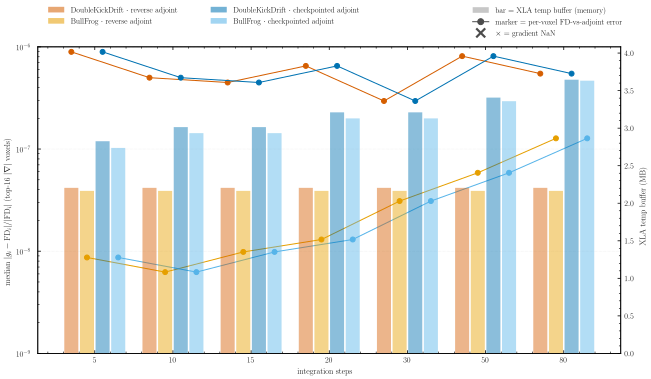
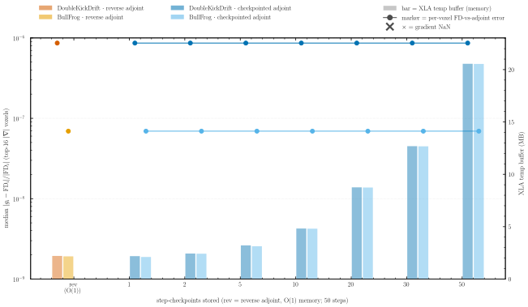
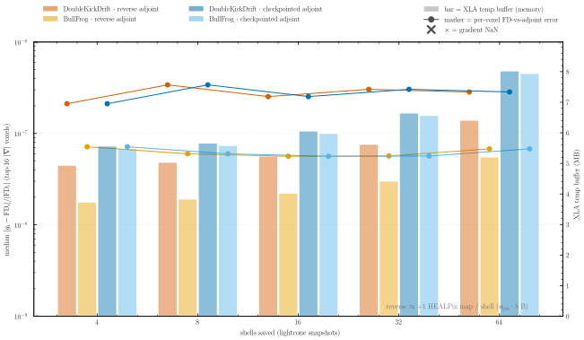

# Experiment 09 — Gradient validation

**Goal.** Field-level inference needs the gradient of the forward model with respect to the initial conditions, `∂L/∂δ`. We check that `jax-fli` computes this gradient **correctly**, against an independent per-voxel finite difference, and we measure the **memory** of its two adjoints for the spherical output of the weak-lensing science: a single HEALPix shell (`nb_shells=1`, the last shell at `a=1.0`) and a lightcone of several saved shells. Everything runs in **float64 on GPU** at a **16³** mesh, where the finite difference is clean and cheap. At 16³ the scratch memory is a few MB, so the figures show the scaling trend of each adjoint, and [Experiment 12](../12-scaling-gradient/README.md) measures the multi-GB trade at 64³ and beyond.

`jax-fli` offers two adjoints. **`reverse`** is a reversible backsolve: it stores *no* trajectory (O(1) memory in the integration steps) and reconstructs it on the backward pass by inverting each step. **`checkpointed`** is an equinox checkpointed scan, which recomputes forward segments instead and stores a tunable number of checkpoints. `checkpoints` controls the outer scan over the saved shells, and `step_checkpoints` the inner loop of integration steps between two consecutive shells. Both trade recompute for memory, and **neither changes the gradient value**. For more on PM simulations, see [03-PM-Simulation](../../1-introduction-and-basics/03-PM-Simulation.ipynb).

```python
from jax_fli import nbody

result = nbody(
    cosmo, dx, p, solver=solver, nb_shells=4,
    adjoint="checkpointed",   # or "reverse" for the O(1)-memory backsolve, or None for forward-mode AD
    checkpoints=10,           # checkpoints the outer scan over SAVED SHELLS   (memory control, see Exp 12)
    step_checkpoints=6,       # checkpoints the inner INTEGRATION-STEP loop within each shell
)
```

| test | figure | swept | fixed |
| --- | --- | --- | --- |
| accuracy | fig01 | output: single spherical (`nb_shells=1`), lightcone (`nb_shells=4`) | 20 steps, a = 0.001 → 1.0 |
| integration steps | fig02 | **5, 10, 15, 20, 30, 50, 80** | single spherical output |
| step-checkpoints | fig03 | **1, 2, 5, 10, 20, 30, 50** | 50 steps, single spherical output |
| saved shells | fig04 | `nb_shells` **4, 8, 16, 32, 64** | 80 steps, spherical lightcone |

*Fixed:* 16³ mesh, HEALPix `nside` 16, box 1000 Mpc/h, float64 on GPU, solvers DoubleKickDrift and BullFrog, adjoints `reverse` and `checkpointed`.

## Method

**Loss.** The observable is a spherical HEALPix painting, and the scalar loss is `L = ½ Σ observable.array²`, the loss that `fli-simulate --grad` differentiates ([`scripts/entry/fli_simulate.py`](../../../src/jax_fli/scripts/entry/fli_simulate.py)).

**Finite difference.** For the **16 voxels with the largest `|∂L/∂δ|`** we compare the adjoint component `g_i` with a central finite difference of the loss,

FD_i  =  [ L(δ + ε e_i) − L(δ − ε e_i) ] / (2 ε),   ε = machine_eps^(1/3),

and report the **median** relative error `|g_i − FD_i| / |FD_i|` over those voxels. High-signal voxels and the median keep the denominator away from zero, so the check reaches the float64 floor of the central difference. That floor is the truncation error of the finite difference itself (`∝ ε²·L‴`) and depends on the loss curvature of each solver: **~1e-8** for BullFrog and **~5e-7** for DoubleKickDrift, identical on CPU and GPU.

**Transpose test.** The sharper proof of correctness uses no finite difference. Forward-mode AD gives `⟨w, Jv⟩` and the adjoint gives `⟨Jᵀw, v⟩`, and the two agree, so `reverse ≡ checkpointed ≡ forward-mode AD` to `~10⁻¹²` in float64, for the single output and for the **4-shell lightcone**. The N-body suite asserts both: `tests/nbody/test_adjoints.py::test_adjoint_transpose` for the single output, and `test_reverse_vs_checkpointed_lightcone` for the lightcone through saved snapshots.

**Lightcone accumulation.** A lightcone observable is **not** a single final-state output: the forward model saves many intermediate snapshots and paints each onto the sky, so its gradient must **accumulate** the cotangent of *every* saved shell back through the one shared particle trajectory. The differentiable particle-mesh codes that predate this — [pmwd](https://github.com/eelregit/pmwd) and [DISCO-DJ](https://github.com/cosmo-sims/DISCO-DJ) — implement the adjoint for the **final state only**; they do not propagate gradients through a multi-snapshot lightcone. `jax-fli` adds that accumulation in its custom reverse-mode: sweeping from the outermost shell inward, it injects each shell's painting cotangent into the running trajectory adjoint, then propagates it back through the integration steps to the initial conditions.


*(Rendered from [`lightcone-gradient-algorithm.tex`](lightcone-gradient-algorithm.tex).)*

**Memory.** We read the XLA scratch buffer `temp_size_in_bytes` of the compiled gradient (`jax.jit(jax.grad(...)).lower(x).compile().memory_analysis()`). The stored trajectory of `checkpointed` lands in this buffer, as stacked `[n_stored, …, 3]` particle buffers in the HLO, so `temp` tracks the memory that separates the two adjoints. On GPU the buffer captures the FFT scratch in full (the `reverse` temp grows 6.95× from 16³ to 32³), but cuFFT is leaner than a CPU run, so the absolute MB depend on the backend. The two solvers use the same scratch to within ~0.1 MB.

## Results


**IC-gradient adjoints against per-voxel finite differences.** Median relative error of both adjoints and both solvers, for a single spherical output and a 4-shell lightcone (float64, 16³). The `reverse` and `checkpointed` markers overlap exactly within each solver group: the two adjoints compute the same gradient, bit for bit. The finite difference confirms it to **~1 × 10⁻⁸ (BullFrog)** and **~5 × 10⁻⁷ (DoubleKickDrift)** for both outputs, independently of automatic differentiation. The two solvers differ because the truncation error of the finite difference sees a different loss curvature in each, and the transpose test pins the gradient itself to `~10⁻¹²`.



**Accuracy and memory against the number of integration steps.** Single spherical output at 16³, markers on the left axis and bars on the right. `reverse` stays at **2.2 MB** from 5 to 80 steps: it stores no trajectory and is O(1) in the integration steps. `checkpointed` grows from **2.8 to 3.6 MB**, since it stores ~`log₂(steps)` particle states. The accuracy markers creep up with the step count because a longer integration is more nonlinear and the truncation error of the finite difference grows, while `reverse ≡ checkpointed` throughout.



**Accuracy and memory against the number of step-checkpoints.** Single spherical output at 16³, 50 integration steps; `rev` is the reverse adjoint, which stores none. The accuracy is flat across every checkpoint count (DoubleKickDrift ~5e-7, BullFrog ~7e-8), and the N-body suite asserts this invariance (`test_step_checkpoints_invariant`). `checkpointed` climbs from **2.2 to 20.6 MB** between 1 and 50 checkpoints, while `reverse` stays at **2.2 MB**. `checkpointed` ties `reverse` at 1 checkpoint (maximal recompute), crosses it near 5 and reaches ~9× by 50, so `reverse` is the fixed-overhead baseline that wins in the realistic regime of default and heavier checkpointing. BullFrog matches DoubleKickDrift to ~0.1 MB.



**Accuracy and memory against the number of saved shells.** Spherical lightcone at 16³ with 80 integration steps, so that `nb_shells ≤ n_steps` holds up to 64; the counts start at 4 because a 1–2-shell lightcone is degenerate. The checkpointed series sets `step_checkpoints = ⌈log₂(80 / nb_shells)⌉`, from 5 to 1 as the shells go from 4 to 64. `reverse` rises slowly, **4.9 → 6.4 MB** (DoubleKickDrift), by about one painted HEALPix map per shell (`npix · 8 B`, the painting cotangent the reverse scan carries), and its trajectory part stays O(1) in the shells. `checkpointed` sits above it throughout and rises faster, **5.6 → 8.0 MB**, because it stores integration-step states on top. BullFrog tracks within ~1 MB.

## Summary

Both adjoints compute the **same** IC gradient: the finite difference confirms it to `~10⁻⁸` (BullFrog) and `~10⁻⁷` (DoubleKickDrift), and the transpose test to `~10⁻¹²`. `reverse` is the lean adjoint: it stores no trajectory, is **O(1)** in the integration steps and the step-checkpoints (flat at 2.2 MB), and is **O(nb_shells)** in the saved shells with a small per-shell constant. `checkpointed` trades memory for recompute, from a tie at 1 checkpoint to ~9× (20.6 MB) at 50. These 16³ numbers are a few MB and depend on the backend, so they give the trend, and [Experiment 12](../12-scaling-gradient/README.md) gives the production-scale trade.

## How to run

All runs are float64 on GPU at 16³. At the CLI, `fli-simulate --grad reverse | checkpointed_<N>` selects the adjoint, wraps the forward model in `jax.grad` and writes the IC-shaped gradient field. Two scripts reproduce the figures, save the SVGs and cache their results in `data_f64/` (`grad_validation.npz`, `degradation.npz`); `09b-degradation.py` also prints the tables quoted above.

```bash
uv run python 09-gradient-validation.py    # fig01 — per-voxel FD vs adjoint   (16³, ~5 min)
uv run python 09b-degradation.py           # fig02/03/04 — accuracy & memory   (16³, ~50 min)
pdflatex lightcone-gradient-algorithm.tex && pdftocairo -svg lightcone-gradient-algorithm.pdf assets/algorithm.svg
```
