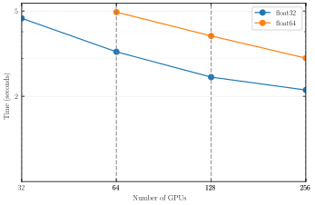
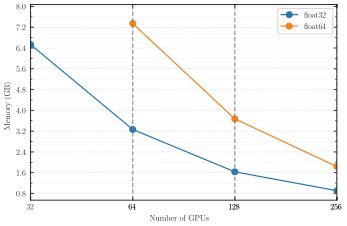
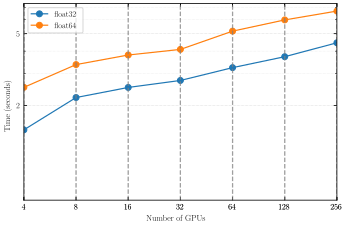
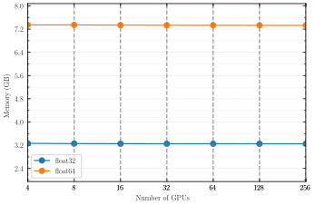

# Experiment 11 — PM forward model: strong & weak scaling

**Goal.** Characterize the distributed performance of the **PM forward model** (N-body + lightcone painting) under a **slab `(N, 1)`** decomposition — how fast it runs and how much per-device memory it needs as the GPU count grows. Two questions: **strong scaling** (fixed grid, more GPUs → how much speedup, and how far from the ideal 1/N) and **weak scaling** (fixed work per GPU → does wall-time and memory stay flat). Every run captures **min wall-time *and* peak per-device temporary memory** from `fli-simulate --perf` (XLA `memory_analysis`), in **both float32 and float64** — the precision/perf/memory trade-off is part of the point. Only the PM stage is timed; gradient cost is [Exp 12](../12-scaling-gradient/README.md).

The runs, and the fixed forward-model configuration behind every one of them:

| Knob | Value |
|------|-------|
| Stage | PM forward (N-body + lightcone painting), `--sim-mode pm` |
| Solver / steps | BullFrog (`bf`), `--nb-steps 50` |
| Painting | `--paint-order cic`, `--scheme rbf_neighbor --kernel-width-pixels 0.8`, `--drift-on-lightcone` |
| Lightcone | `--nb-shells 20`, `--nside M` (strong) / `256` (weak) |
| Box | `5000³` Mpc/h (5 Gpc/h) |
| Precision | float32 **and** float64 |
| Decomposition | slab `(px, 1)`, `px = #GPUs`, `nodes = GPUs/4` |
| Timing | `--perf --iterations 5`, `--seed 0` |

| Scaling | Grid | Precision | GPU counts that landed |
|---------|------|-----------|------------------------|
| Strong | 1024³ | float32 | 32, 64, 128, 256 |
| Strong | 1024³ | float64 | 64, 128, 256 |
| Strong | 2048³ | float32 | 256 |
| Strong | 2048³ | float64 | 512 |
| Weak (256³/GPU) | `(256·px, 256, 256)` | float32 | 4, 8, 16, 32, 64, 128, 256 |
| Weak (256³/GPU) | `(256·px, 256, 256)` | float64 | 4, 8, 16, 32, 64, 128, 256 |

Two hard limits shape which runs exist. **Even halo:** the ghost zone `halo = int((M/px)·0.5)` must be even (odd halo crashes jaxpm `slice_unpad`), so at `halo_multiplier 0.5` a **1024³ slab tops out at 256 GPUs**. **Per-GPU memory:** each ladder starts at the smallest GPU count whose local volume fits (≈300³ cells/GPU in float64 for this heavier 5 Gpc/h model, ≈2× in float32). The weak grids are anisotropic by construction (the slab shards only X) — perf/memory benchmarks, not science runs.

## Method

Slab `(N, 1)` shards the global mesh along X into `px = #GPUs` equal slabs of local shape `(M/px, M, M)`; Y and Z stay per-GPU depth. Strong scaling holds the global grid fixed and grows `px` (each GPU does less work → time should fall as 1/N and per-device memory as 1/N). Weak scaling holds the **local** volume fixed at 256³ by setting the global mesh to `(256·px, 256, 256)` (each GPU always does the same work → time and per-device memory should stay flat). All figures are built from the committed `perf_pm.csv` by [`build.py`](build.py) using [`jax-hpc-profiler`](https://pypi.org/project/jax-hpc-profiler/); the x-axis is the GPU count (log₂), with one line per precision (float32, float64).

## Results

### Strong scaling — wall-time



At 1024³ (top) the PM step gets faster with more GPUs but flattens well short of ideal 1/N scaling: float32 goes 4.6 s (32 GPUs) → 2.1 s (256 GPUs) — a **2.2× speedup for 8× the GPUs** (≈27% parallel efficiency), and float64 3.8 s → 3.0 s from 128→256 GPUs. The gap to a perfect 1/N is the slab's communication cost (the X-sharded FFT's all-to-all and the halo exchange), which grows with `px` and eventually dominates the shrinking per-GPU compute. float64 sits ≈1.5× above float32 throughout. The 2048³ panel (bottom) holds two landed points at different GPU counts — float32 at 256 GPUs (7.7 s) and float64 at 512 GPUs (7.65 s) — a cross-precision comparison rather than a scaling curve (the intermediate 2048³ runs weren't run).

### Strong scaling — peak temporary memory



Peak per-device scratch memory scales **almost perfectly as 1/N** — float32 1024³ falls 6.53 → 3.26 → 1.63 → 0.91 GB across 32→256 GPUs (halving at each doubling), and float64 is exactly 2× the float32 footprint (7.34 → 3.67 → 1.84 GB). This is the clean result: distributing the mesh distributes the working set, so memory is not the strong-scaling bottleneck here — communication is. The 2048³ panel's two points land at exactly the per-device footprint the 1/N law predicts: float32 6.52 GB at 256 GPUs matches float32 1024³ at 32 GPUs (6.53 GB), and float64 7.34 GB at 512 GPUs matches float64 1024³ at 64 GPUs (7.34 GB) — 8× the cells on 8× the GPUs leaves the per-device working set unchanged.

### Weak scaling — wall-time



With a fixed 256³ per GPU, ideal weak scaling would keep wall-time flat. Instead it climbs — float32 1.8 s (4 GPUs) → 4.5 s (256 GPUs), a **2.5× rise over 64× the GPUs** — because the slab's global all-to-all touches more peers as `px` grows even though per-GPU compute is constant. float64 tracks the same shape ≈1.5× higher (2.5 → 6.7 s). The rise is communication, not compute.

### Weak scaling — peak temporary memory



Memory weak-scales essentially perfectly: peak scratch is flat at **≈3.26 GB (float32)** and **≈7.34 GB (float64)** across all seven GPU counts — each device holds exactly its fixed 256³ working set regardless of the total problem size. float64 is again 2× float32. Per-device memory is fully predictable from the local volume alone.

### Note on the 2048³ panel

The 2048³ strong panel is a two-point cross-precision comparison, not a full scaling curve: only `M2048_g256_f32` and `M2048_g512_f64` completed (the intermediate 2048³ runs, and the `g512_f32` / `g256_f64` counterparts, were not run or did not finish). `build.py` loads the CSV from HuggingFace and the strong query already spans both 1024³ and 2048³, so appending any further 2048³ rows to `perf_pm.csv` on HuggingFace and re-running `build.py` extends the panel with no code change.

## How to run

```bash
# (a) produce perf_pm.csv on the cluster (both precisions; --perf → wall-time + per-device memory)
MODE=dryrun bash run.sh    # print the resolved fli-launcher commands + skipped runs (submit nothing)
bash run.sh                # submit to SLURM → writes perf_pm.csv rows under results/exp11/

# (b) render the four SVGs locally from the HuggingFace copy of perf_pm.csv (CPU-only, no GPU)
/home/wassim/Projects/NBody/jax-fli/.venv/bin/python build.py
```

`build.py` pulls only `11-scaling/perf/perf_pm.csv` from the `ASKabalan/jax-fli-experiments` dataset, rewrites the per-run `function` label to a single `pm-forward` series (the two lines are float32/float64), splits the rows into weak/strong, and calls `jax-hpc-profiler` to write `assets/fig0{1..4}-*.svg`.
