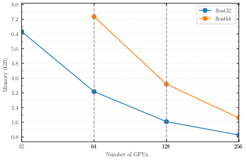
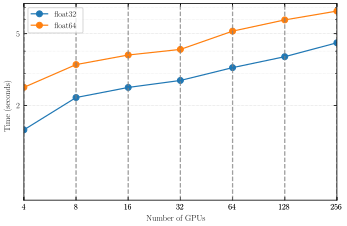
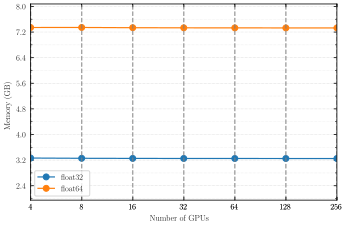

# Experiment 11 — PM forward model: strong & weak scaling

**Goal.** We measure the distributed performance of the **PM forward model** (N-body and lightcone painting) under a **slab `(N, 1)`** decomposition: how fast it runs and how much per-device memory it needs as the GPU count grows. **Strong scaling** fixes the grid and adds GPUs, to measure the speedup against the ideal 1/N; **weak scaling** fixes the work per GPU, to check that wall-time and memory stay flat. Every run records the **minimum wall-time and the peak per-device temporary memory** from `fli-simulate --perf` (XLA `memory_analysis`), in **float32 and float64**, since the trade between precision, speed and memory is part of the result. Only the PM stage is timed, and the cost of the gradient is [Exp 12](../12-scaling-gradient/README.md).

| Knob | Value |
|------|-------|
| Stage | PM forward (N-body + lightcone painting), `--sim-mode pm` |
| Solver / steps | BullFrog (`bf`), `--nb-steps 50` |
| Painting | `--paint-order cic`, `--scheme rbf_neighbor --kernel-width-pixels 0.8`, `--drift-on-lightcone` |
| Lightcone | `--nb-shells 20`, `--nside M` (strong) / `256` (weak) |
| Box | `5000³` Mpc/h (5 Gpc/h) |
| Precision | float32 **and** float64 |
| Decomposition | slab `(px, 1)`, `px = #GPUs`, `nodes = GPUs/4` |
| Timing | `--perf --iterations 5`, `--seed 0` |

| Scaling | Grid | Precision | GPU counts that landed |
|---------|------|-----------|------------------------|
| Strong | 1024³ | float32 | 32, 64, 128, 256 |
| Strong | 1024³ | float64 | 64, 128, 256 |
| Strong | 2048³ | float32 | 256 |
| Strong | 2048³ | float64 | 512 |
| Weak (256³/GPU) | `(256·px, 256, 256)` | float32 | 4, 8, 16, 32, 64, 128, 256 |
| Weak (256³/GPU) | `(256·px, 256, 256)` | float64 | 4, 8, 16, 32, 64, 128, 256 |

Two limits set which runs exist. The ghost zone `halo = int((M/px)·0.5)` must be **even**, since an odd halo crashes the `slice_unpad` of jaxpm, so at `halo_multiplier 0.5` a **1024³ slab tops out at 256 GPUs**. Each ladder starts at the smallest GPU count whose local volume fits in memory, ≈300³ cells per GPU in float64 for this 5 Gpc/h model and ≈2× that in float32. The weak grids are anisotropic by construction, since the slab shards only X, and serve as benchmarks of performance and memory.

## Method

The slab `(N, 1)` shards the global mesh along X into `px = #GPUs` slabs of local shape `(M/px, M, M)`. Strong scaling holds the global grid fixed and grows `px`, so the time and the per-device memory should fall as 1/N. Weak scaling holds the **local** volume at 256³ with a global mesh of `(256·px, 256, 256)`, so the time and the per-device memory should stay flat. [`build.py`](build.py) draws every figure from `perf_pm.csv` with [`jax-hpc-profiler`](https://pypi.org/project/jax-hpc-profiler/), with the GPU count on a log₂ axis and one line per precision.

## Results


**Strong scaling of the PM forward model, minimum wall-time.** Fixed grids, float32 and float64, under a slab decomposition. At 1024³ (top) the PM step gets faster with more GPUs and flattens well short of the ideal 1/N: float32 goes from 4.6 s at 32 GPUs to 2.1 s at 256, a **2.2× speedup for 8× the GPUs** (≈27% parallel efficiency), and float64 from 3.8 s to 3.0 s between 128 and 256 GPUs. The communication of the slab, the all-to-all of the X-sharded FFT and the halo exchange, grows with `px` until it dominates the shrinking per-GPU compute. float64 sits ≈1.5× above float32 throughout. The 2048³ panel (bottom) holds float32 at 256 GPUs (7.7 s) and float64 at 512 GPUs (7.65 s), a comparison across precisions; the intermediate 2048³ runs, and the `g512_f32` / `g256_f64` counterparts, were not run or did not finish.



**Strong scaling, peak per-device temporary memory.** The same runs. The scratch memory falls **almost exactly as 1/N**: float32 1024³ goes 6.53 → 3.26 → 1.63 → 0.91 GB from 32 to 256 GPUs, halving at each doubling, and float64 is exactly 2× float32 (7.34 → 3.67 → 1.84 GB). The two 2048³ points land on the footprint the 1/N law predicts: float32 at 256 GPUs (6.52 GB) matches float32 1024³ at 32 GPUs (6.53 GB), and float64 at 512 GPUs (7.34 GB) matches float64 1024³ at 64 GPUs (7.34 GB), since 8× the cells on 8× the GPUs leaves the working set per device unchanged. Distributing the mesh distributes the working set, so communication limits the strong scaling and memory does not.



**Weak scaling of the PM forward model, minimum wall-time.** Fixed 256³ per GPU, 4–256 GPUs, where flat would be ideal. The time climbs, for float32 from 1.8 s at 4 GPUs to 4.5 s at 256, a **2.5× rise over 64× the GPUs**, because the global all-to-all of the slab touches more peers as `px` grows while the compute per GPU stays constant. float64 follows the same shape ≈1.5× higher (2.5 → 6.7 s).



**Weak scaling, peak per-device temporary memory.** The scratch is flat at **≈3.26 GB (float32)** and **≈7.34 GB (float64)** across all seven GPU counts, since each device holds its fixed 256³ working set whatever the total size, and float64 is again 2× float32. The memory per device follows from the local volume alone.

## How to run

```bash
MODE=dryrun bash run.sh    # print the resolved fli-launcher commands and the skipped runs
bash run.sh                # submit; writes perf_pm.csv rows under results/exp11/
JAX_PLATFORMS=cpu uv run --no-sync python build.py   # the four SVGs from the HuggingFace copy of perf_pm.csv
```

`build.py` downloads only `11-scaling/perf/perf_pm.csv` from the [`ASKabalan/jax-fli-scaling`](https://huggingface.co/datasets/ASKabalan/jax-fli-scaling) dataset, relabels every run as one `pm-forward` series (the two lines are float32 and float64), splits the rows into weak and strong, and calls `jax-hpc-profiler` to write `assets/fig0{1..4}-*.svg`. The strong query already spans 1024³ and 2048³, so further 2048³ rows appended to `perf_pm.csv` extend the panel without a code change.
