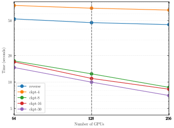
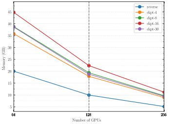
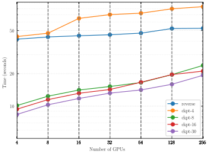
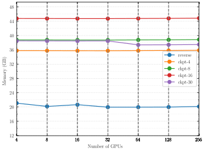

# Experiment 12 — IC-gradient: strong & weak scaling

**Goal.** [Experiment 09](../09-gradient-validation/README.md) established that the lightcone initial-condition gradient is **correct**; this experiment measures what it **costs at scale**. We strong- and weak-scale the IC gradient (forward + backward) under a **slab `(N, 1)`** decomposition and capture **min wall-time *and* peak per-device temporary memory** (`fli-simulate --perf`, XLA `memory_analysis`) for **five reverse-mode adjoints**, so you can read off which adjoint to pick and how large a *differentiable* simulation fits at a given GPU count. The gradient is bit-identical across all five (Exp 09) — this is a pure time↔memory trade.

The adjoint variants (`--grad`) — the five that are plotted, plus the `ckpt-20` boundary check — and the fixed forward model they differentiate:

| Knob | Value |
|------|-------|
| Stage | PM forward + lightcone painting, differentiated (`--sim-mode pm`) |
| Solver / steps | DoubleKickDrift (`kdk`), `--nb-steps 30` |
| Painting | `--paint-order cic`, `--scheme rbf_neighbor --kernel-width-pixels 0.8`, `--drift-on-lightcone` |
| Lightcone | `--nb-shells 20`, `--nside M` (strong) / `256` (weak) |
| Box / precision | `5000³` Mpc/h, **float64** |
| Decomposition | slab `(px, 1)`, `px = #GPUs`, `nodes = GPUs/4` |
| Timing | `--perf --iterations 5`, `--seed 0` |

| `--grad` | Legend label | Adjoint strategy |
|----------|--------------|------------------|
| `reverse` | reverse | reversible `kdk` backsolve — reconstructs the trajectory by inverting each step; **O(1) in step count** |
| `checkpointed_4` | ckpt-4 | equinox checkpointed shell-scan, 4 stored shell-checkpoints |
| `checkpointed_8` | ckpt-8 | " , 8 checkpoints |
| `checkpointed_16` | ckpt-16 | " , 16 checkpoints |
| `checkpointed_20` | ckpt-20 | " , 20 checkpoints (= 20 shells → store-all) — **boundary check, not a plotted series** (see [below](#the-store-all-boundary-sits-exactly-at-n--20)) |
| `checkpointed_30` | ckpt-30 | " , 30 checkpoints (≥ 20 shells → store-all) |

| Scaling | Grid | GPU counts that landed |
|---------|------|------------------------|
| Strong | 1024³ | 64, 128, 256 (× the 5 plotted variants) |
| Weak (256³/GPU) | `(256·px, 256, 256)` | 4, 8, 16, 32, 64, 128, 256 (× the 5 plotted variants) |
| `ckpt-20` boundary check | as above | 64, 128 (strong); 4 → 128 (weak) — 256 not submitted |

Strong scaling is 1024³ only (2048³ gradient runs are out of scope). Same slab constraints as [Exp 11](../11-scaling/README.md) — even halo caps 1024³ at 256 GPUs — plus a gradient memory penalty: differentiating roughly doubles the forward working set, so the strong ladder starts at 64 GPUs (no `g512` run landed).

## Method

Two families of reverse-mode adjoint trade memory against compute differently. **`reverse`** is a reversible `kdk` (DoubleKickDrift) backsolve: it reconstructs the forward trajectory by inverting each integration step, so it stores **no** step trajectory (O(1) in the step count) — but it still accumulates one painting VJP per saved shell. **`checkpointed_N`** wraps the **outer scan over the 20 saved shells** ([`pm/integrate.py`](../../../src/jax_fli/pm/integrate.py), `eqxi.scan(..., checkpoints=N)`) in equinox's checkpointed scan: it stores `N` shell-carries on the forward pass and, on the backward pass, **recomputes** the shell-segments it didn't store. `N` is the number of stored checkpoints — larger `N` = more stored, less recompute. Because the scan has **20** steps (`nb_shells=20`), any `N ≥ 20` degenerates to **store-all** (every shell stored, zero recompute) — this is why `checkpointed_30` behaves differently from the sub-20 variants (see below). That threshold is not assumed but [measured](#the-store-all-boundary-sits-exactly-at-n--20), by a `checkpointed_20` run sitting exactly *on* the boundary. It ran at 64/128 GPUs (strong) and 4→128 (weak); the 256-GPU point was never submitted, which costs nothing here since the result it establishes holds identically at every count where it did run.

All figures are built from the committed `perf_pm.csv` by [`build.py`](build.py) with [`jax-hpc-profiler`](https://pypi.org/project/jax-hpc-profiler/); x-axis is the GPU count (log₂), one line per adjoint variant.

## Results

### Strong scaling — wall-time



The variants span an order of magnitude in speed. **`ckpt-4`** is slowest (≈69 s at 128 GPUs) — with only 4 checkpoints over 20 shells it recomputes almost the entire forward pass on the backward sweep. **`reverse`** is next-slowest (≈47 s) — the step-by-step backsolve is expensive per shell. The heavily-checkpointed variants are ≈5–7× faster: at 128 GPUs `ckpt-8` = 12.4 s, `ckpt-16` = 11.0 s, and **`ckpt-30` = 10.0 s is the fastest of all**. None come close to ideal 1/N scaling (the gradient is recompute- and communication-bound), but the *ranking* is the headline: more checkpoints → less recompute → faster.

### Strong scaling — peak temporary memory



Memory is where the trade reverses. **`reverse`** is by far the lightest (9.96 GB at 128 GPUs, and it falls almost perfectly ≈1/N) — its O(1)-in-steps design is the memory-frugal choice. Among the checkpointed variants the footprint rises `ckpt-4` (17.85 GB) < `ckpt-8` (19.35 GB) < `ckpt-16` (**22.35 GB, the peak**) — *then falls back* for `ckpt-30` (18.75 GB). That non-monotonic dip is the surprising result explained below. All curves scale cleanly ≈1/N with GPU count.

### Weak scaling — wall-time and memory





At a fixed 256³/GPU the same ranking holds and is flat-ish in memory. Wall-time rises gently with GPU count for every variant (communication growth), preserving `ckpt-30` < `ckpt-16` < `ckpt-8` ≪ `reverse` < `ckpt-4`. Peak memory is essentially flat per variant — `ckpt-16` pinned highest at ≈44.8 GB, `ckpt-30` ≈37–38 GB, and `reverse` lowest at ≈20 GB — confirming the strong-scaling ordering is a property of the adjoint, not of the GPU count.

### Why `ckpt-30` uses *less* memory than `ckpt-16` while also being *faster*

This is the one counter-intuitive result, and it holds at every GPU count (strong 1024³):

| variant | 64 GPUs | 128 GPUs | 256 GPUs |
|---------|---------|----------|----------|
| `ckpt-16` min time | 16.9 s | 11.0 s | 8.3 s |
| `ckpt-30` min time | **14.6 s** | **10.0 s** | **7.0 s** |
| `ckpt-16` peak temp | 44.76 GB | 22.35 GB | 11.18 GB |
| `ckpt-30` peak temp | **38.59 GB** | **18.75 GB** | **9.42 GB** |

The cause is the 20-shell scan length. `checkpointed_16` stores 16 of the 20 shell-carries and **recomputes** the missing 4 segments during the backward pass; `checkpointed_30` has `N = 30 ≥ 20`, so equinox stores **all** carries and recomputes **nothing**. Store-all is therefore (a) faster — it pays zero recompute FLOPs — and (b) *lower* peak memory, because the recomputation in `ckpt-16` must briefly re-materialize a full forward shell-step's scratch (the PM force FFT + the spherical painting) *on top of* the stored checkpoints, and that transient buffer is larger than the ~4 extra carries `ckpt-30` stores. So `ckpt-16` sits at the worst corner: it recomputes (slower — 11.0 s vs 10.0 s at 128 GPUs) *and* its recompute scratch pushes peak temp above store-all (22.35 GB vs 18.75 GB).

The XLA HLO for the two 128-GPU programs confirms this directly. Both have the **identical loop, painting, and communication skeleton** — 126 `while`, 13 `scatter` (the painting), 341 `all-reduce` (the slab comm) — but `ckpt-16` carries **more fused compute**: **1385 fusions vs 1297** (+88) and **468 dynamic-slices vs 426** (+42). Those extra ~90 fused regions and ~40 slices are exactly the recomputed forward shell-segments and their checkpoint gathers — present in `ckpt-16`, absent in the store-all `ckpt-30`. They are simultaneously the extra FLOPs (slower) and the extra live scratch (higher peak temp). Even the generated code is smaller for `ckpt-30` (19.78 KB vs 20.28 KB) — a simpler program.

### The store-all boundary sits exactly at `N = 20`

Everything above turns on one claim: that `checkpointed_N` stops checkpointing and starts storing everything once `N` reaches the 20-shell scan length, which is why `ckpt-30` wins on both axes. A run *at* the boundary, `checkpointed_20`, tests it directly — and the two are not merely similar, they are **the same compiled program**:

| strong 1024³ | `ckpt-20` | `ckpt-30` | |
|---|---|---|---|
| generated code (64 & 128 GPUs) | 20253 B | 20253 B | **identical** |
| peak temp, 64 GPUs | 41440490384 B (38.59 GB) | 41440490384 B (38.59 GB) | **identical** |
| peak temp, 128 GPUs | 20133228936 B (18.75 GB) | 20133228936 B (18.75 GB) | **identical** |
| min time, 64 GPUs | 14.33 s | 14.62 s | within run noise |
| min time, 128 GPUs | 9.62 s | 9.97 s | within run noise |

XLA emits byte-for-byte the same code size and the same peak temporary allocation — not close, *equal* — and the same identity holds at every weak-scaling point (4 → 128 GPUs: 20557 B of code and 37.4–38.5 GB of temp for both). Identical peak temp to the byte is the strongest evidence available that `ckpt-20` materializes no recompute scratch whatsoever: had it recomputed even one shell-segment, the transient buffer that penalizes `ckpt-16` would show up here too. It also pins down the mechanism — equinox clamps `checkpoints` to the scan length, so `N = 20` and `N = 30` request the *same* store-all schedule; had `N = 30` been honoured literally, it would have reserved 10 more carries and its peak would sit above `ckpt-20`'s rather than exactly on it. The residual sub-second time differences are run-to-run noise on the same program, not work. So the threshold is measured rather than inferred: store-all begins exactly at `N = nb_shells = 20`, not somewhere above it.

**Takeaway.** With 20 shells, `checkpointed_N` is only worth `N < 20`; the useful frontier is `reverse` (minimum memory, slow), the sub-20 checkpoints (memory grows, recompute shrinks), and then store-all at `N ≥ 20` (`ckpt-30` here), which strictly dominates any `16 ≤ N < 20` on **both** axes. The boundary is exact and measured — `checkpointed_20` and `checkpointed_30` compile to the same program — so there is nothing to gain by tuning `N` above the shell count, and `ckpt-16` is a local worst case: never pick a checkpoint count just below the shell count.

## How to run

```bash
# (a) produce perf_pm.csv on the cluster (float64; --perf → wall-time + per-device memory + HLO markdown)
MODE=dryrun bash run.sh    # print the resolved commands + skipped runs (submit nothing)
bash run.sh                # submit to SLURM → writes perf_pm.csv rows + per-run HLO .md under results/exp12/

# (b) render the four SVGs locally from the HuggingFace copy of perf_pm.csv (CPU-only, no GPU)
/home/wassim/Projects/NBody/jax-fli/.venv/bin/python build.py
```

`build.py` pulls only `12-gradient-scaling/perf/perf_pm.csv` from the `ASKabalan/jax-fli-experiments` dataset, rewrites the per-run `function` label to the adjoint variant (`reverse`, `ckpt-4/8/16/20/30`), splits the rows into weak/strong, and calls `jax-hpc-profiler` to write `assets/fig0{1..4}-*.svg`. All six variants are labelled, but only the five in `VARIANTS` are drawn — `ckpt-20` is the store-all boundary check and would exactly overplot `ckpt-30`.
