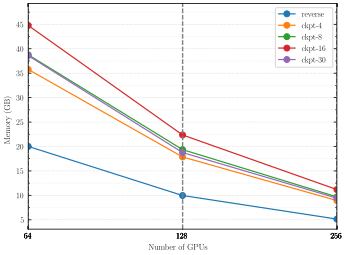
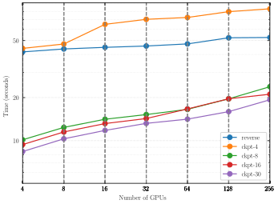
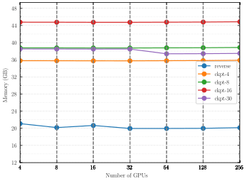

# Experiment 12 — IC-gradient: strong & weak scaling

**Goal.** [Experiment 09](../09-gradient-validation/README.md) showed that the lightcone initial-condition gradient is **correct**, and this experiment measures what it **costs at scale**. We strong- and weak-scale the IC gradient (forward and backward) under a **slab `(N, 1)`** decomposition and record the **minimum wall-time and peak per-device temporary memory** (`fli-simulate --perf`, XLA `memory_analysis`) of **five reverse-mode adjoints**. The results give the adjoint to pick and the largest *differentiable* simulation that fits at a given GPU count. The gradient is bit-identical across the five (Exp 09), so the comparison is a pure trade between time and memory.

| Knob | Value |
|------|-------|
| Stage | PM forward + lightcone painting, differentiated (`--sim-mode pm`) |
| Solver / steps | DoubleKickDrift (`kdk`), `--nb-steps 30` |
| Painting | `--paint-order cic`, `--scheme rbf_neighbor --kernel-width-pixels 0.8`, `--drift-on-lightcone` |
| Lightcone | `--nb-shells 20`, `--nside M` (strong) / `256` (weak) |
| Box / precision | `5000³` Mpc/h, **float64** |
| Decomposition | slab `(px, 1)`, `px = #GPUs`, `nodes = GPUs/4` |
| Timing | `--perf --iterations 5`, `--seed 0` |

| `--grad` | Legend label | Adjoint strategy |
|----------|--------------|------------------|
| `reverse` | reverse | reversible `kdk` backsolve, reconstructs the trajectory by inverting each step; **O(1) in step count** |
| `checkpointed_4` | ckpt-4 | equinox checkpointed shell-scan, 4 stored shell-checkpoints |
| `checkpointed_8` | ckpt-8 | same, 8 checkpoints |
| `checkpointed_16` | ckpt-16 | same, 16 checkpoints |
| `checkpointed_20` | ckpt-20 | same, 20 checkpoints (= 20 shells, store-all); **boundary check, not plotted** (see [below](#the-store-all-boundary-sits-exactly-at-n--20)) |
| `checkpointed_30` | ckpt-30 | same, 30 checkpoints (≥ 20 shells, store-all) |

| Scaling | Grid | GPU counts that landed |
|---------|------|------------------------|
| Strong | 1024³ | 64, 128, 256 (× the 5 plotted variants) |
| Weak (256³/GPU) | `(256·px, 256, 256)` | 4, 8, 16, 32, 64, 128, 256 (× the 5 plotted variants) |
| `ckpt-20` boundary check | as above | 64, 128 (strong); 4 → 128 (weak); 256 not submitted |

Strong scaling covers 1024³ only; 2048³ gradient runs are out of scope. The slab constraints of [Exp 11](../11-scaling/README.md) apply, and the even halo caps 1024³ at 256 GPUs. Differentiating roughly doubles the forward working set, so the strong ladder starts at 64 GPUs, and no `g512` run landed.

## Method

The two families of adjoint trade memory against compute differently. **`reverse`** reconstructs the forward trajectory by inverting each `kdk` step, so it stores no step trajectory (O(1) in the step count), and it still accumulates one painting VJP per saved shell. **`checkpointed_N`** wraps the **outer scan over the 20 saved shells** ([`pm/integrate.py`](../../../src/jax_fli/pm/integrate.py), `eqxi.scan(..., checkpoints=N)`) in the checkpointed scan of equinox: it stores `N` shell-carries on the forward pass and **recomputes** the missing shell-segments on the backward pass, so a larger `N` stores more and recomputes less. The scan has **20** steps (`nb_shells=20`), so any `N ≥ 20` degenerates to **store-all**, and the `checkpointed_20` run sitting on the boundary [measures](#the-store-all-boundary-sits-exactly-at-n--20) this threshold. `build.py` draws every figure from `perf_pm.csv` with [`jax-hpc-profiler`](https://pypi.org/project/jax-hpc-profiler/), with the GPU count on a log₂ axis and one line per adjoint.

## Results


**Strong scaling of the IC gradient, minimum wall-time.** Fixed 1024³ grid, five reverse-mode adjoints, 64–256 GPUs (float64, slab). The variants span an order of magnitude in speed. **`ckpt-4`** is the slowest (≈69 s at 128 GPUs), since with 4 checkpoints over 20 shells it recomputes almost the entire forward pass on the backward sweep. **`reverse`** comes next (≈47 s), because the step-by-step backsolve is expensive per shell. The heavily checkpointed variants are ≈5–7× faster: at 128 GPUs `ckpt-8` takes 12.4 s, `ckpt-16` 11.0 s and **`ckpt-30` 10.0 s, the fastest**. The gradient is bound by recompute and communication and stays far from the ideal 1/N, and more checkpoints mean less recompute and a faster gradient.



**Strong scaling, peak per-device temporary memory.** The same runs. **`reverse`** is by far the lightest (9.96 GB at 128 GPUs) and falls almost exactly as ≈1/N. Among the checkpointed variants the footprint rises from `ckpt-4` (17.85 GB) to `ckpt-8` (19.35 GB) and `ckpt-16` (**22.35 GB, the peak**), then **falls back** for `ckpt-30` (18.75 GB). All curves scale as ≈1/N with the GPU count.



**Weak scaling of the IC gradient, minimum wall-time.** Fixed 256³ per GPU, 4–256 GPUs, five adjoints. The wall-time of every variant rises gently with the GPU count as the communication grows, and the order `ckpt-30` < `ckpt-16` < `ckpt-8` ≪ `reverse` < `ckpt-4` holds throughout.



**Weak scaling, peak per-device temporary memory.** Flat in the GPU count for every adjoint, with `ckpt-16` highest at ≈44.8 GB, `ckpt-30` at ≈37–38 GB and `reverse` lowest at ≈20 GB. The ordering of the strong-scaling runs is a property of the adjoint and holds at every GPU count.

### Why `ckpt-30` uses *less* memory than `ckpt-16` while also being *faster*

| variant | 64 GPUs | 128 GPUs | 256 GPUs |
|---------|---------|----------|----------|
| `ckpt-16` min time | 16.9 s | 11.0 s | 8.3 s |
| `ckpt-30` min time | **14.6 s** | **10.0 s** | **7.0 s** |
| `ckpt-16` peak temp | 44.76 GB | 22.35 GB | 11.18 GB |
| `ckpt-30` peak temp | **38.59 GB** | **18.75 GB** | **9.42 GB** |

`checkpointed_16` stores 16 of the 20 shell-carries and recomputes the 4 missing segments on the backward pass, while `checkpointed_30` has `N = 30 ≥ 20`, so equinox stores all carries and recomputes nothing. Store-all is faster, since it pays no recompute FLOPs, and its peak memory is lower: the recompute in `ckpt-16` re-materialises the scratch of a full forward shell-step (the PM force FFT and the spherical painting) on top of the stored checkpoints, and this transient buffer is larger than the ~4 extra carries of `ckpt-30`. `ckpt-16` therefore recomputes (11.0 s against 10.0 s at 128 GPUs) and peaks higher (22.35 GB against 18.75 GB). The XLA HLO of the two 128-GPU programs shares the same loop, painting and communication skeleton (126 `while`, 13 `scatter`, 341 `all-reduce`), and `ckpt-16` carries **1385 fusions against 1297** (+88) and **468 dynamic-slices against 426** (+42). These extra regions are the recomputed shell-segments and their checkpoint gathers, which give both the extra FLOPs and the extra live scratch, and the generated code of `ckpt-30` is smaller (19.78 KB against 20.28 KB).

### The store-all boundary sits exactly at `N = 20`

| strong 1024³ | `ckpt-20` | `ckpt-30` | |
|---|---|---|---|
| generated code (64 & 128 GPUs) | 20253 B | 20253 B | **identical** |
| peak temp, 64 GPUs | 41440490384 B (38.59 GB) | 41440490384 B (38.59 GB) | **identical** |
| peak temp, 128 GPUs | 20133228936 B (18.75 GB) | 20133228936 B (18.75 GB) | **identical** |
| min time, 64 GPUs | 14.33 s | 14.62 s | within run noise |
| min time, 128 GPUs | 9.62 s | 9.97 s | within run noise |

`checkpointed_20` and `checkpointed_30` compile to **the same program**: XLA emits the same code size and the same peak temporary allocation, to the byte, and the identity holds at every weak-scaling point (4 → 128 GPUs, 20557 B of code and 37.4–38.5 GB of temp for both). Byte-identical peak memory shows that `ckpt-20` materialises no recompute scratch, since one recomputed shell-segment would bring back the transient buffer of `ckpt-16`. It also fixes the mechanism: equinox clamps `checkpoints` to the scan length, so `N = 20` and `N = 30` request the same store-all schedule, while a literal `N = 30` would reserve 10 more carries and peak above `ckpt-20`. The sub-second differences in time are run-to-run noise on one program. Store-all therefore begins exactly at `N = nb_shells = 20`.

## Conclusion

With 20 shells, `checkpointed_N` is useful only for `N < 20`. The frontier runs from `reverse` (minimum memory, slow) through the sub-20 checkpoint counts (more memory, less recompute) to store-all at `N ≥ 20` (`ckpt-30` here), which dominates any `16 ≤ N < 20` in both time and memory. Tuning `N` above the shell count gains nothing, and `ckpt-16` is a local worst case: a checkpoint count just below the shell count should be avoided.

## How to run

```bash
MODE=dryrun bash run.sh    # print the resolved commands and the skipped runs
bash run.sh                # submit; writes perf_pm.csv rows and per-run HLO .md under results/exp12/
JAX_PLATFORMS=cpu uv run --no-sync python build.py   # the four SVGs from the HuggingFace copy of perf_pm.csv
```

`build.py` downloads only `12-gradient-scaling/perf/perf_pm.csv` from the [`ASKabalan/jax-fli-scaling`](https://huggingface.co/datasets/ASKabalan/jax-fli-scaling) dataset, relabels each run by its adjoint (`reverse`, `ckpt-4/8/16/20/30`), splits the rows into weak and strong, and calls `jax-hpc-profiler` to write `assets/fig0{1..4}-*.svg`. `ckpt-20` is labelled but left out of `VARIANTS`, since it would overplot `ckpt-30` exactly.
