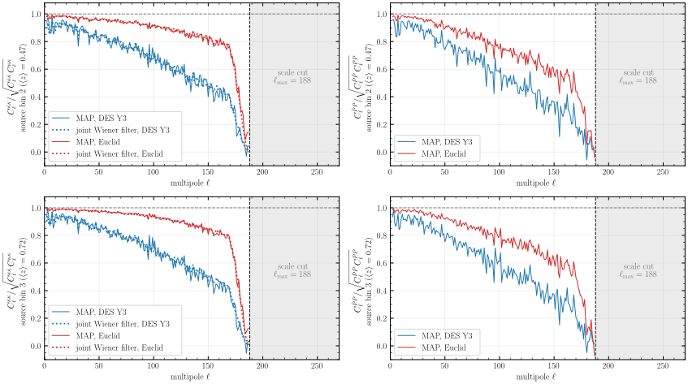
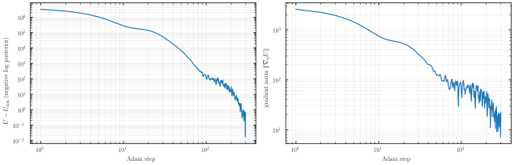

# Experiment 13 — MAP mass mapping with 2LPT ⚠️ 2048³ pending

**Goal.** We reconstruct the 3D initial conditions (IC) from two tomographic convergence maps by maximum a posteriori (MAP) optimisation, with the model of [notebook 14](../../3-sampling-and-inference/14-LPT-MassMapping.ipynb) at 416³, for the noise of DES Y3 and of Euclid. The reconstructed κ must reach the coherence of the joint Wiener filter, the lower-noise Euclid survey must beat DES Y3, and the starlet ℓ1 norm of κ must be recovered. Both runs share the forward model and the Planck18 truth cosmology: 2LPT on 22 capped equal-volume shells from 300 Mpc/h to z = 1, a per-shell resolution cut, Born convergence, and a pixel likelihood on κ. [`15-LPT-Multihost-MassMapping.py`](../../3-sampling-and-inference/15-LPT-Multihost-MassMapping.py) runs the same model sharded over several GPUs, and its 2048³ production runs are pending.

| run | survey | mesh | GPUs | nside | ℓ range (taper) | n_gal per bin [arcmin⁻²] | σ_e | Adam steps |
|---|---|---|---|---|---|---|---|---|
| `mesh_416_DES` | DES Y3 bins 2, 3 | 416³ | 1 | 256 | 2–188 (24) | 1.48 | 0.26 | 300 |
| `mesh_416_EUCLID` | Euclid IST:F | 416³ | 1 | 256 | 2–188 (24) | 7.5 | 0.21 | 400 |

*Fixed:* Adam with a cosine-decay learning rate from 0.05, eleven log-spaced frames per run, float64. The runs are published in the [`ASKabalan/jax-fli-sampling`](https://huggingface.co/datasets/ASKabalan/jax-fli-sampling) dataset under `13-LPT-MassMapping/`.

## Method

`build.py` downloads the two runs from HuggingFace and draws the figures of sections 6–15 of notebook 14 for each survey, plus the comparison of the two surveys. We measure coherences over 2 ≤ ℓ ≤ ℓ_max − taper, and compare the MAP with the truth through the κ maps, through the IC projected with the lensing kernel of each source bin (`DensityField.sky_projection`), and through the starlet ℓ1 norm of κ.

## Results

| statistic (bin 2 / bin 3) | DES Y3 | Euclid |
|---|---|---|
| κ coherence (joint Wiener filter) | 0.714 (0.716) / 0.730 (0.733) | 0.915 (0.915) / 0.933 (0.934) |
| projected-IC coherence | 0.633 / 0.646 | 0.797 / 0.821 |
| starlet ℓ1 MAP / truth, finest scale | 0.73 / 0.73 | 0.93 / 0.93 |
| χ²/N_pix, MAP (truth) | 0.992 (1.001) | 0.982 (1.001) |

Both MAPs reach the coherence of the joint Wiener filter in both bins and fit the data at χ²/N_pix just below 1. Euclid, at 0.36 times the per-pixel noise of DES, raises the κ coherence from about 0.72 to about 0.92 and the projected-IC coherence from about 0.64 to about 0.81.



**κ and projected-IC coherence, DES Y3 against Euclid.** Left: coherence of the MAP κ with the truth (solid) against that of the joint Wiener filter of both bins for the same survey (dotted). Right: coherence of the IC projected with the lensing kernel of each bin. Both MAPs follow their Wiener curves up to the taper at ℓ ≈ 164. At ℓ ≈ 100 Euclid keeps a κ coherence of about 0.93–0.95, where DES has fallen to about 0.7.


**Starlet ℓ1 norm of κ at the last step.** Five starlet scales, from the finest (left) to the coarsest, with the coefficients in units of the standard deviation of the truth at each scale, ν = w_j / σ_j. The lower panels show MAP / truth − 1, with a grey band of ±10%. Euclid stays within 10% of the truth over the bulk of the distribution at scales 2–4 and loses part of both tails at the finest scale. DES loses the high-|ν| tails at the two finest scales. Both scatter at the coarsest scale.


**IC projected with the lensing kernel, Euclid.** Truth, MAP, and truth − MAP of the projection of each source bin, on the full sky at nside 256. The residual carries only small-scale structure.



**Convergence of the MAP, DES Y3.** The negative log posterior above its lowest value (left) and its gradient norm (right). The objective drops by four decades in the first 100 steps, then decreases slowly as the cosine schedule lowers the learning rate towards step 300.

The other figures of notebook 14 are in `assets/`, with the suffix `-des` or `-euclid`:
- `fig01-loss` — objective and gradient norm;
- `fig02-kappa-filmstrip` — κ from the first guess to the final MAP;
- `fig03-lightcone` — density shells with the unperturbed lattice subtracted;
- `fig04-ic-projection`, `fig05-ic-projection-patch` — projected IC, full sky and a 16° patch;
- `fig06-ic-cube` — projected IC on the faces of the box;
- `fig07-ic-slice`, `fig08-ic-slice-steps` — raw IC on the slice through the observer;
- `fig09-ic-radial-spectra` — radial RMS profile, 3D IC coherence and transfer;
- `fig10-kappa-maps`, `fig11-kappa-coherence` — κ maps and κ coherence and transfer per survey;
- `fig12-starlet-l1-*-bin{2,3}` — starlet ℓ1 norm at the first guess, an intermediate step and the final MAP.

[`animation/animate_map_scene.gif`](animation/animate_map_scene.gif) shows the MAP moving from the first guess to the truth, for the DES Y3 run.

## How to run

```bash
# the two runs: notebook 14 on one A100 (writes MESH416_DESY3/ and MESH416_EUCLID/ next to the notebook)
# the figures, on CPU; the first run downloads the two runs (~10 GB) from HuggingFace
JAX_PLATFORMS=cpu uv run --no-sync python docs/5-experiments/13-map-lpt2-mass-mapping/build.py

# the animation of one run, from a local copy
cd docs/5-experiments/13-map-lpt2-mass-mapping/animation
hf download ASKabalan/jax-fli-sampling --repo-type dataset --include "13-LPT-MassMapping/mesh_416_DES/*" --local-dir ../data
uv run --no-sync python animate_map_prep.py --out-dir ../data/13-LPT-MassMapping/mesh_416_DES --title "DES Y3"
MAP_ANIM_FRAMES=../data/13-LPT-MassMapping/mesh_416_DES/anim_frames manim -qh animate_map_scene.py MapAnimation
```

The starlet figures need the `starlet` extra (`pycs`).
