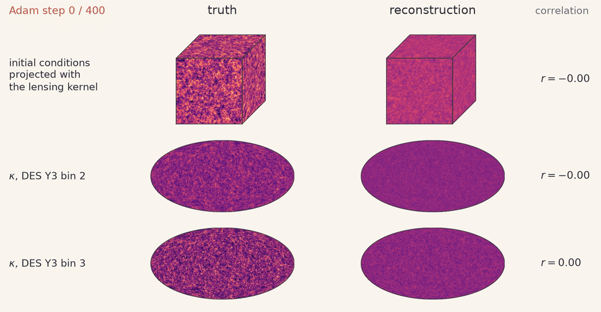
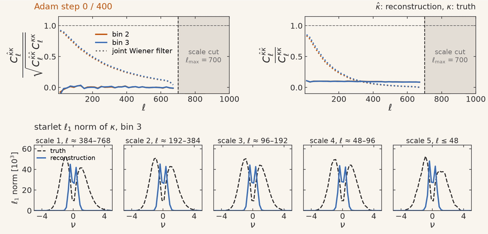
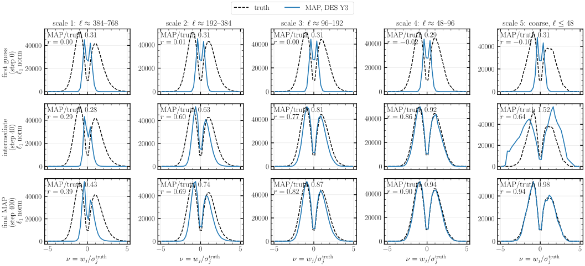

# Experiment 13 — MAP mass mapping with 2LPT ✅

**Goal.** We reconstruct the 3D initial conditions (IC) from two tomographic convergence maps by maximum a posteriori (MAP) optimisation, and test whether the reconstructed κ reaches the joint Wiener filter, the best linear estimate from the same maps. The main run solves the problem at 1200³ on 32 GPUs with [`15-LPT-Multihost-MassMapping.py`](../../3-sampling-and-inference/15-LPT-Multihost-MassMapping.py), for DES Y3 noise on maps at nside 1024 and a likelihood band of 2 ≤ ℓ ≤ 700. Two 416³ runs of [notebook 14](../../3-sampling-and-inference/14-LPT-MassMapping.ipynb) on one GPU compare DES Y3 with the lower noise of Euclid in a band of 2 ≤ ℓ ≤ 188. All runs share the Planck18 truth cosmology and the forward model, which evolves the IC with 2LPT on 22 capped equal-volume shells from 300 Mpc/h to z = 1, low-passes each shell at its resolution limit, integrates the Born convergence, and evaluates a pixel likelihood on κ band-limited with a cosine taper.

| run | survey | mesh | GPUs | nside | ℓ range (taper) | n_gal per bin [arcmin⁻²] | σ_e | Adam steps | saved steps |
|---|---|---|---|---|---|---|---|---|---|
| `mesh_1200_DES` | DES Y3 bins 2, 3 | 1200³ | 32 (16 × 2 pencils) | 1024 | 2–700 (64) | 1.48 | 0.26 | 400 | 21, every 20 steps |
| `mesh_416_DES` | DES Y3 bins 2, 3 | 416³ | 1 | 256 | 2–188 (24) | 1.48 | 0.26 | 300 | 11, log-spaced |
| `mesh_416_EUCLID` | Euclid IST:F | 416³ | 1 | 256 | 2–188 (24) | 7.5 | 0.21 | 400 | 11, log-spaced |

*Fixed:* Adam with a cosine-decay learning rate from 0.05, float64. The 1200³ run stores its 3D IC at 1024³ in float32, through a Fourier resample that keeps every mode below the new Nyquist frequency. The runs are published in the [`ASKabalan/jax-fli-sampling`](https://huggingface.co/datasets/ASKabalan/jax-fli-sampling) dataset under `13-LPT-MassMapping/`.

## Method

`build.py` downloads the three runs and draws the figures of sections 6–15 of notebook 14 for each of them into `assets/<run>/`, plus the comparison of DES Y3 and Euclid at 416³ into `assets/`. We compare the MAP convergence κ̂ with the truth κ through the cross-correlation coefficient C_ℓ^{κ̂κ} / √(C_ℓ^{κ̂κ̂} C_ℓ^{κκ}) and the power ratio C_ℓ^{κ̂κ̂} / C_ℓ^{κκ}. A Wiener estimate has equal cross- and auto-spectra, so the joint Wiener filter of both bins gives the reference value r_W for the first and r_W² for the second. Averages run over 2 ≤ ℓ ≤ ℓ_max − taper. We also compare the IC through their projection with the lensing kernel of each source bin (`DensityField.sky_projection`), and κ through its starlet ℓ1 norm. `animation/map_data.py` computes the same statistics at every saved step of the 1200³ run, and `animation/map_anim.py` renders them.

## Results

### 1200³ on 32 GPUs



**MAP reconstruction at 1200³, DES Y3.** The truth (left) and the MAP (right) over the 21 saved Adam steps, cross-faded between consecutive steps. The top row shows the IC projected with the lensing efficiency of both source bins, averaged, and drawn on the faces of the box along the rays from the observer at its centre. The two lower rows show κ of DES Y3 bins 2 and 3 in Mollweide projection. During the optimisation the box splits into the 16 × 2 pencils of the domain decomposition over 32 GPUs. The right column gives the Pearson correlation of each map with the truth at the shown step.

The MAP recovers the large-scale structure of κ first: by step 20 the Pearson correlation of κ with the truth reaches 0.58 / 0.56 in bins 2 / 3. The optimisation then refines the reconstruction until step 320, after which the correlation stays at 0.65 / 0.62, and at 0.55 for the projected IC.



**κ cross-spectra over the optimisation, 1200³.** Top left: cross-correlation coefficient C_ℓ^{κ̂κ} / √(C_ℓ^{κ̂κ̂} C_ℓ^{κκ}) of the MAP κ̂ with the truth κ, for bin 2 (orange) and bin 3 (blue), against the joint Wiener filter (dotted). Top right: power ratio C_ℓ^{κ̂κ̂} / C_ℓ^{κκ}, against the Wiener value r_W² (dotted). Both are averaged in bands of 20 multipoles. The shaded region lies beyond the scale cut ℓ_max = 700, where the forward model carries no κ. Bottom: starlet ℓ1 norm of κ in bin 3 at five scales, with the coefficients in units of the standard deviation of the truth at each scale, ν = w_j / σ_j.


**κ cross-spectra of the final MAP, 1200³.** Left: cross-correlation coefficient of the MAP κ̂ with the truth κ (solid) and of the joint Wiener filter (dotted), per multipole, for source bins 2 and 3. Right: the power ratio C_ℓ^{κ̂κ̂} / C_ℓ^{κκ} against r_W². Over 2 ≤ ℓ ≤ 636 the cross-correlation coefficient averages 0.390 / 0.402 in bins 2 / 3, equal to the Wiener value, and over 2 ≤ ℓ ≤ 164 it averages 0.746 / 0.763 against 0.742 / 0.760. The power ratio averages 0.272 / 0.267 over 2 ≤ ℓ ≤ 636.

The MAP follows the Wiener cross-correlation coefficient over the whole band up to the scale cut, so the 1200³ model extracts from the DES Y3 maps what a linear filter of the same data extracts. Its power ratio lies above r_W² over the whole band, by about a quarter at ℓ ≈ 100 (0.59 against 0.47).


**IC projected with the lensing kernel, 1200³.** Truth, MAP, and truth − MAP of the projection of each source bin, on the full sky at nside 1024. The cross-correlation coefficient of the projections is 0.91 below ℓ = 30, falls to 0.64–0.67 at ℓ = 60–100 and to 0.23–0.26 at ℓ = 150–300, and stays below 0.07 above ℓ = 300, so the residual carries the small scales.



**Starlet ℓ1 norm of κ in bin 3, 1200³.** Rows: the first guess (step 0), an intermediate step (step 40) and the final MAP (step 400). Columns: five starlet scales, from ℓ ≈ 384–768 (left) to ℓ ≤ 48. Each panel gives the ratio of the summed ℓ1 norm of the MAP to that of the truth, and the correlation r of the starlet coefficients. The final MAP recovers 98 and 94 per cent of the ℓ1 norm at the two coarsest scales, 87 and 74 per cent at the next two, and 43 per cent at the finest, where the shape noise of DES dominates.

### Summary of the three runs

| statistic (bin 2 / bin 3) | 1200³ DES Y3 | 416³ DES Y3 | 416³ Euclid |
|---|---|---|---|
| ℓ band of the averages | 2–636 | 2–164 | 2–164 |
| κ cross-correlation coefficient (joint Wiener filter) | 0.390 (0.390) / 0.402 (0.402) | 0.714 (0.716) / 0.730 (0.733) | 0.915 (0.915) / 0.933 (0.934) |
| same, over 2 ≤ ℓ ≤ 164 | 0.746 (0.742) / 0.763 (0.760) | 0.714 (0.716) / 0.730 (0.733) | 0.915 (0.915) / 0.933 (0.934) |
| κ power ratio C_ℓ^{κ̂κ̂} / C_ℓ^{κκ} | 0.272 / 0.267 | 0.575 / 0.582 | 0.871 / 0.878 |
| projected-IC cross-correlation coefficient | 0.214 / 0.238 | 0.633 / 0.646 | 0.797 / 0.821 |
| starlet ℓ1 MAP / truth, finest scale | 0.46 / 0.43 (ℓ ≈ 384–768) | 0.73 / 0.73 (ℓ ≈ 96–192) | 0.93 / 0.93 (ℓ ≈ 96–192) |
| χ²/N_pix, MAP (truth) | 0.999 (1.000) | 0.992 (1.001) | 0.982 (1.001) |

Every MAP reaches the Wiener value of its own survey and band, and fits the data at χ²/N_pix just below 1. On the band the three runs share, 2 ≤ ℓ ≤ 164, the 1200³ and 416³ DES Y3 runs both sit on their Wiener values. The 1200³ run extends the reconstruction to ℓ = 700, and over 300 ≤ ℓ ≤ 636, where the DES shape noise dominates, it still follows a Wiener value that averages about 0.2.

### DES Y3 against Euclid at 416³

Euclid, at 0.36 times the per-pixel noise of DES, raises the κ cross-correlation coefficient from about 0.72 to about 0.92 and that of the projected IC from about 0.64 to about 0.81.


**κ and projected-IC cross-correlation, DES Y3 against Euclid at 416³.** Left: cross-correlation coefficient of the MAP κ̂ with the truth κ (solid) against that of the joint Wiener filter of both bins for the same survey (dotted). Right: cross-correlation coefficient of the IC projected with the lensing kernel of each bin, P̂ for the MAP and P for the truth. The shaded region lies beyond the scale cut ℓ_max = 188. Both MAPs follow their Wiener curves up to the taper at ℓ ≈ 164. At ℓ ≈ 100 Euclid keeps a κ cross-correlation coefficient of about 0.93–0.95, where DES has fallen to about 0.7.


**Starlet ℓ1 norm of κ at the last step, 416³.** Five starlet scales, from the finest (left) to the coarsest, with the coefficients in units of the standard deviation of the truth at each scale, ν = w_j / σ_j. The lower panels show MAP / truth − 1, with a grey band of ±10%. Euclid stays within 10% of the truth over the bulk of the distribution at scales 2–4 and loses part of both tails at the finest scale. DES loses the high-|ν| tails at the two finest scales. Both scatter at the coarsest scale.

### Figures of each run

Each run has the figures of notebook 14 in its own folder, `assets/mesh_1200_DES/`, `assets/mesh_416_DES/` and `assets/mesh_416_EUCLID/`:
- `fig01-loss` — objective and gradient norm;
- `fig02-kappa-filmstrip` — κ from the first guess to the final MAP;
- `fig03-lightcone` — density shells with the unperturbed lattice subtracted;
- `fig04-ic-projection`, `fig05-ic-projection-patch` — projected IC, full sky and a 16° patch;
- `fig06-ic-cube` — projected IC on the faces of the box;
- `fig07-ic-slice`, `fig08-ic-slice-steps` — raw IC on the slice through the observer;
- `fig09-ic-radial-spectra` — radial RMS profile of the IC, and the cross-correlation coefficient P^{δ̂δ} / √(P^{δ̂δ̂} P^{δδ}) and power ratio P^{δ̂δ̂} / P^{δδ} of the 3D IC;
- `fig10-kappa-maps`, `fig11-kappa-spectra` — κ maps, and the κ cross-correlation coefficient and power ratio against the joint Wiener filter;
- `fig12-starlet-l1-bin{2,3}` — starlet ℓ1 norm at the first guess, an intermediate step and the final MAP.

## How to run

```bash
# 1200^3: script 15 on 32 GPUs (8 nodes x 4), writing MESH1200_DESY3/
srun python docs/3-sampling-and-inference/15-LPT-Multihost-MassMapping.py --mesh 1200 --pdims 16 2 --halo-cells 20 \
  --survey des --map2alm-method jax_cuda --map-max-iter 400 --n-snapshots 20 --seed 0 --gpus-per-node 4 \
  --paint-density 1024 --density-precision float32 --nside 1024 --paint-nside 512 --ell-max 700 --ell-taper 64 \
  --out-dir MESH1200_DESY3
# 416^3: notebook 14 on one A100 (writes MESH416_DESY3/ and MESH416_EUCLID/ next to the notebook)

# the figures, on CPU (~35 GB of RAM); the first run downloads the three runs (~140 GB) from HuggingFace
JAX_PLATFORMS=cpu uv run --no-sync python docs/5-experiments/13-map-lpt2-mass-mapping/build.py

# the animation of the 1200^3 run: the statistics of the 21 saved steps (~1.5 h), then the videos (needs ffmpeg)
cd docs/5-experiments/13-map-lpt2-mass-mapping/animation
JAX_PLATFORMS=cpu uv run --no-sync python map_data.py
uv run --no-sync python map_anim.py
```

`Catalog.from_parquet` reads through the `datasets` library, which keeps an Arrow copy of every file it loads under `HF_DATASETS_CACHE` (about 100 GB for `map_data.py`); point it at a scratch folder for these runs. The starlet figures need the `starlet` extra (`pycs`).
