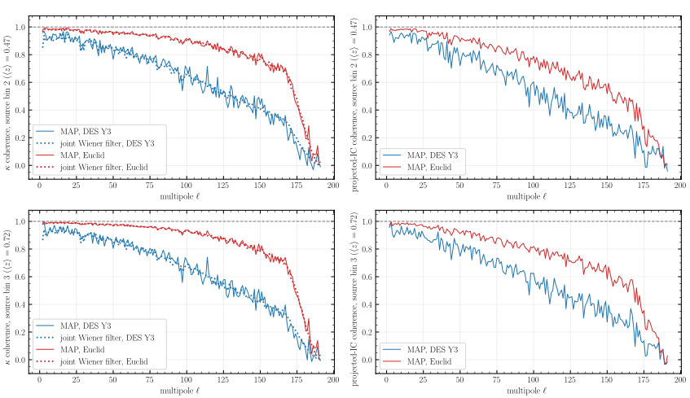
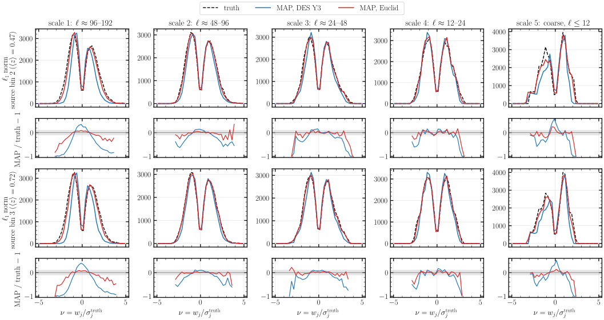
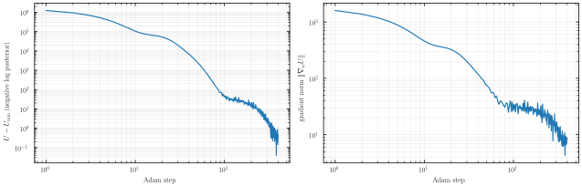

# Experiment 14 — MAP mass mapping with 2LPT on several GPUs ⚠️ pilot

## Goal

We reconstruct the 3D initial conditions (IC) from two tomographic convergence maps by maximum a posteriori (MAP) optimisation, with the model of [notebook 14](../../3-sampling-and-inference/14-LPT-MassMapping.ipynb) sharded over several GPUs. We check that the sharded MAP recovers the same physics as the single-GPU notebook. The reconstructed κ must reach the coherence of the joint Wiener filter, the lower-noise Euclid survey must beat DES Y3, and the starlet ℓ1 norm of κ must be recovered. The truths differ between the two meshes, so we compare these statistics and not the maps pixel by pixel.

The two pilot runs below are small (300³ on 4 GPUs). The 2048³ production runs will replace them and will be loaded from HuggingFace.

| run | survey | mesh | GPUs (pdims) | halo | nside | ℓ range (taper) | n_gal per bin [arcmin⁻²] | σ_e | Adam steps |
|---|---|---|---|---|---|---|---|---|---|
| `PILOT_MESH512_DES` | DES Y3 bins 2, 3 | 300³ | 4 (4 × 1) | 20 cells | 128 | 2–192 (32) | 1.48 | 0.26 | 400 |
| `PILOT_MESH512_EUCLID` | Euclid IST:F | 300³ | 4 (4 × 1) | 20 cells | 128 | 2–192 (32) | 7.5 | 0.21 | 400 |
| notebook 14, Part I | DES Y3 bins 2, 3 | 416³ | 1 | — | 256 | 2–188 (24) | 1.48 | 0.26 | 300 |
| notebook 14, Part II | Euclid IST:F | 416³ | 1 | — | 256 | 2–188 (24) | 7.5 | 0.21 | 400 |

The run names say 512, but the pilot line of `run.sh` sets the mesh to 300. All four runs share the forward model and the Planck18 truth cosmology: 2LPT on 22 capped equal-volume shells from 300 Mpc/h to z = 1, a per-shell resolution cut, Born convergence, and a pixel likelihood on κ.

## Method

[`15-LPT-Multihost-MassMapping.py`](../../3-sampling-and-inference/15-LPT-Multihost-MassMapping.py) is notebook 14 written as a one-process-per-GPU script. It shards the white-noise field in x-slabs and replicates κ before every spherical harmonic transform. It writes the same parquet layout as the notebook, with frames every 10 Adam steps. `build.py` reads the two pilots from `data/` and draws the notebook's figures, which are defined in its sections 6–15.

## Results

| statistic (bin 2 / bin 3) | DES Y3, pilot | DES Y3, 416³ | Euclid, pilot | Euclid, 416³ |
|---|---|---|---|---|
| κ coherence (joint Wiener filter) | 0.702 (0.698) / 0.720 (0.714) | 0.714 (0.716) / 0.730 (0.733) | 0.904 (0.903) / 0.924 (0.923) | 0.915 (0.915) / 0.933 (0.934) |
| projected-IC coherence | 0.632 / 0.650 | 0.633 / 0.646 | 0.796 / 0.829 | 0.797 / 0.821 |
| starlet ℓ1 MAP / truth, finest scale | 0.75 / 0.73 | 0.73 / 0.73 | 0.93 / 0.93 | 0.93 / 0.93 |
| χ²/N_pix, MAP (truth) | 0.971 (1.001) | 0.992 (1.001) | 0.934 (1.001) | 0.982 (1.001) |

Coherences are averaged over 2 ≤ ℓ ≤ ℓ_max − taper. The pilot numbers are printed by `build.py`. The 416³ numbers are the saved outputs of notebook 14. Within each survey the sharded MAP matches the single-GPU MAP to about 0.01 in every coherence and ends at the Wiener bound in both. The pilot MAP fits the data slightly below χ²/N_pix = 1, more so than at 416³.



**κ and projected-IC coherence, DES Y3 against Euclid.** Left: coherence of the MAP κ with the truth (solid), against the coherence of the joint Wiener filter of both bins for the same survey (dotted). Right: coherence of the IC projected with the lensing kernel of each bin (`DensityField.sky_projection`). Both MAPs follow their Wiener curves up to the taper at ℓ ≈ 160. Euclid, at 0.36 times the DES per-pixel noise, keeps a coherence above 0.9 up to ℓ ≈ 100, where DES has fallen to 0.6.



**Starlet ℓ1 norm of κ at the last step.** Five starlet scales, from the finest (left) to the coarsest. The coefficients are expressed in units of the truth's standard deviation at each scale, ν = w_j / σ_j. The lower panels show MAP / truth − 1, and the grey band is ±10 %. Euclid stays within 10 % of the truth over the bulk of the distribution at scales 2–5, and loses part of the negative tail at the finest scale. DES loses the high-|ν| tails at the two finest scales, where its noise dominates.


**IC projected with the lensing kernel, Euclid.** Truth, MAP, and truth − MAP of the projection of each source bin, on the full sky at nside 128. The residual carries only small-scale structure.



**Convergence of the MAP, DES Y3.** The negative log posterior above its lowest value (left) and its gradient norm (right). The objective drops by four decades in the first 100 steps, then decreases slowly as the cosine schedule lowers the learning rate towards step 400.

The other figures of notebook 14 are in `assets/`, with the suffix `-des` or `-euclid`:
- `fig01-loss` — objective and gradient norm;
- `fig02-kappa-filmstrip` — κ from the first guess to the final MAP;
- `fig03-lightcone` — density shells with the unperturbed lattice subtracted;
- `fig04-ic-projection`, `fig05-ic-projection-patch` — projected IC, full sky and a 16° patch;
- `fig06-ic-cube` — projected IC on the faces of the box;
- `fig07-ic-slice`, `fig08-ic-slice-steps` — raw IC on the slice through the observer;
- `fig09-ic-radial-spectra` — radial RMS profile, 3D IC coherence and transfer;
- `fig10-kappa-maps`, `fig11-kappa-coherence` — κ maps and κ coherence and transfer per survey;
- `fig12-starlet-l1-*-bin{2,3}` — starlet ℓ1 norm at the first guess, an intermediate step and the final MAP.

[`animation/animate_map_scene.gif`](animation/animate_map_scene.gif) shows the MAP moving from the first guess to the truth. It was rendered from the single-GPU 416³ DES Y3 run of notebook 14.

## How to run

```bash
# the pilots, on Jean Zay (writes docs/3-sampling-and-inference/results_15/, then move it to data/)
cd docs/3-sampling-and-inference && WHAT=pilot bash run.sh

# the figures, on CPU
JAX_PLATFORMS=cpu uv run python docs/5-experiments/14-map-lpt2-mass-mapping/build.py

# the animation of one run
cd docs/5-experiments/14-map-lpt2-mass-mapping/animation
uv run --no-sync python animate_map_prep.py --out-dir ../data/PILOT_MESH512_DES --title "DES Y3"
MAP_ANIM_FRAMES=../data/PILOT_MESH512_DES/anim_frames manim -qh animate_map_scene.py MapAnimation
```

The starlet figures need the `starlet` extra (`pycs`). The pilot parquet files are local only; they are not yet on HuggingFace.
