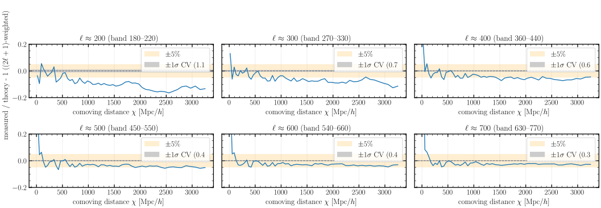
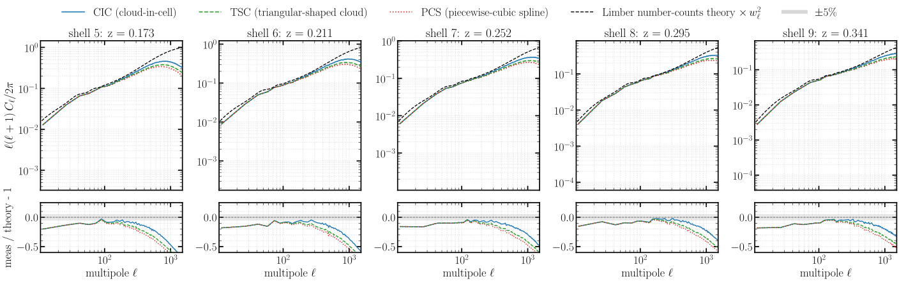
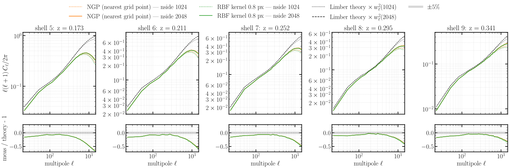
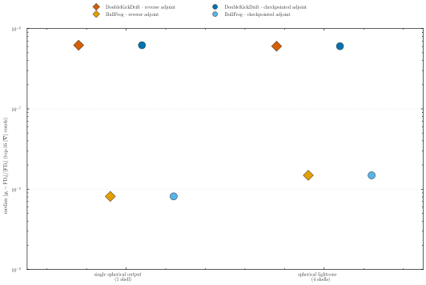

# Experiments

End-to-end reproduction studies behind the **jax-fli / jaxpm** methods paper. Each experiment lives
in its own folder with a hand-written `README.md` (the goal + the exact run grid), a `run.sh` that
launches the runs, and — once the data exists — a runnable Python script that saves the figures
(SVG for the web, PDF for the paper). ⚠️ marks experiments **not yet run**; ✅ marks finished ones.

## Running

Each experiment's `run.sh` sources the shared [`_launch_common.sh`](_launch_common.sh) and submits
via `fli-launcher` → `fli-simulate`:

```bash
bash run.sh                 # submit to SLURM (MODE=sbatch, the default → the cluster)
MODE=local  bash run.sh     # run locally via mpirun (use tiny meshes)
MODE=dryrun bash run.sh     # print the resolved commands, submit nothing
```

**Precision:** every run is **float64** (`--enable-x64`) *except* [Experiment 11](11-scaling/README.md)
(scaling), which is run in **both** float32 and float64. **All experiments run on the cluster except
[Experiment 09](09-gradient-validation/README.md)** — the gradient correctness / stability check runs
**locally** (CPU, small mesh) and ships its own Python scripts instead of a `run.sh`.

You can also check the results stored on the [HuggingFace Hub](https://huggingface.co/datasets/ASKabalan/jax-fli-experiments),
or explore them interactively using the [Results Explorer dashboard](https://askabalan-jax-fli-results.hf.space/).

## Simulation accuracy (0–7)

- **00 — [CosmoGrid reference](00-cosmogrid-reference/README.md)** ✅ — ground-truth density + κ
  (already on HuggingFace); one ray-traced reference run pending.

  [](00-cosmogrid-reference/README.md)

- **01 — [Resolution convergence](01-resolution-convergence/README.md)** ✅ — per-shell spherical
  `C_ℓ` converging with particle count, 512³ → 4096³.

  [](01-resolution-convergence/README.md)

- **02 — [Mass assignment + force deconvolution](02-mass-assignment/README.md)** ✅ — CIC / TSC / PCS
  × force-deconvolution on/off, impact on the spherical `C_ℓ`.

  [](02-mass-assignment/README.md)

- **03 — [Spherical painting + pixel-window](03-spherical-painting/README.md)** ✅ — interpolation
  scheme (NGP / bilinear / RBF) and HEALPix pixel-window impact.

  [](03-spherical-painting/README.md)

- **04 — [Step convergence](04-step-convergence/README.md)** ✅ — minimum step budget and the
  kdk / dkd / BullFrog comparison on the per-shell spherical `C_ℓ` vs step count.

  [](04-step-convergence/README.md)

- **05a — [Spacing & stepping: drift on the lightcone](05a-spacing-n-stepping-drift/README.md)** ✅ — the drift
  sharpens thick-shell density `C_ℓ`; the Born convergence is unaffected.

  [](05a-spacing-n-stepping-drift/README.md)

- **05b — [Spacing & stepping: drift, 3-bin](05b-spacing-n-stepping-3bin/README.md)** ⚠️ — the deeper
  5 Gpc/h, 2560³, three-source-bin tomographic counterpart of 05a (scale-factor spacing).
- **05c — [Spacing & stepping: equal-volume, 3-bin](05c-spacing-n-stepping-equal-vol/README.md)** ⚠️ — 05b with
  **equal-volume** shells (the near-shell shot-noise lever) instead of scale-factor spacing.
- **06 — [Match CosmoGrid shells](06-cosmogrid-shells/README.md)** ✅ — per-shell density `C_ℓ` +
  cross-correlation vs the CosmoGrid shells (needs the CosmoGrid shell edges).

  [](06-cosmogrid-shells/README.md)

- **07 — [Born lensing vs CosmoGrid](07-born-lensing/README.md)** ✅ — convergence `C_ℓ` +
  cross-correlation of our Born κ vs the CosmoGrid lensed maps.

  [](07-born-lensing/README.md)

## Weak lensing on a cut sky

- **08 — [Masked shear](08-masked-shear/README.md)** ✅ — Kaiser–Squires κ → γ on a cut sky (DES Y3
  footprint + observer visibility masks), mask-decoupled `EE` spectra. Loads the CosmoGrid
  convergence from Experiment 0.

  [](08-masked-shear/README.md)

## Performance & gradients

- **09 — [Gradient through the lightcone](09-gradient-validation/README.md)** ✅ *(local)* — adjoint
  `∂L/∂δ` vs finite differences (correctness, float64) + reversible-reconstruction stability: error vs
  step count (float32) and exactness vs number of saved shells. The lightcone gradient accumulation that
  pmwd / DISCO-DJ do not provide.

  [](09-gradient-validation/README.md)

- **11 — [Performance: strong & weak scaling](11-scaling/README.md)** ⚠️ — PM strong & weak scaling
  (perf + memory) on slab decompositions, in float32 *and* float64.
- **12 — [Gradient scaling](12-scaling-gradient/README.md)** ⚠️ — strong & weak scaling of the
  initial-condition gradient (`reverse` and `checkpointed` adjoints) on slab decompositions; absorbs the
  former adjoint memory / checkpoint-count study.

## Field-level inference (13–15) — blocked on the inference pipeline

- **13 — [Toy field-level (full sky)](13-inference-toy/README.md)** ⚠️ — smallest end-to-end posterior.
- **14 — [Field-level vs CosmoGrid shear](14-inference-cosmogrid-shear/README.md)** ⚠️ — DES Y3 mask.
- **15 — [Power-spectrum level vs theory](15-inference-power-spectrum/README.md)** ⚠️ — decoupled
  angular `C_ℓ` vs theory.

```{toctree}
:hidden:

00-cosmogrid-reference/README
01-resolution-convergence/README
02-mass-assignment/README
03-spherical-painting/README
04-step-convergence/README
05a-spacing-n-stepping-drift/README
05b-spacing-n-stepping-3bin/README
05c-spacing-n-stepping-equal-vol/README
06-cosmogrid-shells/README
07-born-lensing/README
08-masked-shear/README
09-gradient-validation/README
11-scaling/README
12-scaling-gradient/README
13-inference-toy/README
14-inference-cosmogrid-shear/README
15-inference-power-spectrum/README
```
