# Experiments

[](https://jax-fli.readthedocs.io/en/latest/)
[](https://huggingface.co/datasets/ASKabalan/jax-fli-experiments)
[](https://huggingface.co/datasets/ASKabalan/jax-fli-scaling)
[](https://huggingface.co/datasets/ASKabalan/jax-fli-sampling)
[](https://askabalan-jax-fli-results.hf.space/)

End-to-end reproduction studies behind the **jax-fli / jaxpm** methods paper.

Each experiment has its own folder with a `README.md` (the goal, the run grid and the results), a `run.sh` that launches the runs, and a Python script that saves the figures once the data exist (SVG for the web, PDF for the paper).

✅ marks finished experiments and ⚠️ experiments with runs still pending.

## Running

The `run.sh` of each experiment sources the shared [`_launch_common.sh`](_launch_common.sh) and submits through `fli-launcher` → `fli-simulate`:

```bash
bash run.sh                 # submit to SLURM (MODE=sbatch, the default → the cluster)
MODE=local  bash run.sh     # run locally via mpirun (use tiny meshes)
MODE=dryrun bash run.sh     # print the resolved commands, submit nothing
```

Every run is **float64** (`--enable-x64`), except the scaling runs of [Experiment 11](11-scaling/README.md), which use **both** float32 and float64. Every experiment runs on the cluster, except [Experiment 09](09-gradient-validation/README.md), whose gradient checks run **locally** at a 16³ mesh and ship their own Python scripts in place of a `run.sh`.

The accuracy runs are stored in the [`jax-fli-experiments`](https://huggingface.co/datasets/ASKabalan/jax-fli-experiments) dataset, which the [Results Explorer dashboard](https://askabalan-jax-fli-results.hf.space/) browses interactively. The scaling benchmarks of experiments 11 and 12 are in [`jax-fli-scaling`](https://huggingface.co/datasets/ASKabalan/jax-fli-scaling), and the MAP and chain outputs of experiment 13 and of notebooks 14, 16 and 17 are in [`jax-fli-sampling`](https://huggingface.co/datasets/ASKabalan/jax-fli-sampling).

## Simulation accuracy (0–7)

- **00 — [CosmoGrid reference](00-cosmogrid-reference/README.md)** ✅ — ground-truth density + κ (already on HuggingFace); one ray-traced reference run pending.

  [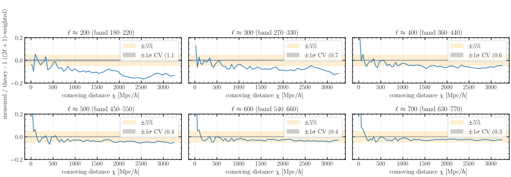](00-cosmogrid-reference/README.md)

- **01 — [Resolution convergence](01-resolution-convergence/README.md)** ✅ — per-shell spherical `C_ℓ` converging with particle count, 512³ → 3072³.

  [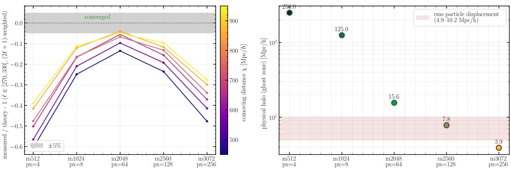](01-resolution-convergence/README.md)

- **02 — [Mass assignment + force deconvolution](02-mass-assignment/README.md)** ✅ — CIC / TSC / PCS × force-deconvolution on/off, impact on the spherical `C_ℓ`.

  [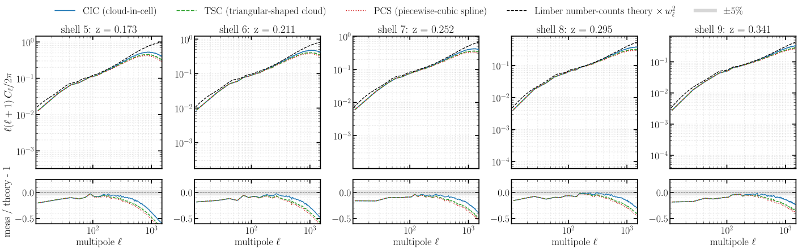](02-mass-assignment/README.md)

- **03 — [Spherical painting + pixel-window](03-spherical-painting/README.md)** ✅ — interpolation scheme (NGP / bilinear / RBF) and HEALPix pixel-window impact.

  [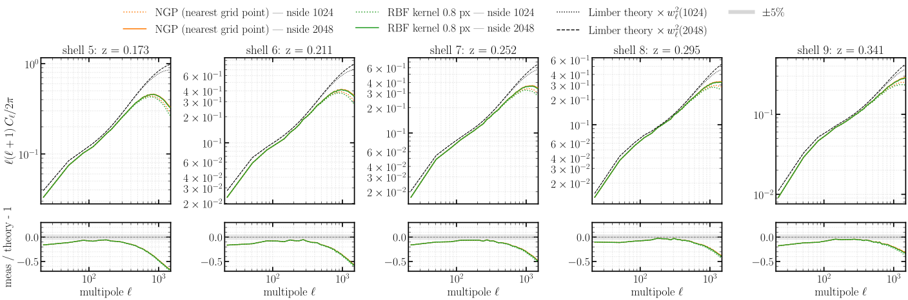](03-spherical-painting/README.md)

- **04 — [Step convergence](04-step-convergence/README.md)** ✅ — minimum step budget and the kdk / dkd / BullFrog comparison on the per-shell spherical `C_ℓ` vs step count.

  [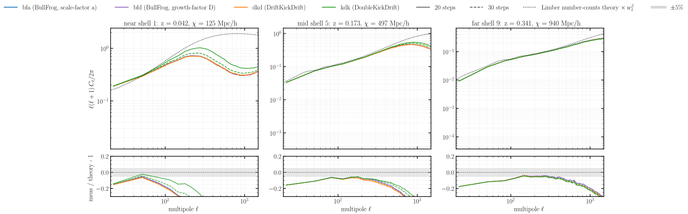](04-step-convergence/README.md)

- **05a — [Spacing & stepping: drift on the lightcone](05a-spacing-n-stepping-drift/README.md)** ✅ — the drift sharpens thick-shell density `C_ℓ`; the Born convergence is unaffected.

  [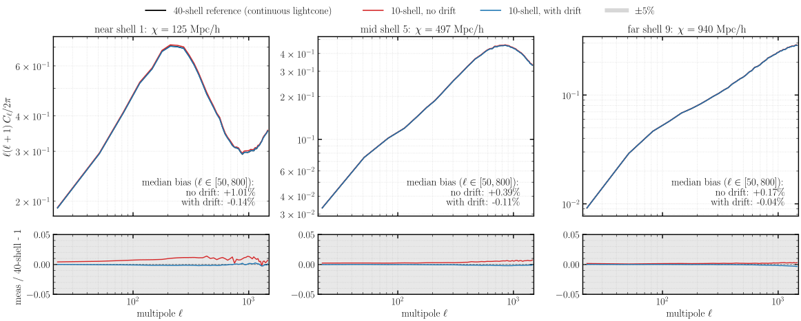](05a-spacing-n-stepping-drift/README.md)

- **05b — [Spacing & stepping: drift, 3-bin](05b-spacing-n-stepping-3bin/README.md)** ✅ — the deeper 5 Gpc/h, 2560³, three-source-bin tomographic counterpart of 05a (scale-factor spacing).

  [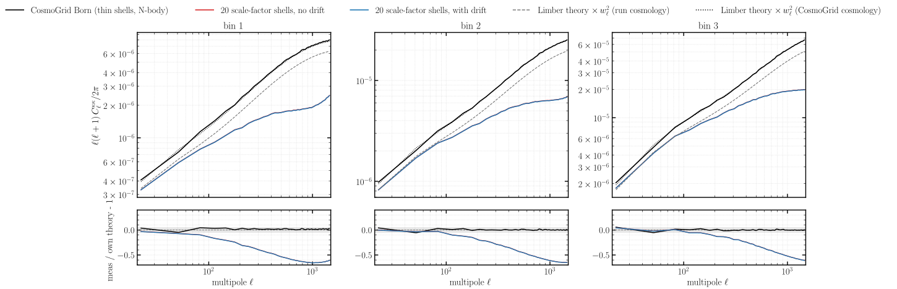](05b-spacing-n-stepping-3bin/README.md)

- **05c — [Spacing & stepping: equal-volume, 3-bin](05c-spacing-n-stepping-equal-vol/README.md)** ✅ — 05b with **equal-volume** shells (the near-shell shot-noise lever) instead of scale-factor spacing.

  [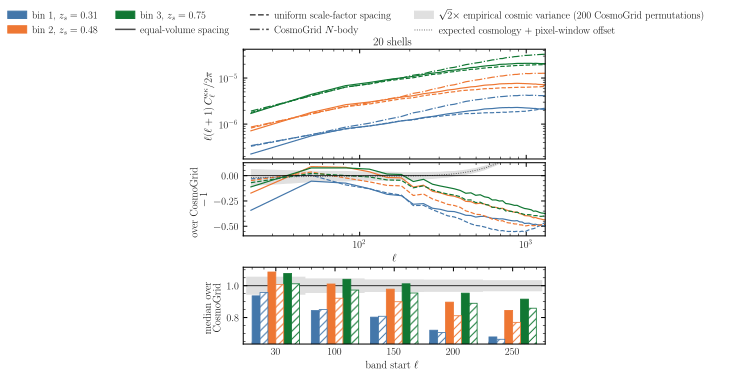](05c-spacing-n-stepping-equal-vol/README.md)

- **05d — [Step & stepping convergence (equal-volume, 3-bin)](05d-spacing-n-stepping-steps/README.md)** ✅ — BullFrog D-stepping is step-converged down to 20 steps at the production geometry; KDK a-stepping converges from above (+36% excess at 20 steps, still +8% at 50).

  [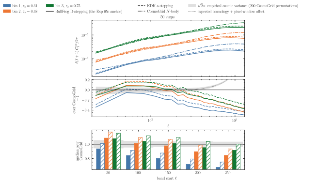](05d-spacing-n-stepping-steps/README.md)

- **05e — [Mesh ladder (equal-volume, 3-bin)](05e-spacing-n-stepping-mesh/README.md)** ✅ — 512³ → 4096³ at the fixed bf/D/50-step production point: tomographic Born κ converges at 2048³, 3072³ sits on the 2560³ anchor at every band, 1024³/512³ lose 10–78% of power.

  [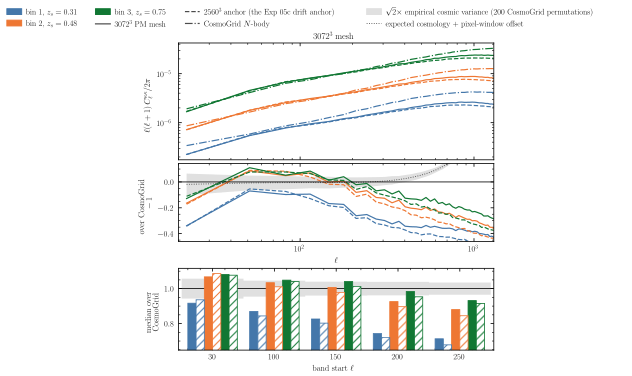](05e-spacing-n-stepping-mesh/README.md)

- **05f — [Mesh plateau diagnosis](05f-mesh-plateau-diagnosis/README.md)** ✅ — mesh × solver (bf / kdk) × five shell spacings × Born resolution cut at 100 steps: κ keeps rising up to 4096³; kdk, equal volume capped at 150 Mpc/h from r = 0, 4096³, no cut matches CosmoGrid to within 2% over ℓ ∈ [30, 300).

  [](05f-mesh-plateau-diagnosis/README.md)

- **06 — [Match CosmoGrid shells](06-cosmogrid-shells/README.md)** ✅ — per-shell density `C_ℓ` + cross-correlation vs the CosmoGrid shells (needs the CosmoGrid shell edges).

  [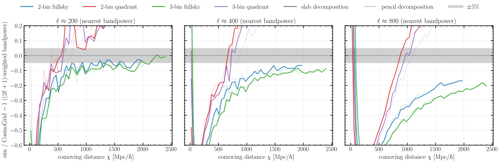](06-cosmogrid-shells/README.md)

- **07 — [Born lensing vs CosmoGrid](07-born-lensing/README.md)** ✅ — convergence `C_ℓ` + cross-correlation of our Born κ vs the CosmoGrid lensed maps.

  [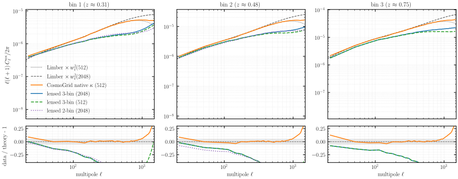](07-born-lensing/README.md)

## Weak lensing on a cut sky

- **08 — [Masked shear](08-masked-shear/README.md)** ✅ — Kaiser–Squires κ → γ on a cut sky (DES Y3 footprint + observer visibility masks), mask-decoupled `EE` spectra. Loads the CosmoGrid convergence from Experiment 0.

  [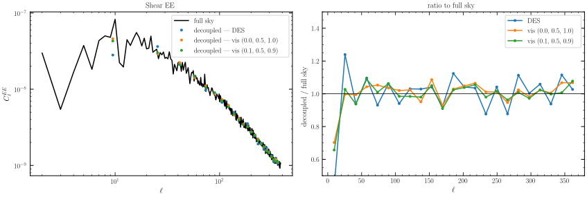](08-masked-shear/README.md)

## Performance & gradients

- **09 — [Gradient through the lightcone](09-gradient-validation/README.md)** ✅ *(local)* — the adjoint `∂L/∂δ` against per-voxel finite differences and the transpose test (float64, 16³), and the scratch memory of the `reverse` and `checkpointed` adjoints against the integration steps, the step-checkpoints and the saved shells. The lightcone gradient accumulation that pmwd / DISCO-DJ do not provide.

  [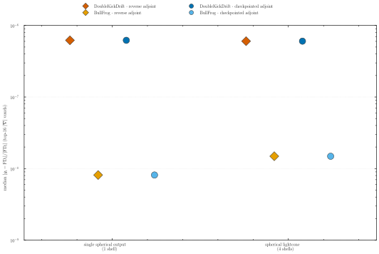](09-gradient-validation/README.md)

- **11 — [Performance: strong & weak scaling](11-scaling/README.md)** ✅ — PM strong & weak scaling (perf + memory) on slab decompositions, in float32 *and* float64.

  [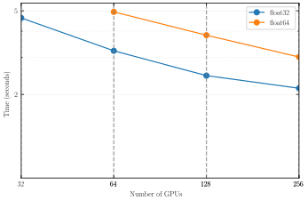](11-scaling/README.md)

- **12 — [Gradient scaling](12-scaling-gradient/README.md)** ✅ — strong & weak scaling of the initial-condition gradient (`reverse` and `checkpointed` adjoints) on slab decompositions; absorbs the former adjoint memory / checkpoint-count study.

  [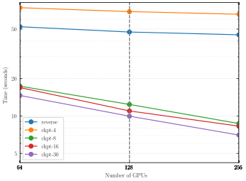](12-scaling-gradient/README.md)

## Field-level inference (13)

- **13 — [MAP mass mapping with 2LPT](13-map-lpt2-mass-mapping/README.md)** ✅ *(1200³ DES Y3 run on 32 GPUs; 416³ DES Y3 and Euclid runs of notebook 14)* — MAP reconstruction of the IC from two tomographic κ maps. At 1200³ the reconstructed κ follows the cross-correlation coefficient of the joint Wiener filter up to the scale cut at ℓ = 700 (0.39–0.40 averaged over 2 ≤ ℓ ≤ 636, 0.75–0.76 over 2 ≤ ℓ ≤ 164). At 416³ both surveys reach their Wiener values, 0.71–0.73 for DES Y3 and 0.92–0.93 for Euclid.

  [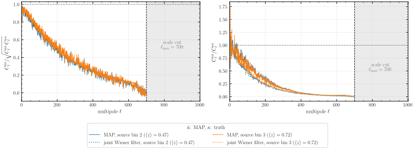](13-map-lpt2-mass-mapping/README.md)

```{toctree}
:hidden:

00-cosmogrid-reference/README
01-resolution-convergence/README
02-mass-assignment/README
03-spherical-painting/README
04-step-convergence/README
05a-spacing-n-stepping-drift/README
05b-spacing-n-stepping-3bin/README
05c-spacing-n-stepping-equal-vol/README
05d-spacing-n-stepping-steps/README
05e-spacing-n-stepping-mesh/README
05f-mesh-plateau-diagnosis/README
06-cosmogrid-shells/README
07-born-lensing/README
08-masked-shear/README
09-gradient-validation/README
11-scaling/README
12-scaling-gradient/README
13-map-lpt2-mass-mapping/README
```
