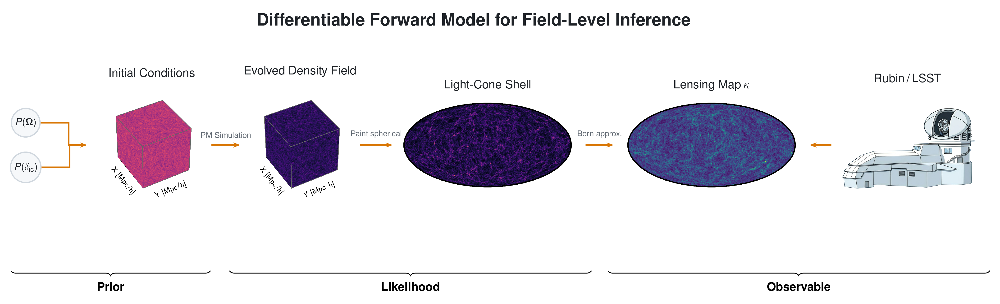

# JAX Field Level Inference

**jax-fli** is a JAX toolkit for end-to-end **differentiable** cosmological forward modeling. It chains
Gaussian initial conditions → Lagrangian Perturbation Theory → Particle-Mesh N-body → light-cone
painting (3D, flat-sky, HEALPix) → weak-lensing convergence and shear (Born or ray-tracing) → angular
power spectra, with multi-GPU sharding throughout and probabilistic inference via NumPyro / BlackJAX.

These pages are the tutorials and reference. Each notebook is committed with its outputs and where run on a HPC cluster, so you can reproduce the figures and results by running the notebook on a GPU / cluster. or lower the resolution and running on your laptop.

The documentation is organized into four sections:

## Introduction & basics

1. [Library Fundamentals](1-introduction-and-basics/01-basics.ipynb) — the four field types,
   painting to 3-D / flat-sky / HEALPix, power spectra, and saving catalogs.
2. [LPT Lightcone](1-introduction-and-basics/02-LPT-Simulation.ipynb) — a Zel'dovich lightcone,
   comparison to theory, and **window deconvolution + shot-noise subtraction**.
3. [PM Simulation](1-introduction-and-basics/03-PM-Simulation.ipynb) — the BullFrog N-body solver
   and 3-D $P(k)$ vs Halofit with CIC deconvolution + shot noise.
4. [SPMD Basics](1-introduction-and-basics/04-SPMD-Basics.md) — how a single device mesh shards the
   whole pipeline: the M (pixels) / N (bins) convention and choosing the mesh shape.
5. [Distributed PM](1-introduction-and-basics/05-Distributed-PM.ipynb) — multi-device sharding,
   halo exchange, and distributed painting.

## Advanced usage

6. [PM Interpolation](2-advanced-usage/06-PM-Interpolation.ipynb) — `TelephotoInterp` /
   `OnionTiler` for shells that reach beyond the box.
7. [Drift on the Lightcone](2-advanced-usage/07-Drift-on-Lightcone.ipynb) — drifting particles to
   their lightcone-crossing epoch so the density field needs fewer, thicker shells.
8. [Advanced PM](2-advanced-usage/08-Advanced-PM.ipynb) — PGD small-scale correction and shell
   partitioning (equal width vs equal volume).
9. [Weak Lensing](2-advanced-usage/09-Lensing.ipynb) — Born + ray-traced convergence, shear maps,
   and saving convergence/shear catalogs.
10. [External Catalogs](2-advanced-usage/10-External-Catalog.ipynb) — loading CosmoGrid and
   GowerStreet lightcones.
11. [Multi-host PM](2-advanced-usage/11-multi-host-pm.md) — launching across nodes and validating
    convergence against a CosmoGrid reference.

## Sampling & inference

12. [Probabilistic Modeling](3-sampling-and-inference/12-Probabilistic-Modeling.ipynb) — the
    forward-model builder, the `Configurations` dataclass, and NumPyro / BlackJAX wrappers.
13. [Rosenbrock](3-sampling-and-inference/13-Rosen.ipynb) — an MCMC sanity check on a known target
    before touching cosmology.
14. [LPT Lensing Inference](3-sampling-and-inference/14-LPTLensingInference.ipynb) — a small
    end-to-end Bayesian posterior over cosmology + initial conditions from an LPT lensing map.
15. [Full-Field Inference](3-sampling-and-inference/15-FullFieldInference.ipynb) — full-field
    posterior with the PM forward model.

See the [Sampling & inference](3-sampling-and-inference/README.md) index for the
[configuration options](3-sampling-and-inference/configurations-options.md) and the matching
command-line entry points.

## Scripts & utilities

Command-line entry points for batch / HPC runs — one page per script under
[Scripts & utilities](4-scripts-and-utilities/README.md).

## Experiments

End-to-end reproduction studies behind the methods paper — each a self-contained, runnable script
that produces (initial conditions → LPT / N-body → light-cone → lensing → statistics / inference) on
real reference data. Finished studies cover the CosmoGrid reference maps, resolution /
mass-assignment / spherical-painting / step convergence, shell spacing and drift on the light-cone,
CosmoGrid-shell and Born-lensing validation, masked shear on a cut sky, and gradient validation
through the light-cone; scaling and field-level inference studies are in progress.

For the full catalogue, conventions, embedded figures, and lifecycle, start at the
[experiments index](5-experiments/README.md).
